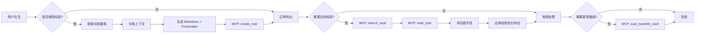
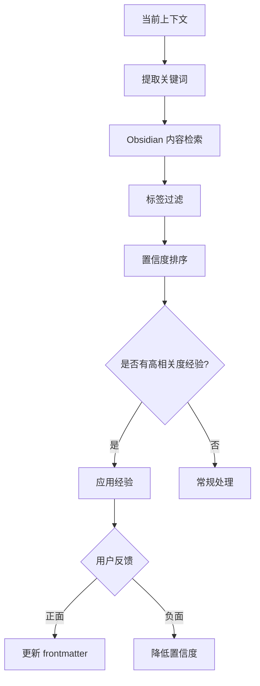

# 经验管理技能

从用户交互中学习和积累经验，建立经验库，并在未来的对话中应用这些经验以提供更智能、更个性化的响应。

**数据存储：** 使用 Obsidian Markdown 格式存储在 `~/exp` Vault 中，支持 Obsidian 的双向链接、标签和搜索功能。

---

## 核心能力

### 1. 经验捕获
- 自动识别有价值的学习点
- 提取用户偏好、习惯和模式
- 记录解决方案和最佳实践
- 存储上下文相关的决策

### 2. 经验存储（使用 Obsidian MCP）
- 使用 `create_note` 创建 Markdown 格式的经验笔记
- 支持完整 frontmatter 元数据
- 维护经验的置信度和时效性
- 使用 `update_note` 进行精确更新

### 3. 经验应用（使用 Obsidian MCP）
- 使用 `search_vault` 检索相关经验
- 使用 `read_note` 读取详细内容
- 使用 `read_multiple_notes` 批量读取
- 使用 `auto_backlink_vault` 自动生成关联链接

### 4. 经验演进
- 使用 `update_note` 更新 frontmatter 中的置信度
- 使用 `manage_folder` 管理经验分类
- 使用 `list_notes` 列出和筛选经验
- 使用 `notes_insight` 进行 AI 分析

---

## 工作流程



---

## 经验类型

| 类型 | 描述 | 示例 |
|------|------|------|
| 用户偏好 | 用户的喜好和设置 | "用户喜欢使用 TypeScript" |
| 工作模式 | 用户的常用工作流程 | "用户习惯先运行 test 再提交" |
| 决策模式 | 用户在特定场景下的决策倾向 | "遇到性能问题优先考虑缓存" |
| 知识点 | 用户掌握的特定知识 | "用户熟悉 React 但不熟悉 Vue" |
| 解决方案 | 问题和解决方案的映射 | "解决 CORS 问题使用代理配置" |
| 沟通风格 | 用户的沟通偏好 | "用户偏好简洁的回答" |
| 上下文约定 | 约定和命名规范 | "项目使用驼峰命名" |

---

## 经验捕获时机

在以下情况下自动触发经验捕获：

1. **用户明确表达偏好**
   - "我更喜欢..."
   - "通常我会..."
   - "我的习惯是..."

2. **重复出现的模式**
   - 连续 3 次以上相同的选择
   - 特定场景下的固定操作序列

3. **成功的问题解决**
   - 用户确认解决方案有效
   - 问题被标记为已解决

4. **显式学习指令**
   - "记住这个..."
   - "下次遇到这种情况..."
   - "学习这个模式..."

5. **上下文约定**
   - 项目配置的读取
   - 文档约定的识别
   - 代码风格的发现

---

## Obsidian 存储结构

经验以 Obsidian Markdown 格式存储在 `~/exp` Vault 中，支持双向链接和标签。

### 文件命名规范

```
exp_<type>_<timestamp>.md
exp_preference_20260311_130245.md
exp_solution_cors_20260311_130245.md
```

### Markdown 模板

```markdown
---
id: exp_20260311_130245
type: preference
created: 2026-03-11T13:02:45Z
updated: 2026-03-11T13:02:45Z
confidence: 0.8
usage_count: 0
effective: true
tags: [preference, npm, pnpm]
project: niuma
---

# 用户偏好使用 pnpm

## 描述
用户在项目开发中偏好使用 pnpm 而不是 npm。

## 上下文
- **场景**: 项目依赖管理
- **来源**: 显式声明
- **时间**: 2026-03-11

## 关联
- [[exp_workflow_20260311_120000]] - 工作流程

## 反馈记录
- 2026-03-11: 确认有效 ✓
```

### 目录结构

```
~/exp/
├── .obsidian/           # Obsidian 配置
├── Preferences/         # 用户偏好
├── Workflows/          # 工作流程
├── Solutions/          # 解决方案
├── Knowledge/          # 知识点
├── Conventions/        # 约定规范
└── Styles/             # 沟通风格
```

### 标签系统

- `#experience` - 所有经验笔记
- `#preference` - 用户偏好
- `#workflow` - 工作流程
- `#solution` - 解决方案
- `#knowledge` - 知识点
- `#convention` - 约定规范
- `#style` - 沟通风格
- `#project:<name>` - 项目标签

---

## 经验检索策略



**检索规则：**

1. **Obsidian 搜索** - 使用 `obsidian-cli search-content` 检索笔记内容
2. **标签匹配** - 通过 Obsidian 标签过滤相关经验
3. **双向链接** - 通过 `[[link]]` 查找关联经验
4. **上下文过滤** - 通过 frontmatter 的 project 字段过滤
5. **置信度排序** - 优先返回高 confidence 的经验
6. **时效性考虑** - 通过 created/updated 字段判断时效

**Obsidian CLI 命令：**

```bash
# 内容搜索
obsidian-cli search-content <query> --vault ~/exp

# 按标签搜索（通过 frontmatter）
obsidian-cli list --vault ~/exp | grep "#preference"

# 按项目过滤
grep -r "project: niuma" ~/exp/
```

---

## 使用场景

### 场景 1：学习用户偏好

```
用户：我更喜欢用 pnpm 而不是 npm
→ 捕获经验：用户偏好使用 pnpm
→ 未来：自动使用 pnpm 命令
```

### 场景 2：识别工作模式

```
用户：先运行测试，然后构建，最后部署
→ 捕获经验：用户的工作流程是 test → build → deploy
→ 未来：建议或自动执行这个流程
```

### 场景 3：应用解决方案

```
用户：上次解决这个 CORS 问题是用代理
→ 检索经验：CORS 问题 → 代理配置
→ 未来：遇到 CORS 问题时优先建议代理方案
```

### 场景 4：适配沟通风格

```
用户：简单点，别讲太多理论
→ 捕获经验：用户偏好简洁回答
→ 未来：提供简洁直接的响应
```

---

## 约束和限制

### 必须
- ✅ 只捕获与实际任务相关的经验
- ✅ 维护经验的置信度机制
- ✅ 支持用户的显式反馈
- ✅ 定期清理低置信度的经验

### 禁止
- ❌ 不要捕获敏感信息（密码、密钥等）
- ❌ 不要过度泛化个别情况
- ❌ 不要在没有足够证据时推断经验
- ❌ 不要在未经确认时应用高风险经验

---


## 使用方法

```bash
/exp <自然语言描述>
```

只需要用自然语言描述你的需求，AI 会自动判断需要做什么操作。

### 示例

#### 添加经验
```bash
/exp 我喜欢用 pnpm 而不是 npm
/exp 记住这个：项目使用 TypeScript strict mode
/exp 我的习惯是先运行测试再提交代码
```

#### 查看经验
```bash
/exp 显示所有经验
/exp 列出所有关于 TypeScript 的经验
/exp 看看有什么工作流程
```

#### 搜索经验
```bash
/exp 搜索 CORS 相关的经验
/exp 找找关于部署的解决方案
/exp 查询 pnpm 相关的偏好
```

#### 应用经验
```bash
/exp 遇到了 CORS 问题，有什么经验吗？
/exp 怎么部署这个项目？
/exp 根据经验，我应该用什么工具？
```

#### 提供反馈
```bash
/exp 这个经验很有效：exp_preference_20260311_130245.md
/exp 这个方案不管用：exp_solution_cors.md
```
## 集成点

### 与 Obsidian 集成
- 使用 `obsidian-cli create` 创建经验笔记
- 使用 `obsidian-cli search-content` 检索相关经验
- 使用 `obsidian-cli frontmatter` 更新元数据
- 支持双向链接 `[[link]]` 关联相关经验
- 使用标签系统 `#tag` 分类经验

### 与 Agent Memory 集成
- 将 Obsidian 笔记 ID 存储到长期记忆中
- 使用 Obsidian 搜索功能查找相关经验
- 维护经验之间的关联关系（通过双向链接）

### 与 Context 集成
- 从上下文中自动提取经验要素
- 将经验应用到当前上下文
- 记录经验使用的上下文信息（frontmatter project 字段）

### With Tools 集成
- 在工具调用前检查相关经验
- 记录工具使用模式
- 优化工具选择策略

---

## 示例交互

### 示例 1：自动学习偏好

```
用户：我习惯用 TypeScript strict mode
系统：已记录 - 您偏好使用 TypeScript strict mode ✓

（稍后）
用户：创建一个新的配置文件
系统：我将为您创建启用 strict mode 的 tsconfig.json...
```

### 示例 2：应用历史经验

```
用户：上次我们是怎么解决这个 API 问题的？
系统：根据历史经验，上次我们通过添加超时重试机制解决了这个问题。
是否应用相同的解决方案？
```

### 示例 3：用户反馈

```
系统：基于经验，我建议使用方案 A...
用户：不，这次用方案 B
系统：已记录反馈 - 在此场景下方案 B 更合适 ✓
```

---

## 版本历史

- **v1.1** (2026-03-11) - 集成 Obsidian 存储，数据存储在 ~/exp Vault
- **v1.0** (2026-03-11) - 初始版本，定义核心能力