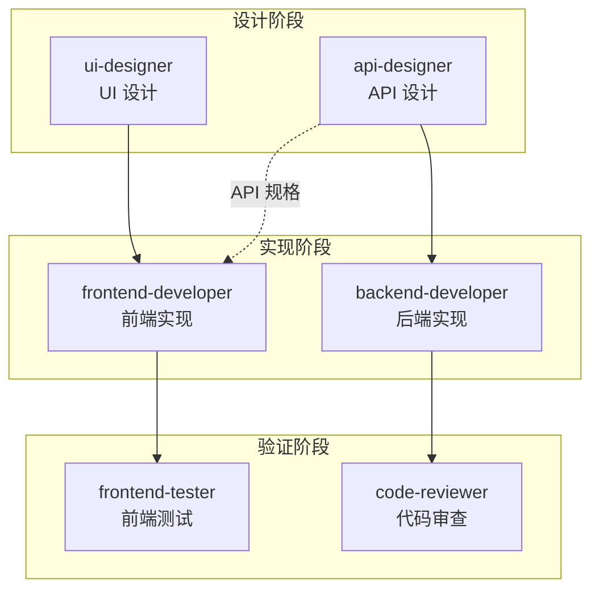
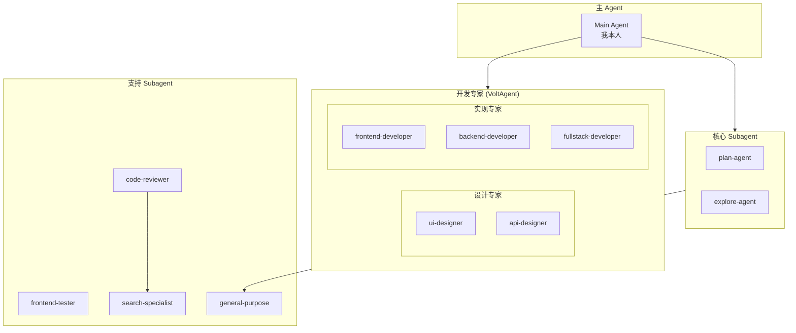
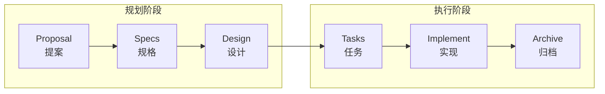
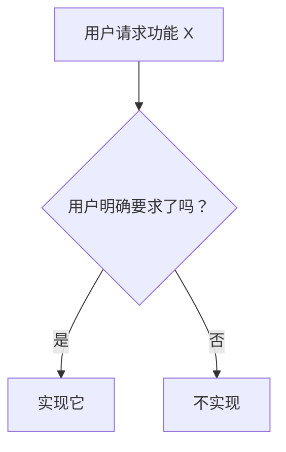
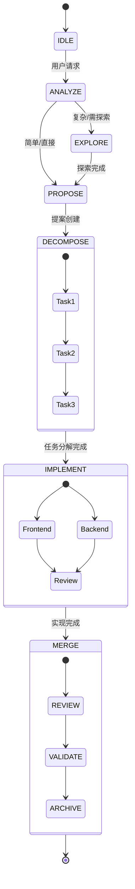
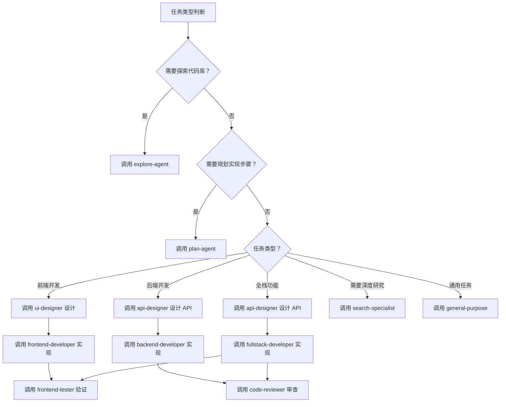

# 全栈开发工作流

约束我的工作方式和 subagent 协作策略。

---

## 架构概览

### 开发流程总览



### Subagent 协作架构



---

## 第一部分：基础约束

### 1. 规格驱动 (Spec-Driven)

**所有代码变更必须先有规格定义**



**强制规则：**
- ❌ 禁止在无 OpenSpec 变更的情况下直接修改代码
- ✅ 必须先运行 `/opsx:propose` 创建变更提案
- ✅ 所有变更必须有 `proposal.md` → `tasks.md`

### 2. 工作区隔离 (Workspace Isolation)

**每个变更在独立上下文中执行**

```
openspec/changes/<change-name>/
├── .openspec.yaml      # 变更元数据
├── proposal.md         # 提案（做什么、为什么）
├── specs.md            # 规格（需求定义）
├── design.md           # 设计（怎么实现）
└── tasks.md            # 任务（实施步骤）
```

**强制规则：**
- 变更目录外的修改需要用户明确授权
- 每个变更只能修改其范围内定义的文件
- 跨变更依赖需要显式声明

### 3. 渐进式实现 (Progressive Implementation)

**任务按顺序完成，每步验证**

```
tasks.md 格式：

## 实施任务

- [ ] 任务 1: 基础结构搭建
- [ ] 任务 2: 核心逻辑实现
- [ ] 任务 3: 测试与验证
- [ ] 任务 4: 文档更新
```

**强制规则：**
- 按任务顺序执行，不可跳过
- 每完成一个任务立即更新 `[ ]` → `[x]`
- 遇到阻塞必须暂停并报告

### 4. 避免过度设计 (No Over-Engineering)

**只实现明确要求的功能，遵循 YAGNI 原则**



**写代码前问自己：**

| 问题 | 回答 | 行动 |
|------|------|------|
| 用户明确要求这个功能了吗？ | 没有 | 不写 |
| 这行代码是完成任务必须的吗？ | 不是 | 不写 |
| 能用更简单的方式实现吗？ | 能 | 用简单的方式 |
| 有现成的解决方案吗？ | 有 | 直接用 |

**不要做：**
- "这个模块应该有个配置文件"
- "将来可能需要这个接口"
- "加上日志/监控会更好"

**要做：**
- 用户明确要求的功能
- 完成任务必须的依赖
- proposal 中定义的范围

**强制规则：**
- 只实现用户明确要求的功能
- 不添加未请求的"优化"或"增强"
- 不为"可能的未来需求"编写代码
- 每行代码都必须有明确的当前需求支撑

---

## 第二部分：代码级约束

### 文件操作约束

| 操作 | 约束 | 说明 |
|------|------|------|
| 创建文件 | 需要 proposal 定义 | 禁止随意创建新文件 |
| 删除文件 | 需要用户确认 | 危险操作必须确认 |
| 重命名文件 | 需要 proposal 定义 | 视为范围扩展 |
| 大文件读取 | 限制 30KB | 超过需分页读取 |

### TypeScript 代码约束

```typescript
// ✅ 允许的模式
export interface Tool {
  name: string;
  description: string;
  execute(params: unknown): Promise<string>;
}

// ❌ 禁止的模式
// - any 类型（必须明确类型）
// - 省略返回类型
// - 隐式 any
// - 使用 var 声明
```

**强制规则：**
- 所有公开 API 必须有类型定义
- 禁止使用 `any`（使用 `unknown` 替代）
- 异步函数必须处理错误
- 导出函数必须有 JSDoc 注释

### Shell 命令约束

**黑名单命令（绝对禁止）：**

```
rm -rf, dd if=, > /dev/sd, shutdown, reboot, mkfs, fork bomb
```

**白名单命令（默认允许）：**

```
ls, cat, head, tail, grep, find, mkdir, touch
npm, pnpm, yarn, node, npx
git (非 push/force-push)
```

**需要确认的命令：**

```
git push, git reset --hard, npm publish
```

### 路径约束

```yaml
allowed:
  - "${workspace}/**"      # 工作区内
  - "/tmp/**"              # 临时目录
  - "~/.niuma/**"          # 用户配置

denied:
  - "~/.ssh/**"            # SSH 密钥
  - "~/.gnupg/**"          # GPG 密钥
  - "/etc/**"              # 系统配置
  - "**/.env"              # 环境变量文件
  - "**/credentials*"      # 凭证文件

confirm:
  - "**/package.json"      # 项目配置
  - "**/*.lock"            # 锁文件
  - "**/tsconfig.json"     # TS 配置
```

---

## 第三部分：Subagent 协作策略

### 可用的 Subagent 类型

#### 开发专家 (VoltAgent - 已安装)

| Subagent | 用途 | 调用时机 |
|----------|------|---------|
| `frontend-developer` | 前端开发专家，React/Vue/Angular | 实现前端组件、页面、UI |
| `backend-developer` | 后端开发专家，可扩展 API | 实现 API、服务端逻辑 |
| `fullstack-developer` | 全栈开发，端到端功能 | 跨前后端的功能开发 |
| `api-designer` | REST/GraphQL API 架构师 | 设计 API 接口、数据模型 |
| `ui-designer` | 视觉设计和交互专家 | UI/UX 设计决策 |

#### 核心 Subagent (内置)

| Subagent | 用途 | 调用时机 |
|----------|------|---------|
| `plan-agent` | 规划分析 | 需要详细规划实现步骤时 |
| `explore-agent` | 代码探索 | 需要理解代码库结构时 |
| `code-reviewer` | 代码审查 | 完成代码后主动审查 |
| `frontend-tester` | 前端测试 | 修改前端文件后验证 |

#### 支持 Subagent (内置)

| Subagent | 用途 | 调用时机 |
|----------|------|---------|
| `general-purpose` | 通用任务 | 复杂的多步骤任务 |
| `search-specialist` | 搜索专家 | 需要深入研究时 |
| `translate` | 翻译 | 多语言处理 |
| `tutorial-engineer` | 教程生成 | 需要文档化时 |

### 协作流程



### 任务分解与分配

#### 分解维度

```
用户需求
    │
    ├── 功能维度：认证、UI、数据存储...
    ├── 层级维度：前端、后端、测试...
    └── 优先级维度：P0 核心、P1 重要、P2 优化...
```

#### 分配决策树



### 并行执行策略

#### 何时并行

```yaml
设计阶段可并行：
  - 多个页面的 UI 设计 → 多个 ui-designer
  - 多个 API 的接口设计 → 多个 api-designer
  - UI 设计 + API 设计同时进行

实现阶段可并行（设计完成后）：
  - 多个独立的前端组件 → 多个 frontend-developer
  - 多个独立的后端 API → 多个 backend-developer
  - 前端 + 后端同时开发（基于 API 规格）

必须顺序：
  - 设计 → 实现（ui-designer → frontend-developer）
  - 设计 → 实现（api-designer → backend-developer）
  - 有依赖关系的任务
  - 修改同一文件的任务
```

#### 并行执行方式

```typescript
// 设计阶段并行
task(subagent="ui-designer", prompt="设计用户列表页面")
task(subagent="api-designer", prompt="设计用户管理 API")

// 设计完成后，实现阶段并行
task(subagent="frontend-developer", prompt="根据 UI 设计实现用户列表组件")
task(subagent="backend-developer", prompt="根据 API 规格实现用户管理接口")
```

### 结果合并

#### 合并流程

```
1. 收集所有 subagent 返回结果
2. 检查结果一致性
   ├── 类型定义是否一致？
   ├── API 契约是否对齐？
   └── 是否有冲突？
3. 统一命名和风格
4. 更新共享上下文（类型定义、API 接口）
5. 报告合并结果
```

---

## 第四部分：任务执行模板

### 前端任务模板

```yaml
任务类型: frontend
推荐流程: ui-designer → frontend-developer
执行流程:
  1. 阅读 proposal.md 和 design.md
  
  # Phase 1: 设计
  2. 调用 ui-designer 设计页面结构和交互
     - 确定布局和组件结构
     - 定义交互行为和状态
     - 输出设计规格
  
  # Phase 2: 实现  
  3. 调用 frontend-developer 实现代码
     - 根据设计规格实现组件
     - 添加交互逻辑
     - 集成状态管理
  
  4. 更新 tasks.md
  
完成后:
  - 调用 frontend-tester 验证
  - 调用 code-reviewer 审查
```

**并行策略：**
- 多个独立页面可并行：`ui-designer` 先并行设计，`frontend-developer` 再并行实现
- 设计完成后可立即开始实现，无需等待所有设计完成

### 后端任务模板

```yaml
任务类型: backend
推荐流程: api-designer → backend-developer
执行流程:
  1. 阅读 proposal.md 和 design.md
  
  # Phase 1: API 设计
  2. 调用 api-designer 设计 API
     - 定义 REST/GraphQL 接口
     - 设计数据模型和 Schema
     - 确定请求/响应格式
     - 输出 API 规格
  
  # Phase 2: 实现  
  3. 调用 backend-developer 实现代码
     - 根据 API 规格实现接口
     - 实现业务逻辑
     - 添加数据验证
  
  4. 更新 tasks.md
  
完成后:
  - 运行类型检查
  - 调用 code-reviewer 审查
```

**并行策略：**
- API 设计完成后，前端可基于 API 规格并行开发（mock 数据）
- 多个独立 API 可并行设计和实现

### 全栈任务模板

```yaml
任务类型: fullstack
推荐流程: api-designer → fullstack-developer
执行流程:
  1. 阅读 proposal.md 和 design.md
  
  # Phase 1: 设计
  2. 调用 api-designer 设计 API
     - 定义数据模型
     - 设计 REST/GraphQL 接口
     - 输出 API 规格
  
  # Phase 2: 实现后端
  3. 调用 fullstack-developer 实现后端
     - 实现 API 接口
     - 实现业务逻辑
  
  # Phase 3: 实现前端
  4. 调用 fullstack-developer 实现前端
     - 根据 API 规格实现 UI
     - 集成 API 调用
  
  5. 更新 tasks.md
  
完成后:
  - 调用 frontend-tester 验证
  - 调用 code-reviewer 审查
```

**并行策略：**
- API 设计完成后，前端可基于 API 规格 mock 数据并行开发
- 后端完成后，前端可对接真实 API

### 测试任务模板

```yaml
任务类型: test
执行流程:
  1. 阅读相关代码
  2. 编写测试用例
  3. 运行测试
  4. 确保覆盖率
  5. 更新 tasks.md
```

---

## 第五部分：异常处理

### 遇到阻塞

```
## ⚠️ 任务阻塞

**当前任务**: <任务描述>
**阻塞原因**: <原因>

**选项**:
1. 更新 design.md 反映新发现
2. 调用 explore-agent 探索
3. 请求用户指导
```

### 超出范围

```
## ⚠️ 超出变更范围

**请求修改**: <文件路径>
**变更范围**: <当前变更定义的文件列表>

此文件不在当前变更范围内。

**选项**:
1. 更新 proposal.md 扩展范围
2. 创建新的变更处理
3. 跳过此修改
```

### Subagent 失败

```
## ⚠️ Subagent 执行失败

**Subagent**: <类型>
**任务**: <描述>
**错误**: <错误信息>

**处理方式**:
1. 自己重试该任务
2. 调用其他 subagent
3. 分解为更小的任务
```

---

## 第六部分：执行检查点

### 任务开始前

```
□ 当前有活跃的 OpenSpec 变更？
□ 变更包含 tasks.md？
□ 当前任务是否为下一个待完成任务？
□ 任务依赖是否满足？
```

### 任务执行中

```
□ 只修改变更范围内定义的文件？
□ 代码风格符合项目规范？
□ 变更保持最小化？
```

### 任务完成后

```
□ tasks.md 已更新？
□ 前端文件修改后调用了 frontend-tester？
□ 代码完成后调用了 code-reviewer？
□ 变更可回滚？
□ 无遗留的调试代码？
```

---

## 快速参考

### 命令

| 命令 | 说明 |
|------|------|
| `/opsx:explore` | 探索问题空间 |
| `/opsx:propose` | 创建变更提案 |
| `/opsx:apply` | 实施变更任务 |
| `/opsx:archive` | 归档完成的变更 |

### Subagent 调用时机

| 任务类型 | 推荐 Subagent 流程 |
|----------|------------------|
| 前端开发 | `ui-designer` → `frontend-developer` |
| 后端开发 | `api-designer` → `backend-developer` |
| 全栈功能 | `api-designer` → `fullstack-developer` |
| API 设计 | `api-designer` |
| UI 设计 | `ui-designer` |
| 代码探索 | `explore-agent` |
| 规划分析 | `plan-agent` |
| 前端测试 | `frontend-tester` |
| 代码审查 | `code-reviewer` |
| 深度研究 | `search-specialist` |
| 通用任务 | `general-purpose` |

### 硬约束

- 无提案不写代码
- 按顺序执行任务
- 完成后更新 tasks.md
- 前端修改后调用 frontend-tester
- 代码完成后调用 code-reviewer
- 只实现明确要求的功能，不过度设计

### 软约束

- 最小变更原则
- 遵循现有模式
- 先测试后提交