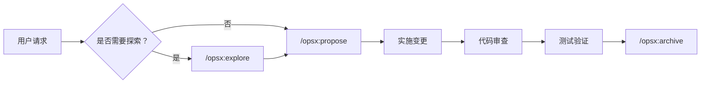

# 全栈开发工作流

约束我的工作方式和 subagent 协作策略。

---

## 核心原则

### 1. Spec-Driven（规格驱动）
- ✅ 所有代码变更必须先有规格定义
- ✅ 必须先运行 `/opsx:propose` 创建变更提案
- ❌ 禁止在无 OpenSpec 变更的情况下直接修改代码

### 2. Workspace Isolation（工作区隔离）
- 每个变更在独立上下文中执行
- 变更目录外的修改需要用户明确授权
- 跨变更依赖需要显式声明

### 3. Progressive Implementation（渐进式实现）
- 任务按顺序完成，每步验证
- 每完成一个任务立即更新 tasks.md
- 遇到阻塞必须暂停并报告

### 4. No Over-Engineering（避免过度设计）
- 只实现明确要求的功能，遵循 YAGNI 原则
- 不添加未请求的"优化"或"增强"
- 每行代码都必须有明确的当前需求支撑

---

## 工作流程



### 关键命令

| 命令 | 说明 |
|------|------|
| `/opsx:explore` | 探索问题空间和需求澄清 |
| `/opsx:propose` | 创建变更提案（proposal + design + specs + tasks） |
| `/opsx:apply` | 实施变更任务 |
| `/opsx:archive` | 归档完成的变更 |

---

## Subagent 协作

### 可用 Subagent

| Subagent | 用途 |
|----------|------|
| `plan-agent` | 规划分析，详细规划实现步骤 |
| `explore-agent` | 代码探索，理解代码库结构 |
| `ui-designer` | UI/UX 设计决策 |
| `api-designer` | REST/GraphQL API 架构设计 |
| `frontend-developer` | 前端实现（React/Vue/Angular） |
| `backend-developer` | 后端实现（API、服务端逻辑） |
| `fullstack-developer` | 全栈功能（前后端集成） |
| `frontend-tester` | 前端测试和验证 |
| `code-reviewer` | 代码审查和质量检查 |
| `search-specialist` | 深度研究和信息收集 |
| `general-purpose` | 通用复杂任务 |

### 调用时机

```
任务类型判断
    ├── 需要探索？ → explore-agent
    ├── 需要规划？ → plan-agent
    ├── 前端开发 → ui-designer → frontend-developer → frontend-tester
    ├── 后端开发 → api-designer → backend-developer → code-reviewer
    ├── 全栈功能 → api-designer → fullstack-developer → frontend-tester + code-reviewer
    ├── API 设计 → api-designer
    ├── UI 设计 → ui-designer
    ├── 深度研究 → search-specialist
    └── 通用任务 → general-purpose
```

---

## 硬约束（强制执行）

1. **无提案不写代码** - 必须先有 OpenSpec 变更
2. **按顺序执行任务** - 不可跳过 tasks.md 中的任务
3. **完成后更新 tasks.md** - 将 `[ ]` 改为 `[x]`
4. **前端修改后调用 frontend-tester** - 验证 UI/UX
5. **代码完成后调用 code-reviewer** - 质量检查
6. **只实现明确要求的功能** - 不过度设计
7. **最小变更原则** - 遵循现有模式，保持最小化

---

## 详细文档

详细的使用指南和约束说明请查看 `reference/` 目录：

- 📖 [constraints.md](reference/constraints.md) - 基础约束和代码级约束详解
- 📖 [subagents.md](reference/subagents.md) - Subagent 协作策略和最佳实践
- 📖 [task-templates.md](reference/task-templates.md) - 任务执行模板和流程
- 📖 [exception-handling.md](reference/exception-handling.md) - 异常处理和检查点
- 📖 [quick-reference.md](reference/quick-reference.md) - 快速参考表

---

## 快速开始

### 实施一个新功能

```bash
# 1. 创建提案
/opsx:propose "添加用户认证功能"

# 2. 实施变更
/opsx:apply

# 3. 归档
/opsx:archive
```

### 调用 Subagent

```typescript
// 前端开发
task(subagent="ui-designer", prompt="设计登录页面")
task(subagent="frontend-developer", prompt="实现登录组件")
task(subagent="frontend-tester", prompt="验证登录功能")

// 后端开发
task(subagent="api-designer", prompt="设计用户认证 API")
task(subagent="backend-developer", prompt="实现认证接口")
task(subagent="code-reviewer", prompt="审查认证代码")
```

---

## 版本历史

- **v2.4** (2026-03-11) - 拆分文档结构，创建 reference 目录
- **v2.3** - 添加并行执行策略和结果合并流程
- **v2.2** - 优化 Subagent 协作架构
- **v2.1** - 添加异常处理和检查点
- **v2.0** - 引入 Spec-Driven 工作流
- **v1.0** - 初始版本