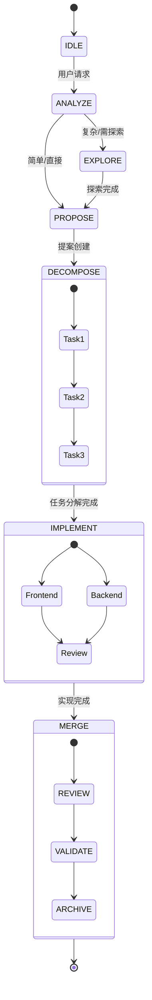
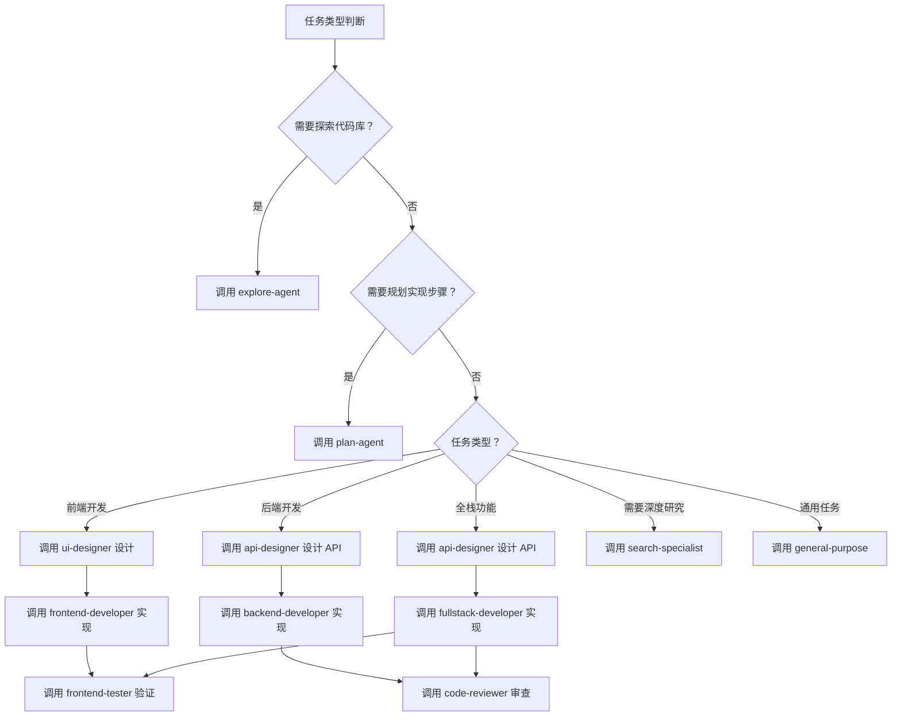

# Subagent 协作策略

本文档详细说明如何有效地使用和协作各种 subagent。

---

## 一、Subagent 分类

### 1. 开发专家（VoltAgent）

| Subagent | 用途 | 调用时机 |
|----------|------|---------|
| `ui-designer` | 视觉设计和交互专家 | UI/UX 设计决策 |
| `api-designer` | REST/GraphQL API 架构师 | API 接口、数据模型设计 |
| `frontend-developer` | 前端开发专家 | 实现前端组件、页面、UI |
| `backend-developer` | 后端开发专家 | 实现 API、服务端逻辑 |
| `fullstack-developer` | 全栈开发专家 | 跨前后端的功能开发 |

### 2. 核心 Subagent（内置）

| Subagent | 用途 | 调用时机 |
|----------|------|---------|
| `plan-agent` | 规划分析 | 需要详细规划实现步骤时 |
| `explore-agent` | 代码探索 | 需要理解代码库结构时 |

### 3. 支持 Subagent（内置）

| Subagent | 用途 | 调用时机 |
|----------|------|---------|
| `frontend-tester` | 前端测试 | 修改前端文件后验证 |
| `code-reviewer` | 代码审查 | 完成代码后主动审查 |
| `search-specialist` | 搜索专家 | 需要深入研究时 |
| `general-purpose` | 通用任务 | 复杂的多步骤任务 |

---

## 二、协作流程



---

## 三、任务分解与分配

### 分解维度

```
用户需求
    │
    ├── 功能维度：认证、UI、数据存储...
    ├── 层级维度：前端、后端、测试...
    └── 优先级维度：P0 核心、P1 重要、P2 优化...
```

### 分配决策树



---

## 四、并行执行策略

### 何时并行

```yaml
设计阶段可并行：
  - 多个页面的 UI 设计 → 多个 ui-designer
  - 多个 API 的接口设计 → 多个 api-designer
  - UI 设计 + API 设计同时进行

实现阶段可并行（设计完成后）：
  - 多个独立的前端组件 → 多个 frontend-developer
  - 多个独立的后端 API → 多个 backend-developer
  - 前端 + 后端同时开发（基于 API 规格）

必须顺序：
  - 设计 → 实现（ui-designer → frontend-developer）
  - 设计 → 实现（api-designer → backend-developer）
  - 有依赖关系的任务
  - 修改同一文件的任务
```

### 并行执行方式

```typescript
// 设计阶段并行
task(subagent="ui-designer", prompt="设计用户列表页面")
task(subagent="api-designer", prompt="设计用户管理 API")

// 设计完成后，实现阶段并行
task(subagent="frontend-developer", prompt="根据 UI 设计实现用户列表组件")
task(subagent="backend-developer", prompt="根据 API 规格实现用户管理接口")
```

### 并行执行示例

**场景：开发用户管理模块**

```typescript
// Phase 1: 并行设计
const [uiDesign, apiDesign] = await Promise.all([
  task(subagent="ui-designer", prompt="设计用户列表、创建、编辑页面"),
  task(subagent="api-designer", prompt="设计用户 CRUD API 接口")
])

// Phase 2: 并行实现（基于设计）
const [frontend, backend] = await Promise.all([
  task(subagent="frontend-developer", prompt="实现用户管理前端组件"),
  task(subagent="backend-developer", prompt="实现用户管理后端 API")
])

// Phase 3: 验证和审查
await Promise.all([
  task(subagent="frontend-tester", prompt="验证用户管理前端功能"),
  task(subagent="code-reviewer", prompt="审查用户管理代码")
])
```

---

## 五、结果合并

### 合并流程

```
1. 收集所有 subagent 返回结果
2. 检查结果一致性
   ├── 类型定义是否一致？
   ├── API 契约是否对齐？
   └── 是否有冲突？
3. 统一命名和风格
4. 更新共享上下文（类型定义、API 接口）
5. 报告合并结果
```

### 冲突处理

**类型定义冲突：**
```
前端期望: interface User { id: string; name: string; email: string; }
后端返回: interface User { id: number; username: string; email: string; }

解决方案: 
1. 统一类型定义
2. 添加转换层
3. 重新设计 API
```

**API 契约冲突：**
```
前端调用: GET /api/users/{id}
后端实现: GET /api/users?id={id}

解决方案:
1. 统一路径参数
2. 添加适配层
3. 修改前端或后端
```

---

## 六、Subagent 最佳实践

### 1. ui-designer

**适用场景：**
- 设计新的页面或组件
- 优化现有 UI/UX
- 定义交互行为和状态

**使用示例：**
```typescript
task(subagent="ui-designer", prompt=`
设计用户登录页面：
- 包含用户名、密码输入框
- 记住我、忘记密码功能
- 登录按钮和注册链接
- 响应式设计
`)
```

**期望输出：**
- 页面布局结构
- 组件分解
- 交互流程
- 状态管理方案

### 2. api-designer

**适用场景：**
- 设计新的 API 接口
- 定义数据模型和 Schema
- 设计请求/响应格式

**使用示例：**
```typescript
task(subagent="api-designer", prompt=`
设计用户认证 API：
- POST /api/auth/login - 用户登录
- POST /api/auth/register - 用户注册
- POST /api/auth/logout - 用户登出
- GET /api/auth/me - 获取当前用户信息
`)
```

**期望输出：**
- REST/GraphQL 接口定义
- 数据模型和 Schema
- 请求/响应格式
- 错误处理规范

### 3. frontend-developer

**适用场景：**
- 实现前端组件和页面
- 添加交互逻辑
- 集成状态管理

**使用示例：**
```typescript
task(subagent="frontend-developer", prompt=`
根据 UI 设计实现登录页面：
- 使用 React + TypeScript
- 集成 Formik 表单处理
- 添加表单验证
- 连接后端 API
`)
```

**期望输出：**
- 完整的组件代码
- 样式定义
- 状态管理逻辑
- API 集成代码

### 4. backend-developer

**适用场景：**
- 实现 API 接口
- 实现业务逻辑
- 添加数据验证

**使用示例：**
```typescript
task(subagent="backend-developer", prompt=`
根据 API 规格实现用户认证接口：
- 使用 Node.js + Express
- JWT 认证
- 密码加密存储
- 输入验证和错误处理
`)
```

**期望输出：**
- API 路由实现
- 业务逻辑代码
- 数据验证逻辑
- 错误处理代码

### 5. fullstack-developer

**适用场景：**
- 跨前后端的功能开发
- 端到端功能实现
- 需要前后端协调的任务

**使用示例：**
```typescript
task(subagent="fullstack-developer", prompt=`
实现用户管理功能（前后端）：
- 设计 API 接口
- 实现后端 API
- 实现前端 UI
- 集成前后端
- 添加测试
`)
```

**期望输出：**
- 完整的前后端代码
- API 集成代码
- 测试代码

### 6. code-reviewer

**适用场景：**
- 代码完成后主动审查
- 质量检查和优化建议
- 安全审查

**使用示例：**
```typescript
task(subagent="code-reviewer", prompt=`
审查以下代码文件：
- src/auth/login.ts
- src/auth/register.ts

检查：
- 代码质量
- 安全问题
- 性能优化
- 最佳实践
`)
```

**期望输出：**
- 代码审查报告
- 改进建议
- 潜在问题列表

### 7. frontend-tester

**适用场景：**
- 修改前端文件后验证
- UI/UX 功能测试
- 交互测试

**使用示例：**
```typescript
task(subagent="frontend-tester", prompt=`
验证登录页面功能：
- 测试表单提交
- 测试错误处理
- 测试响应式布局
- 测试交互流程
`)
```

**期望输出：**
- 测试报告
- Bug 列表
- 改进建议

---

## 七、常见问题

### Q1: 如何选择合适的 subagent？

**A:** 根据任务类型和所需专业知识选择：
- 需要设计 → `ui-designer` 或 `api-designer`
- 需要实现 → `frontend-developer` 或 `backend-developer`
- 需要前后端 → `fullstack-developer`
- 需要规划 → `plan-agent`
- 需要探索 → `explore-agent`
- 需要审查 → `code-reviewer`
- 需要测试 → `frontend-tester`

### Q2: 如何处理 subagent 失败？

**A:** 
1. 查看错误信息
2. 分析失败原因
3. 调整 prompt 或任务分解
4. 重试或使用其他 subagent

### Q3: 如何确保结果一致性？

**A:**
1. 明确的输入和输出定义
2. 使用相同的上下文和规范
3. 检查和合并结果
4. 统一命名和风格

### Q4: 何时需要并行执行？

**A:**
- 多个独立任务
- 无依赖关系
- 可以同时进行
- 需要提高效率

### Q5: 如何处理跨 subagent 的依赖？

**A:**
1. 明确依赖关系
2. 按顺序执行
3. 传递必要的上下文
4. 合并结果