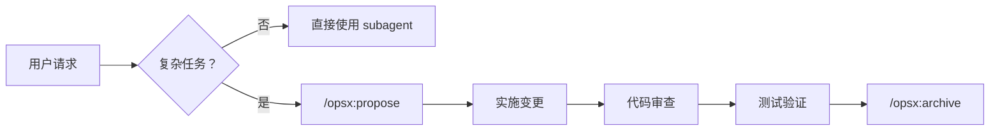

# 全栈开发工作流

协调专业 subagent 完成复杂全栈开发任务。

---

## 何时使用此技能

### ✅ 适合使用（复杂任务）
- API 设计和文档生成（5+ 端点）
- 复杂架构设计（多模块、多服务）
- 多组件集成任务（前后端协作）
- 需要标准化输出的场景

### ❌ 不适合使用（简单任务）
- 简单代码审查（< 100 行）
- 小型功能开发（< 200 行）
- 快速原型验证
- 性能敏感的任务
- Bug 修复

**简单任务直接使用相应的 subagent 即可，无需此技能。**

---

## 核心原则

### 1. Spec-Driven（规格驱动）
- ✅ 所有代码变更必须先有规格定义
- ✅ 必须先运行 `/opsx:propose` 创建变更提案
- ❌ 禁止在无 OpenSpec 变更的情况下直接修改代码

### 2. Workspace Isolation（工作区隔离）
- 每个变更在独立上下文中执行
- 变更目录外的修改需要用户明确授权

### 3. No Over-Engineering（避免过度设计）
- 只实现明确要求的功能
- 不添加未请求的"优化"或"增强"
- 遵循 YAGNI 原则

---

## 快速工作流

### 关键命令

| 命令 | 说明 |
|------|------|
| `/opsx:propose` | 创建变更提案（proposal + design + specs + tasks） |
| `/opsx:apply` | 实施变更任务 |
| `/opsx:archive` | 归档完成的变更 |

---

## Subagent 快速参考

| Subagent | 主要用途 | 适用场景 |
|----------|---------|---------|
| `api-designer` | API 架构设计 | REST/GraphQL API 设计 |
| `ui-designer` | UI/UX 设计 | 页面、组件设计 |
| `frontend-developer` | 前端实现 | React/Vue/Angular 开发 |
| `backend-developer` | 后端实现 | API、服务端逻辑 |
| `fullstack-developer` | 全栈功能 | 前后端集成 |
| `frontend-tester` | 前端测试 | UI/UX 验证 |
| `code-reviewer` | 代码审查 | 质量检查 |
| `plan-agent` | 规划分析 | 实现步骤规划 |
| `explore-agent` | 代码探索 | 理解代码库结构 |

**更多详细信息：** [reference/subagents.md](reference/subagents.md)

---

## 硬约束（强制执行）

1. **无提案不写代码** - 必须先有 OpenSpec 变更
2. **按顺序执行任务** - 不可跳过 tasks.md 中的任务
3. **完成后更新 tasks.md** - 将 `[ ]` 改为 `[x]`
4. **前端修改后调用 frontend-tester** - 验证 UI/UX
5. **代码完成后调用 code-reviewer** - 质量检查
6. **只实现明确要求的功能** - 不过度设计

**更多约束详情：** [reference/constraints.md](reference/constraints.md)

---

## 版本历史

- **v2.5** (2026-03-12) - 性能优化：添加任务复杂度检测，简化主文档
- **v2.4** (2026-03-11) - 拆分文档结构，创建 reference 目录
- **v2.3** - 添加并行执行策略和结果合并流程
- **v2.2** - 优化 Subagent 协作架构
- **v2.1** - 添加异常处理和检查点
- **v2.0** - 引入 Spec-Driven 工作流
- **v1.0** - 初始版本