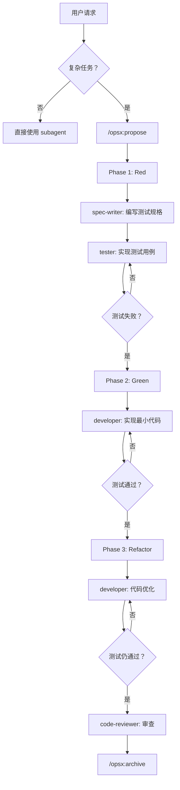
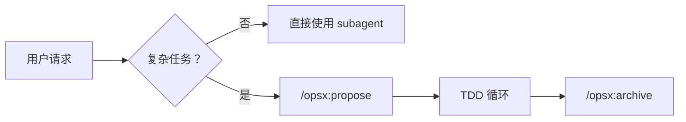

# 全栈开发工作流

协调专业 subagent 完成复杂全栈开发任务，遵循 TDD 实践。

---

## 何时使用此技能

### ✅ 适合使用（复杂任务）
- API 设计和文档生成（5+ 端点）
- 复杂架构设计（多模块、多服务）
- 多组件集成任务（前后端协作）
- 需要标准化输出的场景

### ❌ 不适合使用（简单任务）
- 简单代码审查（< 100 行）
- 小型功能开发（< 200 行）
- 快速原型验证
- 性能敏感的任务
- 简单 Bug 修复（< 50 行或单文件修改）

**复杂 Bug 修复（> 50 行或多文件修改）仍适合使用此技能，但可跳过 Red 阶段。**

**简单任务直接使用相应的 subagent 即可，无需此技能。**

---

## 核心原则

### 1. Spec-Driven（规格驱动）
- ✅ 所有代码变更必须先有规格定义
- ✅ 必须先运行 `/opsx:propose` 创建变更提案
- ❌ 禁止在无 OpenSpec 变更的情况下直接修改代码

### 2. TDD 循环（测试驱动开发）
- ✅ **Red** - 先写失败的测试用例
- ✅ **Green** - 实现最小代码使测试通过
- ✅ **Refactor** - 优化代码，保持测试通过
- ❌ 禁止在无测试的情况下编写实现代码

### 3. Workspace Isolation（工作区隔离）
- 每个变更在独立上下文中执行
- 变更目录外的修改需要用户明确授权

### 4. No Over-Engineering（避免过度设计）
- 只实现明确要求的功能
- 不添加未请求的"优化"或"增强"
- 遵循 YAGNI 原则

---

## TDD 工作流



### TDD 三阶段

| 阶段 | 角色 | 输出 | 验证 |
|------|------|------|------|
| **Red** | spec-writer → tester | 测试规格 + 测试代码 | 测试必须失败 |
| **Green** | developer | 实现代码 | 测试必须通过 |
| **Refactor** | developer | 优化代码 | 测试仍须通过 |

### OpenSpec 目录结构（TDD 模式）

```
openspec/changes/<change-name>/
├── proposal.md          # 提案（做什么、为什么）
├── specs/               # 规格（需求定义）
│   └── <capability>/
│       ├── spec.md      # 功能规格
│       └── test.md      # 测试规格
├── design.md            # 设计（怎么实现）
└── tasks.md             # TDD 三阶段任务
```

**tasks.md 示例：**
```markdown
## 实施任务

### Phase 1: Red（测试先行）
- [ ] 编写测试规格
- [ ] 实现测试用例
- [ ] 运行测试，确认失败

### Phase 2: Green（最小实现）
- [ ] 实现最小代码
- [ ] 运行测试，确认通过

### Phase 3: Refactor（优化）
- [ ] 重构代码
- [ ] 确认测试仍通过
- [ ] 代码审查
```

---

## 快速工作流（简化版）



### 关键命令

| 命令 | 说明 |
|------|------|
| `/opsx:propose` | 创建变更提案（proposal + design + specs + tasks） |
| `/opsx:apply` | 实施变更任务（遵循 TDD 循环） |
| `/opsx:archive` | 归档完成的变更 |

---

## Subagent 快速参考

### TDD 角色（新增）

| Subagent | 主要用途 | TDD 阶段 |
|----------|---------|---------|
| `spec-writer` | 编写功能规格和测试规格 | Red - 定义测试用例 |
| `tester` | 实现测试用例 | Red - 确保测试失败 |

### 开发角色

| Subagent | 主要用途 | TDD 阶段 |
|----------|---------|---------|
| `api-designer` | API 架构设计 | 规格定义 |
| `ui-designer` | UI/UX 设计 | 规格定义 |
| `frontend-developer` | 前端实现 | Green/Refactor |
| `backend-developer` | 后端实现 | Green/Refactor |
| `fullstack-developer` | 全栈功能 | Green/Refactor |

### 质量角色

| Subagent | 主要用途 | TDD 阶段 |
|----------|---------|---------|
| `frontend-tester` | 前端测试验证 | 全阶段 |
| `code-reviewer` | 代码审查 | Refactor 后 |

### 支持角色

| Subagent | 主要用途 | 适用场景 |
|----------|---------|---------|
| `plan-agent` | 规划分析 | 实现步骤规划 |
| `explore-agent` | 代码探索 | 理解代码库结构 |

**更多详细信息：** [reference/subagents.md](reference/subagents.md)

### 快速开始

> **5 分钟上手：** [reference/quickstart.md](reference/quickstart.md)

### 详细文档

| 文档 | 说明 |
|------|------|
| [quickstart.md](reference/quickstart.md) | 5 分钟快速上手 |
| [tdd-workflow.md](reference/tdd-workflow.md) | TDD 工作流详解 |
| [task-templates.md](reference/task-templates.md) | 任务执行模板 |
| [subagents.md](reference/subagents.md) | Subagent 协作策略 |
| [constraints.md](reference/constraints.md) | 约束规则 |
| [exception-handling.md](reference/exception-handling.md) | 异常处理 |
| [quick-reference.md](reference/quick-reference.md) | 快速参考 |
| [code-patterns.md](reference/code-patterns.md) | 代码模式和最佳实践 |

---

## 硬约束（强制执行）

### OpenSpec 约束
1. **无提案不写代码** - 必须先有 OpenSpec 变更
2. **按顺序执行任务** - 不可跳过 tasks.md 中的任务
3. **完成后更新 tasks.md** - 将 `[ ]` 改为 `[x]`

### TDD 约束（新增）
4. **测试先行** - 先写测试，再写实现
5. **Red → Green → Refactor** - 必须完成完整循环
6. **最小实现** - 只写使测试通过的最少代码
7. **重构保持绿色** - 重构后测试必须仍然通过

### 质量约束
8. **前端修改后调用 frontend-tester** - 验证 UI/UX
9. **代码完成后调用 code-reviewer** - 质量检查
10. **只实现明确要求的功能** - 不过度设计

**更多约束详情：** [reference/constraints.md](reference/constraints.md)

---

## 版本历史

详见 [VERSION.md](VERSION.md)