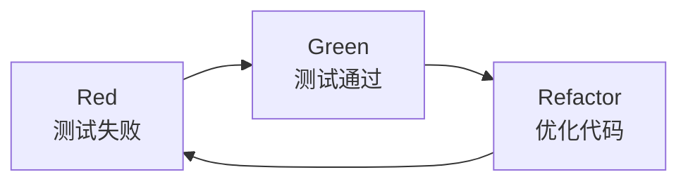
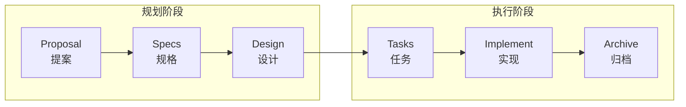
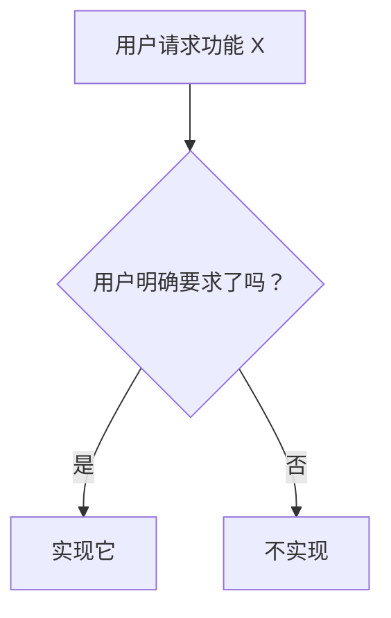

# 约束详解

本文档详细说明全栈开发工作流中的所有约束规则，包含 TDD 实践约束。

---

## 目录

- [一、基础约束](#一基础约束)
  - [Spec-Driven（规格驱动）](#1-spec-driven规格驱动)
  - [Workspace Isolation（工作区隔离）](#2-workspace-isolation工作区隔离)
  - [Progressive Implementation（渐进式实现）](#3-progressive-implementation渐进式实现)
  - [No Over-Engineering（避免过度设计）](#4-no-over-engineering避免过度设计)
- [二、TDD 约束](#二tdd-约束)
- [三、代码级约束](#三代码级约束)
- [四、检查清单](#四检查清单)

---

## 一、基础约束

### 0. TDD 循环（测试驱动开发）

**原则：** 测试先行，红绿重构循环



**强制规则：**
- ❌ 禁止在无测试的情况下编写实现代码
- ✅ 必须先运行 Red 阶段（测试失败）
- ✅ 必须完成 Green 阶段（测试通过）
- ✅ 重构后测试必须仍然通过

**TDD 三阶段验证：**

| 阶段 | 状态 | 验证命令 | 期望结果 |
|------|------|---------|---------|
| Red | 测试失败 | `pnpm test` | ❌ 测试失败 |
| Green | 测试通过 | `pnpm test` | ✓ 测试通过 |
| Refactor | 测试仍通过 | `pnpm test` | ✓ 测试通过 |

**检查清单：**
- [ ] 测试规格（test.md）已编写？
- [ ] 测试用例已实现？
- [ ] Red 阶段：测试确认失败？
- [ ] Green 阶段：测试确认通过？
- [ ] Refactor 阶段：测试仍然通过？

**禁止行为：**
```
❌ 跳过 Red 阶段直接实现
❌ 在 Green 阶段添加额外功能
❌ Refactor 后测试失败
❌ 为了通过测试而修改测试用例（除测试本身有 bug）
```

### TDD 灵活应用

**必须 TDD：**
- 新的核心业务逻辑
- 复杂的算法实现（> 50 行）
- 需要高可靠性的功能
- 涉及多模块的新功能

**可跳过 Red 阶段：**
- 复杂 Bug 修复（> 50 行或多文件）→ 先修复，后写回归测试
- 紧急生产问题修复 → 快速修复优先

**可选 TDD：**
- 简单的 CRUD 操作（< 100 行）
- 纯 UI 展示组件
- 配置文件修改
- 简单 Bug 修复（< 50 行）

### 1. Spec-Driven（规格驱动）

**原则：** 所有代码变更必须先有规格定义



**强制规则：**
- ❌ 禁止在无 OpenSpec 变更的情况下直接修改代码
- ✅ 必须先运行 `/opsx:propose` 创建变更提案
- ✅ 所有变更必须有 `proposal.md` → `tasks.md`

**检查清单：**
- [ ] 当前有活跃的 OpenSpec 变更？
- [ ] 变更包含 proposal.md？
- [ ] 变更包含 design.md？
- [ ] 变更包含 specs/ 目录？
- [ ] 变更包含 tasks.md？

### 2. Workspace Isolation（工作区隔离）

**原则：** 每个变更在独立上下文中执行

```
openspec/changes/<change-name>/
├── .openspec.yaml      # 变更元数据
├── proposal.md         # 提案（做什么、为什么）
├── specs/              # 规格（需求定义）
│   ├── capability-1/
│   │   └── spec.md
│   └── capability-2/
│       └── spec.md
├── design.md           # 设计（怎么实现）
└── tasks.md            # 任务（实施步骤）
```

**强制规则：**
- 变更目录外的修改需要用户明确授权
- 每个变更只能修改其范围内定义的文件
- 跨变更依赖需要显式声明

**超出范围的处理：**
```
## ⚠️ 超出变更范围

**请求修改**: <文件路径>
**变更范围**: <当前变更定义的文件列表>

此文件不在当前变更范围内。

**选项**:
1. 更新 proposal.md 扩展范围
2. 创建新的变更处理
3. 跳过此修改
```

### 3. Progressive Implementation（渐进式实现）

**原则：** 任务按顺序完成，每步验证

**tasks.md 格式：**
```markdown
## 实施任务

- [ ] 任务 1: 基础结构搭建
- [ ] 任务 2: 核心逻辑实现
- [ ] 任务 3: 测试与验证
- [ ] 任务 4: 文档更新
```

**强制规则：**
- 按任务顺序执行，不可跳过
- 每完成一个任务立即更新 `[ ]` → `[x]`
- 遇到阻塞必须暂停并报告

### 4. No Over-Engineering（避免过度设计）

**原则：** 只实现明确要求的功能，遵循 YAGNI 原则



**写代码前问自己：**

| 问题 | 回答 | 行动 |
|------|------|------|
| 用户明确要求这个功能了吗？ | 没有 | 不写 |
| 这行代码是完成任务必须的吗？ | 不是 | 不写 |
| 能用更简单的方式实现吗？ | 能 | 用简单的方式 |
| 有现成的解决方案吗？ | 有 | 直接用 |

**不要做：**
- ❌ "这个模块应该有个配置文件"
- ❌ "将来可能需要这个接口"
- ❌ "加上日志/监控会更好"

**要做：**
- ✅ 用户明确要求的功能
- ✅ 完成任务必须的依赖
- ✅ proposal 中定义的范围

---

## 二、代码级约束

### 1. 文件操作约束

| 操作 | 约束 | 说明 |
|------|------|------|
| 创建文件 | 需要 proposal 定义 | 禁止随意创建新文件 |
| 删除文件 | 需要用户确认 | 危险操作必须确认 |
| 重命名文件 | 需要 proposal 定义 | 视为范围扩展 |
| 大文件读取 | 限制 30KB | 超过需分页读取 |

### 2. TypeScript 代码约束

**允许的模式：**
```typescript
// ✅ 明确的类型定义
export interface Tool {
  name: string;
  description: string;
  execute(params: unknown): Promise<string>;
}

// ✅ 异步函数处理错误
async function fetchData(url: string): Promise<unknown> {
  try {
    const response = await fetch(url);
    return await response.json();
  } catch (error) {
    console.error('Failed to fetch:', error);
    throw new Error(`Failed to fetch ${url}`);
  }
}

// ✅ JSDoc 注释
/**
 * @description 执行工具调用
 * @param params 工具参数
 * @returns 执行结果
 */
export async function executeTool(params: unknown): Promise<string> {
  // ...
}
```

**禁止的模式：**
```typescript
// ❌ any 类型
const data: any = response.json();

// ❌ 省略返回类型
function process(input) {
  return input * 2;
}

// ❌ 隐式 any
function validate(value) {
  return value.length > 0;
}

// ❌ 使用 var 声明
var count = 0;
```

**强制规则：**
- 所有公开 API 必须有类型定义
- 禁止使用 `any`（使用 `unknown` 替代）
- 异步函数必须处理错误
- 导出函数必须有 JSDoc 注释

### 3. Shell 命令约束

**黑名单命令（绝对禁止）：**
```bash
rm -rf          # 递归强制删除
dd if=          # 直接写入磁盘
> /dev/sd       # 直接写入设备
shutdown        # 关闭系统
reboot          # 重启系统
mkfs            # 格式化文件系统
fork bomb       # 系统攻击
```

**白名单命令（默认允许）：**
```bash
# 文件操作
ls, cat, head, tail, grep, find, mkdir, touch, cp, mv

# 包管理器
npm, pnpm, yarn, node, npx

# Git（非 push/force-push）
git status, git log, git diff, git add, git commit

# 安全操作
echo, printf, cd, pwd
```

**需要确认的命令：**
```bash
git push         # 推送到远程
git reset --hard # 硬重置（可能丢失数据）
npm publish      # 发布包到 npm
```

### 4. 路径约束

**允许的路径：**
```yaml
allowed:
  - "${workspace}/**"      # 工作区内
  - "/tmp/**"              # 临时目录
  - "~/.niuma/**"          # 用户配置目录
```

**禁止的路径：**
```yaml
denied:
  - "~/.ssh/**"            # SSH 密钥
  - "~/.gnupg/**"          # GPG 密钥
  - "/etc/**"              # 系统配置
  - "**/.env"              # 环境变量文件
  - "**/credentials*"      # 凭证文件
  - "**/secrets*"          # 密钥文件
```

**需要确认的路径：**
```yaml
confirm:
  - "**/package.json"      # 项目配置
  - "**/*.lock"            # 锁文件
  - "**/tsconfig.json"     # TS 配置
  - "**/.gitignore"        # Git 忽略规则
```

---

## 三、检查清单

### 任务开始前
- [ ] 当前有活跃的 OpenSpec 变更？
- [ ] 变更包含 tasks.md？
- [ ] 当前任务是否为下一个待完成任务？
- [ ] 任务依赖是否满足？

### TDD 循环检查（新增）
- [ ] 测试规格（test.md）已编写？
- [ ] 测试用例已实现？
- [ ] Red 阶段：测试确认失败？
- [ ] Green 阶段：测试确认通过？
- [ ] Refactor 阶段：测试仍然通过？
- [ ] 测试覆盖率满足要求？

### 任务执行中
- [ ] 只修改变更范围内定义的文件？
- [ ] 代码风格符合项目规范？
- [ ] 变更保持最小化？
- [ ] 遵循 TDD 循环（Red → Green → Refactor）？

### 任务完成后
- [ ] tasks.md 已更新？
- [ ] 前端文件修改后调用了 frontend-tester？
- [ ] 代码完成后调用了 code-reviewer？
- [ ] 变更可回滚？
- [ ] 无遗留的调试代码？
- [ ] 所有测试通过？