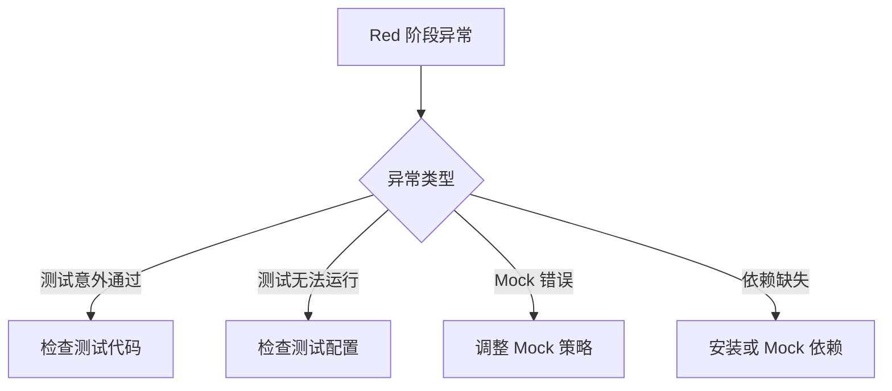
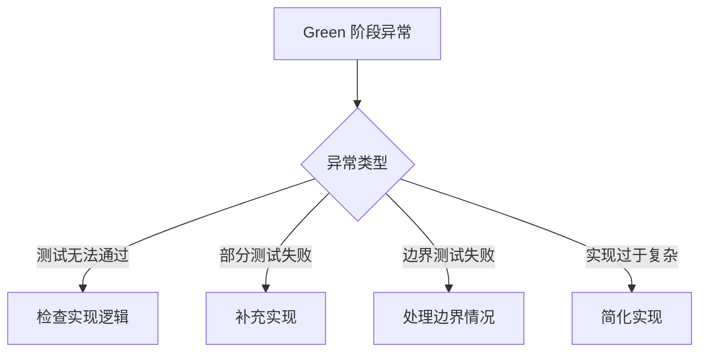
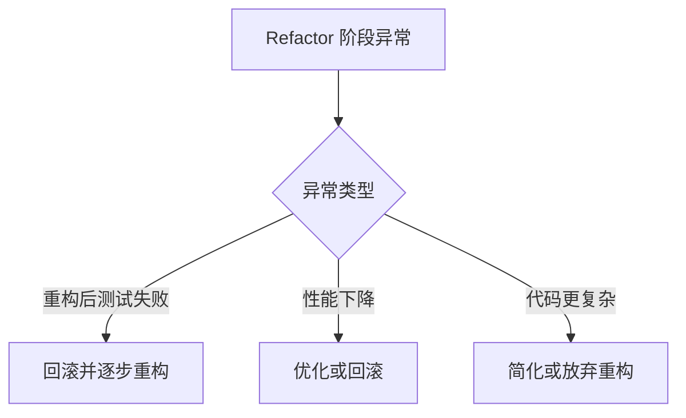
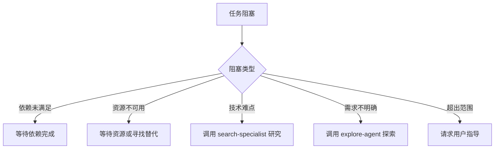
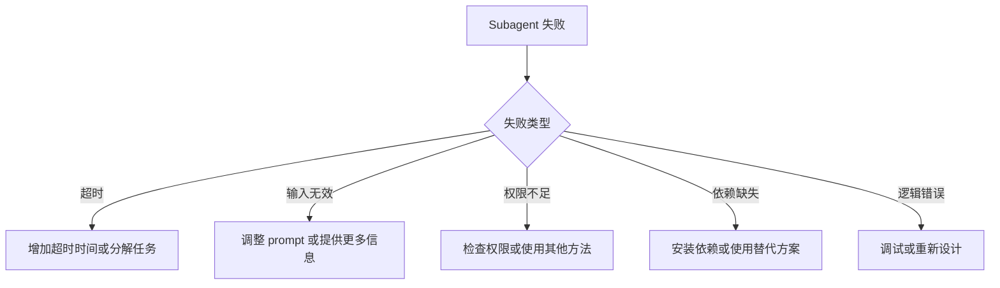

# 异常处理和检查点

本文档详细说明各种异常情况的处理方法和执行检查点。

---

## 目录

- [一、TDD 异常处理](#一tdd-异常处理)
- [二、遇到阻塞](#二遇到阻塞)
- [三、超出范围](#三超出范围)
- [四、Subagent 失败](#四subagent-失败)
- [五、执行检查点](#五执行检查点)
- [六、常见错误处理](#六常见错误处理)
- [七、回滚策略](#七回滚策略)
- [八、沟通策略](#八沟通策略)
- [九、文档更新](#九文档更新)
- [十、测试验证](#十测试验证)
- [十一、完成标准](#十一完成标准)

---

## 一、TDD 异常处理（新增）

### Red 阶段异常



**测试意外通过（严重）：**

```
## ⚠️ TDD 警告：测试意外通过

**问题**: 测试在实现前就通过了
**可能原因**:
1. 测试断言有误
2. 测试了错误的功能
3. Mock 返回了真实数据
4. 功能已存在

**处理步骤**:
1. 检查测试断言是否正确
2. 确认测试覆盖的是预期功能
3. 检查 Mock 配置
4. 确认功能确实未实现

**示例修复**:
```typescript
// ❌ 错误：断言太宽松
expect(result).toBeDefined()

// ✅ 正确：精确断言
expect(result).toEqual({ id: '123', name: 'Test' })
```
```

**测试无法运行：**

```
## ⚠️ 测试配置错误

**问题**: 测试文件无法执行
**可能原因**:
1. 测试框架未安装
2. 配置文件缺失
3. 导入路径错误
4. TypeScript 编译错误

**处理步骤**:
1. 确认测试框架已安装：`pnpm test`
2. 检查 vitest.config.ts
3. 修复导入路径
4. 解决 TypeScript 错误
```

**Mock 配置错误：**

```
## ⚠️ Mock 配置问题

**问题**: Mock 未正确模拟依赖
**常见错误**:
1. Mock 返回 undefined
2. Mock 未被调用
3. Mock 覆盖范围不足

**修复示例**:
```typescript
// ❌ 错误：Mock 返回 undefined
vi.mock('@/lib/db', () => ({ db: {} }))

// ✅ 正确：Mock 返回预期值
vi.mock('@/lib/db', () => ({
  db: {
    query: vi.fn().mockResolvedValue({ id: '123' })
  }
}))
```
```

### Green 阶段异常



**测试无法通过：**

```
## ⚠️ Green 阶段阻塞

**问题**: 实现后测试仍然失败
**处理策略**:
1. 逐个运行测试，定位失败原因
2. 检查实现是否满足测试规格
3. 添加调试日志定位问题
4. 确保实现是最小化方案

**调试示例**:
```typescript
// 添加调试日志
async function login(username: string, password: string) {
  console.log('[DEBUG] login called:', { username });
  const result = await authenticate(username, password);
  console.log('[DEBUG] auth result:', result);
  return result;
}
```
```

**边界测试失败：**

```
## ⚠️ 边界情况未处理

**问题**: 边界测试失败
**常见边界**:
- 空值输入
- 最大长度输入
- 特殊字符
- 并发访问

**处理步骤**:
1. 列出所有边界情况
2. 逐个添加边界处理
3. 运行测试确认通过
4. 保持最小实现原则
```

### Refactor 阶段异常



**重构后测试失败（严重）：**

```
## ⚠️ TDD 警告：重构破坏测试

**问题**: 重构后测试失败
**处理原则**: 立即回滚，保持绿色

**处理步骤**:
1. 回滚到重构前状态
2. 确认测试通过
3. 分解重构为更小步骤
4. 每步验证测试通过

**安全重构模式**:
```
// 步骤 1: 提取变量
const isValid = validate(input);
if (isValid) { ... }

// 步骤 2: 运行测试 ✓

// 步骤 3: 提取函数
function isValidInput(input) {
  return validate(input);
}

// 步骤 4: 运行测试 ✓
```
```

### TDD 流程恢复

```
## TDD 流程恢复模板

**当前状态**: <Red/Green/Refactor>
**阻塞原因**: <原因>
**已验证**:
- [ ] 测试文件存在
- [ ] 测试可运行
- [ ] Mock 配置正确
- [ ] 依赖满足

**恢复计划**:
1. <步骤一>
2. <步骤二>
3. <步骤三>

**预期结果**: <描述>
```

---

## 二、遇到阻塞

### 阻塞类型



### 处理模板

```
## ⚠️ 任务阻塞

**当前任务**: <任务描述>
**阻塞原因**: <原因>

**选项**:
1. 更新 design.md 反映新发现
2. 调用 explore-agent 探索
3. 调用 search-specialist 研究
4. 请求用户指导
```

### 示例

```
## ⚠️ 任务阻塞

**当前任务**: 实现用户认证功能
**阻塞原因**: 需要明确认证方式（JWT vs Session）

**选项**:
1. 调用 explore-agent 探索项目现有认证实现
2. 询问用户偏好认证方式
3. 两种方式都实现，通过配置切换
```

---

## 二、超出范围

### 判断标准

```
超出变更范围的情况：
1. 修改了 proposal.md 中未列出的文件
2. 添加了 proposal.md 中未定义的功能
3. 修改了其他变更范围内的文件
4. 需要修改项目配置文件（如 tsconfig.json）
5. 需要添加新的依赖
```

### 处理模板

```
## ⚠️ 超出变更范围

**请求修改**: <文件路径>
**变更范围**: <当前变更定义的文件列表>

此文件不在当前变更范围内。

**选项**:
1. 更新 proposal.md 扩展范围
2. 创建新的变更处理
3. 跳过此修改
```

### 示例

```
## ⚠️ 超出变更范围

**请求修改**: src/config/database.ts
**变更范围**: 
- src/auth/login.ts
- src/auth/register.ts

此文件不在当前变更范围内。

**选项**:
1. 更新 proposal.md，添加数据库配置任务
2. 创建新的变更处理数据库配置
3. 跳过，使用现有配置
```

---

## 三、Subagent 失败

### 失败类型



### 处理模板

```
## ⚠️ Subagent 执行失败

**Subagent**: <类型>
**任务**: <描述>
**错误**: <错误信息>

**处理方式**:
1. 自己重试该任务
2. 调用其他 subagent
3. 分解为更小的任务
4. 请求用户指导
```

### 示例

```
## ⚠️ Subagent 执行失败

**Subagent**: frontend-developer
**任务**: 实现用户登录组件
**错误**: 超时（120秒）

**处理方式**:
1. 将任务分解为：
   - 实现 UI 布局
   - 实现表单验证
   - 实现 API 调用
2. 逐个实现每个子任务
3. 确保每个子任务在合理时间内完成
```

---

## 四、执行检查点

### 任务开始前检查

```
[ ] 理解任务需求
[ ] 阅读 proposal.md 和 design.md
[ ] 确定任务类型
[ ] 选择合适的 subagent
[ ] 准备必要的上下文
[ ] 检查依赖是否满足
[ ] 评估任务复杂度
[ ] 确定执行策略
```

### 任务执行中检查

```
[ ] 按计划执行
[ ] 只修改变更范围内定义的文件
[ ] 代码风格符合项目规范
[ ] 变更保持最小化
[ ] 及时更新 tasks.md
[ ] 处理阻塞和问题
[ ] 记录重要决策
[ ] 保持可回滚性
```

### 任务完成后检查

```
[ ] tasks.md 已更新
[ ] 代码已实现
[ ] 代码已测试
[ ] 前端修改后调用了 frontend-tester
[ ] 代码完成后调用了 code-reviewer
[ ] 文档已更新（如需要）
[ ] 变更可回滚
[ ] 无遗留的调试代码
[ ] 无性能问题
[ ] 无安全问题
```

---

## 五、常见错误处理

### 错误 1: 编译错误

```
现象: TypeScript 编译失败
原因: 类型错误、语法错误、缺少依赖
处理:
  1. 查看编译错误信息
  2. 修复类型错误
  3. 检查导入和导出
  4. 确保依赖已安装
```

### 错误 2: 运行时错误

```
现象: 程序运行时崩溃
原因: 逻辑错误、边界情况、空值引用
处理:
  1. 查看错误堆栈
  2. 定位错误位置
  3. 添加错误处理
  4. 添加单元测试
```

### 错误 3: 测试失败

```
现象: 测试用例失败
原因: 实现错误、测试错误、环境问题
处理:
  1. 查看测试输出
  2. 分析失败原因
  3. 修复实现或测试
  4. 确保测试通过
```

### 错误 4: 性能问题

```
现象: 程序运行缓慢
原因: 算法复杂度高、资源泄漏、I/O 阻塞
处理:
  1. 性能分析
  2. 识别瓶颈
  3. 优化算法
  4. 添加缓存
```

### 错误 5: 安全问题

```
现象: 存在安全漏洞
原因: 输入验证不足、权限控制缺失、数据泄露
处理:
  1. 安全审查
  2. 修复漏洞
  3. 添加验证
  4. 加强权限控制
```

---

## 六、回滚策略

### 何时回滚

```yaml
需要回滚的情况:
  - 实现与需求不符
  - 发现严重问题
  - 测试失败无法修复
  - 超出范围且未授权
  - 阻塞其他重要任务
```

### 回滚步骤

```
1. 停止当前任务
2. 标记任务为失败
3. 恢复已修改的文件
4. 更新 tasks.md
5. 记录回滚原因
6. 通知相关人员
```

### 回滚模板

```
## ⚠️ 任务回滚

**任务**: <任务描述>
**回滚原因**: <原因>
**回滚时间**: <时间>

**已回滚的修改**:
- <文件1>
- <文件2>

**后续行动**:
1. 重新评估任务
2. 调整实施方案
3. 重新执行任务
```

---

## 七、沟通策略

### 需要沟通的情况

```yaml
必须沟通:
  - 超出变更范围
  - 技术方案重大变更
  - 依赖外部资源
  - 需要用户决策
  - 发现严重问题

建议沟通:
  - 实现方案选择
  - 设计细节确认
  - 时间估计更新
  - 阻塞问题
```

### 沟通模板

```
## 📋 需要决策

**问题**: <问题描述>
**选项**:
1. <选项1>: <说明>
2. <选项2>: <说明>
3. <选项3>: <说明>

**我的建议**: <建议>
**原因**: <原因>
```

---

## 八、文档更新

### 需要更新文档的情况

```yaml
必须更新:
  - 新增 API
  - 修改接口
  - 添加配置项
  - 重大功能变更

建议更新:
  - 小功能改进
  - bug 修复
  - 代码重构
```

### 更新检查清单

```
[ ] API 文档已更新
[ ] 用户文档已更新
[ ] 开发者文档已更新
[ ] 示例代码已更新
[ ] 版本号已更新
[ ] 更新日志已更新
```

---

## 九、测试验证

### 测试类型

```yaml
单元测试:
  - 测试单个函数
  - 快速执行
  - 高覆盖率

集成测试:
  - 测试组件交互
  - 测试 API 集成
  - 需要环境

端到端测试:
  - 测试完整流程
  - 模拟用户操作
  - 耗时较长
```

### 验证检查清单

```
[ ] 单元测试通过
[ ] 集成测试通过
[ ] 端到端测试通过
[ ] 测试覆盖率达标
[ ] 性能测试通过
[ ] 安全测试通过
```

---

## 十、完成标准

### 任务完成标准

```yaml
功能完成:
  [ ] 实现了所有需求
  [ ] 测试全部通过
  [ ] 文档已更新

质量达标:
  [ ] 代码审查通过
  [ ] 无严重问题
  [ ] 性能符合要求

可交付:
  [ ] 可回滚
  [ ] 可部署
  [ ] 可维护
```

### 验收检查清单

```
[ ] 需求已实现
[ ] 测试已通过
[ ] 代码已审查
[ ] 文档已更新
[ ] 性能达标
[ ] 安全达标
[ ] 可回滚
[ ] 可部署
```