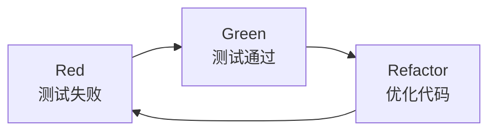

# TDD 工作流详解

本文档详细说明 TDD（测试驱动开发）工作流的具体实施方法。

---

## 目录

- [一、TDD 核心理念](#一tdd-核心理念)
- [二、Phase 1: Red（测试先行）](#二phase-1-red测试先行)
- [三、Phase 2: Green（最小实现）](#三phase-2-green最小实现)
- [四、Phase 3: Refactor（优化）](#四phase-3-refactor优化)
- [五、完整示例](#五完整示例)
- [六、TDD 检查清单](#六tdd-检查清单)
- [七、常见问题](#七常见问题)

---

## 一、TDD 核心理念

**测试先行，红绿重构循环**



| 阶段 | 目标 | 验证 |
|------|------|------|
| **Red** | 编写失败的测试 | 测试必须失败 |
| **Green** | 最小实现使测试通过 | 测试必须通过 |
| **Refactor** | 优化代码质量 | 测试仍须通过 |

---

## 二、Phase 1: Red（测试先行）

### 步骤

```
1. 阅读 proposal.md 和 design.md
2. 理解需求和设计规格
3. 调用 spec-writer 编写测试规格
   - 定义功能规格
   - 定义测试用例
   - 定义验收标准
   - 输出 test.md
4. 调用 tester 实现测试用例
   - 根据测试规格编写测试代码
   - 运行测试，确认失败
   - 输出测试报告（Red 状态）
5. 更新 tasks.md
6. 验证：测试必须失败 ✓
```

### 测试规格模板

```markdown
# 测试规格：<功能名称>

## 测试策略
- 测试框架：Vitest
- 覆盖率目标：80%+
- Mock 策略：外部依赖全部 mock

## 测试用例

### 正常用例
| ID | 描述 | 输入 | 期望输出 | 期望状态 |
|----|------|------|---------|---------|
| TC01 | 描述 | 输入 | 输出 | 通过 |

### 边界用例
| ID | 描述 | 输入 | 期望输出 | 期望状态 |
|----|------|------|---------|---------|
| TC10 | 描述 | 边界输入 | 输出 | 通过/失败 |

### 异常用例
| ID | 描述 | 输入 | 期望错误 | 错误码 |
|----|------|------|---------|--------|
| TC20 | 描述 | 非法输入 | 错误信息 | ERR_XXX |

## 验收标准
- [ ] 所有正常用例通过
- [ ] 所有边界用例正确处理
- [ ] 所有异常用例返回正确错误
- [ ] 覆盖率 ≥ 80%
```

### 测试代码模板

```typescript
/**
 * 测试：<功能名称>
 * @description 根据 test.md 实现的测试用例
 */

import { describe, it, expect, beforeEach, afterEach, vi } from 'vitest'

// Mock 外部依赖
vi.mock('@/lib/database', () => ({
  db: { query: vi.fn() }
}))

describe('<功能名称>', () => {
  beforeEach(() => {
    // 测试前准备
  })

  afterEach(() => {
    vi.clearAllMocks()
  })

  describe('正常用例', () => {
    it('TC01: <测试描述>', async () => {
      // Arrange
      const input = { /* ... */ }
      
      // Act
      const result = await functionUnderTest(input)
      
      // Assert
      expect(result).toEqual(expectedOutput)
    })
  })

  describe('边界用例', () => {
    it('TC10: <边界测试描述>', async () => {
      // 边界测试实现
    })
  })

  describe('异常用例', () => {
    it('TC20: <异常测试描述>', async () => {
      await expect(functionUnderTest(invalidInput))
        .rejects.toThrow(expectedError)
    })
  })
})
```

---

## 三、Phase 2: Green（最小实现）

### 步骤

```
1. 调用 developer 实现最小代码
   - 只写使测试通过的代码
   - 不添加额外功能
   - 保持代码简单
2. 运行测试
3. 验证：测试必须通过 ✓
4. 更新 tasks.md
```

### 最小实现原则

```typescript
// ❌ 错误：过度实现
async function login(username: string, password: string) {
  // 验证格式
  if (username.length < 3) throw new Error('用户名太短')
  if (password.length < 8) throw new Error('密码太短')
  
  // 查询用户
  const user = await db.query('SELECT * FROM users WHERE username = ?', [username])
  
  // 验证密码
  const isValid = await bcrypt.compare(password, user.password)
  if (!isValid) throw new Error('密码错误')
  
  // 生成 token
  const token = jwt.sign({ id: user.id }, SECRET, { expiresIn: '7d' })
  
  // 记录日志
  await logService.record(user.id, 'login')
  
  return { token, expiresIn: 604800 }
}

// ✅ 正确：最小实现（只满足当前测试）
async function login(username: string, password: string) {
  const user = await db.query('SELECT * FROM users WHERE username = ?', [username])
  if (!user) throw new Error('用户名或密码错误')
  
  const isValid = await bcrypt.compare(password, user.password)
  if (!isValid) throw new Error('用户名或密码错误')
  
  const token = jwt.sign({ id: user.id }, SECRET)
  return { token }
}
```

---

## 四、Phase 3: Refactor（优化）

### 步骤

```
1. 分析代码质量
2. 调用 developer 进行重构
   - 改善代码结构
   - 消除重复
   - 提高可读性
3. 运行测试
4. 验证：测试仍然通过 ✓
5. 调用 code-reviewer 审查
6. 更新 tasks.md
```

### 重构技巧

**提取函数：**
```typescript
// Before
async function login(username: string, password: string) {
  const user = await db.query('SELECT * FROM users WHERE username = ?', [username])
  if (!user) throw new Error('用户名或密码错误')
  const isValid = await bcrypt.compare(password, user.password)
  if (!isValid) throw new Error('用户名或密码错误')
  const token = jwt.sign({ id: user.id }, SECRET)
  return { token }
}

// After: 提取函数
async function login(username: string, password: string) {
  const user = await findUser(username)
  validatePassword(password, user.password)
  return generateToken(user)
}
```

**消除重复：**
```typescript
// Before
if (!user) throw new Error('用户名或密码错误')
if (!isValid) throw new Error('用户名或密码错误')

// After
function throwAuthError() {
  throw new Error('用户名或密码错误')
}
```

---

## 五、完整示例

### 示例：用户登录功能

**执行顺序：**

```typescript
// ========== Phase 1: Red ==========

// Step 1: 编写测试规格
await task(subagent="spec-writer", prompt=`
编写用户登录功能的测试规格：
- 功能：用户使用用户名和密码登录
- 输入：用户名、密码
- 输出：成功返回 JWT token
- 边界情况：空用户名、空密码、错误密码、用户不存在
`)

// Step 2: 实现测试用例
await task(subagent="tester", prompt=`
根据测试规格实现用户登录测试：
- 使用 Vitest 测试框架
- 测试文件：tests/auth/login.test.ts
- Mock 数据库和外部依赖
- 确保所有测试失败（功能未实现）
`)

// Step 3: 验证 Red 状态
// pnpm test tests/auth/login.test.ts
// 期望：所有测试失败

// ========== Phase 2: Green ==========

// Step 4: 实现最小代码
await task(subagent="backend-developer", prompt=`
实现用户登录功能（最小实现）：
- 只写使测试通过的代码
- 不添加额外功能
- 文件：src/auth/login.ts
`)

// Step 5: 验证 Green 状态
// pnpm test tests/auth/login.test.ts
// 期望：所有测试通过

// ========== Phase 3: Refactor ==========

// Step 6: 代码优化
await task(subagent="backend-developer", prompt=`
重构用户登录代码：
- 改善代码结构
- 消除重复
- 添加必要注释
- 保持测试通过
`)

// Step 7: 代码审查
await task(subagent="code-reviewer", prompt=`
审查用户登录代码：
- src/auth/login.ts
- tests/auth/login.test.ts
检查：代码质量、安全问题、测试覆盖
`)
```

---

## 六、TDD 检查清单

### Red 阶段
- [ ] 测试规格已编写
- [ ] 测试用例已实现
- [ ] 测试确认失败
- [ ] 失败原因符合预期

### Green 阶段
- [ ] 最小实现完成
- [ ] 测试确认通过
- [ ] 无额外功能
- [ ] 代码简洁

### Refactor 阶段
- [ ] 代码结构改善
- [ ] 测试仍然通过
- [ ] 代码审查完成
- [ ] 无性能下降

---

## 七、常见问题

### Q: 测试在 Red 阶段就通过了？

检查：
1. 测试断言是否正确
2. 是否测试了错误的功能
3. Mock 是否返回了真实数据
4. 功能是否已存在

### Q: Green 阶段测试无法通过？

检查：
1. 实现是否满足测试规格
2. 是否有遗漏的边界情况
3. Mock 配置是否正确
4. 依赖是否满足

### Q: Refactor 后测试失败？

处理：
1. 立即回滚到重构前状态
2. 确认测试通过
3. 分解重构为更小步骤
4. 每步验证测试通过
