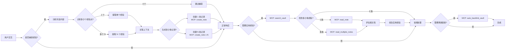
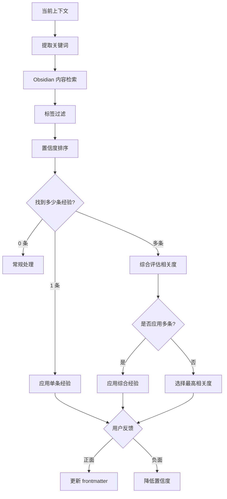

# 经验管理技能

从用户交互中学习和积累经验，建立经验库，并在未来的对话中应用这些经验以提供更智能、更个性化的响应。

**核心特性：**
- ✅ 支持单次交互生成 **0-x 条经验记录**（动态数量）
- ✅ 根据对话内容智能识别和提取多个相关经验点
- ✅ 每条经验独立存储，可独立更新和管理
- ✅ 支持批量经验检索和应用

**数据存储：** 使用 Obsidian Markdown 格式存储在 `~/Exp Vault` 中，支持 Obsidian 的双向链接、标签和搜索功能。

---

## 核心能力

### 1. 经验捕获（支持多条）
- 自动识别有价值的学习点（可识别多个）
- 提取用户偏好、习惯和模式（支持多个维度）
- 记录解决方案和最佳实践（可关联多个方案）
- 存储上下文相关的决策（支持决策链）
- **动态生成 0-x 条经验记录**（根据实际情况）

### 2. 经验存储（使用 Obsidian MCP）
- 使用 `create_note` 创建 Markdown 格式的经验笔记
- 支持批量创建多条经验
- 支持完整 frontmatter 元数据
- 维护经验的置信度和时效性
- 使用 `update_note` 进行精确更新

### 3. 经验应用（使用 Obsidian MCP）
- 使用 `search_vault` 检索相关经验
- 使用 `read_note` 读取详细内容
- 使用 `read_multiple_notes` 批量读取
- 使用 `auto_backlink_vault` 自动生成关联链接
- 支持多条经验综合应用

### 4. 经验演进
- 使用 `update_note` 更新 frontmatter 中的置信度
- 使用 `manage_folder` 管理经验分类
- 使用 `list_notes` 列出和筛选经验
- 使用 `notes_insight` 进行 AI 分析

---

## 工作流程



---

## 经验类型

| 类型 | 描述 | 支持多条 | 示例 |
|------|------|---------|------|
| 用户偏好 | 用户的喜好和设置 | ✅ | "用户喜欢使用 TypeScript" + "用户偏好严格模式" |
| 工作模式 | 用户的常用工作流程 | ✅ | "先运行 test 再提交" + "使用 lint 检查" |
| 决策模式 | 用户在特定场景下的决策倾向 | ✅ | "性能问题优先缓存" + "安全问题优先审查" |
| 知识点 | 用户掌握的特定知识 | ✅ | "熟悉 React" + "不熟悉 Vue" + "了解 Next.js" |
| 解决方案 | 问题和解决方案的映射 | ✅ | "CORS 问题 → 代理" + "CORS 问题 → JSONP" |
| 沟通风格 | 用户的沟通偏好 | ✅ | "简洁回答" + "喜欢代码示例" |
| 上下文约定 | 约定和命名规范 | ✅ | "驼峰命名" + "2 空格缩进" + "单引号" |

---

## 经验捕获时机

在以下情况下自动触发经验捕获：

1. **用户明确表达偏好**（可能包含多个）
   - "我更喜欢 pnpm，而且习惯用 workspace"
   - "我喜欢 TypeScript，还要用 strict mode"

2. **重复出现的模式**（可识别多个）
   - 连续多次相同的选择
   - 特定场景下的多个固定操作序列

3. **成功的问题解决**（可记录多个方案）
   - 用户确认方案 A 有效
   - 同时也发现方案 B 可行

4. **显式学习指令**（可批量学习）
   - "记住这些：使用 TypeScript、严格模式、ESLint"
   - "学习这个项目的规范"

5. **上下文约定**（可发现多个）
   - 项目配置中的多个约定
   - 代码风格中的多个规则

6. **综合场景分析**（一次交互提取多条）
   - 一次代码评审发现多个改进点
   - 一次需求讨论明确多个偏好

---

## Obsidian 存储结构

经验以 Obsidian Markdown 格式存储在 `~/Exp Vault` 中，支持双向链接和标签。

### 文件命名规范

```
exp_<type>_<timestamp>_<seq>.md
exp_preference_20260311_130245_1.md  # 第一条偏好
exp_preference_20260311_130245_2.md  # 第二条偏好
exp_solution_cors_20260311_130245_1.md
```

### Markdown 模板

```markdown
---
id: exp_20260311_130245_1
type: preference
created: 2026-03-11T13:02:45Z
updated: 2026-03-11T13:02:45Z
confidence: 0.8
usage_count: 0
effective: true
tags: [preference, npm, pnpm]
project: niuma
batch_id: 20260311_130245  # 同一批次的关联 ID
---

# 用户偏好使用 pnpm

## 描述
用户在项目开发中偏好使用 pnpm 而不是 npm。

## 上下文
- **场景**: 项目依赖管理
- **来源**: 显式声明
- **时间**: 2026-03-11

## 关联
- [[exp_preference_20260311_130245_2]] - 同批次其他经验
- [[exp_workflow_20260311_120000]] - 工作流程

## 反馈记录
- 2026-03-11: 确认有效 ✓
```

### 目录结构

```
~/Exp Vault/
├── .obsidian/           # Obsidian 配置
├── Preferences/         # 用户偏好
├── Workflows/          # 工作流程
├── Solutions/          # 解决方案
├── Knowledge/          # 知识点
├── Conventions/        # 约定规范
└── Styles/             # 沟通风格
```

### 标签系统

- `#experience` - 所有经验笔记
- `#preference` - 用户偏好
- `#workflow` - 工作流程
- `#solution` - 解决方案
- `#knowledge` - 知识点
- `#convention` - 约定规范
- `#style` - 沟通风格
- `#project:<name>` - 项目标签
- `#batch:<id>` - 批次标签

---

## 经验检索策略



**检索规则：**

1. **Obsidian 搜索** - 使用 `obsidian-cli search-content` 检索笔记内容
2. **标签匹配** - 通过 Obsidian 标签过滤相关经验
3. **双向链接** - 通过 `[[link]]` 查找关联经验
4. **上下文过滤** - 通过 frontmatter 的 project 字段过滤
5. **置信度排序** - 优先返回高 confidence 的经验
6. **时效性考虑** - 通过 created/updated 字段判断时效
7. **批次关联** - 通过 batch_id 查找同批次的关联经验

---

## 使用场景

### 场景 1：批量学习偏好

```
用户：我更喜欢用 pnpm，而且习惯用 workspace 模式，还要启用 pnpm-workspace
→ 捕获经验：生成 3 条经验记录
  1. 用户偏好使用 pnpm
  2. 用户习惯 workspace 模式
  3. 用户启用 pnpm-workspace
→ 未来：自动应用这 3 条偏好
```

### 场景 2：识别完整工作模式

```
用户：先运行测试，然后构建，接着 lint 检查，最后部署
→ 捕获经验：生成 4 条经验记录
  1. 测试阶段优先
  2. 构建阶段要求
  3. Lint 检查必要
  4. 部署流程规范
→ 未来：建议或自动执行这个完整流程
```

### 场景 3：多个解决方案对比

```
用户：上次我们用了代理，也试了 JSONP，最后代理更好
→ 捕获经验：生成 2 条经验记录
  1. CORS 问题 → 代理配置（高置信度）
  2. CORS 问题 → JSONP（低置信度）
→ 未来：优先推荐代理方案，JSONP 作为备选
```

### 场景 4：综合代码规范

```
用户：项目用 TypeScript，strict mode，单引号，2 空格缩进
→ 捕获经验：生成 4 条经验记录
  1. 使用 TypeScript
  2. 启用 strict mode
  3. 使用单引号
  4. 2 空格缩进
→ 未来：创建代码时自动应用这些规范
```

### 场景 5：零经验场景

```
用户：今天天气不错
→ 分析：没有有价值的经验点
→ 生成：0 条经验记录
→ 行为：正常响应，不创建笔记
```

---

## 约束和限制

### 必须
- ✅ 只捕获与实际任务相关的经验
- ✅ 维护经验的置信度机制
- ✅ 支持用户的显式反馈
- ✅ 定期清理低置信度的经验
- ✅ 每条经验独立可管理

### 禁止
- ❌ 不要捕获敏感信息（密码、密钥等）
- ❌ 不要过度泛化个别情况
- ❌ 不要在没有足够证据时推断经验
- ❌ 不要在未经确认时应用高风险经验
- ❌ 不要将不相关的经验强制归为一组

### 多条经验处理原则
- ✅ 相关经验可以同批次生成，但独立存储
- ✅ 使用 batch_id 关联同批次经验
- ✅ 每条经验可独立更新置信度
- ✅ 检索时可按批次或单独查找

---

## 使用方法

```bash
/openexp <自然语言描述>
```

只需要用自然语言描述你的需求，AI 会自动判断需要做什么操作。

### 示例

#### 添加单条经验
```bash
/openexp 我喜欢用 pnpm 而不是 npm
```

#### 添加多条经验
```bash
/openexp 记住这些：项目使用 TypeScript、strict mode、ESLint、单引号
/openexp 我的习惯是先运行测试再 lint 检查，然后构建最后部署
/openexp 规范：驼峰命名、2 空格缩进、单引号、尾随逗号
```

#### 查看经验
```bash
/openexp 显示所有经验
/openexp 列出所有关于 TypeScript 的经验
/openexp 看看有什么工作流程
```

#### 搜索经验
```bash
/openexp 搜索 CORS 相关的经验
/openexp 找找关于部署的解决方案
/openexp 查询 pnpm 相关的偏好
```

#### 应用经验
```bash
/openexp 遇到了 CORS 问题，有什么经验吗？
/openexp 怎么部署这个项目？
/openexp 根据经验，我应该用什么工具？
```

#### 提供反馈
```bash
/openexp 这个经验很有效：exp_preference_20260311_130245_1.md
/openexp 这批经验中，第 2 条不管用
```

---

## 集成点

### 与 Obsidian 集成
此技能提供两种 Obsidian 集成方式：

#### 方式一：使用 Obsidian CLI Shell 脚本（推荐）
技能内置了完整的 Shell 脚本封装（`obsidian-cli.sh`），提供简单易用的命令行接口：

```bash
# 创建笔记
./obsidian-cli.sh create Preferences/test.md '# 测试内容'

# 搜索笔记
./obsidian-cli.sh search pnpm content

# 读取笔记
./obsidian-cli.sh read Preferences/test.md
```

**特点：**
- ✅ 无需编译，直接运行
- ✅ 跨平台兼容（Linux、macOS）
- ✅ 无需额外 MCP 服务器
- ✅ 直接调用 Obsidian CLI 命令
- ✅ 完整的错误处理

#### 方式二：使用 MCP Server
通过 `storks-obsidian-mcp` MCP 服务器访问 Obsidian vault：

- 使用 `create_note` 创建经验笔记（支持批量）
- 使用 `search_vault` 检索相关经验
- 使用 `update_note` 更新元数据
- 支持双向链接 `[[link]]` 关联相关经验
- 使用标签系统 `#tag` 分类经验
- 使用 batch_id 关联同批次经验

**特点：**
- ✅ MCP 协议标准
- ✅ 支持 Obsidian 完整功能（backlinks、graphs 等）
- ✅ 需要配置 MCP 服务器
- ✅ 需要 Obsidian 桌面应用运行

### 与 Agent Memory 集成
- 将 Obsidian 笔记 ID 存储到长期记忆中
- 使用 Obsidian 搜索功能查找相关经验
- 维护经验之间的关联关系（通过双向链接）
- 支持多条经验的综合应用

### 与 Context 集成
- 从上下文中自动提取经验要素（可能多个）
- 将经验应用到当前上下文
- 记录经验使用的上下文信息（frontmatter project 字段）

### With Tools 集成
- 在工具调用前检查相关经验
- 记录工具使用模式
- 优化工具选择策略
- 支持基于经验的工具推荐

---

## 示例交互

### 示例 1：批量学习偏好

```
用户：我习惯用 TypeScript strict mode，还要用 ESLint，代码用单引号
系统：已记录 3 条经验：
  ✓ 用户偏好使用 TypeScript strict mode
  ✓ 用户习惯使用 ESLint
  ✓ 用户代码使用单引号

（稍后）
用户：创建一个新的配置文件
系统：我将为您创建配置文件，已应用您的偏好：
  - TypeScript strict mode 已启用
  - ESLint 配置已包含
  - 代码风格使用单引号...
```

### 示例 2：综合应用历史经验

```
用户：上次我们是怎么处理这个项目的配置的？
系统：根据历史经验，上次我们：
  1. 启用了 TypeScript strict mode
  2. 配置了 ESLint
  3. 设置了单引号规范
  4. 使用 pnpm workspace 模式
是否应用相同的配置？
```

### 示例 3：多方案对比

```
用户：解决这个 CORS 问题
系统：根据经验，有 2 种方案：
  1. 代理配置（高置信度，上次成功使用）
  2. JSONP（低置信度，备选方案）
您想尝试哪种？
```

### 示例 4：零经验场景

```
用户：今天天气怎么样？
系统：今天天气不错，适合外出！
（未生成任何经验记录）
```

---

## 版本历史

- **v1.3** (2026-03-11) - 添加 Obsidian CLI Shell 脚本封装，支持直接使用 obsidian-cli 命令
- **v1.2** (2026-03-11) - 支持单次交互生成 0-x 条经验记录
- **v1.1** (2026-03-11) - 集成 Obsidian 存储，数据存储在 ~/Exp Vault
- **v1.0** (2026-03-11) - 初始版本，定义核心能力

## 相关资源

- [obsidian-cli.sh](scripts/obsidian-cli.sh) - Obsidian CLI Shell 脚本封装
- [Obsidian 文档](https://help.obsidian.md/)
- [Obsidian CLI 文档](https://help.obsidian.md/cli)
