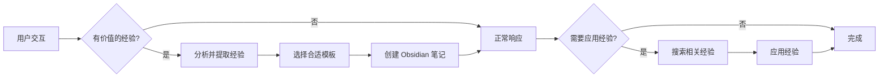

# 经验管理技能

从用户交互中学习和积累经验，建立经验库，并在未来的对话中应用这些经验以提供更智能、更个性化的响应。

**核心特性：**
- ✅ 支持单次交互生成 **0-x 条经验记录**（动态数量）
- ✅ 智能识别用户偏好、工作流程、解决方案等多种经验类型
- ✅ 使用 Obsidian Markdown 格式存储，支持双向链接和标签
- ✅ 根据使用频率、置信度和关联关系自动计算影响力
- ✅ 只展示影响力最大的前 20 条经验

**数据存储：** `~/Exp Vault` 目录

---

## 快速开始

```bash
# 记录偏好
/openexp 我喜欢用 pnpm 而不是 npm

# 记录工作流程
/openexp 我的习惯是先运行测试再 lint 检查，然后构建最后部署

# 记录问题解决经验
/openexp 这次解决了 API 嵌套 JSON 的解析问题，用了 3 个小时

# 查找经验
/openexp 遇到了 CORS 问题，有什么经验吗？

# 查看索引地图
/openexp 查看经验索引地图
```

---

## 经验类型

| 类型 | 描述 | 模板 |
|------|------|------|
| 经验记录 | 完整的问题解决过程，提炼技巧、原则、模型 | `templates/experience-log-template.md` |
| 用户偏好 | 用户的喜好、设置和习惯 | `templates/preference-template.md` |
| 工作流程 | 固定的操作步骤和流程 | `templates/workflow-template.md` |
| 解决方案 | 问题和解决方案的映射 | `templates/solution-template.md` |
| 知识点 | 技术概念、API、工具等知识 | `templates/knowledge-template.md` |
| 约定规范 | 命名、格式、结构等规则 | `templates/convention-template.md` |
| 索引地图 | 经验库的中央枢纽，展示技巧、原则、模型的关系 | `templates/index-map-template.md` |

> 💡 **如何选择合适的模板？** 查看 [模板使用指南](reference/template-guide.md)

---

## 存储结构

```
~/Exp Vault/
├── 经验索引地图.md           # 中央枢纽（技巧、原则、模型）
├── Preferences/             # 用户偏好
├── Workflows/              # 工作流程
├── Solutions/              # 解决方案
├── Knowledge/              # 知识点
└── Conventions/            # 约定规范
```

**文件命名：** `exp_<type>_<timestamp>_<seq>.md`

**常用标签：** `#preference` `#workflow` `#solution` `#knowledge` `#convention`

---

## 工作流程



---

## 索引地图

经验索引地图是经验库的中央枢纽，展示"技巧"、"原则"、"模型"三个核心维度之间的关系。

**影响力排序：**
```
影响力 = usage_count * 5 + confidence * 50 + backlinks * 10 + referenced_weight
```

**说明**：
- `usage_count * 5` - 使用频率贡献
- `confidence * 50` - 可靠性贡献
- `backlinks * 10` - 被引用程度贡献
- `referenced_weight` - 引用的重要经验的权重总和

> 💡 **详细了解影响力计算**：查看 [影响力计算逻辑](reference/impact-calculation.md)

**只展示影响力最大的前 20 条**

**三个维度：**
- **技巧** - 具体的、可直接应用的技术手段
- **原则** - 指导决策和行为的通用准则
- **模型** - 用于理解和解决问题的思维框架

**自动化维护**：
```bash
# 运行维护脚本，自动计算影响力和更新索引地图
python3 scripts/maintain-experience-vault.py
```

---

## 使用方法

### 添加经验

```bash
# 单条经验
/openexp 我喜欢用 pnpm 而不是 npm

# 多条经验（批量）
/openexp 记住这些：项目使用 TypeScript、strict mode、ESLint、单引号

# 问题解决经验
/openexp 这次解决了 API 嵌套 JSON 的解析问题，用了 3 个小时
```

### 查找经验

```bash
# 搜索特定主题
/openexp 搜索 CORS 相关的经验

# 应用经验
/openexp 遇到了 CORS 问题，有什么经验吗？

# 查看所有经验
/openexp 显示所有经验
```

### 管理经验

```bash
# 提供反馈
/openexp 这个经验很有效：exp_preference_20260311_130245_1.md

# 查看索引地图
/openexp 查看经验索引地图

# 自动维护（运行维护脚本）
python3 scripts/maintain-experience-vault.py
```

---

## 捕获时机

自动在以下情况触发：

- ✅ 用户明确表达偏好（"我喜欢..."）
- ✅ 重复出现的模式（连续多次相同选择）
- ✅ 成功的问题解决（用户确认方案有效）
- ✅ 显式学习指令（"记住这些..."）
- ✅ 综合场景分析（一次交互提取多个经验点）

---

## 约束和限制

### 必须
- ✅ 只捕获与实际任务相关的经验
- ✅ 维护经验的置信度机制
- ✅ 支持用户的显式反馈
- ✅ 定期清理低置信度的经验
- ✅ 定期运行维护脚本更新影响力（建议每周）

### 禁止
- ❌ 不要捕获敏感信息（密码、密钥等）
- ❌ 不要过度泛化个别情况
- ❌ 不要在没有足够证据时推断经验
- ❌ 不要在未经确认时应用高风险经验

---

## 集成方式

### Obsidian CLI（推荐）

```bash
# 创建笔记
./scripts/obsidian-cli.sh create Preferences/test.md '# 内容'

# 搜索笔记
./scripts/obsidian-cli.sh search pnpm content

# 读取笔记
./scripts/obsidian-cli.sh read Preferences/test.md
```

### MCP Server

- `create_note` - 创建经验笔记
- `search_vault` - 检索相关经验
- `update_note` - 更新元数据
- 支持双向链接 `[[link]]` 和标签系统

---

## 相关资源

- [模板使用指南](reference/template-guide.md) - 如何选择合适的模板
- [影响力计算逻辑](reference/impact-calculation.md) - 影响力计算方法和原理
- [templates/](templates/) - Obsidian 模板文件
- [scripts/obsidian-cli.sh](scripts/obsidian-cli.sh) - Obsidian CLI 封装
- [scripts/maintain-experience-vault.py](scripts/maintain-experience-vault.py) - 经验库维护脚本
- [Obsidian 文档](https://help.obsidian.md/)

---

## 版本历史

- **v2.1** (2026-03-11) - 优化影响力计算，考虑使用频率、置信度和关联关系；添加自动化维护脚本
- **v2.0** (2026-03-11) - 聚焦核心功能，简化文档结构，移除冗余内容
- **v1.6** (2026-03-11) - 优化目录结构，将模板文件移至 `templates/` 目录
- **v1.5** (2026-03-11) - 新增经验索引地图，支持技巧、原则、模型关系展示
- **v1.4** (2026-03-11) - 拆分多种经验类型模板
- **v1.0** (2026-03-11) - 初始版本