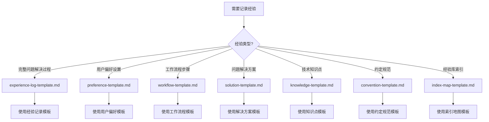
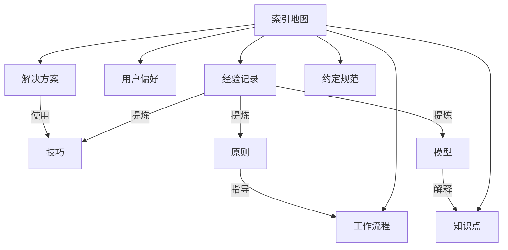

# 模板使用指南

本指南说明了如何为不同类型的经验选择合适的模板。

## 📁 目录结构

```
.iflow/skills/openexp/
├── SKILL.md                    # 技能主文档
├── reference/                  # 参考文档（本目录）
│   └── template-guide.md      # 模板使用指南
├── templates/                  # Obsidian 模板文件
│   ├── experience-log-template.md
│   ├── preference-template.md
│   ├── workflow-template.md
│   ├── solution-template.md
│   ├── knowledge-template.md
│   ├── convention-template.md
│   └── index-map-template.md
└── scripts/                    # Shell 脚本
    └── obsidian-cli.sh
```

---

## 🎯 模板选择决策树



---

## 📋 模板详情

### 1. 经验记录模板

**文件**：`templates/experience-log-template.md`

**何时使用**：
- ✅ 需要记录完整的问题解决过程
- ✅ 包含目标、操作、原因分析、核心经验提炼
- ✅ 涉及提示词优化、调试过程、技术探索
- ✅ 需要提炼技巧、原则、模型三个层次的结论

**典型场景**：
- "这次调试用了3个小时，终于解决了 API 嵌套 JSON 的解析问题"
- "优化了提示词，现在 AI 能够正确处理长上下文了"
- "尝试了多种方案，最终找到最优解"

**核心特点**：
- 结构化的问题分析（目标、障碍、操作、原因）
- 提炼三个层次的结论：技巧、原则、模型
- 记录待验证假设和后续问题

---

### 2. 用户偏好模板

**文件**：`templates/preference-template.md`

**何时使用**：
- ✅ 记录用户的个人喜好、设置和习惯
- ✅ 涉及工具选择、编码风格、工作方式
- ✅ 需要区分核心偏好和排除项

**典型场景**：
- "我更喜欢用 pnpm 而不是 npm"
- "代码使用单引号，2 空格缩进"
- "不喜欢使用 TypeScript any 类型"

**核心特点**：
- 区分核心偏好、次要偏好和排除项
- 记录上下文（场景、来源、时间）
- 包含反馈记录和使用建议

---

### 3. 工作流程模板

**文件**：`templates/workflow-template.md`

**何时使用**：
- ✅ 记录一系列固定的操作步骤
- ✅ 涉及多个阶段的流程
- ✅ 需要展示流程图或步骤序列

**典型场景**：
- "先运行测试，然后构建，接着 lint 检查，最后部署"
- "代码评审流程：自评 → 同行评审 → 修改 → 合并"
- "问题排查流程：复现 → 定位 → 修复 → 验证"

**核心特点**：
- 使用 Mermaid 流程图展示步骤
- 记录触发条件和输入要求
- 包含变体和选项

---

### 4. 解决方案模板

**文件**：`templates/solution-template.md`

**何时使用**：
- ✅ 记录特定问题的解决方案
- ✅ 需要对比多个方案
- ✅ 包含实施步骤和效果验证

**典型场景**：
- "CORS 问题通过代理配置解决"
- "性能问题通过缓存优化解决"
- "跨域问题的两种方案对比"

**核心特点**：
- 详细描述问题和症状
- 包含代码/配置示例
- 记录局限性、适用场景和替代方案

---

### 5. 知识点模板

**文件**：`templates/knowledge-template.md`

**何时使用**：
- ✅ 记录技术概念、API、工具等知识
- ✅ 需要解释定义和核心概念
- ✅ 包含常见误区和实践示例

**典型场景**：
- "React Hooks 使用注意事项"
- "JavaScript Promise 的理解"
- "Docker 容器网络配置"

**核心特点**：
- 清晰定义知识点
- 列出关键特性和使用场景
- 记录常见误区和正确理解

---

### 6. 约定规范模板

**文件**：`templates/convention-template.md`

**何时使用**：
- ✅ 记录项目的约定和规范
- ✅ 涉及命名、格式、结构等规则
- ✅ 需要工具配置支持

**典型场景**：
- "TypeScript 命名规范"
- "代码格式规范（ESLint + Prettier）"
- "文件组织规范"

**核心特点**：
- 详细的规则说明和示例
- 包含正确/错误示例对比
- 关联工具配置（ESLint、Prettier 等）

---

### 7. 索引地图模板

**文件**：`templates/index-map-template.md`

**何时使用**：
- ✅ 创建经验库的中央枢纽
- ✅ 展示经验之间的关系
- ✅ 需要快速查找特定类型的经验

**典型场景**：
- 初始化经验库时创建
- 需要整体浏览经验库时使用
- 发现经验之间的新关系时更新

**核心特点**：
- 三个核心维度：技巧、原则、模型
- 只展示影响力最大的前 20 条
- 使用反向链接关联相关经验

---

## 🔍 模板对比

| 模板 | 重点 | 适用场景 | 结构复杂度 |
|------|------|---------|-----------|
| 经验记录 | 问题解决过程 | 调试、优化、探索 | ⭐⭐⭐⭐⭐ |
| 用户偏好 | 个人喜好 | 工具选择、编码风格 | ⭐⭐⭐ |
| 工作流程 | 操作步骤 | 流程、任务序列 | ⭐⭐⭐⭐ |
| 解决方案 | 问题-方案映射 | 特定问题解决 | ⭐⭐⭐⭐ |
| 知识点 | 技术概念 | 概念理解、API 使用 | ⭐⭐⭐ |
| 约定规范 | 规则标准 | 项目规范、代码风格 | ⭐⭐⭐⭐ |
| 索引地图 | 关系网络 | 经验库导航 | ⭐⭐⭐⭐⭐ |

---

## 💡 最佳实践

### 1. 选择模板的原则

- **优先使用最具体的模板**：如果同时符合多个模板，选择结构最合适的
- **不要混合使用多个模板**：一条经验只使用一个模板
- **定期审查模板选择**：如果发现模板不合适，可以重新创建

### 2. 填写模板的技巧

- **完整填写必填字段**：特别是 frontmatter 中的核心字段
- **使用简洁明了的语言**：避免过于冗长或模糊的描述
- **提供具体示例**：代码、配置、命令等示例很有价值
- **使用反向链接**：关联相关的经验笔记

### 3. 维护经验库

- **定期更新索引地图**：新增经验后及时更新
- **清理低影响力经验**：定期审查和删除过时的经验
- **验证经验的有效性**：定期检查经验是否仍然适用

---

## 📚 模板之间的关系



**关系说明**：
- **索引地图**是中央枢纽，链接所有类型的经验
- **经验记录**可以提炼出技巧、原则、模型，这些会被索引地图引用
- **解决方案**使用具体的技巧
- **原则**指导工作流程的制定
- **模型**解释知识点的本质

---

## 🛠️ 在 Obsidian 中使用模板

### 方法一：手动复制

1. 打开 `templates/` 目录中的模板文件
2. 复制模板内容
3. 在 Exp Vault 中创建新文件
4. 粘贴模板并填充内容

### 方法二：使用 Obsidian 模板插件（推荐）

1. 安装 Obsidian 模板插件
2. 配置模板文件夹为 `.iflow/skills/openexp/templates/`
3. 在 Obsidian 中按 `Cmd/Ctrl + T` 插入模板
4. 选择合适的模板

### 方法三：使用 Shell 脚本

```bash
# 复制模板到 Exp Vault
cp .iflow/skills/openexp/templates/experience-log-template.md ~/Exp\ Vault/exp_$(date +%Y%m%d_%H%M%S).md
```

---

## 📖 参考资源

- [SKILL.md](../SKILL.md) - 经验管理技能主文档
- [scripts/obsidian-cli.sh](../scripts/obsidian-cli.sh) - Obsidian CLI 封装脚本
- [Obsidian 文档](https://help.obsidian.md/) - Obsidian 官方文档