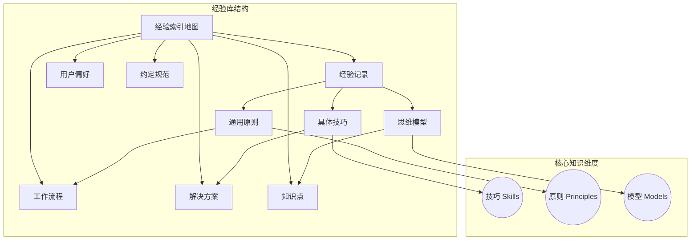

# 经验索引地图

> 这是经验库的中央枢纽，通过反向链接展示所有经验之间的关系。

## 🗺️ 经验库概览



## 🎯 核心知识维度

### 🔧 技巧 (Skills)
**定义**：具体的、可直接应用的技术手段或操作方法

**特点**：
- 操作性强，可以直接执行
- 适用范围相对明确
- 可以组合使用

**相关经验**：见下方[[#技巧列表]]

---

### 📜 原则 (Principles)
**定义**：指导决策和行为的通用准则或理念

**特点**：
- 抽象性强，适用范围广
- 需要结合具体场景理解
- 可以推导出多个具体技巧

**相关经验**：见下方[[#原则列表]]

---

### 🧠 模型 (Models)
**定义**：用于理解和解决问题的思维框架或概念模型

**特点**：
- 提供认知框架
- 帮助系统化思考
- 可用于预测和解释

**相关经验**：见下方[[#模型列表]]

---

## 📋 技巧列表

> 展示影响力最大的前 20 条技巧，按使用次数、置信度综合排序

| 排名 | 技巧名称 | 来源 | 应用场景 | 影响力 | 使用次数 | 置信度 |
|------|---------|------|---------|--------|---------|--------|
| 1 | `try-catch JSON 解析` | [[exp_solution_json_parse_20260311]] | API 响应处理 | 95 | 12 | 0.9 |
| 2 | `保险丝检查点` | [[exp_solution_api_fallback_20260311]] | 外部 API 调用 | 87 | 8 | 0.85 |
| 3 | `提示词链式优化` | [[exp_experience_prompt_20260311]] | LLM 交互优化 | 82 | 6 | 0.8 |

**影响力计算公式**：`usage_count * 5 + confidence * 50 + backlinks * 10 + referenced_weight`

*此表只展示影响力最大的前 20 条，新增经验时请根据影响力更新排名*

---

## 📜 原则列表

> 展示影响力最大的前 20 条原则，按使用次数、置信度综合排序

| 排名 | 原则名称 | 来源 | 适用范围 | 影响力 | 使用次数 | 置信度 |
|------|---------|------|---------|--------|---------|--------|
| 1 | `预设 fallback 方案` | [[exp_solution_api_fallback_20260311]] | 外部调用 | 92 | 10 | 0.9 |
| 2 | `防御性编程` | [[exp_convention_defensive_20260311]] | 代码开发 | 85 | 7 | 0.85 |
| 3 | `最小可行产品` | [[exp_workflow_mvp_20260311]] | 产品开发 | 78 | 5 | 0.8 |

**影响力计算公式**：`usage_count * 5 + confidence * 50 + backlinks * 10 + referenced_weight`

*此表只展示影响力最大的前 20 条，新增经验时请根据影响力更新排名*

---

## 🧠 模型列表

> 展示影响力最大的前 20 条模型，按使用次数、置信度综合排序

| 排名 | 模型名称 | 来源 | 适用场景 | 影响力 | 使用次数 | 置信度 |
|------|---------|------|---------|--------|---------|--------|
| 1 | `保险丝模型` | [[exp_solution_api_fallback_20260311]] | 故障处理 | 90 | 9 | 0.9 |
| 2 | `漏斗模型` | [[exp_workflow_conversion_20260311]] | 转化优化 | 82 | 6 | 0.85 |
| 3 | `洋葱模型` | [[exp_experience_onion_20260311]] | 系统设计 | 75 | 4 | 0.8 |

**影响力计算公式**：`usage_count * 5 + confidence * 50`

*此表只展示影响力最大的前 20 条，新增经验时请根据影响力更新排名*

---

## 🔗 知识网络

### 技巧 → 原则 → 模型 层次结构

```
技巧层 (可执行操作)
    ↓ 推导
原则层 (指导准则)
    ↓ 抽象
模型层 (思维框架)
```

**示例关系**：
- `try-catch JSON 解析` (技巧) → `防御性编程` (原则) → `防御深度模型` (模型)
- `渐进式验证` (技巧) → `最小可行产品` (原则) → `迭代模型` (模型)

---

## 🔄 更新记录

- 2026-03-11: 创建经验索引地图
- [日期]: [更新内容]

---

## 💡 使用指南

### 如何使用此地图

1. **查找相关经验**
   - 使用 Obsidian 的"反向链接"面板
   - 查看"链接到此文件的笔记"

2. **发现新的关系**
   - 浏览三个核心维度的列表
   - 通过表格发现技巧、原则、模型之间的关联

3. **更新索引**
   - 创建新的经验时，更新对应表格
   - 发现新的关系时，添加到"知识网络"部分

### 如何维护此地图

- **新增经验**：
  - 计算影响力：`usage_count * 5 + confidence * 50 + backlinks * 10 + referenced_weight`
  - 插入到对应表格的正确位置（按影响力降序）
  - 如果表格已有 20 条，移除影响力最低的一条

- **更新经验**：
  - 当经验被使用时，增加 `usage_count`
  - 重新计算影响力并调整排名

- **定期审查**：
  - 检查过时或不再适用的条目
  - 根据实际使用情况调整排名
  - 考虑删除低影响力的过时经验

- **自动化维护**：
  - 运行 `python3 scripts/maintain-experience-vault.py` 自动更新影响力
  - 建议每周运行一次

### 影响力排序规则

1. **计算影响力分数**：
   ```
   影响力 = usage_count * 5 + confidence * 50
   ```

2. **排序规则**：
   - 按影响力降序排列
   - 影响力相同时，按更新时间降序排列

3. **展示限制**：
   - 每个维度只展示前 20 条
   - 超出部分通过 Obsidian 搜索功能查找

---

## 📊 统计信息

- **总经验数**：[自动统计]
- **技巧数**：[自动统计]（展示前 20）
- **原则数**：[自动统计]（展示前 20）
- **模型数**：[自动统计]（展示前 20）
- **最高影响力**：[自动计算]
- **平均影响力**：[自动计算]
- **最近更新**：[自动更新]

---

## 🏷️ 标签导航

- [[#技巧]] - 所有技巧相关经验
- [[#原则]] - 所有原则相关经验
- [[#模型]] - 所有模型相关经验
- [[#经验记录]] - 完整的经验记录
- [[#解决方案]] - 解决方案经验
- [[#工作流程]] - 工作流程经验