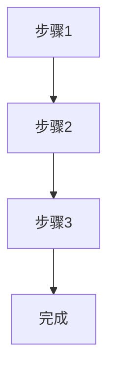

# 工作流程：[简明描述，如"代码提交前的检查流程"]

## 描述
[详细描述工作流程的目的和场景]

## 流程步骤

1. **步骤 1**：[具体操作]
   - 输入：[需要什么]
   - 输出：[产生什么]
   - 注意事项：[特殊说明]

2. **步骤 2**：[具体操作]
   - 输入：[需要什么]
   - 输出：[产生什么]
   - 注意事项：[特殊说明]

3. **步骤 3**：[具体操作]
   - 输入：[需要什么]
   - 输出：[产生什么]
   - 注意事项：[特殊说明]

## 触发条件
- **何时使用**：[适用的场景]
- **前置条件**：[需要满足的条件]
- **输入要求**：[需要的输入数据]

## 变体和选项
- **变体 A**：[替代方案，适用于不同情况]
- **变体 B**：[另一个替代方案]

## 关联
- [[exp_<id>]] - 相关偏好
- [[exp_<id>]] - 相关解决方案

## 使用统计
- 使用次数：[数字]
- 成功率：[百分比]
- 平均耗时：[时间]

## 优化记录
- [日期]: [优化内容]
- [日期]: [优化内容]