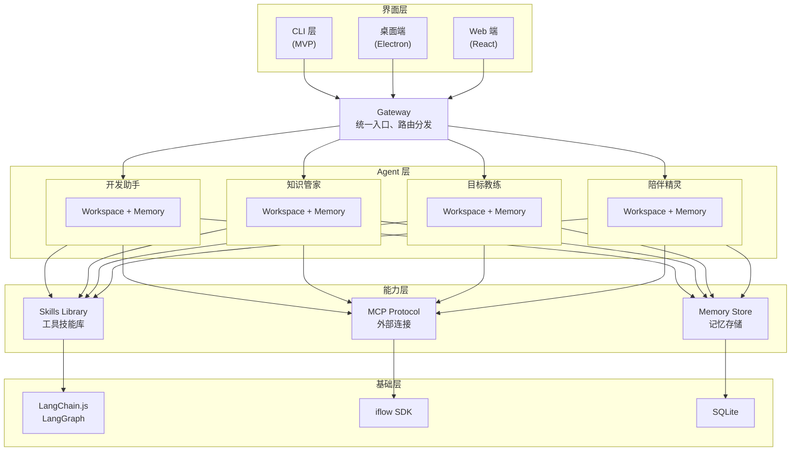

# Niuma (牛马) - 项目上下文

## 项目概述

**Niuma（牛马）** 是一个处于早期规划阶段的智能生活助手项目。项目的核心理念是打造一个不仅具备工具属性，更能提供"陪伴感"和"情绪价值"的智能精灵。

### 核心定位

| 维度 | 描述 |
|------|------|
| **名称** | Niuma（牛马） |
| **角色** | 智能精灵 + 陪伴者 |
| **当前形态** | CLI（命令行界面） |
| **未来扩展** | 桌面端 / Web 端 |
| **技术栈** | TypeScript / JavaScript |
| **LLM 接口** | iflow SDK |
| **Agent 框架** | LangChain.js + LangGraph |
| **工具协议** | MCP (Model Context Protocol) |
| **性格特质** | 温暖、懂你、适时出现、提供情绪价值 |

### 参考项目

- **nanobot**：精巧设计参考
- **nanoclaw**：沙箱安全模式参考
- **OpenClaw**：多 Agent 架构设计参考

---

## 目录结构

```
niuma/
├── .iflow/                    # iFlow CLI 配置目录
│   ├── settings.json          # iFlow 设置
│   └── agents/                # 自定义 Agent 配置
│       ├── academic-paper-writer.md
│       ├── code-reviewer.md
│       ├── frontend-expert.md
│       └── ... (40+ 自定义 Agent)
├── docs/                      # 项目文档
│   ├── brainstorming-session.md     # 产品设计头脑风暴
│   ├── ai-tools-research-report.md  # AI 工具生态研究报告
│   └── ai-tools-research-prompt.md  # 研究提示词
├── memory_data/               # 记忆数据存储（待使用）
├── .vscode/                   # VS Code 配置
├── .gitignore                 # Git 忽略规则
├── AGENTS.md                  # 本文件 - 项目上下文
├── LICENSE                    # Apache 2.0 许可证
└── README.md                  # 项目说明
```

---

## 技术架构

### 架构设计



### Agents（智能体）

| Agent | 职责 | 核心能力 |
|-------|------|----------|
| **开发助手** | 开发效率模块 | 脚手架生成、代码审查、调试辅助 |
| **知识管家** | 知识管理模块 | 笔记整理、关联发现、复习提醒 |
| **目标教练** | 目标追踪模块 | 目标拆解、进度追踪、复盘激励 |
| **陪伴精灵** | 日循环陪伴 | 早安问候、晚间复盘、灵感分享 |

### Skills（技能）

| 类别 | 技能示例 |
|------|----------|
| **文件操作** | 读写文件、搜索内容、目录管理 |
| **网络服务** | 天气查询、新闻获取、API 调用 |
| **笔记联动** | Obsidian 笔记读写、标签管理、关联分析 |
| **任务管理** | TodoList 操作、提醒设置、进度更新 |

---

## 核心功能规划

### 1. 开发效率模块
- 快速脚手架生成
- 任务拆解与进度追踪
- 结对编程辅助
- 错误分析与解决建议
- 支持语言：TypeScript / JavaScript / Python

### 2. 知识管理模块（Obsidian 联动）
- 笔记整理与关联发现
- 学习路径规划
- 复习提醒（基于遗忘曲线）
- 知识问答与内容摘要

### 3. 目标追踪模块（Obsidian 联动）
- 目标明确化对话
- 任务分解与时间安排
- 进度可视化
- 敦促提醒与复盘激励

### 日循环陪伴机制

| 时段 | 行为 | 内容 |
|------|------|------|
| 🌅 早晨 | 早安流程 | 问候 + 天气 + 新闻 + 待办 + 提醒 |
| 🌙 晚间 | 复盘流程 | 总结 + 回顾 + 计划制定 |
| ☕ 空闲 | 成长陪伴 | 灵感语录 / 小知识分享 |

---

## 安全边界策略

| 区域 | 自主性 | 说明 |
|------|--------|------|
| ✅ 用户目录 | 完全自动 | 整理文件、归档项目、清理缓存 |
| ⚠️ 系统文件 | 必须确认 | 修改系统配置、访问系统目录 |
| ⚠️ 敏感信息 | 必须确认 | 访问密码管理器、处理账号密码 |

---

## 开发路线

### MVP 阶段（Q1-Q2 2026）
- [ ] CLI 基础框架搭建
- [ ] iflow SDK 集成
- [ ] 早安/晚间流程实现
- [ ] 基础 TodoList 管理
- [ ] 天气查询集成
- [ ] 记忆系统基础

### 近期规划（Q3-Q4 2026）
- [ ] Obsidian 笔记库联动
- [ ] 目标追踪系统
- [ ] 学习路径规划
- [ ] 多 Agent 架构
- [ ] 桌面端原型

### 未来规划（2027+）
- [ ] Web 端扩展
- [ ] 多端同步
- [ ] 情绪识别与响应
- [ ] 多模态交互（语音、图像）

---

## 关键文档

| 文档 | 说明 |
|------|------|
| [产品设计头脑风暴](docs/brainstorming-session.md) | 完整的产品设计头脑风暴记录 |
| [AI 工具生态研究报告](docs/ai-tools-research-report.md) | AI 辅助工具生态全景研究成果 |
| [研究提示词](docs/ai-tools-research-prompt.md) | 深度研究提示词模板 |

---

## 许可证

本项目采用 [Apache License 2.0](LICENSE) 许可证。

---

*最后更新：2026-03-01*