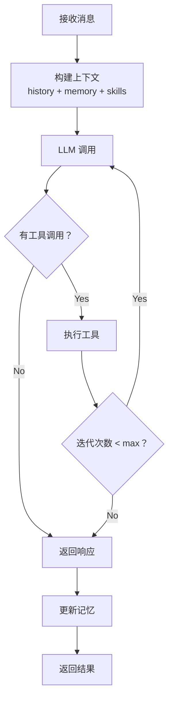

# Niuma（牛马）- 项目上下文

## 项目概述

Niuma（牛马）是一个企业级多角色 AI 助手系统，基于 TypeScript + Node.js 构建。支持创建多个完全独立的 AI 角色，每个角色拥有独立的配置、工作区、会话、记忆和日志。

**当前版本：** v0.1.0  
**项目状态：** 核心基础设施、Agent 核心、多角色配置系统已完成

## 行为指导

### 经验积累
- 如果你觉得当前对话有价值（例如：解决了问题、学到了新知识、发现了重要信息），可以主动提示用户是否将对话内容总结成经验记录
- 提示方式：简洁自然地询问，例如："这次对话似乎很有价值，是否需要我将其总结成经验记录？"

### 经验利用
在执行任务时，应该主动利用已有的经验来提高效率和质量：

1. **任务启动时**
   - 开始任务前，先查询相关经验：`/openexp [任务关键词]`
   - 例如：开发新功能前，查询 `/openexp 开发工作流程` 或 `/openexp TypeScript 开发规范`
   - 应用找到的经验到当前任务

2. **遇到问题时**
   - 遇到技术问题时，查询相关解决方案：`/openexp [问题关键词]`
   - 例如：遇到 CORS 问题，查询 `/openexp CORS 解决方案`
   - 优先使用高影响力的方案

3. **用户偏好应用**
   - 了解用户偏好（如工具选择、编码风格、工作流程）
   - 自动应用用户偏好到操作中
   - 例如：用户偏好 pnpm，则使用 pnpm 而不是 npm

4. **经验反馈**
   - 应用经验后，主动询问用户效果：`/openexp 这个经验很有效：[经验ID]`
   - 如果经验无效，提供负面反馈：`/openexp 这个方案不管用：[经验ID]`
   - 定期运行维护脚本更新影响力：`python3 scripts/maintain-experience-vault.py`

5. **经验库维护**
   - 每周运行一次维护脚本，更新影响力和索引地图
   - 查看索引地图了解经验库整体情况：`/openexp 查看经验索引地图`
   - 清理低影响力的过时经验

**经验查询时机：**
- 开始新任务前
- 遇到问题时
- 需要做决策时
- 用户询问最佳实践时
- 代码审查时

### 工作流约束（强制）
1. **必须触发 fullstack-workflow skill**
   - 无论通过任何方式（如：`/opsx:apply`、手动开发任务等）开始实现代码时，必须先调用 `Skill` 工具触发 `fullstack-workflow` skill
   - 示例：`Skill(skill: "fullstack-workflow")`

2. **必须使用 OpenSpec CLI 命令**
   - **禁止手动文件操作** - 不要使用 `mv`、`cp`、`mkdir` 等命令操作 openspec 目录
   - **优先使用 openspec CLI** - 所有 openspec 相关操作必须通过 `openspec` 命令完成
   - **严禁修改 .iflow 目录** - 除非用户明确说明，否则绝对不要修改 `.iflow/` 下的任何文件（包括 skills、commands 等）
   - 常用命令：
     ```bash
     openspec list                    # 列出所有变更
     openspec status <change-name>    # 查看变更状态
     openspec archive <change-name>   # 归档变更（自动处理规格同步）
     openspec spec list               # 列出所有规格
     openspec validate <item-name>    # 验证变更或规格
     ```
   - 正确的工作流顺序：
     - `/opsx:explore` - 探索模式（可选，复杂任务建议使用）
     - `/opsx:propose` - 创建提案（包含 proposal、design、specs、tasks）
     - `/opsx:apply` - 实施变更（仅当 `applyReady: true` 时）
     - `/opsx:archive` - 归档变更（自动执行 `openspec archive` 命令）

3. **Subagent 优先级**
   每个角色优先使用对应的 subagent 处理：

   | 角色/任务类型 | 优先使用的 Subagent |
   |--------------|-------------------|
   | 规划分析 | plan-agent |
   | 代码探索 | explore-agent |
   | 代码审查 | code-reviewer |
   | 前端测试 | frontend-tester |
   | 深度研究 | search-specialist |
   | 复杂多步骤任务 | general-purpose |
   | 翻译任务 | translate |
   | 教程生成 | tutorial-engineer |

## 技术栈

### 核心技术
- **TypeScript** 5.9.3 - 严格类型检查
- **Node.js** >=22.0.0 - 运行时环境
- **pnpm** - 包管理器

### 主要依赖

| 依赖 | 用途 | 版本 |
|------|------|------|
| langchain | AI/LLM 应用框架 | ^1.2.30 |
| @langchain/openai | OpenAI 集成 | ^1.2.12 |
| zod | 运行时类型验证 | ^4.3.6 |
| json5 | JSON5 配置文件格式 | ^2.2.3 |
| better-sqlite3 | 本地 SQLite 数据库 | ^12.6.2 |
| sqlite-vec | 向量存储扩展 | 0.1.7-alpha.10 |
| cac | 命令行参数解析 | ^7.0.0 |
| pino | 日志记录 | ^10.3.1 |

### 开发依赖
- **tsx** ^4.21.0 - TypeScript 执行器
- **vitest** ^4.0.18 - 单元测试框架
- **eslint** ^10.0.3 - 代码规范检查

## 项目结构

```
niuma/
├── niuma/                    # 核心模块目录
│   ├── agent/                # Agent 核心模块
│   ├── bus/                  # 事件总线
│   ├── channels/             # 多渠道接入
│   ├── cli/                  # CLI 入口
│   ├── config/               # 配置管理
│   ├── cron/                 # 定时任务
│   ├── heartbeat/            # 主动唤醒
│   ├── providers/            # LLM 提供商
│   ├── session/              # 会话管理
│   ├── types/                # 类型定义
│   └── utils/                # 工具函数
├── openspec/                 # OpenSpec 规范
├── .iflow/                   # iFlow CLI 配置
├── docs/                     # 文档
└── package.json
```

## 架构设计

### 核心模块

- **Agent** - 智能体核心，处理对话循环、记忆管理、技能调用、工具执行
- **Tools** - 工具集，包括文件系统操作、Shell 命令、Web 请求、MCP 协议等
- **Bus** - 事件总线，模块间异步通信
- **Channels** - 多渠道接入（Telegram, Discord, 飞书, 钉钉, Slack 等）
- **Providers** - LLM 提供商抽象层（OpenAI, Anthropic, 自定义端点）
- **Session** - 会话管理，历史记录和状态持久化
- **Skills** - 可扩展技能系统，动态加载 SKILL.md
- **Cron** - 定时任务调度服务
- **Memory** - 双层记忆系统，自动整合长期记忆

### Agent Loop 核心流程



### 数据存储

- **SQLite** - 本地数据库（better-sqlite3）
- **sqlite-vec** - 向量检索，用于语义记忆

## 配置系统

### 多角色架构

```json5
{
  "agents": {
    "defaults": { "progressMode": "normal" },
    "list": [
      { "id": "manager", "name": "项目经理", "default": true },
      { "id": "developer", "name": "开发工程师" }
    ]
  }
}
```

### 环境变量引用

```json5
{
  "providers": {
    "openai": {
      "apiKey": "${OPENAI_API_KEY}",
      "apiBase": "${OPENAI_BASE_URL:https://api.openai.com/v1}"
    }
  }
}
```

### 配置优先级
1. 命令行参数
2. 角色特定配置覆盖
3. 全局 `~/.niuma/niuma.json`
4. `.env` 文件中的环境变量
5. 默认值

## 开发规范

### 代码风格
- 使用 ESLint 进行代码规范检查
- TypeScript 严格模式开启
- 使用 ES Module (`"type": "module"`)
- **注释必须使用中文**，代码标识符使用英文
- **图表必须使用 mermaid 语法**

### 提交规范
- 遵循 Conventional Commits 规范
- 提交信息格式：`type: description`

### 分支策略
- `main` - 主分支
- `feat/*` - 功能分支

## 构建与测试

```bash
# 安装依赖
pnpm install

# 开发模式
pnpm dev

# 构建
pnpm build

# 运行
pnpm start

# 测试
pnpm test

# 代码检查
pnpm lint

# 类型检查
pnpm type-check
```

## 项目当前状态

### ✅ 已完成功能

| Phase | 名称 | 完成日期 | 状态 |
|-------|------|----------|------|
| Phase 1 | 核心基础设施 | 2026-03-10 | ✅ 已完成 |
| Phase 2 | Agent 核心 | 2026-03-10 | ✅ 已完成 |
| 企业扩展 | 多角色配置系统 | 2026-03-11 | ✅ 已完成 |

### 🔄 待开发功能

- **Phase 3：** 内置工具（read_file, write_file, edit_file, exec, web_search 等）
- **Phase 4：** LLM 提供商扩展（Anthropic, OpenRouter, DeepSeek 等）
- **Phase 5：** 多渠道接入（Telegram, Discord, 飞书, 钉钉等）
- **Phase 6：** 定时任务与心跳
- **Phase 7：** MCP 协议支持

详细开发计划请参考：[docs/niuma-development-plan.md](docs/niuma-development-plan.md)

## 最近变更

### v0.1.0 (2026-03-11)

**企业级多角色配置系统**
- ✅ JSON5 配置文件格式支持
- ✅ 多角色架构，支持独立 AI 角色
- ✅ 环境变量引用 `${VAR}` 和 `${VAR:default}`
- ✅ defaults-with-overrides 配置模式
- ✅ 角色完全隔离（工作区、会话、日志）
- ✅ 严格 Zod 配置验证

**代码质量改进**
- ✅ 删除未使用的变量和导入
- ✅ 添加完整的测试用例注释

### v0.1.0-beta (2026-03-10)

**Phase 2：Agent 核心**
- ✅ 上下文构建器（支持媒体、技能、记忆）
- ✅ 双层记忆系统
- ✅ 技能系统
- ✅ Agent 循环（LLM ↔ 工具执行）

**Phase 1：核心基础设施**
- ✅ 核心类型系统
- ✅ 配置管理
- ✅ 工具框架
- ✅ 事件总线

## 相关资源

- [项目开发计划](docs/niuma-development-plan.md)
- [LangChain.js 文档](https://js.langchain.com/)
- [Zod](https://zod.dev/)
- [nanobot 参考](https://github.com/HKUDS/nanobot)

---

> 本文件由 iFlow CLI 维护，用于为 AI 助手提供项目上下文。