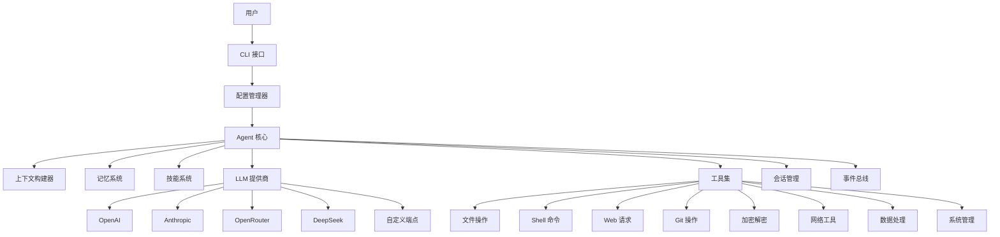
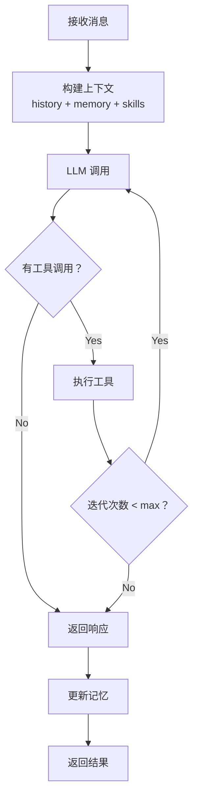

# Niuma（牛马）- 智能生活助手

> 🐄 打造属于你的企业级 AI 团队，每个角色独立工作，完全隔离

[](https://www.typescriptlang.org/)
[](https://nodejs.org/)
[](LICENSE)

## ✨ 简介

[Niuma（牛马）](https://github.com/lihaizhong/niuma) 是一个企业级多角色 AI 助手 CLI 工具，基于 TypeScript + Node.js 构建，借鉴 [nanobot](https://github.com/HKUDS/nanobot) 设计理念。

**核心价值：**
- 🎭 **多角色架构** - 为团队中的不同角色（项目经理、开发工程师、测试工程师等）创建专属的 AI 助手
- 🔒 **完全隔离** - 每个角色拥有独立的配置、工作区、会话、记忆和日志，互不干扰
- ⚙️ **灵活配置** - 支持 JSON5 格式，可使用注释和环境变量引用
- 🧠 **智能记忆** - 双层记忆系统（MEMORY.md + HISTORY.md），自动整合长期记忆
- 💓 **主动唤醒** - 支持定时任务和心跳机制，主动执行周期性任务
- 🤖 **多提供商** - 支持 OpenAI、Anthropic、OpenRouter、DeepSeek 等多种 LLM 提供商
- 🛠️ **丰富工具** - 内置 30+ 个工具，涵盖文件系统、Shell、Web、Git、加密、系统管理等

## 🚀 快速开始

### 安装

```bash
# 克隆项目
git clone git@github.com:lihaizhong/niuma.git
cd niuma

# 安装依赖
pnpm install

# 构建项目
pnpm build
```

### 配置

#### 1. 创建配置目录

```bash
# 创建配置目录
mkdir -p ~/.niuma
```

#### 2. 复制示例配置文件

```bash
# 复制配置文件
cp niuma/niuma.config.json.example ~/.niuma/niuma.config.json
```

#### 3. 配置角色

编辑 `~/.niuma/niuma.config.json`，配置你的角色：

```json5
{
  // 全局默认配置
  "maxIterations": 40,
  "workspaceDir": ".niuma",
  
  // LLM 提供商配置
  "providers": {
    "openai": {
      "type": "openai",
      "model": "gpt-4o",
      "apiKey": "${OPENAI_API_KEY}",
      "apiBase": "${OPENAI_BASE_URL:https://api.openai.com/v1}"
    }
  },
  
  // 多角色配置
  "agents": {
    "defaults": {
      "progressMode": "normal",
      "showReasoning": false
    },
    "list": [
      {
        "id": "manager",
        "name": "项目经理",
        "description": "负责项目规划和进度管理",
        "default": true,
        "workspaceDir": "~/.niuma/agents/manager/workspace",
        "agent": {
          "progressMode": "verbose",
          "showReasoning": true
        }
      },
      {
        "id": "developer",
        "name": "开发工程师",
        "description": "负责代码开发和问题解决",
        "workspaceDir": "~/.niuma/agents/developer/workspace"
      },
      {
        "id": "tester",
        "name": "测试工程师",
        "description": "负责测试和质量保证",
        "workspaceDir": "~/.niuma/agents/tester/workspace"
      }
    ]
  }
}
```

### 运行

```bash
# 使用默认角色（项目经理）
niuma chat

# 使用指定角色
niuma chat --agent developer

# 列出所有角色
niuma agents list

# 查看角色详情
niuma agents get --id manager
```

## 💡 功能特性

### 🎭 多角色架构

为团队中的不同角色创建专属的 AI 助手：

```bash
# 项目经理 - 负责项目规划和进度管理
niuma chat --agent manager

# 开发工程师 - 负责代码开发和问题解决
niuma chat --agent developer

# 测试工程师 - 负责测试和质量保证
niuma chat --agent tester
```

每个角色拥有：
- ✅ 独立的配置和工作区
- ✅ 独立的会话历史
- ✅ 独立的长期记忆（MEMORY.md）
- ✅ 独立的日志文件

### ⚙️ JSON5 配置

支持 JSON5 格式，可使用注释和环境变量引用：

```json5
{
  // 这是一个注释
  "apiKey": "${OPENAI_API_KEY}",  // 环境变量引用
  "apiBase": "${OPENAI_BASE_URL:https://api.openai.com/v1}",  // 带默认值
  "features": [  // 尾随逗号
    "chat",
    "code",
  ]
}
```

### 🔧 环境变量集成

支持 `${VAR}` 和 `${VAR:default}` 语法：

```json5
{
  "providers": {
    "openai": {
      "apiKey": "${OPENAI_API_KEY}",
      "apiBase": "${OPENAI_BASE_URL:https://api.openai.com/v1}",
      "model": "${MODEL:gpt-4o}"
    }
  }
}
```

配置优先级：
1. 命令行参数
2. 角色特定配置覆盖
3. 全局 `~/.niuma/niuma.config.json`
4. 系统环境变量
5. 默认值

### 🧠 智能记忆系统

双层记忆系统，自动整合长期记忆：

- **MEMORY.md** - 长期记忆，自动整合和存储重要信息
- **HISTORY.md** - 历史日志，可搜索的对话历史

记忆整合会自动触发，当消息数量超过阈值时，LLM 会整合重要信息到长期记忆中。

### 📱 多渠道接入

支持多种消息渠道，统一接口：

| 渠道 | 协议 | 状态 |
|------|------|------|
| CLI | stdin/stdout | ✅ 已完成 |
| Discord | WebSocket Gateway | ✅ 已完成 |
| 飞书 | WebSocket 长连接 | ✅ 已完成 |
| Email | IMAP/SMTP | ✅ 已完成 |
| QQ | WebSocket | ✅ 已完成 |
| Telegram | HTTP Bot API | ⏸️ 暂时禁用 |
| 钉钉 | Stream Mode | ⏸️ 暂时禁用 |
| Slack | Socket Mode | ⏸️ 暂时禁用 |
| WhatsApp | WebSocket Bridge | ⏸️ 暂时禁用 |

```bash
# 查看渠道状态
niuma channels status

# 列出所有渠道
niuma channels list

# 启动渠道
niuma channels start discord

# 停止渠道
niuma channels stop discord
```

### 🔌 服务端接入

Niuma 支持作为服务端接入智能体，导出核心模块供外部程序调用：

```typescript
import {
  AgentLoop,
  ConfigManager,
  EventBus,
  SessionManager,
  ToolRegistry,
  registerBuiltinTools,
  ChannelRegistry,
  DiscordChannel,
} from 'niuma';

// 创建配置管理器
const configManager = new ConfigManager();
const config = configManager.load();

// 创建事件总线
const bus = new EventBus();

// 创建工具注册表
const tools = new ToolRegistry();
registerBuiltinTools(tools);

// 创建会话管理器
const sessions = new SessionManager({ workspace: config.workspaceDir });

// 创建渠道注册表
const channelRegistry = new ChannelRegistry();
channelRegistry.register(new DiscordChannel({ ... }));

// 获取 LLM 提供商
const provider = configManager.getDefaultProvider();

// 创建 Agent 循环
const agentLoop = new AgentLoop({
  bus,
  provider,
  tools,
  sessions,
  workspace: config.workspaceDir,
  channelRegistry,
});

// 启动 Agent
await agentLoop.run();
```

**导出的核心模块：**

| 模块 | 说明 |
|------|------|
| `AgentLoop` | Agent 核心循环 |
| `ConfigManager` | 配置管理器 |
| `EventBus` | 事件总线 |
| `SessionManager` | 会话管理器 |
| `ToolRegistry` | 工具注册表 |
| `ChannelRegistry` | 渠道注册表 |
| `CLIChannel` | CLI 渠道 |
| `DiscordChannel` | Discord 渠道 |
| `FeishuChannel` | 飞书渠道 |
| `EmailChannel` | Email 渠道 |
| `QQChannel` | QQ 渠道 |
| `HeartbeatService` | 心跳服务 |

### 🎯 可扩展技能系统

支持自定义技能，通过 SKILL.md 定义：

**项目级技能（`.iflow/skills/`）：**
```
.iflow/skills/                  # 项目级技能（随项目版本控制）
├── fullstack/                  # 全栈开发工作流
│   └── SKILL.md
├── openexp/                    # 经验管理
│   └── SKILL.md
└── openspec-*/                 # OpenSpec 相关技能
    └── SKILL.md
```

**用户级技能（`~/.niuma/agents/<id>/skills/`）：**
```bash
~/.niuma/agents/developer/skills/
├── github/
│   └── SKILL.md
├── weather/
│   └── SKILL.md
└── ...
```

## 📁 目录结构

```
~/.niuma/                      # 配置根目录
├── niuma.config.json                 # 全局配置文件
├── sessions/                  # 会话存储
│   ├── manager/              #   项目经理会话
│   ├── developer/            #   开发工程师会话
│   └── tester/               #   测试工程师会话
├── logs/                      # 日志文件
│   ├── manager.log
│   ├── developer.log
│   └── tester.log
└── agents/                    # 角色工作区
    ├── manager/              #   项目经理工作区
    │   ├── workspace/       #     工作目录
    │   │   ├── memory/     #       记忆存储
    │   │   │   ├── MEMORY.md
    │   │   │   └── HISTORY.md
    │   │   └── skills/     #       自定义技能
    │   └── skills/         #     技能定义
    ├── developer/            #   开发工程师工作区
    │   ├── workspace/
    │   │   ├── memory/
    │   │   └── skills/
    │   └── skills/
    └── tester/               #   测试工程师工作区
        ├── workspace/
        │   ├── memory/
        │   └── skills/
        └── skills/
```

## 🔨 开发

### 开发流程

本项目使用 **OpenSpec** 进行规格驱动的开发（Spec-Driven Development），支持 TDD 工作流：

```bash
# 查看所有变更
openspec list

# 查看变更状态
openspec status <change-name>

# 归档变更（自动同步规格到主规格库）
openspec archive <change-name>

# 验证变更或规格
openspec validate <item-name>

# 列出所有规格
openspec spec list
```

**TDD 工作流：**

项目支持测试驱动开发（TDD），遵循 Red → Green → Refactor 循环：

| 阶段 | 角色 | 输出 | 验证 |
|------|------|------|------|
| Red | spec-writer → tester | 测试规格 + 测试代码 | 测试必须失败 |
| Green | developer | 实现代码 | 测试必须通过 |
| Refactor | developer → code-reviewer | 优化代码 | 测试仍须通过 |

**OpenSpec 命令：**

| Command | Skill | 用途 |
|---------|-------|------|
| `/opsx:explore` | openspec-explore | 探索需求、澄清问题 |
| `/opsx:propose` | openspec-propose | 创建变更提案 |
| `/opsx:apply` | openspec-apply-change | 实施变更任务 |
| `/opsx:archive` | openspec-archive-change | 归档已完成的变更 |

**重要提示：**
- 所有 openspec 相关操作必须使用 `openspec` CLI 命令
- 禁止手动使用 `mv`、`cp` 等命令操作 openspec 目录
- 归档变更时会自动处理规格同步，无需手动操作

### 开发环境设置

```bash
# 安装依赖
pnpm install

# 开发模式运行
pnpm dev

# 构建项目
pnpm build

# 运行生产版本
pnpm start
```

### 测试

```bash
# 运行所有测试
pnpm test

# 运行测试 UI
pnpm test:ui

# 测试覆盖率
pnpm test:coverage
```

### 代码质量

```bash
# 代码检查
pnpm lint

# 自动修复
pnpm lint:fix

# 类型检查
pnpm type-check
```

## 🛠️ 内置工具

Niuma 提供了丰富的内置工具，支持文件操作、Shell 命令、Web 请求、Git 操作、加密解密、系统管理等功能。

### 文件系统工具

| 工具 | 功能 | 状态 |
|------|------|------|
| read_file | 读取文件内容，支持行号范围和大文件截断 | ✅ |
| write_file | 创建或覆盖文件，自动创建目录 | ✅ |
| edit_file | 精确修改文件的特定部分 | ✅ |
| list_dir | 列出目录内容，支持递归和 glob 模式过滤（使用 fast-glob） | ✅ |

### Shell 工具

| 工具 | 功能 | 状态 |
|------|------|------|
| exec | 执行 Shell 命令，包含危险命令黑名单防护 | ✅ |

### Web 工具

| 工具 | 功能 | 状态 |
|------|------|------|
| web_search | 使用搜索引擎查找信息（Brave Search） | ✅ |
| web_fetch | 获取和处理网页内容，支持 HTML 解析 | ✅ |

### 消息工具

| 工具 | 功能 | 状态 |
|------|------|------|
| message | 通过配置的渠道发送消息，支持队列和富文本 | ✅ |

### Agent 工具

| 工具 | 功能 | 状态 |
|------|------|------|
| spawn | 创建和管理子智能体 | ✅ |
| cron | 管理定时任务，支持 Cron 表达式 | ✅ |

### Git 工具

| 工具 | 功能 | 状态 |
|------|------|------|
| git_status | 查看 Git 状态 | ✅ |
| git_commit | 提交代码 | ✅ |
| git_push | 推送代码 | ✅ |
| git_pull | 拉取代码 | ✅ |
| git_branch | 分支管理 | ✅ |
| git_log | 查看提交历史 | ✅ |

### 网络工具

| 工具 | 功能 | 状态 |
|------|------|------|
| ping | 网络连通性测试 | ✅ |
| dns_lookup | DNS 查询 | ✅ |
| http_request | 通用 HTTP 请求 | ✅ |

### 数据处理工具

| 工具 | 功能 | 状态 |
|------|------|------|
| json_parse | 解析 JSON | ✅ |
| json_stringify | 序列化为 JSON | ✅ |
| yaml_parse | 解析 YAML | ✅ |
| yaml_stringify | 序列化为 YAML | ✅ |

### 加密与解密工具

| 工具 | 功能 | 状态 |
|------|------|------|
| encrypt | 加密数据（AES-256-GCM） | ✅ |
| decrypt | 解密数据（AES-256-GCM） | ✅ |
| hash | 计算哈希值（SHA-256/512、MD5） | ✅ |

### 系统工具

| 工具 | 功能 | 状态 |
|------|------|------|
| env_get | 获取环境变量 | ✅ |
| env_set | 设置环境变量（仅当前进程） | ✅ |
| process_list | 列出进程 | ✅ |
| process_kill | 终止进程 | ✅ |

**安全特性：**
- 🔒 Shell 工具包含危险命令黑名单（rm -rf、shutdown、fork bomb 等）
- 🔒 删除操作需要显式确认（confirm 参数）
- 🔒 目录删除支持受保护路径列表（防止删除系统目录）
- 🔒 文件操作支持大小限制（防止内存溢出）
- 🔒 正则表达式搜索包含安全检查（防止 ReDoS 攻击）
- 🔒 进程终止支持受保护进程列表（PID 1、自身进程）

详细使用示例请参考：[工具使用示例](docs/tool-usage-examples.md)

## 🏗️ 技术架构

### 核心模块



### Agent 循环流程



## 📊 项目状态

### ✅ 已完成功能

| 功能 | 状态 | 说明 |
|------|------|------|
| 核心基础设施 | ✅ 完成 | 类型系统、配置管理、工具框架、事件总线 |
| Agent 核心 | ✅ 完成 | 上下文构建、记忆系统、技能系统、Agent 循环 |
| 多角色配置系统 | ✅ 完成 | JSON5 配置、环境变量引用、角色隔离 |
| 内置工具 | ✅ 完成 | 30+ 个工具，涵盖文件系统、Shell、Web、Git、加密、系统管理等 |
| LLM 提供商 | ✅ 完成 | OpenAI、Anthropic、OpenRouter、DeepSeek、Custom 等多种提供商 |
| 会话管理 | ✅ 完成 | 会话状态、历史记录、持久化 |
| 定时任务与心跳 | ✅ 完成 | 支持定时任务调度和主动唤醒 |
| 多渠道接入 | ✅ 完成 | CLI、Discord、飞书、Email、QQ 渠道 |

### 🔄 待开发功能

- **MCP 协议支持**（对接外部 MCP Server，扩展专业功能）

详细开发计划请参考：[项目开发计划](docs/niuma-development-plan.md)

## 🛠️ 技术栈

| 技术 | 用途 | 版本 |
|------|------|------|
| TypeScript | 主要开发语言 | 5.9.3 |
| Node.js | 运行时环境 | >=22.0.0 |
| LangChain | AI/LLM 应用框架 | ^1.2.32 |
| @langchain/openai | OpenAI 集成 | ^1.2.13 |
| @anthropic-ai/sdk | Anthropic Claude 集成 | ^0.78.0 |
| Zod | 运行时类型验证 | ^4.3.6 |
| JSON5 | 配置文件格式 | ^2.2.3 |
| @sqliteai/sqlite-wasm | SQLite WASM 数据库 | 3.50.4-sync.0.8.68-vector.0.9.93-memory.0.7.2 |
| pino | 日志记录 | ^10.3.1 |
| vitest | 单元测试框架 | ^4.1.0 |
| node-cron | 定时任务调度 | ^4.2.1 |
| cron-parser | Cron 表达式解析 | ^5.5.0 |
| ps-tree | 进程树管理 | ^1.2.0 |

## 📖 示例

### 示例 1：创建项目经理角色

```bash
# 编辑 ~/.niuma/niuma.config.json
{
  "agents": {
    "list": [
      {
        "id": "manager",
        "name": "项目经理",
        "description": "负责项目规划和进度管理",
        "default": true,
        "agent": {
          "progressMode": "verbose",
          "showReasoning": true
        }
      }
    ]
  }
}

# 启动对话
niuma chat --agent manager
```

### 示例 2：使用环境变量

```bash
# 设置环境变量（可以放在 ~/.bashrc、~/.zshrc 或 .env 文件中）
export OPENAI_API_KEY=sk-xxx
export MODEL=gpt-4o

# 编辑 ~/.niuma/niuma.config.json
{
  "providers": {
    "openai": {
      "apiKey": "${OPENAI_API_KEY}",
      "model": "${MODEL:gpt-4o}"
    }
  }
}
```

### 示例 3：角色配置覆盖

```json5
{
  // 全局默认配置
  "agent": {
    "progressMode": "normal",
    "showReasoning": false
  },
  
  "agents": {
    "list": [
      {
        "id": "manager",
        // 覆盖全局配置
        "agent": {
          "progressMode": "verbose",  // 覆盖为 verbose
          "showReasoning": true      // 覆盖为 true
        }
      }
    ]
  }
}
```

## ❓ 常见问题

### Q: 如何切换角色？

```bash
# 列出所有角色
niuma agents list

# 使用指定角色
niuma chat --agent <角色ID>
```

### Q: 角色数据存储在哪里？

每个角色的数据存储在独立的工作区：

```
~/.niuma/agents/<角色ID>/
├── workspace/
│   ├── memory/
│   │   ├── MEMORY.md
│   │   └── HISTORY.md
│   └── skills/
└── skills/
```

### Q: 如何配置不同的 LLM 提供商？

在 `~/.niuma/niuma.config.json` 中配置：

```json5
{
  "providers": {
    "openai": {
      "type": "openai",
      "model": "gpt-4o",
      "apiKey": "${OPENAI_API_KEY}",
      "apiBase": "${OPENAI_BASE_URL:https://api.openai.com/v1}"
    },
    "anthropic": {
      "type": "anthropic",
      "model": "claude-3-5-sonnet-20241022",
      "apiKey": "${ANTHROPIC_API_KEY}"
    },
    "openrouter": {
      "type": "openrouter",
      "model": "anthropic/claude-3.5-sonnet",
      "apiKey": "${OPENROUTER_API_KEY}"
    },
    "deepseek": {
      "type": "deepseek",
      "model": "deepseek-chat",
      "apiKey": "${DEEPSEEK_API_KEY}"
    }
  }
}
```

### Q: 如何自定义技能？

在角色工作区创建 `SKILL.md` 文件：

```bash
mkdir -p ~/.niuma/agents/developer/skills/my-skill
cat > ~/.niuma/agents/developer/skills/my-skill/SKILL.md << 'EOF'
# My Custom Skill

## 功能描述
这是一个自定义技能示例。

## 使用场景
当需要执行特定任务时使用。

## 示例
用户：帮我执行自定义任务
AI：[使用自定义技能完成任务]
EOF
```

## 🤝 贡献

欢迎贡献！请遵循以下步骤：

1. Fork 本仓库
2. 创建特性分支 (`git checkout -b feat/amazing-feature`)
3. 提交更改 (`git commit -m 'feat: add amazing feature'`)
4. 推送到分支 (`git push origin feat/amazing-feature`)
5. 提交 Pull Request

### 开发规范

- 遵循 [Conventional Commits](https://www.conventionalcommits.org/) 规范
- 提交信息格式：`type: description`
- 使用 ESLint 进行代码检查
- 添加适当的测试用例

## 📄 许可证

[Apache-2.0](LICENSE)

## 🔗 相关资源

- [变更日志](CHANGELOG.md)
- [项目开发计划](docs/niuma-development-plan.md)
- [项目上下文](AGENTS.md)
- [LangChain.js 文档](https://js.langchain.com/)
- [Zod 文档](https://zod.dev/)
- [nanobot 参考](https://github.com/HKUDS/nanobot)
- [OpenSpec 规范](https://github.com/openspec-io)

## ⭐ Star History

如果这个项目对你有帮助，请给个 Star 支持！

---

<div align="center">
  <sub>Built with ❤️ by <a href="https://github.com/lihaizhong">lihaizhong</a></sub>
</div>