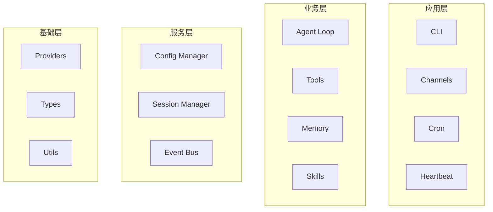
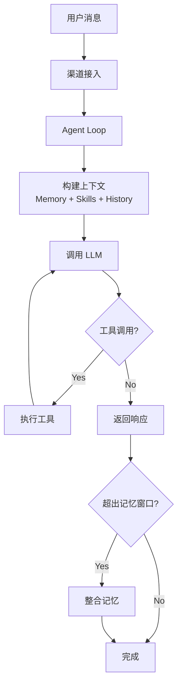

# Niuma API 文档

> **版本：** v0.2.2
> **最后更新：** 2026-03-17

## 目录

- [项目概述](#项目概述)
- [架构摘要](#架构摘要)
- [快速开始](#快速开始)
- [核心 API 参考](#核心-api-参考)
- [CLI 命令参考](#cli-命令参考)
- [配置参考](#配置参考)

## 相关文档

| 文档 | 描述 |
|------|------|
| [架构设计详解](./architecture-design.md) | 完整的架构设计、模块详解、设计决策 |
| [渠道接入指南](./channels.md) | CLI、Telegram、Discord、飞书等渠道配置 |
| [TypeDoc API 参考](./api/reference/index.md) | 自动生成的完整类型和接口文档 |

---

## 项目概述

**Niuma（牛马）** 是一个基于 TypeScript + Node.js 构建的企业级多角色 AI 助手系统。

### 核心特性

| 特性 | 描述 |
|------|------|
| 多角色架构 | 支持多个独立角色，每个角色拥有独立配置、工作区、会话、记忆 |
| 双层记忆 | MEMORY.md（长期记忆）+ HISTORY.md（历史日志），自动整合 |
| 工具系统 | 文件系统、Shell、Web、Git、加密等内置工具，支持自定义扩展 |
| 多渠道接入 | CLI、Telegram、Discord、飞书、钉钉、Slack、WhatsApp、邮件、QQ |
| 多 LLM 提供商 | OpenAI、Anthropic、Ollama、DeepSeek、OpenRouter、自定义端点 |
| 技能系统 | 动态加载 SKILL.md，支持技能依赖检查 |

### 技术栈

```
TypeScript 5.9+ | Node.js 22+ | pnpm | LangChain | Zod | SQLite WASM
```

---

## 架构摘要

### 分层架构



### 核心流程



### 目录结构

```
niuma/
├── niuma/
│   ├── agent/           # Agent 核心（loop、memory、skills、tools）
│   ├── bus/             # 事件总线
│   ├── channels/        # 渠道系统（CLI、Telegram、Discord 等）
│   ├── cli/             # CLI 入口
│   ├── config/          # 配置管理
│   ├── heartbeat/       # 心跳服务
│   ├── providers/       # LLM 提供商
│   ├── session/         # 会话管理
│   ├── types/           # 类型定义
│   └── utils/           # 工具函数
├── openspec/            # OpenSpec 规范
└── docs/                # 文档
```

---

## 快速开始

### 安装

```bash
pnpm install
pnpm build
```

### 基本使用

```bash
# 启动对话（默认 CLI 渠道）
niuma chat

# 使用指定角色
niuma chat --agent developer

# 启动多渠道
niuma chat --channels cli,telegram
```

### 服务端接入

```typescript
import {
  AgentLoop,
  ConfigManager,
  EventBus,
  SessionManager,
  ToolRegistry,
  registerBuiltinTools,
} from 'niuma';

// 1. 加载配置
const configManager = new ConfigManager();
const config = configManager.load();

// 2. 创建事件总线
const bus = new EventBus();

// 3. 创建工具注册表
const tools = new ToolRegistry();
registerBuiltinTools(tools);

// 4. 创建会话管理器
const sessions = new SessionManager({ workspace: config.workspaceDir });

// 5. 初始化提供商
configManager.initializeProviders();
const provider = configManager.getDefaultProvider();

// 6. 创建 Agent 循环
const agentLoop = new AgentLoop({
  bus,
  provider,
  tools,
  sessions,
  workspace: config.workspaceDir,
  agentId: 'default',
});

// 7. 启动
await agentLoop.run();
```

---

## 核心 API 参考

### Agent 核心

#### AgentLoop

智能体的核心执行引擎，处理对话循环、工具调用、记忆整合。

```typescript
import { AgentLoop } from 'niuma';

const agentLoop = new AgentLoop({
  bus: EventBus,           // 事件总线
  provider: LLMProvider,   // LLM 提供商
  tools: ToolRegistry,     // 工具注册表
  sessions: SessionManager,// 会话管理器
  workspace: string,       // 工作区路径
  agentId: string,         // 角色 ID
  channelsConfig?: ChannelsConfig,  // 渠道配置
  channelRegistry?: ChannelRegistry,// 渠道注册表
  providerRegistry?: ProviderRegistry,// 提供商注册表
  configManager?: ConfigManager,    // 配置管理器
});

// 启动 Agent
await agentLoop.run();
```

#### ContextBuilder

构建对话上下文，整合记忆、技能、历史消息。

```typescript
import { ContextBuilder } from 'niuma';

const builder = new ContextBuilder({
  workspace: string,
  memoryWindow: number,
});
```

#### MemoryStore

双层记忆系统管理。

```typescript
import { MemoryStore } from 'niuma';

const memory = new MemoryStore(workspace);

// 读取长期记忆
const longTerm = await memory.readLongTerm();

// 写入长期记忆
await memory.writeLongTerm(content);

// 追加历史记录
await memory.appendHistory(entry);

// 整合记忆
await memory.consolidate({
  session,
  provider,
  model,
  memoryWindow,
});
```

#### SkillsLoader

技能动态加载器。

```typescript
import { SkillsLoader } from 'niuma';

const skillsLoader = new SkillsLoader(workspace);

// 加载技能
const skill = await skillsLoader.load('skill-name');

// 列出所有技能
const skills = await skillsLoader.list();
```

### 工具系统

#### ToolRegistry

工具注册和执行中心。

```typescript
import { ToolRegistry, registerBuiltinTools, BaseTool } from 'niuma';

// 创建注册表
const tools = new ToolRegistry();

// 注册内置工具
registerBuiltinTools(tools);

// 注册自定义工具
class MyTool extends BaseTool<Input, Output> {
  readonly name = 'my_tool';
  readonly description = '我的自定义工具';
  readonly parameters = z.object({ /* ... */ });
  
  async execute(args: Input): Promise<Output> {
    // 实现逻辑
  }
}
tools.register(new MyTool());

// 执行工具
const result = await tools.execute('read_file', { path: '/path/to/file' });

// 获取所有工具 Schema（用于 LLM 工具调用）
const schemas = tools.getAllSchemas();
```

#### 内置工具列表

| 类别 | 工具名称 | 描述 |
|------|---------|------|
| 文件系统 | `read_file` | 读取文件 |
| | `write_file` | 写入文件 |
| | `edit_file` | 编辑文件（查找替换） |
| | `list_dir` | 列出目录 |
| | `file_search` | 搜索文件（glob） |
| | `file_move` | 移动文件 |
| | `file_copy` | 复制文件 |
| | `file_delete` | 删除文件 |
| | `file_info` | 文件信息 |
| | `dir_create` | 创建目录 |
| | `dir_delete` | 删除目录 |
| Shell | `exec` | 执行命令（带安全黑名单） |
| Web | `web_search` | 网络搜索 |
| | `web_fetch` | 获取网页内容 |
| 网络 | `http_request` | HTTP 请求 |
| Git | `git_status` | Git 状态 |
| | `git_diff` | Git 差异 |
| | `git_log` | Git 日志 |
| 数据 | `json_parse` | JSON 解析 |
| | `csv_parse` | CSV 解析 |
| 加密 | `hash` | 哈希计算 |
| | `encode` / `decode` | 编码解码 |
| 消息 | `message` | 发送消息 |
| Agent | `spawn` | 创建子智能体 |
| 系统 | `env` | 环境变量 |

### 事件系统

#### EventBus

事件驱动的模块间通信。

```typescript
import { EventBus, EventNames } from 'niuma';

const bus = new EventBus();

// 发送事件
bus.emit(EventNames.MESSAGE_RECEIVED, {
  message: '...',
  channel: 'cli',
});

// 监听事件
bus.on(EventNames.MESSAGE_RECEIVED, (data) => {
  console.log('收到消息:', data.message);
});

// 可用事件
EventNames.MESSAGE_RECEIVED    // 收到消息
EventNames.MESSAGE_SENT        // 发送消息
EventNames.TOOL_EXECUTED       // 工具执行完成
EventNames.ERROR              // 错误发生
EventNames.SESSION_CREATED    // 会话创建
EventNames.SESSION_UPDATED    // 会话更新
```

### 渠道系统

#### BaseChannel

渠道基类，所有渠道实现继承此类。

```typescript
import { BaseChannel, ChannelRegistry } from 'niuma';

// 使用渠道注册表
const registry = new ChannelRegistry();

// 注册渠道
registry.register(new CLIChannel(config));
registry.register(new TelegramChannel(config));

// 启动渠道
await registry.startAll();

// 停止渠道
await registry.stopAll();

// 健康检查
const status = await registry.checkHealth();
```

#### 支持的渠道

| 渠道 | 类名 | 配置类型 |
|------|------|---------|
| CLI | `CLIChannel` | `CLIChannelConfig` |
| Telegram | `TelegramChannel` | `TelegramChannelConfig` |
| Discord | `DiscordChannel` | `DiscordChannelConfig` |
| 飞书 | `FeishuChannel` | `FeishuChannelConfig` |
| 钉钉 | `DingtalkChannel` | - |
| Slack | `SlackChannel` | - |
| WhatsApp | `WhatsAppChannel` | - |
| 邮件 | `EmailChannel` | `EmailChannelConfig` |
| QQ | `QQChannel` | - |

### 配置管理

#### ConfigManager

配置加载、验证、合并。

```typescript
import { ConfigManager } from 'niuma';

const manager = new ConfigManager();

// 加载全局配置
const config = manager.load();

// 获取角色配置（合并默认配置）
const agentConfig = manager.getAgentConfig('developer');

// 获取角色工作区路径
const workspace = manager.getAgentWorkspaceDir('developer');

// 初始化提供商
manager.initializeProviders('developer');

// 获取默认提供商
const provider = manager.getDefaultProvider('developer');

// 列出可用提供商
const providers = manager.listAvailableProviders('developer');

// 切换提供商
manager.switchProvider('anthropic', 'developer');
```

### 会话管理

#### SessionManager

会话状态管理。

```typescript
import { SessionManager } from 'niuma';

const sessions = new SessionManager({
  workspace: '/path/to/workspace',
});

// 创建会话
const session = await sessions.create('session-key');

// 获取会话
const session = await sessions.get('session-key');

// 更新会话
await sessions.update('session-key', {
  messages: [...],
});

// 删除会话
await sessions.delete('session-key');

// 列出所有会话
const all = await sessions.list();
```

### LLM 提供商

#### ProviderRegistry

提供商注册和管理。

```typescript
import { providerRegistry, LLMProvider } from 'niuma';

// 获取提供商
const provider = providerRegistry.get('openai');

// 列出所有提供商
const specs = providerRegistry.list();

// 创建提供商实例
const instance = providerRegistry.create('openai', config);
```

#### 支持的提供商

| 提供商 | 类型标识 | 默认模型 |
|--------|---------|---------|
| OpenAI | `openai` | gpt-4o |
| Anthropic | `anthropic` | claude-sonnet-4-20250514 |
| Ollama | `ollama` | llama3.2 |
| DeepSeek | `deepseek` | deepseek-chat |
| OpenRouter | `openrouter` | openai/gpt-4o |
| 自定义 | `custom` | - |

---

## CLI 命令参考

### chat

启动对话。

```bash
niuma chat [options]

选项：
  --agent <id>          使用指定角色
  --channels [types]    启用的渠道（逗号分隔）
  --no-channels         禁用所有渠道（仅 CLI 交互）
```

### channels

渠道管理。

```bash
niuma channels              # 显示帮助
niuma channels status       # 查看渠道状态
niuma channels list         # 列出所有渠道
niuma channels start [types...]   # 启动渠道
niuma channels stop [types...]    # 停止渠道

选项：
  --agent <id>          使用指定角色的配置
```

---

## 配置参考

### 配置文件位置

```
~/.niuma/niuma.config.json
```

### 配置结构

```typescript
interface NiumaConfig {
  /** 工作目录 */
  workspaceDir: string;

  /** Agent 配置 */
  agent: {
    progressMode: 'quiet' | 'normal' | 'verbose';
    showReasoning: boolean;
    showToolDuration: boolean;
    memoryWindow: number;
    maxRetries: number;
    retryBaseDelay: number;
  };

  /** LLM 提供商配置 */
  providers: Record<string, {
    type: 'openai' | 'anthropic' | 'ollama' | 'deepseek' | 'openrouter' | 'custom';
    model: string;
    apiKey?: string;
    apiBase?: string;
    temperature?: number;
    maxTokens?: number;
    topP?: number;
    stopSequences?: string[];
    frequencyPenalty?: number;
    presencePenalty?: number;
    timeout?: number;
  }>;

  /** 渠道配置 */
  channels: {
    enabled: string[];
    defaults: {
      timeout: number;
      retryAttempts: number;
    };
    channels: ChannelConfig[];
  };

  /** 多角色配置 */
  agents: {
    defaults: AgentConfig;
    list: AgentDefinition[];
  };

  /** 心跳服务配置 */
  heartbeat: {
    enabled: boolean;
    interval: string;
    filePath: string;
    taskTimeout: number;
  };

  /** 调试模式 */
  debug: boolean;

  /** 日志级别 */
  logLevel: 'debug' | 'info' | 'warn' | 'error';
}
```

### 环境变量支持

配置文件支持环境变量引用：

```json5
{
  providers: {
    openai: {
      apiKey: "${OPENAI_API_KEY}",
      apiBase: "${OPENAI_BASE_URL:https://api.openai.com/v1}",
    }
  }
}
```

### 配置优先级

```
命令行参数 > 角色特定配置 > 全局配置 > 系统环境变量 > 默认值
```

### 多角色配置示例

```json5
{
  agents: {
    defaults: {
      progressMode: "normal",
      memoryWindow: 50,
      maxRetries: 4,
    },
    list: [
      {
        id: "manager",
        name: "项目经理",
        default: true,
        agent: { progressMode: "verbose" },
        providers: {
          openai: { model: "gpt-4o" }
        }
      },
      {
        id: "developer",
        name: "开发工程师",
        workspaceDir: "~/projects/my-app/.niuma",
        agent: { showReasoning: true },
        providers: {
          anthropic: { model: "claude-sonnet-4-20250514" }
        }
      }
    ]
  }
}
```

---

## 类型定义

### 核心类型

```typescript
// 消息类型
type ChatRole = 'system' | 'user' | 'assistant' | 'tool';

interface ChatMessage {
  role: ChatRole;
  content: string | MessageContentPart[];
  toolCalls?: ToolCall[];
  toolCallId?: string;
  name?: string;
}

// 工具类型
interface ToolDefinition {
  name: string;
  description: string;
  parameters: ToolParameterSchema;
}

interface ToolCall {
  id: string;
  name: string;
  arguments: string;
}

// LLM 响应
interface LLMResponse {
  content: string;
  toolCalls?: ToolCall[];
  hasToolCalls: boolean;
  usage?: {
    inputTokens: number;
    outputTokens: number;
    totalTokens: number;
  };
}

// 会话
interface Session {
  key: string;
  messages: SessionMessage[];
  lastConsolidated: number;
  createdAt: Date;
  updatedAt: Date;
}
```

### 错误类型

```typescript
// 导出的错误类
export {
  NiumaError,           // 基础错误
  ToolExecutionError,   // 工具执行错误
  ConfigError,          // 配置错误
  ValidationError,      // 验证错误
  ProviderError,        // 提供商错误
  ChannelError,         // 渠道错误
  SessionError,         // 会话错误
} from 'niuma';
```

---

## 更多资源

- [架构设计详解](./architecture-design.md) - 完整的架构设计文档
- [开发计划](./niuma-development-plan.md) - 项目开发路线图
- [工具安全指南](./tool-security-guide.md) - 工具系统安全机制

---

> 本文档由 iFlow CLI 自动生成，基于项目源码和架构文档。
