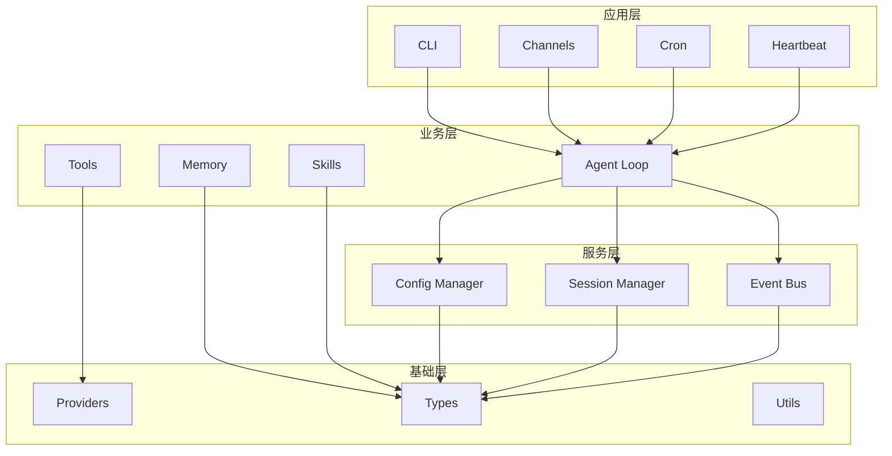
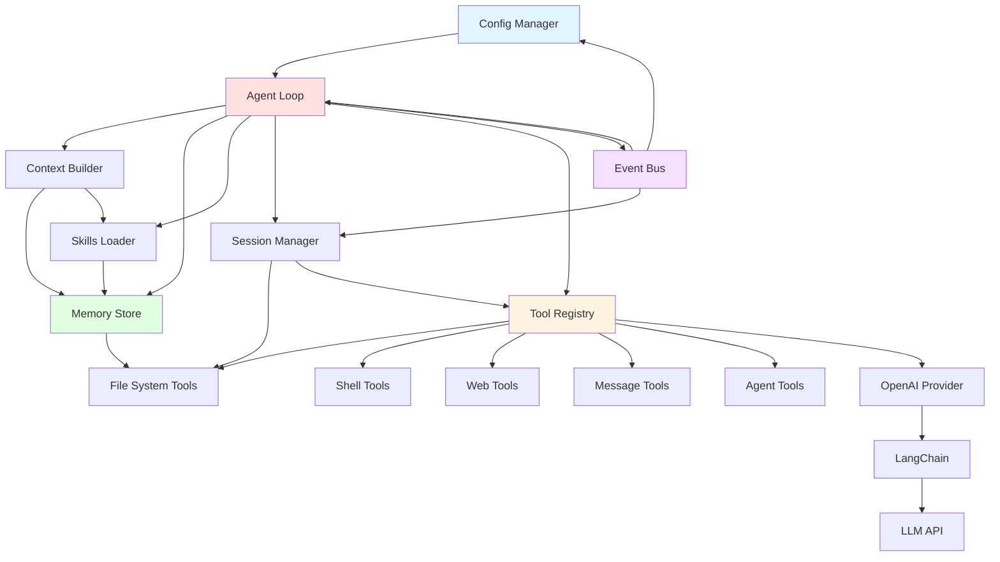
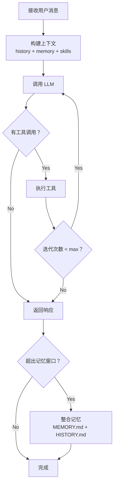
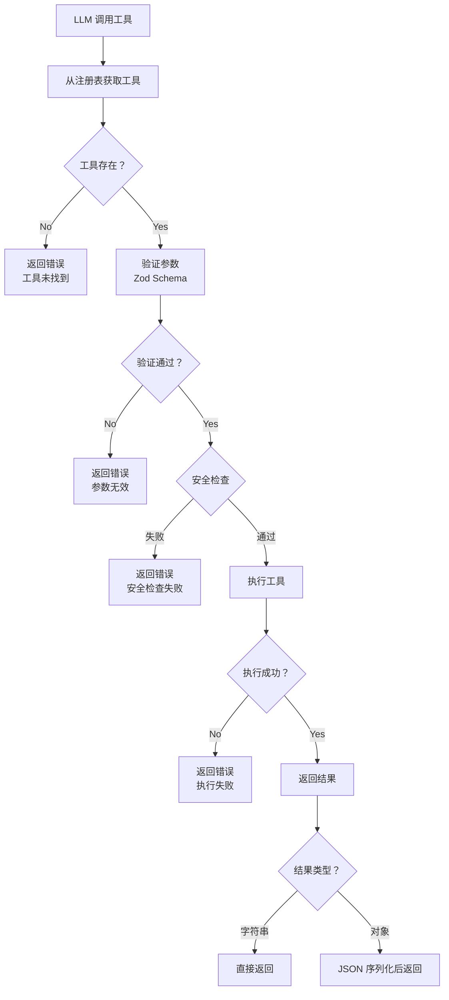

# Niuma 架构设计文档

> **版本：** v0.1.2
> **最后更新：** 2026-03-13
> **状态：** 已完成核心基础设施、Agent 核心、内置工具和多角色配置系统

## 1. 引言

### 1.1 文档目的和受众

本文档旨在全面描述 Niuma 项目的架构设计，包括整体架构、核心模块、设计决策和技术权衡。文档面向以下受众：

- **新加入的开发者**：快速理解项目结构和设计思路，快速上手开发
- **技术评审团队**：评估架构设计的合理性和可扩展性
- **开源社区**：了解项目的技术实力和设计理念

### 1.2 项目概述

Niuma（牛马）是一个基于 TypeScript + Node.js 构建的企业级多角色 AI 助手系统。项目借鉴了 nanobot（[https://github.com/HKUDS/nanobot](https://github.com/HKUDS/nanobot)）的超轻量级设计理念，同时扩展了企业级功能。

**核心特性：**
- 企业级多角色架构：支持多个独立角色（项目经理、开发工程师、测试工程师等）
- 完全隔离：每个角色拥有独立的工作区、会话、记忆和日志
- 轻量级核心：借鉴 nanobot 超轻量级设计
- JSON5 配置：支持注释和尾随逗号的配置格式
- 环境变量集成：支持 `${VAR}` 和 `${VAR:default}` 语法
- 双层记忆系统：MEMORY.md + HISTORY.md
- 技能系统：支持动态加载和依赖检查
- MCP 协议支持：预留接口
- 定时任务与心跳：周期性任务支持

### 1.3 架构演进（简要）

Niuma 的架构从 v0.1.0-beta 演进到 v0.1.2，经历了以下关键阶段：

- **v0.1.0-beta**：实现核心基础设施和 Agent 核心，包括类型系统、配置管理、工具框架、事件总线、上下文构建、记忆系统、技能系统和 Agent 循环
- **v0.1.0**：扩展企业级功能，实现多角色配置系统，包括 JSON5 支持、环境变量解析、defaults-with-overrides 模式和完全隔离
- **v0.1.1**：实现内置工具，包括文件系统、Shell、Web、消息和 Agent 工具
- **v0.1.2**：实现高级文件操作，使用 fast-glob 重构 ListDirTool，添加完整的安全防护机制

架构演进的核心理念是**渐进式扩展**：从轻量级核心开始，逐步添加企业级功能，同时保持架构的清晰性和可维护性。

---

## 2. 整体架构

### 2.1 架构概览

Niuma 采用清晰的 **4 层分层架构**，每层职责明确，依赖关系单向，无循环依赖：



### 2.2 分层架构

#### 应用层
**职责**：提供用户交互界面和入口点
- **CLI**：命令行接口（当前待开发）
- **Channels**：多渠道接入（Telegram、Discord、飞书、钉钉等，待开发）
- **Cron**：定时任务调度（已实现工具，服务层待开发）
- **Heartbeat**：主动唤醒服务（待开发）

#### 业务层
**职责**：实现核心业务逻辑
- **Agent Loop**：智能体循环（LLM ↔ 工具执行）
- **Tools**：工具系统（文件系统、Shell、Web、消息、Agent）
- **Memory**：双层记忆系统（MEMORY.md + HISTORY.md）
- **Skills**：技能系统（动态加载 SKILL.md）

#### 服务层
**职责**：提供支持服务
- **Config Manager**：配置管理（多角色配置、环境变量解析）
- **Session Manager**：会话管理（会话状态、历史记录、持久化）
- **Event Bus**：事件总线（模块间异步通信）

#### 基础层
**职责**：提供基础设施
- **Providers**：LLM 提供商（OpenAI、Anthropic、自定义端点）
- **Types**：核心类型定义
- **Utils**：工具函数（重试工具等）

### 2.3 模块关系图



### 2.4 技术栈选型

| 层次 | 技术选型 | 版本 | 理由 |
|------|---------|------|------|
| 运行时 | Node.js | >=22.0.0 | 现代特性、性能优秀、生态成熟 |
| 语言 | TypeScript | 5.9.3 | 类型安全、开发体验好、IDE 支持强 |
| 包管理 | pnpm | latest | 快速、节省磁盘空间、严格依赖管理 |
| LLM 框架 | LangChain | @langchain/openai | 功能丰富、生态成熟、标准化接口 |
| 类型验证 | Zod | ^4.3.6 | 类型推导、错误友好、JSON Schema 互操作 |
| 数据库 | SQLite | @sqliteai/sqlite-wasm | 单文件、零配置、高性能、WASM 支持 |
| 配置格式 | JSON5 | ^2.2.3 | 支持注释、尾随逗号、兼容 JSON |
| 异步 | Promise/async-await | 原生 | 简单、零依赖、与生态兼容 |
| 日志 | pino | ^10.3.1 | 高性能、结构化、零依赖 |
| 测试 | vitest | ^4.0.18 | 快速、类型安全、与 TypeScript 深度集成 |

---

## 3. 核心模块

### 3.1 Agent Loop

**文件位置**：`niuma/agent/loop.ts`

**职责**：实现智能体的核心循环，协调 LLM 调用和工具执行

**核心流程**：
1. 接收用户消息
2. 构建上下文（history + memory + skills）
3. 调用 LLM
4. 判断是否有工具调用
5. 如果有，执行工具并返回结果
6. 如果没有，返回响应
7. 重复步骤 3-6，直到达到最大迭代次数或 LLM 完成响应

**关键特性**：
- 最大迭代次数限制（默认 40）
- 记忆整合触发机制（超出记忆窗口 80% 时触发）
- 错误处理和重试机制
- 进度模式支持（verbose、normal、silent）

**核心接口**：
```typescript
interface AgentLoopOptions {
  provider: LLMProvider
  model: string
  memoryWindow: number
  maxIterations: number
  maxRetries: number
  retryBaseDelay: number
  progressMode: ProgressMode
}

class AgentLoop {
  async run(input: string, options?: RunOptions): Promise<string>
  async _processMessage(message: Message): Promise<void>
  async _consolidateMemory(session: Session): Promise<void>
}
```

### 3.2 配置系统

**文件位置**：`niuma/config/`

**职责**：加载、验证、合并和管理配置

**核心组件**：
- **schema.ts**：使用 Zod 定义配置结构
- **loader.ts**：配置文件读取、验证、合并（兼容旧 API）
- **manager.ts**：多角色配置管理、缓存
- **merger.ts**：配置合并器（defaults-with-overrides 模式）
- **env-resolver.ts**：环境变量解析器（`${VAR}` 和 `${VAR:default}` 语法）
- **json5-loader.ts**：JSON5 格式解析

**配置优先级**：
```
命令行参数 > 角色特定配置 > 全局配置 > 系统环境变量 > 默认值
```

**defaults-with-overrides 模式**：
- **深度合并**：agent、providers（保留全局默认）
- **完全替换**：channels、cronTasks（角色特定）
- **直接覆盖**：debug、logLevel（单一值）

**核心接口**：
```typescript
class ConfigManager {
  load(): NiumaConfig
  getAgentConfig(agentId: string): NiumaConfig
  getAgentWorkspaceDir(agentId: string): string
}

function mergeConfigs(
  globalConfig: NiumaConfig,
  agentConfig: AgentDefinition
): Partial<NiumaConfig>
```

### 3.3 记忆系统

**文件位置**：`niuma/agent/memory.ts`

**职责**：管理短期记忆（会话）和长期记忆（MEMORY.md），自动整合关键信息

**双层记忆架构**：
- **MEMORY.md**：长期记忆，结构化知识库，LLM 维护和更新，用于 System Prompt 注入
- **HISTORY.md**：历史日志，时间线日志，可搜索的对话历史，用于审计和回溯

**自动整合机制**：
- 触发条件：未整合消息数量超出记忆窗口的 80%
- 整合策略：增量整合（只整合超出窗口的旧消息）+ 保留最近消息（保留 `memoryWindow / 2` 条最新消息）
- LLM 驱动：使用 LLM 提取关键信息并更新 MEMORY.md

**核心接口**：
```typescript
class MemoryStore {
  async readLongTerm(): Promise<string>
  async writeLongTerm(content: string): Promise<void>
  async appendHistory(entry: string): Promise<void>
  async consolidate(options: ConsolidateOptions): Promise<boolean>
}
```

### 3.4 工具系统

**文件位置**：`niuma/agent/tools/`

**职责**：提供可扩展的工具框架，支持动态注册和类型安全的参数验证

**核心组件**：
- **base.ts**：工具基类（ITool 接口、BaseTool 抽象类）
- **registry.ts**：工具注册表（注册、执行、Schema 生成）
- **filesystem.ts**：文件系统工具（read_file、write_file、edit_file、list_dir、file_search、file_move、file_copy、file_delete、file_info、dir_create、dir_delete）
- **shell.ts**：Shell 工具（exec，带危险命令黑名单防护）
- **web.ts**：Web 工具（web_search、web_fetch，带缓存机制）
- **message.ts**：消息工具（message，支持队列和富文本）
- **agent.ts**：Agent 工具（spawn、cron，支持子智能体和定时任务）

**核心特性**：
- 基于 Zod Schema 的类型安全参数验证
- 自动生成 OpenAI 工具 Schema
- 动态注册和执行
- 多层安全机制（黑名单、确认机制、受保护路径）

**核心接口**：
```typescript
interface ITool<TInput = unknown, TOutput = string> {
  readonly name: string
  readonly description: string
  readonly parameters: z.ZodType<TInput>

  getDefinition(): ToolDefinition
  toSchema(): OpenAIToolSchema
  validateArgs(args: unknown): TInput
  execute(args: TInput): Promise<TOutput>
}

class ToolRegistry {
  register(tool: ITool): this
  async execute(name: string, params: Record<string, unknown>): Promise<string>
  getAllSchemas(): OpenAIToolSchema[]
}
```

### 3.5 事件总线

**文件位置**：`niuma/bus/events.ts`

**职责**：提供事件驱动的模块间通信机制

**核心特性**：
- 基于 Node.js EventEmitter
- 类型安全的事件系统（使用泛型）
- 错误隔离（异步事件处理器错误不会导致崩溃）
- 最大监听器数限制（100，防止内存泄漏）

**核心接口**：
```typescript
class EventBus {
  emit<K extends EventType>(type: K, data: EventMap[K]): void
  on<K extends EventType>(
    type: K,
    handler: (data: EventMap[K]) => void | Promise<void>
  ): void
}
```

### 3.6 会话管理

**文件位置**：`niuma/session/manager.ts`

**职责**：管理会话状态、历史记录和持久化

**核心特性**：
- 会话创建、查询、更新、删除
- 历史记录管理（消息列表）
- 持久化到文件系统（JSON 格式）
- 原子写入（先写入临时文件，然后重命名）

**核心接口**：
```typescript
class SessionManager {
  async create(key: string, options?: CreateOptions): Promise<Session>
  async get(key: string): Promise<Session | null>
  async update(key: string, updates: Partial<Session>): Promise<void>
  async delete(key: string): Promise<void>
  async list(): Promise<Session[]>
}
```

### 3.7 LLM 提供商

**文件位置**：`niuma/providers/`

**职责**：提供统一的 LLM 接口，支持多种提供商

**核心组件**：
- **base.ts**：提供商抽象基类
- **openai.ts**：OpenAI 实现（基于 LangChain）

**核心特性**：
- 统一的聊天接口（chat）
- 消息格式转换（内部消息格式 ↔ LangChain 消息格式）
- 工具调用支持
- 流式响应支持（预留）
- 错误处理和重试机制

**核心接口**：
```typescript
interface LLMProvider {
  readonly name: string
  chat(request: ChatRequest): Promise<ChatResponse>
}

class OpenAIProvider implements LLMProvider {
  chat(request: ChatRequest): Promise<ChatResponse>
}
```

---

## 4. 核心流程

### 4.1 Agent Loop 流程



**详细步骤**：
1. **接收消息**：从消息队列中取出一条消息
2. **构建上下文**：
   - 加载历史消息（最近的 `memoryWindow` 条）
   - 加载长期记忆（MEMORY.md）
   - 加载技能（SKILL.md）
   - 组装 System Prompt 和用户消息
3. **调用 LLM**：使用 LangChain 调用 LLM API
4. **判断工具调用**：检查 LLM 返回的消息中是否包含工具调用
5. **执行工具**：
   - 从工具注册表中获取工具
   - 验证参数（Zod Schema）
   - 执行工具
   - 返回结果
6. **重复步骤 3-6**：直到达到最大迭代次数或 LLM 完成响应
7. **返回响应**：将最终响应返回给用户
8. **整合记忆**（可选）：如果超出记忆窗口，调用 LLM 整合旧消息到 MEMORY.md

### 4.2 配置加载流程

```mermaid
flowchart TD
    A[启动应用] --> B[加载 niuma.config.json]
    B --> C[JSON5 解析]
    C --> D[环境变量解析<br/>${VAR} 和 ${VAR:default}]
    D --> E[Zod 验证]
    E --> F{验证通过？}
    F -->|No| G[抛出错误<br/>停止启动]
    F -->|Yes| H[确定角色<br/>--agent 参数或 default]
    H --> I[获取角色配置<br/>defaults-with-overrides 模式]
    I --> J[缓存合并后的配置]
    J --> K[返回配置]
```

**详细步骤**：
1. **加载配置文件**：读取 `~/.niuma/niuma.config.json`
2. **JSON5 解析**：使用 json5 库解析配置
3. **环境变量解析**：
   - 扫描 `${VAR}` 和 `${VAR:default}` 模式
   - 从系统环境变量中查找值
   - 替换配置中的占位符
4. **Zod 验证**：使用 Zod Schema 验证配置
5. **确定角色**：从命令行参数 `--agent` 或配置中的 `default` 字段确定角色
6. **合并配置**：使用 defaults-with-overrides 模式合并全局默认配置和角色特定配置
7. **缓存配置**：将合并后的配置缓存到内存中
8. **返回配置**：返回合并后的配置

### 4.3 记忆整合流程

```mermaid
flowchart TD
    A[触发整合<br/>超出记忆窗口 80%] --> B[提取旧消息<br/>session.messages[lastConsolidated:-keepCount]]
    B --> C[格式化消息为文本]
    C --> D[获取当前长期记忆<br/>MEMORY.md]
    D --> E[构建整合提示词]
    E --> F[调用 LLM 进行整合]
    F --> G[解析 LLM 返回的工具调用]
    G --> H[更新 MEMORY.md]
    H --> I[追加到 HISTORY.md]
    I --> J[更新 session.lastConsolidated]
```

**详细步骤**：
1. **触发整合**：当未整合消息数量超出记忆窗口的 80% 时触发
2. **提取旧消息**：从 `session.messages[lastConsolidated:-keepCount]` 中提取需要整合的消息
3. **格式化消息**：将消息格式化为文本（包括时间戳、角色、内容）
4. **获取长期记忆**：读取当前 MEMORY.md 的内容
5. **构建提示词**：
   - System Prompt：You are a memory consolidation agent.
   - User Prompt：当前长期记忆 + 需要整合的消息 + 要求（提取关键信息、删除冗余信息）
   - Tools：SAVE_MEMORY_TOOL（包含 memory_update 和 history_entry 两个参数）
6. **调用 LLM**：使用 LangChain 调用 LLM API
7. **解析工具调用**：从 LLM 返回的消息中解析 SAVE_MEMORY_TOOL 的调用参数
8. **更新 MEMORY.md**：使用 `memory_update` 参数更新 MEMORY.md
9. **追加到 HISTORY.md**：使用 `history_entry` 参数追加到 HISTORY.md
10. **更新会话**：更新 `session.lastConsolidated` 为当前消息数量

### 4.4 工具执行流程



**详细步骤**：
1. **获取工具**：从工具注册表中根据工具名称获取工具实例
2. **验证存在**：检查工具是否存在
3. **验证参数**：使用工具的 Zod Schema 验证参数
4. **安全检查**：
   - Shell 工具：检查命令是否在黑名单中
   - 文件操作工具：检查路径是否在受保护路径列表中
   - 删除操作：检查 confirm 参数是否为 true
5. **执行工具**：调用工具的 execute 方法
6. **处理结果**：
   - 如果结果是字符串，直接返回
   - 如果结果是对象，使用 JSON 序列化后返回
7. **返回结果**：将结果包装为 ToolMessage 返回给 LLM

---

## 5. 设计决策和权衡

### 5.1 类型系统选择：TypeScript + Zod

#### 背景和动机
- **编译时类型安全**：TypeScript 提供静态类型检查，减少运行时错误
- **运行时验证需求**：AI 助手系统需要处理外部输入（配置文件、API 响应、用户输入），必须进行运行时验证
- **Schema 驱动设计**：工具参数、配置文件需要统一的 Schema 定义和验证机制

#### 选择的方案
```typescript
// 配置 Schema 定义
export const ProviderConfigSchema = z.object({
  type: z.enum(['openai', 'anthropic', 'ollama', 'custom']).default('openai'),
  model: z.string(),
  apiKey: z.string().optional(),
  apiBase: z.string().optional(),
  temperature: z.number().min(0).max(2).optional(),
  maxTokens: z.number().int().positive().optional(),
})

// 类型推导
type ProviderConfig = z.infer<typeof ProviderConfigSchema>
```

#### 替代方案对比

| 方案 | 优点 | 缺点 | 适用场景 |
|------|------|------|----------|
| **TypeScript + Zod** | 类型推导、自动转换、链式 API、错误消息友好 | 依赖较多、运行时开销 | ✅ 配置验证、工具参数 |
| **io-ts** | 函数式编程风格、类型精确 | 学习曲线陡峭、API 复杂 | 函数式项目 |
| **class-validator** | 装饰器语法、类友好 | 需要类定义、装饰器元数据 | OOP 项目 |
| **手动验证** | 零依赖、完全控制 | 代码冗余、易出错 | 简单项目 |

#### 优点
1. **类型推导**：`z.infer<Schema>` 自动生成 TypeScript 类型
2. **链式 API**：`.min().max().optional()` 语法直观
3. **错误消息友好**：自动生成详细的验证错误信息
4. **JSON Schema 互操作**：`z.toJSONSchema()` 支持生成 OpenAI 工具 Schema

#### 缺点
1. **运行时开销**：每次验证都需要执行 Zod Schema
2. **依赖体积**：zod@4.3.6 约 150KB（压缩后）
3. **学习曲线**：需要掌握 Zod 的 API 和最佳实践

#### 性能影响分析
- **配置加载**：启动时一次性验证，影响可忽略
- **工具参数验证**：每次工具调用前验证，平均耗时 < 1ms
- **内存占用**：Schema 对象常驻内存，约 50-100KB

#### 适用场景
- ✅ 配置文件验证（启动时）
- ✅ 工具参数验证（运行时）
- ✅ API 响应验证（集成测试）
- ❌ 高频数据验证（每秒 > 1000 次）

#### 潜在技术债务
1. **Schema 重复定义**：部分 Schema 在多处重复，可考虑提取到共享模块
2. **错误消息国际化**：当前错误消息为英文，未来需要支持多语言

#### 改进建议
1. **Schema 复用**：将常用 Schema（如 URL、邮箱、路径）提取到 `niuma/types/schemas.ts`
2. **自定义错误消息**：为常见错误提供中文错误消息
3. **性能优化**：对高频 Schema 使用 `z.lazy()` 延迟编译

---

### 5.2 数据库选择：SQLite（@sqliteai/sqlite-wasm）

#### 背景和动机
- **本地化需求**：AI 助手需要本地存储会话、记忆、配置等数据
- **零配置要求**：目标用户是开发者，需要开箱即用的解决方案
- **轻量级优先**：借鉴 nanobot 设计理念，避免引入重型数据库
- **WASM 支持**：使用 WebAssembly 版本，提升跨平台兼容性和性能

#### 选择的方案
项目使用 @sqliteai/sqlite-wasm 作为数据库引擎，结合 Vite 开发环境。WASM 版本提供了更好的跨平台支持和性能优化。

**当前实现（文件系统）**：
```typescript
private async _loadFromFile(sessionKey: string): Promise<Session | null> {
  const filePath = this._getSessionFilePath(sessionKey)
  try {
    if (!existsSync(filePath)) {
      return null
    }
    const data = await readFile(filePath, 'utf-8')
    const parsed = JSON.parse(data) as Session
    return {
      ...parsed,
      createdAt: new Date(parsed.createdAt),
      updatedAt: new Date(parsed.updatedAt),
    }
  } catch {
    return null
  }
}
```

#### 替代方案对比

| 方案 | 优点 | 缺点 | 适用场景 |
|------|------|------|----------|
| **SQLite (@sqliteai/sqlite-wasm)** | 单文件、零配置、高性能、WASM 支持、跨平台 | 不支持分布式、需要 Vite 环境 | ✅ 本地应用、CLI 工具 |
| **PostgreSQL** | 功能丰富、支持复杂查询、可扩展 | 需要独立服务、配置复杂 | 企业级应用 |
| **MongoDB** | 灵活的文档模型、易于扩展 | 占用内存大、查询性能一般 | 快速原型 |
| **文件系统（JSON）** | 零依赖、人类可读、易于调试 | 并发安全差、查询效率低 | ✅ 当前方案（简单场景） |

#### 单文件 vs 客户端-服务器权衡

| 维度 | 单文件数据库 | 客户端-服务器 |
|------|------------|--------------|
| 部署复杂度 | ⭐ 零配置 | ⭐⭐⭐ 需要服务 |
| 查询性能 | ⭐⭐⭐ 适合本地 | ⭐⭐⭐⭐ 适合分布式 |
| 并发支持 | ⭐⭐ 有限 | ⭐⭐⭐⭐⭐ 优秀 |
| 备份恢复 | ⭐⭐⭐ 文件复制 | ⭐⭐⭐ 需要工具 |
| 扩展性 | ⭐ 受限 | ⭐⭐⭐⭐⭐ 水平扩展 |

#### 优点（SQLite WASM）
1. **单文件数据库**：无需独立服务，部署简单
2. **高性能**：WASM 版本提供了更好的性能优化
3. **ACID 事务**：支持原子性操作，保证数据一致性
4. **向量检索**：内置向量搜索支持（未来功能）
5. **跨平台兼容**：WASM 版本支持多种平台和运行环境

#### 缺点（当前文件系统方案）
1. **并发安全**：多个进程同时写入可能冲突（已使用原子写入缓解）
2. **查询效率**：无法进行复杂查询，必须加载整个文件
3. **数据膨胀**：JSON 格式占用空间大，无法压缩

#### 适用场景
- ✅ 单机 AI 助手（当前）
- ✅ 个人开发者工具
- ✅ 本地开发环境
- ❌ 多用户在线服务
- ❌ 高并发生产环境

#### 潜在技术债务
1. **数据库未实际使用**：声明了依赖但未使用，存在冗余
2. **文件系统限制**：当前方案无法支持复杂查询和索引
3. **并发问题**：多个 Agent 实例可能同时访问同一文件

#### 改进建议
1. **迁移到 SQLite**：实现 `SessionManager` 和 `MemoryStore` 的 SQLite 版本
2. **数据迁移工具**：提供 JSON → SQLite 的迁移脚本
3. **连接池管理**：如果未来需要多进程，考虑使用 SQLite WAL 模式

---

### 5.3 异步架构：原生 Promise/async-await

#### 背景和动机
- **简单优先**：借鉴 nanobot 的超轻量级设计理念
- **Node.js 生态**：Node.js 原生支持 Promise，与生态兼容性好
- **学习曲线**：async-await 比 RxJS 更容易理解

#### 选择的方案

**事件总线（EventEmitter）**：
```typescript
export class EventBus {
  private bus = new EventEmitter()

  constructor() {
    this.bus.setMaxListeners(100)
  }

  emit<K extends EventType>(type: K, data: EventMap[K]): void {
    this.bus.emit(type, {
      type,
      data,
      timestamp: Date.now(),
    } satisfies EventPayload<K>)
  }

  on<K extends EventType>(
    type: K,
    handler: (data: EventMap[K]) => void | Promise<void>
  ): void {
    this.bus.on(type, (payload: EventPayload<K>) => {
      try {
        const result = handler(payload.data)
        if (result instanceof Promise) {
          result.catch((error) => {
            console.error(`事件处理器 "${type}" 执行错误:`, error)
            this.emit('ERROR', {
              error: error instanceof Error ? error : new Error(String(error)),
              context: { event: type },
            })
          })
        }
      } catch (error) {
        console.error(`事件处理器 "${type}" 执行错误:`, error)
        this.emit('ERROR', {
          error: error instanceof Error ? error : new Error(String(error)),
          context: { event: type },
        })
      }
    })
  }
}
```

**异步队列**：
```typescript
export class AsyncQueue<T> {
  private queue: T[] = []
  private waiting: Array<(value: T) => void> = []

  enqueue(item: T): void {
    const waiter = this.waiting.shift()
    if (waiter) {
      waiter(item)
    } else {
      this.queue.push(item)
    }
  }

  async dequeue(): Promise<T> {
    return new Promise((resolve) => {
      if (this.queue.length > 0) {
        resolve(this.queue.shift()!)
      } else {
        this.waiting.push(resolve)
      }
    })
  }
}
```

#### 替代方案对比

| 方案 | 优点 | 缺点 | 适用场景 |
|------|------|------|----------|
| **Promise/async-await** | 原生支持、简洁直观、零依赖 | 无法取消、无背压控制 | ✅ 简单异步流程 |
| **RxJS** | 强大的操作符、可取消、背压控制 | 学习曲线陡峭、体积大 | 复杂数据流 |
| **EventEmitter** | Node.js 内置、类型安全封装 | 无背压、内存泄漏风险 | ✅ 事件驱动 |

#### EventEmitter vs Observable

| 维度 | EventEmitter | Observable (RxJS) |
|------|-------------|-------------------|
| 学习曲线 | ⭐ 简单 | ⭐⭐⭐ 陡峭 |
| 背压控制 | ❌ 无 | ✅ 支持 |
| 可取消性 | ❌ 有限 | ✅ 支持 |
| 操作符 | ⭐ 基础 | ⭐⭐⭐⭐⭐ 丰富 |
| 内存占用 | ⭐⭐⭐ 低 | ⭐⭐ 较高 |
| 类型安全 | ⭐⭐⭐ 好 | ⭐⭐⭐⭐ 优秀 |

#### 优点
1. **零依赖**：EventEmitter 是 Node.js 内置模块
2. **类型安全**：使用泛型实现类型安全的事件系统
3. **错误隔离**：异步事件处理器错误不会导致崩溃
4. **简单直观**：async-await 语义清晰，易于调试

#### 缺点
1. **无背压控制**：高并发时可能内存溢出
2. **无法取消**：Promise 一旦创建无法取消
3. **操作符有限**：无法进行复杂的流式转换

#### 消息队列使用场景
- ✅ **顺序处理**：保证消息按顺序处理
- ✅ **背压控制**：队列满时阻塞生产者
- ✅ **内存保护**：限制队列大小防止溢出

#### 适用场景
- ✅ 简单异步流程（文件 I/O、HTTP 请求）
- ✅ 事件驱动架构（消息收发、状态通知）
- ✅ CLI 工具（交互式命令）
- ❌ 复杂数据流（实时数据流、数据转换管道）
- ❌ 高并发场景（需要背压控制）

#### 潜在技术债务
1. **内存泄漏风险**：EventEmitter 监听器未移除可能导致内存泄漏
2. **错误处理不完善**：异步错误可能被静默忽略
3. **无背压控制**：高并发时可能导致内存溢出

#### 改进建议
1. **监听器清理**：实现 `removeAllListeners()` 的安全调用
2. **背压控制**：为 AsyncQueue 添加最大长度限制
3. **超时机制**：为异步操作添加超时和取消支持
4. **监控指标**：添加队列长度、处理时间等监控

---

### 5.4 配置系统设计：JSON5 + defaults-with-overrides

#### 背景和动机
- **可读性优先**：配置文件需要人类可读和可编辑
- **灵活性需求**：多角色架构需要配置继承和覆盖
- **安全性考虑**：敏感信息（API Key）不应硬编码

#### 选择的方案

**JSON5 配置示例**：
```json5
{
  // 元数据（自动生成，不要手动编辑）
  "meta": {
    "lastTouchedVersion": "0.1.0",
    "lastTouchedAt": "2026-03-10T14:00:00Z"
  },

  // Agent 配置（defaults-with-overrides 模式）
  "agents": {
    // 所有 agent 的默认配置
    "defaults": {
      "progressMode": "normal",
      "showReasoning": false,
      "showToolDuration": true,
      "memoryWindow": 50,
      "maxRetries": 4,
      "retryBaseDelay": 1000
    },
    // 角色列表
    "list": [
      {
        "id": "manager",
        "name": "项目经理",
        "default": true,
        "agent": {
          "progressMode": "verbose",
          "showReasoning": true
        }
      }
    ]
  }
}
```

**环境变量引用**：
```json5
{
  "providers": {
    "openai": {
      "apiKey": "${OPENAI_API_KEY}",
      "apiBase": "${OPENAI_BASE_URL:https://api.openai.com/v1}"
    }
  }
}
```

#### 替代方案对比

| 格式 | 优点 | 缺点 | 适用场景 |
|------|------|------|----------|
| **JSON5** | 支持注释、尾随逗号、兼容 JSON | 非标准格式 | ✅ 配置文件 |
| **YAML** | 简洁、支持注释、广泛使用 | 缩进敏感、类型不明确 | CI/CD、K8s |
| **TOML** | 简洁、明确类型、支持表格 | 生态较小 | Rust 项目 |
| **JSON** | 标准、生态丰富 | 不支持注释、冗长 | API 响应 |

#### JSON5 vs YAML vs TOML

| 维度 | JSON5 | YAML | TOML |
|------|-------|------|------|
| 注释支持 | ✅ | ✅ | ✅ |
| 尾随逗号 | ✅ | ❌ | ✅ |
| 学习曲线 | ⭐ 简单 | ⭐⭐ 中等 | ⭐⭐⭐ 中等 |
| 类型明确 | ⭐⭐⭐ 中等 | ⭐ 弱 | ⭐⭐⭐⭐ 强 |
| 生态支持 | ⭐⭐⭐ 好 | ⭐⭐⭐⭐⭐ 优秀 | ⭐⭐ 中等 |
| 解析性能 | ⭐⭐⭐⭐ 快 | ⭐⭐ 慢 | ⭐⭐⭐⭐ 快 |

#### defaults-with-overrides 模式

**合并策略**：
- **深度合并**：agent、providers（保留全局默认）
- **完全替换**：channels、cronTasks（角色特定）
- **直接覆盖**：debug、logLevel（单一值）

#### 环境变量解析设计

**语法支持**：
- `${VAR}`：必需环境变量，严格模式下报错
- `${VAR:default}`：可选环境变量，使用默认值

#### 配置优先级
```
命令行参数 > 角色特定配置 > 全局配置 > 系统环境变量 > 默认值
```

#### 优点
1. **人类可读**：JSON5 支持注释，易于理解和维护
2. **灵活性高**：defaults-with-overrides 模式支持复杂配置场景
3. **安全性强**：环境变量引用避免敏感信息泄露
4. **类型安全**：Zod Schema 确保配置有效性

#### 缺点
1. **非标准格式**：JSON5 不是标准格式，兼容性有限
2. **学习成本**：用户需要学习 defaults-with-overrides 模式
3. **配置冲突**：多层级覆盖可能导致配置冲突

#### 适用场景
- ✅ 开发者工具（配置复杂、需要注释）
- ✅ 多租户应用（需要配置隔离）
- ✅ 敏感信息管理（环境变量引用）
- ❌ 静态配置（无需动态覆盖）

#### 潜在技术债务
1. **配置迁移困难**：defaults-with-overrides 模式迁移成本高
2. **配置验证滞后**：运行时才发现配置错误
3. **配置缓存失效**：配置热更新可能导致缓存不一致

#### 改进建议
1. **配置验证 CLI**：提供 `niuma config validate` 命令
2. **配置可视化**：提供 Web UI 管理配置
3. **配置版本控制**：支持配置历史和回滚
4. **配置加密**：支持加密存储敏感字段

---

### 5.5 工具系统设计：Zod Schema + 动态注册

#### 背景和动机
- **类型安全**：工具参数需要强类型定义和验证
- **灵活性**：工具可能需要动态加载和卸载
- **安全性**：工具执行需要沙箱隔离和权限控制

#### 选择的方案

**工具基类**：
```typescript
export interface ITool<TInput = unknown, TOutput = string> {
  readonly name: string
  readonly description: string
  readonly parameters: z.ZodType<TInput>

  getDefinition(): ToolDefinition
  toSchema(): OpenAIToolSchema
  validateArgs(args: unknown): TInput
  execute(args: TInput): Promise<TOutput>
}

export abstract class BaseTool<TInput = unknown, TOutput = string>
  implements ITool<TInput, TOutput>
{
  abstract readonly name: string
  abstract readonly description: string
  abstract readonly parameters: z.ZodType<TInput>

  validateArgs(args: unknown): TInput {
    const result = this.parameters.safeParse(args)
    if (!result.success) {
      throw new Error(`参数无效: ${result.error?.message || '验证失败'}`)
    }
    return result.data as TInput
  }

  abstract execute(args: TInput): Promise<TOutput>
}
```

**工具注册表**：
```typescript
export class ToolRegistry {
  private tools: Map<string, ITool> = new Map()

  register(tool: ITool): this {
    this.tools.set(tool.name, tool)
    return this
  }

  async execute(name: string, params: Record<string, unknown>): Promise<string> {
    const tool = this.tools.get(name)
    if (!tool) {
      return `错误: 工具 "${name}" 未找到。可用工具: ${this.toolNames.join(', ')}`
    }

    try {
      const validatedArgs = tool.validateArgs(params)
      const result = await tool.execute(validatedArgs)
      return typeof result === 'string' ? result : JSON.stringify(result, null, 2)
    } catch (error) {
      const message = error instanceof Error ? error.message : String(error)
      return `执行 ${name} 时出错: ${message}\n\n[分析上述错误并尝试其他方式。]`
    }
  }
}
```

#### Zod Schema vs JSON Schema

| 维度 | Zod Schema | JSON Schema |
|------|-----------|-------------|
| 类型安全 | ⭐⭐⭐⭐⭐ 编译时 + 运行时 | ⭐ 运行时 |
| API 友好度 | ⭐⭐⭐⭐⭐ 链式 API | ⭐⭐ 复杂对象 |
| 转换支持 | ⭐⭐⭐⭐ 自动转换 | ⭐⭐ 手动处理 |
| 互操作性 | ⭐⭐⭐ 可转 JSON Schema | ⭐⭐⭐⭐⭐ 标准 |
| 学习曲线 | ⭐⭐ 中等 | ⭐⭐⭐ 较陡 |

#### 动态注册 vs 静态注册

| 维度 | 动态注册 | 静态注册 |
|------|---------|---------|
| 灵活性 | ⭐⭐⭐⭐⭐ 运行时加载 | ⭐ 编译时固定 |
| 性能 | ⭐⭐⭐ 运行时开销 | ⭐⭐⭐⭐⭐ 零开销 |
| 类型安全 | ⭐⭐⭐ 运行时验证 | ⭐⭐⭐⭐⭐ 编译时 |
| 可扩展性 | ⭐⭐⭐⭐⭐ 插件化 | ⭐ 受限 |

#### 安全机制设计

**Shell 工具黑名单**：
```typescript
const DANGEROUS_COMMANDS = [
  'rm -rf /',
  'shutdown',
  'reboot',
  'halt',
  'poweroff',
  ':(){ :|:& };:',  // fork bomb
  'dd if=/dev/zero',
  'mkfs',
  'fdisk',
  'format',
  'del /F /S /Q',
  'rmdir /S /Q',
]

function isDangerousCommand(command: string): boolean {
  const normalized = command.toLowerCase().trim()
  return DANGEROUS_COMMANDS.some(dangerous =>
    normalized.includes(dangerous.toLowerCase())
  )
}
```

**文件操作安全检查**：
```typescript
async execute(args: FileDeleteInput): Promise<string> {
  const { path: filePath, confirm = false } = args

  // 安全检查：确认机制
  if (!confirm) {
    return '删除操作需要确认，请设置 confirm=true'
  }

  // 安全检查：受保护路径
  const normalizedPath = normalize(filePath)
  for (const protectedPath of PROTECTED_PATHS) {
    if (normalizedPath.startsWith(protectedPath)) {
      return `错误：无法删除受保护路径：${filePath}`
    }
  }

  // 执行删除
  await unlink(filePath)
  return `已删除文件：${filePath}`
}
```

#### 优点
1. **类型安全**：Zod Schema 提供编译时和运行时类型检查
2. **自动转换**：Zod 自动处理类型转换（如字符串转数字）
3. **OpenAI 兼容**：自动生成 OpenAI 工具 Schema
4. **安全防护**：多层安全机制防止恶意操作

#### 缺点
1. **运行时开销**：每次调用都需要验证参数
2. **调试困难**：动态注册导致静态分析困难
3. **权限粒度**：当前权限控制较粗糙

#### 适用场景
- ✅ AI 助手工具（需要自动调用）
- ✅ 插件系统（动态加载）
- ✅ CLI 工具（用户交互）
- ❌ 高性能场景（每秒 > 1000 次调用）

#### 潜在技术债务
1. **权限系统缺失**：无细粒度权限控制
2. **沙箱隔离不足**：工具执行在主进程，存在风险
3. **资源限制缺失**：无 CPU、内存、磁盘配额

#### 改进建议
1. **权限系统**：实现基于角色的权限控制（RBAC）
2. **沙箱隔离**：使用 Worker 线程或子进程隔离工具执行
3. **资源配额**：限制工具的资源使用（CPU、内存、磁盘）
4. **审计日志**：记录所有工具调用的详细日志

---

### 5.6 记忆系统设计：文件系统 + 双层记忆

#### 背景和动机
- **可读性优先**：记忆需要人类可读和可编辑
- **简单性优先**：借鉴 nanobot 的超轻量级设计
- **灵活性需求**：支持手动编辑和版本控制

#### 选择的方案

**双层记忆架构**：
```typescript
export class MemoryStore {
  private readonly memoryDir: string
  private readonly memoryFile: string      // MEMORY.md - 长期记忆
  private readonly historyFile: string     // HISTORY.md - 历史日志

  async readLongTerm(): Promise<string> {
    try {
      return await readFile(this.memoryFile, 'utf-8')
    } catch {
      return ''
    }
  }

  async writeLongTerm(content: string): Promise<void> {
    // 原子写入：先写入临时文件，然后重命名
    const tempPath = `${this.memoryFile}.tmp`
    await writeFile(tempPath, content, 'utf-8')
    await rename(tempPath, this.memoryFile)
  }

  async appendHistory(entry: string): Promise<void> {
    await appendFile(this.historyFile, entry.trimEnd() + '\n\n', 'utf-8')
  }
}
```

**自动整合机制**：
```typescript
async consolidate(options: ConsolidateOptions): Promise<boolean> {
  const { session, provider, model, archiveAll = false, memoryWindow } = options

  // 提取需要整合的消息
  const oldMessages = session.messages.slice(session.lastConsolidated, -keepCount)

  // 格式化消息为文本
  const lines = this._formatMessagesForConsolidation(oldMessages)

  // 获取当前长期记忆
  const currentMemory = await this.readLongTerm()

  // 构建整合提示词
  const prompt = this._buildConsolidationPrompt(currentMemory, lines)

  // 调用 LLM 进行记忆整合
  const response = await provider.chat({
    messages: [
      {
        role: 'system',
        content: 'You are a memory consolidation agent.',
      },
      { role: 'user', content: prompt },
    ],
    tools: [SAVE_MEMORY_TOOL],
    model,
  })

  // 解析并保存结果
  const args = this._parseToolCallArguments(response.toolCalls[0].arguments)
  await this.appendHistory(args.history_entry)
  await this.writeLongTerm(args.memory_update)

  return true
}
```

#### 文件系统 vs 数据库

| 维度 | 文件系统（Markdown） | 数据库（SQLite） |
|------|---------------------|-----------------|
| 可读性 | ⭐⭐⭐⭐⭐ 人类可读 | ⭐ 需要工具 |
| 可编辑性 | ⭐⭐⭐⭐⭐ 文本编辑器 | ⭐ 需要 SQL |
| 版本控制 | ⭐⭐⭐⭐⭐ Git 友好 | ⭐⭐ 需要导出 |
| 查询性能 | ⭐⭐ 慢（grep） | ⭐⭐⭐⭐⭐ 快（索引） |
| 并发安全 | ⭐⭐ 原子写入 | ⭐⭐⭐⭐⭐ 事务 |
| 结构化程度 | ⭐ 弱（自由文本） | ⭐⭐⭐⭐⭐ 强（Schema） |

#### 双层记忆架构

**MEMORY.md（长期记忆）**：
- 结构化知识库
- LLM 维护和更新
- 用于 System Prompt 注入

**HISTORY.md（历史日志）**：
- 时间线日志
- 可搜索的对话历史
- 用于审计和回溯

```markdown
## MEMORY.md
# 用户偏好

用户喜欢使用 TypeScript 进行开发。
用户偏好使用 pnpm 作为包管理器。

## 项目信息

项目名称：niuma
项目类型：AI 助手 CLI 工具
技术栈：TypeScript + Node.js + LangChain

---

## HISTORY.md
[2026-03-13 10:30] USER: 帮我分析项目架构
[2026-03-13 10:35] ASSISTANT [tools: read_file, list_dir]: 分析了核心模块
[2026-03-13 10:40] USER: 给出优化建议
[2026-03-13 10:45] ASSISTANT: 提供了 5 点优化建议
```

#### 自动整合算法

**触发条件**：
```typescript
private async _consolidateMemory(session: Session): Promise<void> {
  const unconsolidated = Math.max(0, session.messages.length - session.lastConsolidated)
  const threshold = Math.floor(this.memoryWindow * CONSOLIDATION_THRESHOLD_RATIO) // 0.8

  if (unconsolidated < threshold) {
    return
  }

  const memoryStore = this._getMemoryStore(session.key)
  await memoryStore.consolidate({
    session,
    provider: this.provider,
    model: this.model,
    memoryWindow: this.memoryWindow,
  })
}
```

**整合策略**：
- 增量整合：只整合超出窗口的旧消息
- 保留最近消息：保留 `memoryWindow / 2` 条最新消息
- LLM 驱动：使用 LLM 提取关键信息

#### 性能考虑

**内存占用**：
- MEMORY.md：通常 < 100KB
- HISTORY.md：随时间增长，需要定期清理

**整合耗时**：
- 小型对话（< 50 条）：1-2 秒
- 中型对话（50-200 条）：3-5 秒
- 大型对话（> 200 条）：5-10 秒

**优化措施**：
- 并发控制：避免同时整合多个会话
- 增量整合：只处理新消息
- 缓存机制：避免重复读取

#### 优点
1. **可读性强**：Markdown 格式易于理解和编辑
2. **版本控制友好**：可以直接使用 Git 管理记忆
3. **灵活性强**：支持手动编辑和结构化信息
4. **简单直观**：无需学习数据库查询语言

#### 缺点
1. **查询效率低**：无法进行复杂查询和索引
2. **并发安全差**：多进程访问可能冲突
3. **结构化不足**：自由文本难以机器处理
4. **性能瓶颈**：大文件读取和整合耗时

#### 适用场景
- ✅ 个人 AI 助手（单用户）
- ✅ 开发者工具（需要手动编辑）
- ✅ 知识管理（结构化 + 非结构化）
- ❌ 多用户协作（需要并发控制）
- ❌ 高频查询（需要索引）

#### 潜在技术债务
1. **查询效率低**：无法进行语义搜索和复杂查询
2. **并发安全**：多进程访问可能导致数据损坏
3. **性能瓶颈**：大文件读取和整合耗时
4. **数据膨胀**：HISTORY.md 无限增长

#### 改进建议
1. **向量检索**：使用 @sqliteai/sqlite-wasm 内置的向量搜索支持语义搜索
2. **并发控制**：使用 SQLite WAL 模式
3. **性能优化**：实现增量读取和缓存机制
4. **数据清理**：定期清理过期的 HISTORY.md 条目
5. **混合存储**：MEMORY.md 保留文件，HISTORY.md 迁移到数据库

---

### 5.7 LLM 集成选择：LangChain

#### 背景和动机
- **标准化接口**：LangChain 提供统一的 LLM 接口
- **功能丰富**：内置工具调用、流式响应、重试机制
- **生态成熟**：LangChain 是最流行的 LLM 框架

#### 选择的方案

**LangChain OpenAI 集成**：
```typescript
import { ChatOpenAI } from '@langchain/openai'
import type { BaseMessage, MessageContent } from '@langchain/core/messages'
import {
  HumanMessage,
  AIMessage,
  SystemMessage,
  ToolMessage,
} from '@langchain/core/messages'

export class OpenAIProvider implements LLMProvider {
  private client: ChatOpenAI

  private _createClient(config: OpenAIConfig): ChatOpenAI {
    return new ChatOpenAI({
      model: config.model || OpenAIProvider.DEFAULT_MODEL,
      openAIApiKey: apiKey,
      configuration: {
        baseURL: config.apiBase || process.env.OPENAI_BASE_URL,
      },
      temperature: config.temperature,
      maxTokens: config.maxTokens,
      timeout: config.timeout,
      maxRetries: config.maxRetries ?? 2,
    })
  }
}
```

**消息格式转换**：
```typescript
private _convertMessages(messages: ChatMessage[]): BaseMessage[] {
  return messages.map((msg) => {
    switch (msg.role) {
      case 'system':
        return new SystemMessage(msg.content as string)
      case 'user':
        return new HumanMessage(msg.content as MessageContent)
      case 'assistant':
        return new AIMessage({
          content: msg.content as MessageContent,
          tool_calls: msg.toolCalls?.map((tc) => ({
            name: tc.name,
            args: tc.arguments,
            id: tc.id,
          })),
        })
      case 'tool':
        return new ToolMessage({
          content: msg.content as string,
          tool_call_id: msg.toolCallId ?? '',
          name: msg.name,
        })
      default:
        throw new ProviderError(this.name, `不支持的消息角色: ${(msg as { role: string }).role}`)
    }
  })
}
```

#### LangChain vs 直接调用 API

| 维度 | LangChain | 直接调用 API |
|------|-----------|-------------|
| 开发效率 | ⭐⭐⭐⭐⭐ 快速开发 | ⭐⭐ 需要自己实现 |
| 功能丰富 | ⭐⭐⭐⭐⭐ 内置功能 | ⭐⭐ 需要自己实现 |
| 依赖开销 | ⭐⭐ 体积大（~1MB） | ⭐⭐⭐⭐⭐ 零依赖 |
| 性能 | ⭐⭐⭐ 中等（抽象层） | ⭐⭐⭐⭐⭐ 高（直接调用） |
| 灵活性 | ⭐⭐⭐ 受限（框架限制） | ⭐⭐⭐⭐⭐ 完全控制 |
| 学习曲线 | ⭐⭐ 中等 | ⭐ 简单 |
| 生态支持 | ⭐⭐⭐⭐⭐ 丰富 | ⭐ 受限 |

#### 依赖开销 vs 功能收益

**依赖开销**：
- @langchain/openai: ~200KB（压缩后）
- @langchain/core: ~300KB（压缩后）
- 总计：~500KB 压缩后，~1.5MB 未压缩

**功能收益**：
- ✅ 工具调用：自动处理工具调用和结果
- ✅ 流式响应：内置流式支持
- ✅ 重试机制：自动重试失败请求
- ✅ 错误处理：统一的错误处理
- ✅ 类型安全：TypeScript 类型定义
- ✅ 多提供商支持：易于切换提供商

**ROI 分析**：
- 如果只需要基础聊天：直接调用 API 更轻量
- 如果需要工具调用、流式响应：LangChain 值得
- 如果需要多提供商支持：LangChain 必不可少

#### 优点
1. **开发效率高**：内置功能，无需自己实现
2. **标准化接口**：统一的 LLM 接口，易于切换提供商
3. **功能丰富**：工具调用、流式响应、重试机制
4. **生态成熟**：丰富的集成和社区支持

#### 缺点
1. **依赖体积大**：@langchain/openai + @langchain/core 约 1.5MB
2. **性能开销**：抽象层导致性能损失
3. **灵活性受限**：受框架限制，无法完全自定义
4. **学习曲线**：需要学习 LangChain 的 API 和概念

#### 适用场景
- ✅ 多提供商支持（OpenAI、Anthropic、自定义端点）
- ✅ 工具调用和流式响应
- ✅ 快速原型开发
- ❌ 极致性能要求（需要最小依赖）
- ❌ 完全自定义控制

#### 潜在技术债务
1. **依赖锁定**：LangChain 版本升级可能导致不兼容
2. **性能瓶颈**：抽象层可能成为性能瓶颈
3. **调试困难**：LangChain 内部逻辑复杂，调试困难
4. **功能冗余**：可能用不到 LangChain 的所有功能

#### 改进建议
1. **依赖优化**：按需导入，减少打包体积
2. **性能监控**：监控 LangChain 调用耗时和成功率
3. **降级方案**：保留直接调用 API 的降级方案
4. **自定义封装**：在 LangChain 之上封装简化接口

---

### 5.8 多角色架构：完全隔离 + defaults-with-overrides

#### 背景和动机
- **企业级需求**：不同角色（项目经理、开发工程师、测试工程师）需要不同的配置和行为
- **隔离性要求**：角色的数据不应互相干扰
- **灵活性需求**：支持角色配置继承和覆盖

#### 选择的方案

**多角色配置结构**：
```typescript
export const AgentsConfigSchema = z.object({
  /** Agent 默认配置 */
  defaults: AgentConfigSchema.default({
    progressMode: 'normal',
    showReasoning: false,
    showToolDuration: true,
    memoryWindow: 50,
    maxRetries: 4,
    retryBaseDelay: 1000,
  }),
  /** 角色列表 */
  list: z.array(AgentDefinitionSchema).default([]),
})

export interface AgentDefinition {
  /** 角色唯一标识符（必填） */
  id: string
  /** 角色显示名称（可选，默认使用 id） */
  name: string
  /** 角色描述 */
  description: string
  /** 是否为默认角色 */
  default: boolean
  /** 工作区目录 */
  workspaceDir: string
  /** Agent 配置覆盖 */
  agent: AgentConfigSchema.partial().optional()
  /** 提供商配置覆盖 */
  providers: z.record(z.string(), ProviderConfigSchema.partial()).optional()
  /** 渠道配置覆盖（完全替换） */
  channels: z.array(ChannelConfigSchema).optional()
  /** 定时任务配置覆盖（完全替换） */
  cronTasks: z.array(CronTaskConfigSchema).optional()
  /** 调试模式覆盖 */
  debug: boolean
  /** 日志级别覆盖 */
  logLevel: z.enum(['debug', 'info', 'warn', 'error']).optional()
}
```

**配置管理器**：
```typescript
export class ConfigManager {
  /**
   * 获取角色配置（合并全局默认配置和角色特定配置）
   * @param agentId 角色唯一标识符
   * @returns 合并后的角色配置
   */
  getAgentConfig(agentId: string): NiumaConfig {
    const config = this.load()

    // 查找角色定义
    const agent = config.agents.list.find(a => a.id === agentId)
    if (!agent) {
      throw new Error(`角色 ${agentId} 不存在`)
    }

    // 检查缓存
    if (this.cache.has(agentId)) {
      return { ...config, ...this.cache.get(agentId)! } as NiumaConfig
    }

    // 合并全局默认配置和角色特定配置
    const mergedConfig = mergeConfigs(config, agent)

    // 缓存合并后的配置
    this.cache.set(agentId, mergedConfig)

    // 返回完整配置（包含 agents 字段）
    return { ...config, ...mergedConfig } as NiumaConfig
  }

  /**
   * 获取角色工作区路径
   * @param agentId 角色唯一标识符
   * @returns 工作区绝对路径
   */
  getAgentWorkspaceDir(agentId: string): string {
    const config = this.load()

    // 查找角色定义
    const agent = config.agents.list.find(a => a.id === agentId)
    if (!agent) {
      throw new Error(`角色 ${agentId} 不存在`)
    }

    // 如果角色配置中指定了 workspaceDir，使用它
    if (agent.workspaceDir) {
      mkdirSync(agent.workspaceDir, { recursive: true })
      return agent.workspaceDir
    }

    // 否则使用默认路径：~/.niuma/agents/{agentId}/workspace
    const defaultWorkspaceDir = join(homedir(), '.niuma', 'agents', agentId, 'workspace')

    // 确保目录存在
    mkdirSync(defaultWorkspaceDir, { recursive: true })

    return defaultWorkspaceDir
  }
}
```

#### 多角色架构 vs 单角色架构

| 维度 | 多角色架构 | 单角色架构 |
|------|-----------|-----------|
| 灵活性 | ⭐⭐⭐⭐⭐ 每个角色独立配置 | ⭐⭐ 全局配置 |
| 隔离性 | ⭐⭐⭐⭐⭐ 完全隔离 | ⭐ 数据共享 |
| 复杂度 | ⭐⭐⭐⭐ 高 | ⭐ 低 |
| 资源占用 | ⭐⭐⭐⭐ 多倍 | ⭐ 单份 |
| 适用场景 | ⭐⭐⭐⭐⭐ 企业级 | ⭐⭐ 个人使用 |

#### 角色隔离设计

**完全隔离的资源**：
```
~/.niuma/
├── agents/
│   ├── manager/              # 项目经理
│   │   ├── workspace/
│   │   │   ├── memory/
│   │   │   │   ├── MEMORY.md
│   │   │   │   └── HISTORY.md
│   │   │   └── skills/
│   │   └── skills/
│   ├── developer/            # 开发工程师
│   │   ├── workspace/
│   │   │   ├── memory/
│   │   │   │   ├── MEMORY.md
│   │   │   │   └── HISTORY.md
│   │   │   └── skills/
│   │   └── skills/
│   └── tester/               # 测试工程师
│       ├── workspace/
│       │   ├── memory/
│       │   │   ├── MEMORY.md
│       │   │   └── HISTORY.md
│       │   └── skills/
│       └── skills/
├── sessions/
│   ├── manager/
│   ├── developer/
│   └── tester/
└── logs/
    ├── manager.log
    ├── developer.log
    └── tester.log
```

**隔离维度**：
- ✅ 配置：每个角色有独立的配置覆盖
- ✅ 工作区：每个角色有独立的工作目录
- ✅ 会话：每个角色有独立的会话存储
- ✅ 记忆：每个角色有独立的 MEMORY.md 和 HISTORY.md
- ✅ 日志：每个角色有独立的日志文件
- ✅ 技能：每个角色可以加载不同的技能

#### defaults-with-overrides 模式适用场景

**深度合并（保留默认）**：
- agent 配置（progressMode、showReasoning 等）
- providers 配置（apiKey、model、temperature 等）

**完全替换（角色特定）**：
- channels 配置（不同角色可能使用不同渠道）
- cronTasks 配置（不同角色可能有不同的定时任务）

**直接覆盖（单一值）**：
- debug 配置
- logLevel 配置

#### 优点
1. **灵活性高**：每个角色可以完全定制
2. **隔离性强**：角色数据不会互相干扰
3. **可扩展性好**：轻松添加新角色
4. **企业级支持**：满足企业级多角色需求

#### 缺点
1. **复杂度高**：配置管理和理解成本高
2. **资源占用大**：每个角色占用独立的资源
3. **维护成本**：需要维护多个角色的配置
4. **一致性风险**：不同角色可能行为不一致

#### 适用场景
- ✅ 企业级多角色 AI 助手（项目经理、开发工程师、测试工程师）
- ✅ 多租户应用（不同租户需要隔离）
- ✅ 多环境部署（开发、测试、生产环境）
- ❌ 个人使用（单角色足够）
- ❌ 资源受限环境（需要共享资源）

#### 潜在技术债务
1. **配置复杂性**：defaults-with-overrides 模式可能导致配置冲突
2. **资源浪费**：多个角色可能使用相同的 LLM 提供商
3. **同步问题**：角色间无法共享数据（如共享记忆）
4. **性能问题**：多个角色同时运行可能导致性能瓶颈

#### 改进建议
1. **配置可视化**：提供 Web UI 管理多角色配置
2. **资源共享**：支持角色间共享某些资源（如记忆）
3. **角色模板**：提供角色模板快速创建新角色
4. **角色克隆**：支持基于现有角色创建新角色
5. **配置验证**：提供配置冲突检测和修复建议

---

## 6. 架构模式

### 6.1 分层架构

**描述**：系统采用 4 层分层架构，每层职责明确，依赖关系单向。

**优势**：
- 高内聚低耦合：每层专注于自己的职责
- 易于测试：可以独立测试每一层
- 易于维护：修改一层不影响其他层
- 易于扩展：可以轻松添加新的功能

**实现**：
- 应用层：CLI、Channels、Cron、Heartbeat
- 业务层：Agent Loop、Tools、Memory、Skills
- 服务层：Config Manager、Session Manager、Event Bus
- 基础层：Providers、Types、Utils

### 6.2 事件驱动架构

**描述**：模块间通过事件总线进行异步通信，实现松耦合。

**优势**：
- 松耦合：模块间不直接依赖，通过事件通信
- 可扩展：可以轻松添加新的事件监听器
- 异步处理：避免阻塞主线程
- 错误隔离：一个模块的错误不会影响其他模块

**实现**：
```typescript
// 发送事件
eventBus.emit('MESSAGE_RECEIVED', { message: '...' })

// 监听事件
eventBus.on('MESSAGE_RECEIVED', (data) => {
  console.log('收到消息:', data.message)
})
```

### 6.3 插件系统

**描述**：工具系统采用插件模式，支持动态注册和卸载工具。

**优势**：
- 可扩展：可以轻松添加新工具
- 动态加载：运行时注册和卸载工具
- 类型安全：基于 Zod Schema 的类型验证
- 自动化：自动生成 OpenAI 工具 Schema

**实现**：
```typescript
// 注册工具
toolRegistry.register(new ReadFileTool())

// 执行工具
const result = await toolRegistry.execute('read_file', { path: '/path/to/file' })
```

### 6.4 策略模式

**描述**：LLM 提供商采用策略模式，支持多种提供商（OpenAI、Anthropic、自定义端点）。

**优势**：
- 可切换：可以轻松切换不同的提供商
- 可扩展：可以轻松添加新的提供商
- 统一接口：所有提供商使用相同的接口
- 运行时选择：可以根据配置选择不同的提供商

**实现**：
```typescript
// 定义策略接口
interface LLMProvider {
  chat(request: ChatRequest): Promise<ChatResponse>
}

// 具体策略
class OpenAIProvider implements LLMProvider { ... }
class AnthropicProvider implements LLMProvider { ... }

// 使用策略
const provider = new OpenAIProvider(config)
const response = await provider.chat(request)
```

### 6.5 建造者模式

**描述**：上下文构建器采用建造者模式，逐步构建复杂的上下文对象。

**优势**：
- 清晰的构建过程：步骤清晰，易于理解
- 可扩展：可以轻松添加新的构建步骤
- 封装复杂度：隐藏复杂的构建逻辑
- 支持多种配置：可以支持不同的构建选项

**实现**：
```typescript
class ContextBuilder {
  private messages: ChatMessage[] = []
  private memory: string = ''
  private skills: string = ''

  withMessages(messages: ChatMessage[]): this {
    this.messages = messages
    return this
  }

  withMemory(memory: string): this {
    this.memory = memory
    return this
  }

  withSkills(skills: string): this {
    this.skills = skills
    return this
  }

  build(): ChatContext {
    return {
      messages: this.messages,
      memory: this.memory,
      skills: this.skills,
    }
  }
}
```

### 6.6 单例模式

**描述**：配置管理器和事件总线采用单例模式，确保全局唯一实例。

**优势**：
- 全局访问：可以在任何地方访问同一个实例
- 资源节约：避免重复创建实例
- 状态共享：可以在不同模块间共享状态
- 线程安全：单例模式天然支持线程安全（在 Node.js 中）

**实现**：
```typescript
class ConfigManager {
  private static instance: ConfigManager

  private constructor() {
    // 私有构造函数
  }

  static getInstance(): ConfigManager {
    if (!ConfigManager.instance) {
      ConfigManager.instance = new ConfigManager()
    }
    return ConfigManager.instance
  }
}
```

---

## 7. 安全机制

### 7.1 Shell 命令安全防护

**黑名单机制**：
```typescript
const DANGEROUS_COMMANDS = [
  'rm -rf /',
  'shutdown',
  'reboot',
  'halt',
  'poweroff',
  ':(){ :|:& };:',  // fork bomb
  'dd if=/dev/zero',
  'mkfs',
  'fdisk',
  'format',
  'del /F /S /Q',
  'rmdir /S /Q',
]

function isDangerousCommand(command: string): boolean {
  const normalized = command.toLowerCase().trim()
  return DANGEROUS_COMMANDS.some(dangerous =>
    normalized.includes(dangerous.toLowerCase())
  )
}
```

**安全特性**：
- 黑名单检查：执行前检查命令是否在黑名单中
- 大小写不敏感：规范化命令后检查
- 部分匹配：检查命令是否包含危险字符串

### 7.2 文件操作安全机制

**受保护路径列表**：
```typescript
const PROTECTED_PATHS = [
  '/',
  '/System',
  '/bin',
  '/sbin',
  '/usr/bin',
  '/usr/sbin',
  '/etc',
  '/var',
  process.cwd(),  // 项目根目录
]
```

**确认机制**：
```typescript
async execute(args: FileDeleteInput): Promise<string> {
  const { path: filePath, confirm = false } = args

  // 安全检查：确认机制
  if (!confirm) {
    return '删除操作需要确认，请设置 confirm=true'
  }

  // 安全检查：受保护路径
  const normalizedPath = normalize(filePath)
  for (const protectedPath of PROTECTED_PATHS) {
    if (normalizedPath.startsWith(protectedPath)) {
      return `错误：无法删除受保护路径：${filePath}`
    }
  }

  // 执行删除
  await unlink(filePath)
  return `已删除文件：${filePath}`
}
```

**安全特性**：
- 确认机制：删除操作需要显式确认
- 受保护路径：防止删除系统关键目录
- 路径规范化：防止路径遍历攻击

### 7.3 配置验证和环境变量解析

**Zod Schema 验证**：
```typescript
export const NiumaConfigSchema = z.object({
  version: z.string(),
  agents: AgentsConfigSchema,
  providers: z.record(z.string(), ProviderConfigSchema),
  debug: z.boolean().default(false),
  logLevel: z.enum(['debug', 'info', 'warn', 'error']).default('info'),
})
```

**环境变量解析**：
```typescript
function resolveStringValue(value: string, env: Record<string, string>, strict: boolean): string {
  return value.replace(/\$\{(\w+)(?::([^}]*))?\}/g, (_, varName, defaultValue) => {
    const envValue = env[varName] ?? process.env[varName]

    if (envValue !== undefined) {
      return envValue
    }

    if (defaultValue !== undefined) {
      return defaultValue
    }

    if (strict) {
      throw new Error(`环境变量 ${varName} 未定义`)
    }

    return `\${${varName}}`
  })
}
```

**安全特性**：
- 类型验证：使用 Zod Schema 验证配置类型
- 环境变量引用：避免敏感信息硬编码
- 严格模式：未定义的环境变量会抛出错误
- 默认值支持：可选环境变量可以使用默认值

---

## 8. 性能考虑

### 8.1 类型验证性能影响

**配置加载**：
- 启动时一次性验证
- 影响可忽略（< 100ms）

**工具参数验证**：
- 每次工具调用前验证
- 平均耗时 < 1ms
- 内存占用约 50-100KB

**优化建议**：
- 对高频 Schema 使用 `z.lazy()` 延迟编译
- 缓存验证结果（如果参数相同）

### 8.2 文件系统性能瓶颈

**会话存储**：
- JSON 格式占用空间大
- 无法进行复杂查询
- 必须加载整个文件

**记忆存储**：
- MEMORY.md 通常 < 100KB
- HISTORY.md 随时间增长
- 整合耗时：小型对话 1-2 秒，中型对话 3-5 秒，大型对话 5-10 秒

**优化建议**：
- 迁移到 SQLite：支持索引和复杂查询
- 增量读取：只读取需要的数据
- 缓存机制：缓存频繁访问的数据
- 数据清理：定期清理过期的 HISTORY.md 条目

### 8.3 异步架构性能

**事件总线**：
- 基于 EventEmitter，性能优秀
- 无背压控制，高并发时可能内存溢出
- 最大监听器数限制 100

**异步队列**：
- 顺序处理，保证消息顺序
- 背压控制：队列满时阻塞生产者
- 内存保护：限制队列大小

**优化建议**：
- 添加背压控制：限制事件队列大小
- 监听器清理：及时移除未使用的监听器
- 超时机制：为异步操作添加超时

### 8.4 记忆整合性能

**整合耗时**：
- 小型对话（< 50 条）：1-2 秒
- 中型对话（50-200 条）：3-5 秒
- 大型对话（> 200 条）：5-10 秒

**优化措施**：
- 并发控制：避免同时整合多个会话
- 增量整合：只处理新消息
- 缓存机制：避免重复读取

**优化建议**：
- 延迟整合：在空闲时整合
- 并行处理：并行整合多个会话
- 压缩历史：压缩 HISTORY.md 的旧条目

---

## 9. 可扩展性

### 9.1 工具注册和扩展

**扩展方式**：
```typescript
// 1. 实现工具类
class MyTool extends BaseTool<MyInput, string> {
  readonly name = 'my_tool'
  readonly description = '我的工具'
  readonly parameters = z.object({
    input: z.string(),
  })

  async execute(args: MyInput): Promise<string> {
    return `执行结果：${args.input}`
  }
}

// 2. 注册工具
toolRegistry.register(new MyTool())

// 3. 工具自动可用
// LLM 可以自动调用这个工具
```

**扩展点**：
- 新增工具：实现 ITool 接口
- 工具验证：使用 Zod Schema 定义参数
- 工具执行：实现 execute 方法
- 工具注册：调用 toolRegistry.register()

### 9.2 提供商扩展

**扩展方式**：
```typescript
// 1. 实现提供商类
class MyProvider implements LLMProvider {
  readonly name = 'my_provider'

  async chat(request: ChatRequest): Promise<ChatResponse> {
    // 调用自定义 API
    const response = await fetch('https://api.example.com/chat', {
      method: 'POST',
      body: JSON.stringify(request),
    })
    return response.json()
  }
}

// 2. 使用提供商
const provider = new MyProvider()
const response = await provider.chat(request)
```

**扩展点**：
- 新增提供商：实现 LLMProvider 接口
- 消息转换：实现内部消息格式 ↔ 提供商消息格式的转换
- 错误处理：实现统一的错误处理
- 重试机制：实现自动重试逻辑

### 9.3 渠道扩展（待开发）

**计划支持的渠道**：
- CLI：stdin/stdout
- Telegram：HTTP Bot API
- Discord：WebSocket Gateway
- 飞书：WebSocket 长连接
- 钉钉：Stream Mode
- Slack：Socket Mode
- WhatsApp：WebSocket Bridge
- Email：IMAP/SMTP
- QQ：WebSocket

**扩展方式**：
```typescript
// 1. 实现渠道接口
class MyChannel implements Channel {
  readonly name = 'my_channel'

  async start(): Promise<void> {
    // 启动渠道
  }

  async stop(): Promise<void> {
    // 停止渠道
  }

  onMessage(handler: (message: Message) => void): void {
    // 监听消息
  }

  async sendMessage(message: Message): Promise<void> {
    // 发送消息
  }
}

// 2. 注册渠道
channelRegistry.register(new MyChannel())
```

### 9.4 技能系统扩展

**技能文件格式**：
```markdown
# 技能名称

## 描述
技能的详细描述

## 依赖
- 其他技能或工具

## 使用场景
何时使用这个技能

## 示例
使用示例
```

**扩展方式**：
- 创建 SKILL.md 文件
- 技能系统自动加载
- LLM 可以自动调用技能

---

## 10. 未来演进

### 10.1 待开发模块

| 模块 | 状态 | 优先级 |
|------|------|--------|
| CLI 模块 | 待开发 | 高 |
| Channels 模块 | 待开发 | 中 |
| Cron 服务 | 待开发 | 低 |
| Heartbeat 服务 | 待开发 | 低 |

### 10.2 技术债务和改进建议

#### 高优先级
1. **迁移到 SQLite**：实现 `SessionManager` 和 `MemoryStore` 的 SQLite 版本
2. **权限系统**：实现基于角色的权限控制（RBAC）
3. **沙箱隔离**：使用 Worker 线程或子进程隔离工具执行

#### 中优先级
1. **配置可视化**：提供 Web UI 管理配置
2. **监控指标**：添加性能监控和日志分析
3. **依赖优化**：按需导入，减少打包体积

#### 低优先级
1. **国际化**：支持多语言错误消息
2. **配置加密**：支持加密存储敏感字段
3. **角色模板**：提供角色模板快速创建新角色

### 10.3 长期规划

**Phase 4：LLM 提供商扩展**
- Anthropic 支持
- OpenRouter 支持
- DeepSeek 支持
- 自定义端点支持
- 提供商注册表

**Phase 5：多渠道接入**
- CLI 入口
- Telegram 集成
- Discord 集成
- 飞书集成
- 钉钉集成

**Phase 6：定时任务与心跳**
- Cron 服务
- Heartbeat 服务
- HEARTBEAT.md 支持

**Phase 7：MCP 协议支持**
- MCP 服务器实现
- MCP 客户端集成
- 工具发现和调用
- 资源访问

---

## 附录

### A. 术语表

| 术语 | 定义 |
|------|------|
| Agent Loop | 智能体的核心循环，协调 LLM 调用和工具执行 |
| Memory Store | 记忆存储，管理长期记忆（MEMORY.md）和历史日志（HISTORY.md） |
| Tool Registry | 工具注册表，管理所有可用工具 |
| Event Bus | 事件总线，实现模块间异步通信 |
| Config Manager | 配置管理器，加载、验证、合并和管理配置 |
| Session Manager | 会话管理器，管理会话状态、历史记录和持久化 |
| LLM Provider | LLM 提供商，提供统一的 LLM 接口 |
| Zod Schema | Zod 类型定义，用于运行时类型验证 |
| JSON5 | JSON 的超集，支持注释和尾随逗号 |
| defaults-with-overrides | 配置合并模式，支持深度合并和完全替换 |

### B. 参考资料

- [nanobot 源码](https://github.com/HKUDS/nanobot)
- [LangChain.js 文档](https://js.langchain.com/)
- [MCP 协议](https://modelcontextprotocol.io/)
- [OpenAI API](https://platform.openai.com/docs)
- [Anthropic API](https://docs.anthropic.com/)
- [OpenSpec 规范](https://github.com/openspec-io)
- [Zod 文档](https://zod.dev/)
- [TypeScript 文档](https://www.typescriptlang.org/docs/)

### C. 版本历史

| 版本 | 日期 | 变更 |
|------|------|------|
| v0.1.2 | 2026-03-13 | 初始版本，完成核心架构分析 |

---

> 本文档由 iFlow CLI 维护，反映项目最新架构设计。