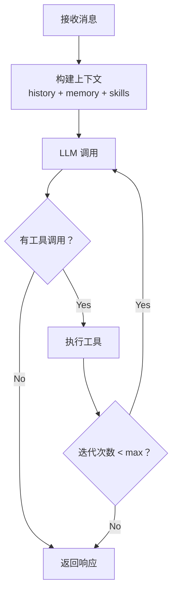

# nanobot TypeScript 复写规划

## 项目概述

**目标：** 在 niuma 项目中使用 TypeScript 复写 nanobot（https://github.com/HKUDS/nanobot）

**nanobot 特点：**
- 超轻量级 AI 助手（核心代码约 3500 行）
- 支持多渠道接入（Telegram, Discord, WhatsApp, 飞书, 钉钉, Slack, Email, QQ 等）
- MCP 协议支持
- 双层记忆系统（MEMORY.md + HISTORY.md）
- 技能系统（SKILL.md）
- 定时任务与心跳

---

## 技术栈对照

| 功能 | Python (nanobot) | TypeScript (niuma) |
|------|------------------|-------------------|
| CLI 框架 | Click/Typer | cac |
| LLM 调用 | LiteLLM | langchain / @langchain/openai |
| 类型验证 | Pydantic | zod |
| 数据库 | SQLite | better-sqlite3 |
| 向量存储 | sqlite-vec | sqlite-vec |
| 异步 | asyncio | Promise/async-await |
| 日志 | loguru | pino |
| 配置格式 | JSON | JSON |

---

## 项目结构

```
niuma/
├── src/
│   ├── agent/                # 🧠 核心智能体逻辑
│   │   ├── loop.ts           #    Agent 循环（LLM ↔ 工具执行）
│   │   ├── context.ts        #    Prompt 构建器
│   │   ├── memory.ts         #    持久化记忆
│   │   ├── skills.ts         #    技能加载器
│   │   ├── subagent.ts       #    后台任务执行
│   │   └── tools/            #    内置工具
│   │       ├── base.ts       #      工具基类
│   │       ├── registry.ts   #      工具注册表
│   │       ├── filesystem.ts #      文件操作（read/write/edit/list）
│   │       ├── shell.ts      #      Shell 命令执行
│   │       ├── web.ts        #      Web 搜索与抓取
│   │       ├── message.ts    #      消息发送
│   │       ├── spawn.ts      #      子智能体创建
│   │       └── cron.ts       #      定时任务
│   ├── providers/            # 🤖 LLM 提供商
│   │   ├── base.ts           #    提供商抽象基类
│   │   ├── registry.ts       #    提供商注册表
│   │   ├── openai.ts         #    OpenAI
│   │   ├── anthropic.ts      #    Anthropic/Claude
│   │   ├── openrouter.ts     #    OpenRouter 网关
│   │   ├── deepseek.ts       #    DeepSeek
│   │   └── custom.ts         #    自定义 OpenAI 兼容端点
│   ├── channels/             # 📱 多渠道接入
│   │   ├── base.ts           #    渠道基类
│   │   ├── cli.ts            #    命令行
│   │   ├── telegram.ts       #    Telegram
│   │   ├── discord.ts        #    Discord
│   │   ├── feishu.ts         #    飞书
│   │   ├── dingtalk.ts       #    钉钉
│   │   ├── slack.ts          #    Slack
│   │   ├── whatsapp.ts       #    WhatsApp
│   │   ├── email.ts          #    Email
│   │   └── qq.ts             #    QQ
│   ├── bus/                  # 🚌 消息路由
│   │   ├── events.ts         #    事件定义
│   │   └── queue.ts          #    异步消息队列
│   ├── session/              # 💬 会话管理
│   │   └── manager.ts        #    会话状态、历史记录
│   ├── cron/                 # ⏰ 定时任务
│   │   ├── service.ts        #    Cron 调度服务
│   │   └── types.ts          #    类型定义
│   ├── heartbeat/            # 💓 主动唤醒
│   │   └── service.ts        #    周期性任务检查
│   ├── config/               # ⚙️ 配置管理
│   │   ├── schema.ts         #    配置 Schema 定义
│   │   └── loader.ts         #    配置加载与验证
│   ├── types/                # 📝 类型定义
│   │   └── index.ts          #    核心类型
│   ├── utils/                # 🔧 工具函数
│   │   └── helpers.ts        #    通用辅助函数
│   ├── cli/                  # 🖥️ 命令行接口
│   │   └── commands.ts       #    CLI 命令
│   └── index.ts              #    入口文件
├── skills/                   # 🎯 内置技能
│   ├── github/SKILL.md
│   ├── weather/SKILL.md
│   └── skill-creator/SKILL.md
├── templates/                # 📄 模板文件
│   ├── AGENTS.md
│   ├── SOUL.md
│   ├── USER.md
│   ├── TOOLS.md
│   └── memory/MEMORY.md
├── package.json
├── tsconfig.json
└── README.md
```

---

## 分阶段实施计划

### Phase 1: 核心基础设施

**目标：** 搭建项目骨架，实现核心类型和配置系统

| 模块 | 文件 | 核心功能 | 对标 Python |
|------|------|----------|-------------|
| 类型定义 | `types/index.ts` | Message, Tool, Provider 等核心类型 | - |
| 配置 Schema | `config/schema.ts` | 使用 zod 定义配置结构 | `config/schema.py` |
| 配置加载 | `config/loader.ts` | 配置文件读取、验证、合并 | `config/loader.py` |
| 工具基类 | `agent/tools/base.ts` | Tool 抽象类、参数验证 | `agent/tools/base.py` |
| 工具注册 | `agent/tools/registry.ts` | 工具注册、执行、Schema 生成 | `agent/tools/registry.py` |
| 事件定义 | `bus/events.ts` | InboundMessage, OutboundMessage | `bus/events.py` |
| 消息队列 | `bus/queue.ts` | AsyncQueue 实现 | `bus/queue.py` |

**关键实现：**

```typescript
// types/index.ts - 核心类型
export interface InboundMessage {
  channel: string;
  senderId: string;
  chatId: string;
  content: string;
  media?: string[];
  metadata?: Record<string, unknown>;
  sessionKey: string;
}

export interface OutboundMessage {
  channel: string;
  chatId: string;
  content: string;
  metadata?: Record<string, unknown>;
}

export interface ToolCall {
  id: string;
  name: string;
  arguments: Record<string, unknown>;
}

export interface LLMResponse {
  content: string | null;
  toolCalls: ToolCall[];
  hasToolCalls: boolean;
  reasoningContent?: string;
}
```

---

### Phase 2: Agent 核心

**目标：** 实现智能体核心循环

| 模块 | 文件 | 核心功能 | 对标 Python |
|------|------|----------|-------------|
| 上下文构建 | `agent/context.ts` | System Prompt 构建、消息组装 | `agent/context.py` |
| 记忆系统 | `agent/memory.ts` | 双层记忆、自动整合 | `agent/memory.py` |
| 技能系统 | `agent/skills.ts` | SKILL.md 加载、依赖检查 | `agent/skills.py` |
| Agent 循环 | `agent/loop.ts` | LLM 调用 ↔ 工具执行循环 | `agent/loop.py` |
| 子智能体 | `agent/subagent.ts` | 后台任务执行、结果通知 | `agent/subagent.py` |

**Agent Loop 核心流程：**



---

### Phase 3: 内置工具

**目标：** 实现所有内置工具

| 工具 | 文件 | 功能 | 安全考虑 |
|------|------|------|----------|
| read_file | `agent/tools/filesystem.ts` | 读取文件 | 路径验证、工作区限制 |
| write_file | `agent/tools/filesystem.ts` | 写入文件 | 路径验证、自动创建目录 |
| edit_file | `agent/tools/filesystem.ts` | 编辑文件 | 差异提示、唯一性检查 |
| list_dir | `agent/tools/filesystem.ts` | 列出目录 | 路径验证 |
| exec | `agent/tools/shell.ts` | 执行命令 | 危险命令黑名单、超时、工作区限制 |
| web_search | `agent/tools/web.ts` | Brave 搜索 | API Key 管理 |
| web_fetch | `agent/tools/web.ts` | 网页抓取 | 超时、大小限制 |
| message | `agent/tools/message.ts` | 发送消息 | 渠道路由 |
| spawn | `agent/tools/spawn.ts` | 创建子智能体 | 资源限制 |
| cron | `agent/tools/cron.ts` | 定时任务 | 调度管理 |

**Shell 工具安全防护：**

```typescript
const DENY_PATTERNS = [
  /\brm\s+-[rf]{1,2}\b/,           // rm -r, rm -rf
  /\bdel\s+/[fq]\b/,               // del /f, del /q
  /\brmdir\s+/s\b/,                // rmdir /s
  /\b(shutdown|reboot|poweroff)\b/, // 系统电源
  /:\(\)\s*\{.*\};\s*:/,           // fork bomb
];
```

---

### Phase 4: LLM 提供商

**目标：** 实现多 LLM 提供商支持

| 模块 | 文件 | 功能 |
|------|------|------|
| 提供商注册 | `providers/registry.ts` | 两步式注册、智能匹配 |
| 基础提供商 | `providers/base.ts` | 抽象接口、通用方法 |
| OpenAI | `providers/openai.ts` | GPT 系列模型 |
| Anthropic | `providers/anthropic.ts` | Claude 系列模型 |
| OpenRouter | `providers/openrouter.ts` | 多模型网关 |
| DeepSeek | `providers/deepseek.ts` | DeepSeek API |
| 自定义 | `providers/custom.ts` | OpenAI 兼容端点 |

**提供商注册表设计：**

```typescript
interface ProviderSpec {
  name: string;                    // 配置字段名
  keywords: string[];              // 模型名关键词匹配
  envKey: string;                  // 环境变量名
  displayName: string;             // 显示名称
  litellmPrefix?: string;          // 模型前缀
  isGateway?: boolean;             // 是否为网关
  detectByKeyPrefix?: string;      // API Key 前缀检测
  defaultApiBase?: string;         // 默认 API Base
}

// 匹配顺序：
// 1. 显式前缀 (provider/model)
// 2. 关键词匹配
// 3. 网关回退
```

---

### Phase 5: 会话与消息路由

**目标：** 实现会话管理和消息路由

| 模块 | 文件 | 功能 |
|------|------|------|
| 事件总线 | `bus/event.ts` | 模块间事件通信 |
| 消息队列 | `bus/queue.ts` | 异步消息处理 |
| 会话管理 | `session/manager.ts` | 会话状态、历史记录、持久化 |

**会话数据结构：**

```typescript
interface Session {
  key: string;
  messages: SessionMessage[];
  lastConsolidated: number;
  createdAt: Date;
  updatedAt: Date;
}

interface SessionMessage {
  role: 'user' | 'assistant' | 'system';
  content: string;
  timestamp: string;
  toolsUsed?: string[];
}
```

---

### Phase 6: 多渠道接入

**目标：** 实现多平台消息接入（按需实现）

| 渠道 | 难度 | 协议 | 说明 |
|------|------|------|------|
| CLI | 简单 | stdin/stdout | 优先实现 |
| Telegram | 简单 | HTTP Bot API | Bot token |
| Discord | 简单 | WebSocket Gateway | Bot token + intents |
| 飞书 | 中等 | WebSocket 长连接 | App ID + Secret |
| 钉钉 | 中等 | Stream Mode | App Key + Secret |
| Slack | 中等 | Socket Mode | Bot + App Token |
| WhatsApp | 中等 | WebSocket Bridge | QR 扫码 |
| Email | 中等 | IMAP/SMTP | 账号凭证 |
| QQ | 简单 | WebSocket | App ID + Secret |

---

### Phase 7: 定时任务与心跳

**目标：** 实现周期性任务支持

| 模块 | 文件 | 功能 |
|------|------|------|
| 定时服务 | `cron/service.ts` | Cron 表达式调度 |
| 心跳服务 | `heartbeat/service.ts` | HEARTBEAT.md 检查 |

**心跳机制：**
- 每 30 分钟检查 `HEARTBEAT.md`
- 执行标记的任务
- 通过最近活跃渠道发送结果

---

### Phase 8: CLI 命令

**目标：** 完善命令行体验

| 命令 | 功能 |
|------|------|
| `niuma onboard` | 初始化配置和工作区 |
| `niuma agent -m "..."` | 单次对话 |
| `niuma agent` | 交互模式 |
| `niuma gateway` | 启动网关服务 |
| `niuma status` | 显示状态 |
| `niuma cron add/list/remove` | 定时任务管理 |
| `niuma provider login <name>` | OAuth 登录 |

---

## 依赖包

```json
{
  "dependencies": {
    "@langchain/openai": "^0.3.0",
    "@langchain/anthropic": "^0.3.0",
    "better-sqlite3": "^12.0.0",
    "cac": "^6.7.0",
    "chalk": "^5.0.0",
    "node-cron": "^3.0.0",
    "node-fetch": "^3.0.0",
    "ora": "^8.0.0",
    "pino": "^9.0.0",
    "zod": "^3.0.0"
  },
  "devDependencies": {
    "@types/better-sqlite3": "^7.6.0",
    "@types/node": "^22.0.0",
    "@types/node-cron": "^3.0.0",
    "tsx": "^4.0.0",
    "typescript": "^5.0.0",
    "vitest": "^2.0.0"
  }
}
```

---

## 开发规范

### 代码风格
- 使用 ESLint + Prettier
- TypeScript 严格模式
- ES Module

### 提交规范
- 遵循 Conventional Commits
- 格式：`type(scope): description`

### 分支策略
- `main` - 主分支
- `feat/*` - 功能分支

---

## 参考资源

- [nanobot 源码](https://github.com/HKUDS/nanobot)
- [LangChain.js 文档](https://js.langchain.com/)
- [MCP 协议](https://modelcontextprotocol.io/)
- [OpenAI API](https://platform.openai.com/docs)
- [Anthropic API](https://docs.anthropic.com/)

---

> 本文档由 iFlow CLI 生成，用于指导 TypeScript 版 nanobot 复写工作。
