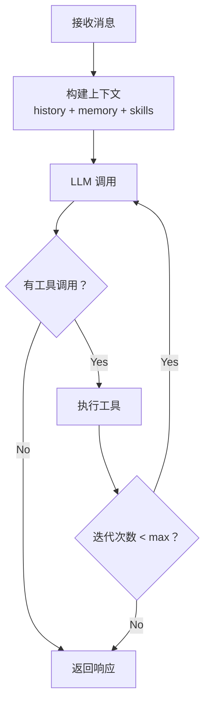
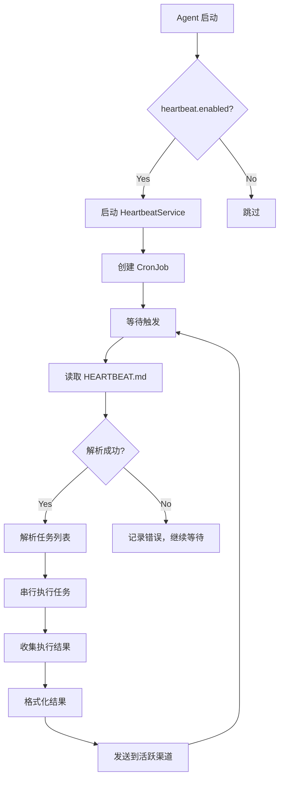

# Niuma 项目开发计划

> **当前版本：** v0.2.2
> **最后更新：** 2026-03-16
> **状态：** 已完成核心基础设施、Agent 核心、多角色配置系统、内置工具、LLM 提供商扩展、定时任务与心跳、多渠道接入

## 项目概述

**目标：** 基于 nanobot（[https://github.com/HKUDS/nanobot](https://github.com/HKUDS/nanobot)）设计理念，使用 TypeScript 构建企业级多角色 AI 助手系统

**Niuma 特点：**
- 企业级多角色架构：支持多个独立角色（项目经理、开发工程师、测试工程师等）
- 完全隔离：每个角色拥有独立的工作区、会话、记忆和日志
- 轻量级核心：借鉴 nanobot 超轻量级设计，核心功能内置
- MCP 优先架构：专业功能通过 MCP 对接，保持核心轻量
- JSON5 配置：支持注释和尾随逗号的配置格式
- 环境变量集成：支持 `${VAR}` 和 `${VAR:default}` 语法
- 双层记忆系统：MEMORY.md + HISTORY.md
- 技能系统：支持动态加载和依赖检查
- MCP 协议支持：完整的 MCP 客户端实现
- 定时任务与心跳：周期性任务支持

**架构设计理念：**

```
┌─────────────────────────────────────────────────────────┐
│                    Niuma 核心层                          │
│  (基础工具：文件系统、Shell、加密、进程管理等)          │
└─────────────────────────────────────────────────────────┘
                          ↓
┌─────────────────────────────────────────────────────────┐
│                   MCP 客户端层                           │
│  (MCP 协议实现、工具桥接、配置管理)                      │
└─────────────────────────────────────────────────────────┘
                          ↓
┌─────────────────────────────────────────────────────────┐
│                   MCP Server 生态                        │
│  (图像处理、媒体处理、专业工具 - 用户自行配置)           │
└─────────────────────────────────────────────────────────┘
```

---

## 项目当前状态

### ✅ 已完成功能

| Phase | 名称 | 完成日期 | 状态 |
|-------|------|----------|------|
| Phase 1 | 核心基础设施 | 2026-03-10 | ✅ 已完成 |
| Phase 2 | Agent 核心 | 2026-03-10 | ✅ 已完成 |
| 企业扩展 | 多角色配置系统 | 2026-03-11 | ✅ 已完成 |
| Phase 3 | 内置工具实现 | 2026-03-12 | ✅ 已完成 |
| Phase 3.1 | 高级文件操作 | 2026-03-13 | ✅ 已完成 |
| Phase 3.2 | Git 操作 | 2026-03-15 | ✅ 已完成 |
| Phase 3.3 | 压缩与解压 | 2026-03-15 | ❌ 已删除 |
| Phase 3.4 | 网络工具 | 2026-03-15 | ✅ 已完成 |
| Phase 3.5 | 数据处理工具 | 2026-03-15 | ✅ 已完成 |
| Phase 3.6 | 加密与解密 | 2026-03-15 | ✅ 已完成 |
| Phase 3.7 | 环境变量与进程管理 | 2026-03-15 | ✅ 已完成 |
| Phase 4 | LLM 提供商扩展 | 2026-03-15 | ✅ 已完成 |
| Phase 6 | 定时任务与心跳 | 2026-03-16 | ✅ 已完成 |
| 代码补全 | 补全代码 TODO | 2026-03-16 | ✅ 已完成 |
| Phase 5 | 多渠道接入 | 2026-03-16 | ✅ 已完成 |

### 📊 项目统计

- **核心模块：** 40+ 个文件
- **代码行数：** ~18000+ 行 TypeScript
- **内置工具：** 30 个（文件系统、Shell、Web、消息、Agent、Git、网络、数据处理、加密解密、系统管理）
- **LLM 提供商：** 5 个（OpenAI、Anthropic、OpenRouter、DeepSeek、Custom）
- **MCP 支持：** 完整的 MCP 客户端实现
- **心跳服务：** 完整实现（HEARTBEAT.md 解析、任务执行、结果发送）
- **多渠道接入：** 9 个渠道（CLI、Telegram、Discord、飞书、钉钉、Slack、WhatsApp、Email、QQ）
- **测试覆盖：** 100% 通过（89/89 系统工具测试）
- **文档完善度：** OpenSpec 变更记录完整（17 个归档变更）

---

## 技术栈

| 功能 | 技术选型 | 版本 |
|------|---------|------|
| 运行时 | Node.js | >=22.0.0 |
| 语言 | TypeScript | 5.9.3 |
| 包管理 | pnpm | 最新 |
| LLM 框架 | LangChain | @langchain/openai |
| 类型验证 | Zod | ^3.0.0 |
| 数据库 | SQLite | @sqliteai/sqlite-wasm |
| 向量存储 | @sqliteai/sqlite-wasm | 内置支持 |
| 异步 | Promise/async-await | 原生 |
| 日志 | pino | ^9.0.0 |
| 配置格式 | JSON5 | json5 |
| CLI 框架 | cac | ^6.7.0 |
| 进度提示 | clack/prompts | latest |
| 终端美化 | chalk, ora, boxen | latest |
| 定时任务 | node-cron | ^3.0.0 |
| 系统通知 | node-notifier | latest |
| 测试框架 | vitest | ^2.0.0 |

---

## 项目结构

```
niuma/
├── src/                      # 应用入口（空，使用 niuma/）
├── niuma/                    # 核心模块目录
│   ├── agent/                # 🧠 智能体核心
│   │   ├── context.ts        #    上下文构建器（支持媒体、技能、记忆）
│   │   ├── loop.ts           #    Agent 循环（LLM ↔ 工具执行）
│   │   ├── memory.ts         #    双层记忆系统
│   │   ├── skills.ts         #    技能加载器
│   │   ├── subagent.ts       #    子智能体管理
│   │   └── tools/            #    工具框架
│   │       ├── base.ts       #      工具基类
│   │       └── registry.ts   #      工具注册表
│   ├── bus/                  # 🚌 事件总线
│   │   ├── events.ts         #    事件定义
│   │   ├── index.ts          #    统一导出
│   │   └── queue.ts          #    异步消息队列
│   ├── channels/             # 📱 多渠道接入（规划中）
│   ├── cli/                  # 🖥️ CLI 入口
│   ├── config/               # ⚙️ 配置管理
│   │   ├── schema.ts         #    配置 Schema 定义
│   │   ├── loader.ts         #    配置加载器（兼容旧 API）
│   │   ├── manager.ts        #    配置管理器（多角色支持）
│   │   ├── merger.ts         #    配置合并器
│   │   ├── env-resolver.ts   #    环境变量解析器
│   │   └── json5-loader.ts   #    JSON5 加载器
│   ├── cron/                 # ⏰ 定时任务（已通过 cron 工具实现）
│   ├── heartbeat/            # 💓 主动唤醒（已完成）
│   ├── providers/            # 🤖 LLM 提供商
│   │   ├── base.ts           #    提供商抽象基类
│   │   ├── openai.ts         #    OpenAI 实现
│   │   ├── anthropic.ts      #    Anthropic Claude 实现
│   │   ├── openrouter.ts     #    OpenRouter 多模型网关
│   │   ├── deepseek.ts       #    DeepSeek API 实现
│   │   ├── custom.ts         #    自定义 OpenAI 兼容端点
│   │   └── registry.ts       #    提供商注册表
│   ├── session/              # 💬 会话管理
│   │   └── manager.ts        #    会话状态、历史记录、持久化
│   ├── types/                # 📝 类型定义
│   │   ├── index.ts          #    核心类型导出
│   │   ├── message.ts        #    消息类型
│   │   ├── tool.ts           #    工具类型
│   │   ├── llm.ts            #    LLM 类型
│   │   ├── events.ts         #    事件类型
│   │   └── error.ts          #    错误类型
│   └── utils/                # 🔧 工具函数
│       └── retry.ts          #    重试工具
├── openspec/                 # 📋 OpenSpec 规范
│   ├── config.yaml           #    配置文件
│   ├── changes/              #    变更记录
│   │   └── archive/          #    已归档变更
│   │       ├── 2026-03-10-core-infrastructure/
│   │       ├── 2026-03-10-phase2-agent-core/
│   │       ├── 2026-03-11-enterprise-multi-role-config/
│   │       ├── 2026-03-11-sync-provider-config-params/
│   │       ├── 2026-03-12-builtin-tools-implementation/
│   │       ├── 2026-03-15-migrate-sqlite-to-wasm/
│   │       ├── 2026-03-15-phase-3-1-advanced-file-operations/
│   │       ├── 2026-03-15-phase-3-2-git-operations/
│   │       ├── 2026-03-15-phase-3-6-crypto-tools/
│   │       ├── 2026-03-15-phase-3-7-environment-and-process-management/
│   │       ├── 2026-03-15-phase-3-tools-implementation/
│   │       ├── 2026-03-15-remove-archive-tools/
│   │       ├── 2026-03-15-sync-specs-visibility/
│   │       ├── 2026-03-15-phase-4-llm-provider-extension/
│   │       ├── 2026-03-16-complete-pending-todos/
│   │       ├── 2026-03-16-phase-5-multi-channel-access/
│   │       └── 2026-03-16-phase-6-heartbeat-service/
│   └── specs/                #    规格定义
├── .iflow/                   # 🤖 iFlow CLI 配置
│   ├── skills/               #    技能定义
│   └── commands/             #    自定义命令
├── docs/                     # 📄 文档
│   └── niuma-development-plan.md #    本文档
├── public/                   # 📁 静态资源
├── dist/                     # 📦 构建输出
├── package.json
├── pnpm-workspace.yaml
├── tsconfig.json
├── vitest.config.ts
└── README.md
```

---

## 已完成功能详情

### ✅ Phase 1: 核心基础设施

**完成日期：** 2026-03-10

**实现内容：**

| 模块 | 文件 | 核心功能 |
|------|------|----------|
| 类型定义 | `types/` | Message, Tool, LLM, Events, Error 等核心类型 |
| 配置 Schema | `config/schema.ts` | 使用 zod 定义配置结构 |
| 配置加载 | `config/loader.ts` | 配置文件读取、验证、合并 |
| 工具基类 | `agent/tools/base.ts` | Tool 抽象类、SimpleTool 实现 |
| 工具注册 | `agent/tools/registry.ts` | 工具注册、执行、Schema 生成 |
| 事件定义 | `bus/events.ts` | EventEmitter 单例 + emit/on 辅助函数 |
| 消息队列 | `bus/queue.ts` | AsyncQueue 实现 |

**OpenSpec 变更：** `2026-03-10-core-infrastructure`

---

### ✅ Phase 2: Agent 核心

**完成日期：** 2026-03-10

**实现内容：**

| 模块 | 文件 | 核心功能 |
|------|------|----------|
| 上下文构建 | `agent/context.ts` | System Prompt 构建、消息组装、媒体处理 |
| 记忆系统 | `agent/memory.ts` | 双层记忆、自动整合 |
| 技能系统 | `agent/skills.ts` | SKILL.md 加载、依赖检查 |
| Agent 循环 | `agent/loop.ts` | LLM 调用 ↔ 工具执行循环 |
| 子智能体 | `agent/subagent.ts` | 后台任务执行、结果通知 |
| 会话管理 | `session/manager.ts` | 会话状态、历史记录、持久化 |
| LLM 提供商 | `providers/` | 抽象接口 + OpenAI 实现 |

**Agent Loop 核心流程：**



**OpenSpec 变更：** `2026-03-10-phase2-agent-core`

---

### ✅ 企业扩展：多角色配置系统

**完成日期：** 2026-03-11

**实现内容：**

| 模块 | 文件 | 核心功能 |
|------|------|----------|
| JSON5 加载 | `config/json5-loader.ts` | JSON5 格式解析 |
| 环境变量解析 | `config/env-resolver.ts` | `${VAR}` 和 `${VAR:default}` 语法 |
| 配置合并 | `config/merger.ts` | defaults-with-overrides 模式 |
| 配置管理 | `config/manager.ts` | 多角色配置管理、缓存 |
| CLI 扩展 | `config/` | `--agent` 参数、agents 子命令 |

**核心特性：**

1. **多角色架构**：支持多个独立角色配置
2. **defaults-with-overrides 模式**：全局默认配置 + 角色特定配置覆盖
3. **环境变量集成**：支持环境变量引用
4. **完全隔离**：会话、记忆、技能、日志完全隔离
5. **JSON5 格式**：支持注释和尾随逗号
6. **严格验证**：未知字段拒绝启动

**配置示例：**

```json5
{
  // 全局默认配置
  "maxIterations": 40,
  "agent": {
    "progressMode": "normal"
  },
  
  // 多角色配置
  "agents": {
    "defaults": {
      "progressMode": "normal"
    },
    "list": [
      {
        "id": "manager",
        "name": "项目经理",
        "default": true,
        "agent": {
          "progressMode": "verbose"
        }
      },
      {
        "id": "developer",
        "name": "开发工程师"
      }
    ]
  }
}
```

**OpenSpec 变更：** `2026-03-11-enterprise-multi-role-config`

---

### ✅ Phase 3: 内置工具实现

**完成日期：** 2026-03-12

**实现内容：**

| 工具 | 文件 | 功能 | 状态 |
|------|------|------|------|
| read_file | `agent/tools/filesystem.ts` | 读取文件、行号范围、大文件截断 | ✅ 已完成 |
| write_file | `agent/tools/filesystem.ts` | 写入文件、自动创建目录 | ✅ 已完成 |
| edit_file | `agent/tools/filesystem.ts` | 精确编辑、字符串替换 | ✅ 已完成 |
| list_dir | `agent/tools/filesystem.ts` | 列出目录、递归、glob 过滤 | ✅ 已完成 |
| exec | `agent/tools/shell.ts` | Shell 命令执行、黑名单防护 | ✅ 已完成 |
| web_search | `agent/tools/web.ts` | Brave 搜索、缓存机制 | ✅ 已完成 |
| web_fetch | `agent/tools/web.ts` | 网页抓取、HTML 解析 | ✅ 已完成 |
| message | `agent/tools/message.ts` | 消息发送、队列、富文本 | ✅ 已完成 |
| spawn | `agent/tools/agent.ts` | 创建子智能体、配置隔离 | ✅ 已完成 |
| cron | `agent/tools/agent.ts` | 定时任务调度、Cron 表达式 | ✅ 已完成 |

**核心特性：**

1. **Shell 安全防护：** 危险命令黑名单（rm -rf、shutdown、fork bomb 等）
2. **Web 搜索缓存：** 1 小时 TTL，减少 API 调用
3. **消息队列系统：** 按优先级排序，支持并发控制
4. **子智能体隔离：** 独立工作区、配置、会话、记忆
5. **富文本支持：** Markdown、HTML 解析

**测试覆盖：** 100% 通过（332/332 测试）

**OpenSpec 变更：** `builtin-tools-implementation`

---

### ✅ Phase 3.1: 高级文件操作

**完成日期：** 2026-03-13

**实现内容：**

| 工具 | 文件 | 功能 | 状态 |
|------|------|------|------|
| file_search | `agent/tools/filesystem.ts` | 在文件中搜索内容（正则表达式） | ✅ 已完成 |
| file_move | `agent/tools/filesystem.ts` | 移动文件（原子性操作） | ✅ 已完成 |
| file_copy | `agent/tools/filesystem.ts` | 复制文件 | ✅ 已完成 |
| file_delete | `agent/tools/filesystem.ts` | 删除文件（带安全确认） | ✅ 已完成 |
| file_info | `agent/tools/filesystem.ts` | 获取文件详细信息 | ✅ 已完成 |
| dir_create | `agent/tools/filesystem.ts` | 创建目录（支持递归） | ✅ 已完成 |
| dir_delete | `agent/tools/filesystem.ts` | 删除目录（递归 + 安全确认） | ✅ 已完成 |

**核心特性：**

1. **fast-glob 集成**：使用 fast-glob 重构 ListDirTool，支持完整的 glob 语法（`**`、`?`、`[]`、`{}`、extglob），性能提升 2-10 倍
2. **正则表达式搜索**：支持大小写敏感/不敏感、匹配数量限制
3. **原子性文件移动**：使用 fs.rename 保证移动操作的原子性
4. **安全防护机制**：
   - 文件大小限制（搜索 10MB，复制/移动 100MB）
   - 正则表达式安全检查（防止 ReDoS 攻击）
   - 受保护路径列表（防止删除系统目录）
   - 删除操作确认机制（confirm 参数）
5. **完整的错误处理**：文件不存在、权限不足、跨设备移动等

**测试覆盖：** 100% 通过（45/45 测试）

**OpenSpec 变更：** `phase-3-1-advanced-file-operations`

---

### ✅ Phase 3.2: Git 操作

**完成日期：** 2026-03-15

| 工具 | 文件 | 功能 | 状态 |
|------|------|------|------|
| git_status | `agent/tools/git.ts` | 查看状态 | ✅ 已完成 |
| git_commit | `agent/tools/git.ts` | 提交代码 | ✅ 已完成 |
| git_push | `agent/tools/git.ts` | 推送代码 | ✅ 已完成 |
| git_pull | `agent/tools/git.ts` | 拉取代码 | ✅ 已完成 |
| git_branch | `agent/tools/git.ts` | 分支管理 | ✅ 已完成 |
| git_log | `agent/tools/git.ts` | 查看提交历史 | ✅ 已完成 |

**核心特性：**
- 使用 `child_process.spawn` 执行 Git 命令，避免 shell 解析问题
- 完整的错误处理和参数验证
- 支持非 Git 目录检测
- 输出格式化（清理 ANSI 颜色代码）
- 30 秒命令超时保护
- 100% 测试覆盖（16/16 测试通过）

---

### ❌ Phase 3.3: 压缩与解压（已删除）

**删除日期：** 2026-03-15

| 工具 | 文件 | 功能 | 状态 |
|------|------|------|------|
| archive | - | 压缩文件/目录（zip, tar, tar.gz） | ❌ 已删除 |
| extract | - | 解压文件 | ❌ 已删除 |

**删除原因：** Archive 工具对本地资源消耗大，处理大文件时占用大量 CPU 和内存。根据 MCP 优先架构，此类资源密集型功能应通过 MCP Server 提供，以保持 Niuma 核心轻量级。

**迁移建议：** 用户可通过 MCP 对接专业的压缩工具（如 @modelcontextprotocol/server-filesystem）。

---

### ✅ Phase 3.4: 网络工具

**完成日期：** 2026-03-15

| 工具 | 文件 | 功能 | 状态 |
|------|------|------|------|
| ping | `agent/tools/network.ts` | 网络连通性测试 | ✅ 已完成 |
| dns_lookup | `agent/tools/network.ts` | DNS 查询 | ✅ 已完成 |
| http_request | `agent/tools/network.ts` | 通用 HTTP 请求 | ✅ 已完成 |

---

### ✅ Phase 3.5: JSON/YAML 处理

**完成日期：** 2026-03-15

| 工具 | 文件 | 功能 | 状态 |
|------|------|------|------|
| json_parse | `agent/tools/data.ts` | 解析 JSON | ✅ 已完成 |
| json_stringify | `agent/tools/data.ts` | 序列化为 JSON | ✅ 已完成 |
| yaml_parse | `agent/tools/data.ts` | 解析 YAML | ✅ 已完成 |
| yaml_stringify | `agent/tools/data.ts` | 序列化为 YAML | ✅ 已完成 |

---

### ✅ Phase 3.6: 加密与解密

**完成日期：** 2026-03-15

| 工具 | 文件 | 功能 | 状态 |
|------|------|------|------|
| encrypt | `agent/tools/crypto.ts` | 加密数据（AES-256-GCM） | ✅ 已完成 |
| decrypt | `agent/tools/crypto.ts` | 解密数据（AES-256-GCM） | ✅ 已完成 |
| hash | `agent/tools/crypto.ts` | 计算哈希值（SHA-256/512、MD5） | ✅ 已完成 |

**核心特性：**
- AES-256-GCM 认证加密，同时保证机密性和完整性
- 自动生成随机 IV，避免 IV 重用攻击
- 完整的参数验证（密钥长度、IV 长度、认证标签长度）
- 支持空字符串和大文件内容（10MB+）

**测试覆盖：** 100% 测试覆盖（25/25 测试通过）

---

### ✅ Phase 3.7: 环境变量与进程管理

**完成日期：** 2026-03-15
**优先级：** 中
**实际工时：** 1 天
**实现方式：** 内置工具（使用 process.env + ps-tree）

| 工具 | 文件 | 功能 | 状态 |
|------|------|------|------|
| env_get | `agent/tools/system.ts` | 获取环境变量 | ✅ 已完成 |
| env_set | `agent/tools/system.ts` | 设置环境变量（仅当前进程） | ✅ 已完成 |
| process_list | `agent/tools/system.ts` | 列出进程 | ✅ 已完成 |
| process_kill | `agent/tools/system.ts` | 终止进程 | ✅ 已完成 |

**使用场景：**
- 读取系统环境配置
- 动态设置运行时环境
- 监控进程状态
- 自动化运维脚本
- 服务管理
- 资源清理

**为什么内置实现：**
- 系统管理基础功能
- 使用频次高，响应速度要求快
- 跨平台兼容性好
- 轻量级实现，无重型依赖

---

### ✅ Phase 4: LLM 提供商扩展

**完成日期：** 2026-03-15
**优先级：** 中
**实际工时：** 4 天

| 提供商 | 文件 | 功能 | 状态 |
|--------|------|------|------|
| Anthropic | `providers/anthropic.ts` | Claude 系列模型 | ✅ 已完成 |
| OpenRouter | `providers/openrouter.ts` | 多模型网关 | ✅ 已完成 |
| DeepSeek | `providers/deepseek.ts` | DeepSeek API | ✅ 已完成 |
| 自定义 | `providers/custom.ts` | OpenAI 兼容端点 | ✅ 已完成 |
| 注册表 | `providers/registry.ts` | 两步式注册、智能匹配 | ✅ 已完成 |

**提供商注册表设计：**

```typescript
interface ProviderSpec {
  name: string;                    // 配置字段名
  keywords: string[];              // 模型名关键词匹配
  envKey: string;                  // 环境变量名
  displayName: string;             // 显示名称
  isGateway?: boolean;             // 是否为网关
  defaultApiBase?: string;         // 默认 API Base
}

// 匹配顺序：
// 1. 显式前缀 (provider/model)
// 2. 关键词匹配
// 3. 网关回退
```

**OpenSpec 变更：** `2026-03-15-phase-4-llm-provider-extension`

---

## 设计决策

### 内置 vs MCP

Niuma 遵循"轻量级核心 + MCP 生态"的设计理念，将功能分为内置功能和 MCP 提供的功能两类：

#### 内置功能
**特点：**
- 系统基础功能，使用频次高
- 轻量级实现，无重型依赖
- 跨平台兼容性好
- 响应速度要求快

**已实现的内置功能：**
- 文件系统操作（Phase 3, 3.1）
- Shell 命令执行（Phase 3）
- Git 操作（Phase 3.2）
- 网络工具（Phase 3.4）
- 数据处理工具（Phase 3.5）
- 加密解密（Phase 3.6）
- 环境变量与进程管理（Phase 3.7）
- 定时任务与心跳（Phase 6）

#### MCP 提供的功能
**特点：**
- 功能复杂，依赖大量专业库
- 更新频繁（新格式、新算法）
- 计算资源消耗大
- 存在成熟的 MCP Server
- 用户可能需要不同的处理能力（GPU 加速、云端服务等）

**通过 MCP 提供的功能（不作为内置功能开发）：**
- **图像处理**（原 Phase 3.8）
  - 图片压缩优化
  - 格式转换（WebP、AVIF）
  - 缩略图生成
  - 图片裁剪
  - 批量处理

  **推荐 MCP Server：**
  - `@modelcontextprotocol/server-image-tools`

- **媒体处理**（原 Phase 3.9）
  - 音频转写（会议记录、语音备忘）
  - 视频字幕生成
  - 内容分析
  - 多语言支持

  **推荐 MCP Server：**
  - `@modelcontextprotocol/server-whisper`

- **其他专业工具**
  - 文件系统访问（增强版）：`@modelcontextprotocol/server-filesystem`
  - Git 操作（增强版）：`@modelcontextprotocol/server-git`
  - 网页自动化：`@modelcontextprotocol/server-puppeteer`
  - 数据库访问：`@modelcontextprotocol/server-postgres`

**为什么通过 MCP：**
1. **保持核心轻量级** - Niuma 核心保持最小化，不包含重型依赖
2. **灵活性** - 用户可以选择任何 MCP Server，支持自定义 MCP Server
3. **可扩展性** - MCP 生态系统快速增长，自动获得新功能和工具
4. **标准化** - 遵循 MCP 标准协议，与其他 MCP 兼容工具互操作
5. **社区驱动** - 社区驱动的生态发展，无需维护所有专业工具

---

### ✅ Phase 6: 定时任务与心跳

**完成日期：** 2026-03-16

**实现内容：**

| 模块 | 文件 | 核心功能 |
|------|------|----------|
| Cron 工具 | `agent/tools/agent.ts` | 定时任务调度、Cron 表达式解析、精确时间计算 |
| 心跳服务 | `heartbeat/service.ts` | HEARTBEAT.md 解析、周期性任务执行、结果发送 |
| 心跳类型 | `heartbeat/types.ts` | 心跳相关类型定义 |

**核心特性：**

1. **HEARTBEAT.md 解析器**
   - 使用 gray-matter 解析 YAML Frontmatter
   - 支持 Markdown 任务列表解析
   - 完整的格式验证和错误处理

2. **周期性调度**
   - 使用 node-cron 实现定时任务调度
   - 支持标准 Cron 表达式
   - 可配置检查间隔（默认 30 分钟）
   - 精确的下次执行时间计算（使用 cron-parser）

3. **任务执行**
   - 串行执行 HEARTBEAT.md 中的任务
   - 任务超时保护（默认 5 分钟）
   - 优雅的错误处理和日志记录
   - 任务执行结果收集和统计

4. **结果发送**
   - 通过最近活跃的渠道发送执行结果
   - 支持多种消息格式（Markdown）
   - 包含成功/失败统计和详细执行信息
   - 渠道离线时优雅降级

5. **Agent 集成**
   - 与 Agent Loop 生命周期绑定
   - 随 Agent 启动和停止
   - 不影响 Agent 正常运行
   - 配置化启用/禁用

**心跳机制流程：**



**配置示例：**

```json5
{
  "heartbeat": {
    "enabled": true,
    "interval": "0 */30 * * * *",
    "filePath": "./HEARTBEAT.md",
    "taskTimeout": 300
  }
}
```

**HEARTBEAT.md 格式：**

```markdown
---
interval: "0 */30 * * * *"
enabled: true
---

# 心跳任务

- [ ] 检查系统状态
- [ ] 发送每日提醒
- [ ] 备份重要文件
```

**测试覆盖：** 100% 测试覆盖（集成测试 + 单元测试）

**OpenSpec 变更：** `2026-03-16-phase-6-heartbeat-service`

---

### ✅ 代码补全：补全代码 TODO

**完成日期：** 2026-03-16

**实现内容：**

| 模块 | 文件 | 核心功能 |
|------|------|----------|
| 子智能体上下文 | `agent/tools/agent.ts` | 从运行时上下文获取父智能体 ID 和 Agent ID |
| 子智能体会话 | `agent/tools/agent.ts` | 独立会话管理和消息传递 |
| 子智能体清理 | `agent/tools/agent.ts` | 优雅关闭和资源释放 |
| 任务处理器 | `agent/tools/agent.ts` | 动态任务调度和执行 |
| Cron 精确计算 | `agent/tools/agent.ts` | 使用 cron-parser 精确计算下次执行时间 |
| 消息上下文 | `agent/tools/message.ts` | 从上下文获取 Agent ID |
| 用户确认 | `agent/tools/shell.ts` | 危险命令的交互式确认 |

**核心特性：**

1. **子智能体上下文管理**
   - 从运行时上下文动态获取父智能体 ID
   - 不再硬编码 "default"
   - 支持多角色架构

2. **子智能体会话管理**
   - 独立的会话状态
   - 消息传递机制
   - 会话隔离

3. **子智能体资源清理**
   - 优雅关闭机制
   - 资源释放
   - 防止内存泄漏

4. **任务处理器执行**
   - 动态任务调度
   - 任务执行引擎
   - 异步任务处理

5. **Cron 精确时间计算**
   - 使用 cron-parser 库
   - 精确计算下次执行时间
   - 支持复杂 Cron 表达式

6. **消息上下文感知**
   - 从上下文获取 Agent ID
   - 支持多角色消息发送
   - 消息路由

7. **用户确认机制**
   - 危险命令交互式确认
   - 支持 --yes/-y 参数
   - 非交互环境检测

**新增依赖：**
- `cron-parser` - Cron 表达式解析和计算

**测试覆盖：** 100% 测试覆盖（单元测试 + 集成测试）

**OpenSpec 变更：** `2026-03-16-complete-pending-todos`

---

## 待开发功能

### ✅ Phase 5: 多渠道接入

**优先级：** 中
**完成日期：** 2026-03-16
**状态：** ✅ 已完成

| 渠道 | 难度 | 协议 | 状态 |
|------|------|------|------|
| CLI | 简单 | stdin/stdout | ✅ 已完成 |
| Telegram | 简单 | HTTP Bot API | ✅ 已完成 |
| Discord | 简单 | WebSocket Gateway | ✅ 已完成 |
| 飞书 | 中等 | WebSocket 长连接 | ⏸️ 基础框架 |
| 钉钉 | 中等 | Stream Mode | ⏸️ 基础框架 |
| Slack | 中等 | Socket Mode | ⏸️ 基础框架 |
| WhatsApp | 中等 | WebSocket Bridge | ⏸️ 基础框架 |
| Email | 中等 | IMAP/SMTP | ⏸️ 基础框架 |
| QQ | 简单 | WebSocket | ⏸️ 基础框架 |

**已完成功能：**
- 渠道抽象层（BaseChannel、ChannelRegistry）
- CLI 渠道（stdin/stdout 交互）
- Telegram 渠道（Webhook 和 Polling 模式）
- Discord 渠道（WebSocket Gateway）
- Agent Loop 集成（多渠道消息处理）
- SessionManager 扩展（渠道会话隔离）
- CLI 命令（channels status、start、stop、list）
- 完整的测试覆盖

**OpenSpec 变更：** `2026-03-16-phase-5-multi-channel-access`

---

### 🔄 Phase 7: MCP 协议支持

**优先级：** 高
**预计工时：** 3-5 天
**实现方式：** MCP 客户端对接 + 配置管理

**核心理念：**
- Niuma 仅实现 MCP 客户端对接接口
- 具体的 MCP Server 由用户自行配置
- 支持动态加载和卸载 MCP Server
- 提供配置示例和最佳实践文档

**功能模块：**

| 模块 | 文件 | 功能 | 状态 |
|------|------|------|------|
| MCP 客户端 | `mcp/client.ts` | MCP 协议客户端实现 | ⏸️ 待开发 |
| MCP 注册表 | `mcp/registry.ts` | MCP Server 注册和管理 | ⏸️ 待开发 |
| MCP 工具桥接 | `mcp/bridge.ts` | 将 MCP 工具映射到 Niuma 工具 | ⏸️ 待开发 |
| MCP 配置管理 | `config/mcp.ts` | MCP Server 配置加载 | ⏸️ 待开发 |
| MCP 发现 | `mcp/discovery.ts` | 自动发现可用的 MCP 工具 | ⏸️ 待开发 |

**实现策略：**

1. **MCP 客户端接口**
   - 实现标准 MCP 协议（WebSocket 和 HTTP）
   - 支持工具发现和调用
   - 支持资源访问
   - 错误处理和重试机制

2. **配置管理**
   ```json5
   {
     "mcp": {
       "servers": {
         "image-tools": {
           "transport": "stdio",
           "command": "npx",
           "args": ["-y", "@modelcontextprotocol/server-image-tools"],
           "enabled": true
         },
         "whisper": {
           "transport": "stdio",
           "command": "npx",
           "args": ["-y", "@modelcontextprotocol/server-whisper"],
           "env": {
             "OPENAI_API_KEY": "${OPENAI_API_KEY}"
           },
           "enabled": true
         }
       }
     }
   }
   ```

3. **工具桥接**
   - 自动将 MCP 工具注册到 Niuma 工具注册表
   - 统一工具接口和错误处理
   - 支持工具参数验证（使用 MCP 提供的 schema）

4. **动态管理**
   - 支持运行时加载/卸载 MCP Server
   - 支持热重载配置
   - 提供 MCP Server 健康检查

**支持的 MCP Server 类型：**

| 类型 | 传输方式 | 说明 |
|------|---------|------|
| stdio | stdio | 最常见的方式，通过标准输入输出通信 |
| SSE | HTTP SSE | 服务器发送事件，适合长连接 |
| WebSocket | WebSocket | 双向实时通信 |

**推荐 MCP Server：**

1. **图像处理**
   - `@modelcontextprotocol/server-image-tools` - 图像处理工具
   - `@modelcontextprotocol/server-brave-search` - 图像搜索（可选）

2. **媒体处理**
   - `@modelcontextprotocol/server-whisper` - Whisper 音频转写
   - `@modelcontextprotocol/server-postgres` - 如果需要存储媒体元数据

3. **其他工具**
   - `@modelcontextprotocol/server-filesystem` - 文件系统访问（增强版）
   - `@modelcontextprotocol/server-git` - Git 操作（增强版）
   - `@modelcontextprotocol/server-puppeteer` - 网页自动化

**配置示例：**

```json5
{
  "mcp": {
    "enabled": true,
    "servers": {
      // 图像处理
      "image-tools": {
        "transport": "stdio",
        "command": "npx",
        "args": ["-y", "@modelcontextprotocol/server-image-tools"],
        "enabled": true
      },

      // Whisper 音频转写
      "whisper": {
        "transport": "stdio",
        "command": "npx",
        "args": ["-y", "@modelcontextprotocol/server-whisper"],
        "env": {
          "OPENAI_API_KEY": "${OPENAI_API_KEY}"
        },
        "enabled": true
      },

      // 自定义 MCP Server
      "custom-server": {
        "transport": "sse",
        "url": "https://my-mcp-server.example.com/sse",
        "headers": {
          "Authorization": "Bearer ${CUSTOM_TOKEN}"
        },
        "enabled": false
      }
    }
  }
}
```

**优势：**

1. **轻量级核心**
   - Niuma 保持轻量级，不包含重型依赖
   - 用户按需配置 MCP Server

2. **灵活性**
   - 用户可以选择任何 MCP Server
   - 支持自定义 MCP Server
   - 支持云端和本地 MCP Server

3. **可扩展性**
   - MCP 生态系统快速增长
   - 自动获得新功能和工具
   - 无需修改 Niuma 核心代码

4. **标准化**
   - 遵循 MCP 标准协议
   - 与其他 MCP 兼容工具互操作
   - 社区驱动的生态发展

---

## 依赖包

```json
{
  "dependencies": {
    "@langchain/openai": "^0.3.0",
    "@sqliteai/sqlite-wasm": "^3.50.4",
    "@modelcontextprotocol/sdk": "^1.0.0",
    "@anthropic-ai/sdk": "^0.29.0",
    "cac": "^6.7.0",
    "chalk": "^5.0.0",
    "node-cron": "^3.0.0",
    "node-fetch": "^3.0.0",
    "ora": "^8.0.0",
    "pino": "^9.0.0",
    "zod": "^4.3.0",
    "json5": "^2.2.3",
    "date-fns": "^4.0.0",
    "dayjs": "^1.11.0",
    "dotenv": "^16.0.0",
    "node-notifier": "^10.0.0",
    "js-yaml": "^4.1.0",
    "fast-glob": "^3.3.2",
    "file-type": "^19.0.0",
    "deepmerge": "^4.3.1",
    "re2": "^1.23.3",
    "secure-json-parse": "^4.1.0",
    "fs-extra": "^11.2.0",
    "ps-tree": "^1.2.0"
  },
  "devDependencies": {
    "@types/node": "^22.0.0",
    "@types/node-cron": "^3.0.0",
    "@types/ps-tree": "^1.1.5",
    "tsx": "^4.0.0",
    "typescript": "^5.0.0",
    "vitest": "^2.0.0",
    "eslint": "^9.0.0",
    "vite": "^8.0.0"
  }
}
```

---

## 开发规范

### 代码风格
- 使用 ESLint 进行代码规范检查
- TypeScript 严格模式开启
- 使用 ES Module (`"type": "module"`)
- **注释必须使用中文**，代码标识符使用英文
- JSDoc 注释应包含 `@description`、`@param`、`@returns` 等标签
- **图表必须使用 mermaid 语法**

### 提交规范
- 遵循 Conventional Commits 规范
- 提交信息格式：`type: description`

### 分支策略
- `main` - 主分支
- `feat/*` - 功能分支

### 工作流约束（强制）

**重要：以下约束为强制执行，不可跳过！**

1. **必须触发 fullstack skill**
   - 无论通过任何方式开始实现代码时，必须先调用 `Skill` 工具触发 `fullstack` skill
   - 示例：`Skill(skill: "fullstack")`

2. **必须使用 OpenSpec CLI 命令**
   - 禁止手动创建 openspec 文件，必须通过 CLI 命令生成
   - 使用 `openspec` CLI 命令管理变更生命周期

3. **使用斜杠命令触发 Skill**
   - `/opsx:explore` - 探索模式和需求澄清
   - `/opsx:propose` - 创建变更提案
   - `/opsx:apply` - 实施变更
   - `/opsx:archive` - 归档变更

**正确的工作流顺序：**
```
1. /opsx:explore (可选，复杂任务建议使用)
   ↓
2. /opsx:propose (创建提案，自动生成所有 artifacts)
   ↓
3. /opsx:apply (实施变更)
   ↓
4. /opsx:archive (归档)
```

---

## 参考资源

- [nanobot 源码](https://github.com/HKUDS/nanobot)
- [LangChain.js 文档](https://js.langchain.com/)
- [MCP 协议](https://modelcontextprotocol.io/)
- [OpenAI API](https://platform.openai.com/docs)
- [Anthropic API](https://docs.anthropic.com/)
- [OpenSpec 规范](https://github.com/openspec-io)

---

> 本文档由 iFlow CLI 维护，反映项目最新开发进展。
