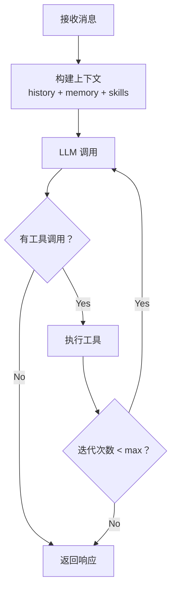

# Niuma 项目开发计划

> **当前版本：** v0.1.0
> **最后更新：** 2026-03-11
> **状态：** 已完成核心基础设施和 Agent 核心，正在进行企业级功能扩展

## 项目概述

**目标：** 基于 nanobot（https://github.com/HKUDS/nanobot）设计理念，使用 TypeScript 构建企业级多角色 AI 助手系统

**Niuma 特点：**
- 企业级多角色架构：支持多个独立角色（项目经理、开发工程师、测试工程师等）
- 完全隔离：每个角色拥有独立的工作区、会话、记忆和日志
- 轻量级核心：借鉴 nanobot 超轻量级设计
- JSON5 配置：支持注释和尾随逗号的配置格式
- 环境变量集成：支持 `${VAR}` 和 `${VAR:default}` 语法
- 双层记忆系统：MEMORY.md + HISTORY.md
- 技能系统：支持动态加载和依赖检查
- MCP 协议支持：预留接口
- 定时任务与心跳：周期性任务支持

---

## 项目当前状态

### ✅ 已完成功能

| Phase | 名称 | 完成日期 | 状态 |
|-------|------|----------|------|
| Phase 1 | 核心基础设施 | 2026-03-10 | ✅ 已完成 |
| Phase 2 | Agent 核心 | 2026-03-10 | ✅ 已完成 |
| 企业扩展 | 多角色配置系统 | 2026-03-11 | ✅ 已完成 |

### 📊 项目统计

- **核心模块：** 20+ 个文件
- **代码行数：** ~8000+ 行 TypeScript
- **测试覆盖：** 核心模块单元测试
- **文档完善度：** OpenSpec 变更记录完整

---

## 技术栈

| 功能 | 技术选型 | 版本 |
|------|---------|------|
| 运行时 | Node.js | >=22.0.0 |
| 语言 | TypeScript | 5.9.3 |
| 包管理 | pnpm | 最新 |
| LLM 框架 | LangChain | @langchain/openai |
| 类型验证 | Zod | ^3.0.0 |
| 数据库 | SQLite | better-sqlite3 |
| 向量存储 | sqlite-vec | 最新 |
| 异步 | Promise/async-await | 原生 |
| 日志 | pino | ^9.0.0 |
| 配置格式 | JSON5 | json5 |
| CLI 框架 | cac | ^6.7.0 |
| 进度提示 | clack/prompts | latest |
| 终端美化 | chalk, ora, boxen | latest |
| 定时任务 | node-cron | ^3.0.0 |
| 系统通知 | node-notifier | latest |
| 测试框架 | vitest | ^2.0.0 |

---

## 项目结构

```
niuma/
├── src/                      # 应用入口（空，使用 niuma/）
├── niuma/                    # 核心模块目录
│   ├── agent/                # 🧠 智能体核心
│   │   ├── context.ts        #    上下文构建器（支持媒体、技能、记忆）
│   │   ├── loop.ts           #    Agent 循环（LLM ↔ 工具执行）
│   │   ├── memory.ts         #    双层记忆系统
│   │   ├── skills.ts         #    技能加载器
│   │   ├── subagent.ts       #    子智能体管理
│   │   └── tools/            #    工具框架
│   │       ├── base.ts       #      工具基类
│   │       └── registry.ts   #      工具注册表
│   ├── bus/                  # 🚌 事件总线
│   │   ├── events.ts         #    事件定义
│   │   ├── index.ts          #    统一导出
│   │   └── queue.ts          #    异步消息队列
│   ├── channels/             # 📱 多渠道接入（规划中）
│   ├── cli/                  # 🖥️ CLI 入口
│   ├── config/               # ⚙️ 配置管理
│   │   ├── schema.ts         #    配置 Schema 定义
│   │   ├── loader.ts         #    配置加载器（兼容旧 API）
│   │   ├── manager.ts        #    配置管理器（多角色支持）
│   │   ├── merger.ts         #    配置合并器
│   │   ├── env-resolver.ts   #    环境变量解析器
│   │   └── json5-loader.ts   #    JSON5 加载器
│   ├── cron/                 # ⏰ 定时任务（规划中）
│   ├── heartbeat/            # 💓 主动唤醒（规划中）
│   ├── providers/            # 🤖 LLM 提供商
│   │   ├── base.ts           #    提供商抽象基类
│   │   └── openai.ts         #    OpenAI 实现
│   ├── session/              # 💬 会话管理
│   │   └── manager.ts        #    会话状态、历史记录、持久化
│   ├── types/                # 📝 类型定义
│   │   ├── index.ts          #    核心类型导出
│   │   ├── message.ts        #    消息类型
│   │   ├── tool.ts           #    工具类型
│   │   ├── llm.ts            #    LLM 类型
│   │   ├── events.ts         #    事件类型
│   │   └── error.ts          #    错误类型
│   └── utils/                # 🔧 工具函数
│       └── retry.ts          #    重试工具
├── openspec/                 # 📋 OpenSpec 规范
│   ├── config.yaml           #    配置文件
│   ├── changes/              #    变更记录
│   │   └── archive/          #    已归档变更
│   │       ├── 2026-03-10-core-infrastructure/
│   │       ├── 2026-03-10-phase2-agent-core/
│   │       └── 2026-03-11-enterprise-multi-role-config/
│   └── specs/                #    规格定义
├── .iflow/                   # 🤖 iFlow CLI 配置
│   ├── skills/               #    技能定义
│   └── commands/             #    自定义命令
├── docs/                     # 📄 文档
│   └── niuma-development-plan.md #    本文档
├── public/                   # 📁 静态资源
├── dist/                     # 📦 构建输出
├── package.json
├── pnpm-workspace.yaml
├── tsconfig.json
├── vitest.config.ts
└── README.md
```

---

## 已完成功能详情

### ✅ Phase 1: 核心基础设施

**完成日期：** 2026-03-10

**实现内容：**

| 模块 | 文件 | 核心功能 |
|------|------|----------|
| 类型定义 | `types/` | Message, Tool, LLM, Events, Error 等核心类型 |
| 配置 Schema | `config/schema.ts` | 使用 zod 定义配置结构 |
| 配置加载 | `config/loader.ts` | 配置文件读取、验证、合并 |
| 工具基类 | `agent/tools/base.ts` | Tool 抽象类、SimpleTool 实现 |
| 工具注册 | `agent/tools/registry.ts` | 工具注册、执行、Schema 生成 |
| 事件定义 | `bus/events.ts` | EventEmitter 单例 + emit/on 辅助函数 |
| 消息队列 | `bus/queue.ts` | AsyncQueue 实现 |

**OpenSpec 变更：** `2026-03-10-core-infrastructure`

---

### ✅ Phase 2: Agent 核心

**完成日期：** 2026-03-10

**实现内容：**

| 模块 | 文件 | 核心功能 |
|------|------|----------|
| 上下文构建 | `agent/context.ts` | System Prompt 构建、消息组装、媒体处理 |
| 记忆系统 | `agent/memory.ts` | 双层记忆、自动整合 |
| 技能系统 | `agent/skills.ts` | SKILL.md 加载、依赖检查 |
| Agent 循环 | `agent/loop.ts` | LLM 调用 ↔ 工具执行循环 |
| 子智能体 | `agent/subagent.ts` | 后台任务执行、结果通知 |
| 会话管理 | `session/manager.ts` | 会话状态、历史记录、持久化 |
| LLM 提供商 | `providers/` | 抽象接口 + OpenAI 实现 |

**Agent Loop 核心流程：**



**OpenSpec 变更：** `2026-03-10-phase2-agent-core`

---

### ✅ 企业扩展：多角色配置系统

**完成日期：** 2026-03-11

**实现内容：**

| 模块 | 文件 | 核心功能 |
|------|------|----------|
| JSON5 加载 | `config/json5-loader.ts` | JSON5 格式解析 |
| 环境变量解析 | `config/env-resolver.ts` | `${VAR}` 和 `${VAR:default}` 语法 |
| 配置合并 | `config/merger.ts` | defaults-with-overrides 模式 |
| 配置管理 | `config/manager.ts` | 多角色配置管理、缓存 |
| CLI 扩展 | `config/` | `--agent` 参数、agents 子命令 |

**核心特性：**

1. **多角色架构**：支持多个独立角色配置
2. **defaults-with-overrides 模式**：全局默认配置 + 角色特定配置覆盖
3. **环境变量集成**：支持环境变量引用
4. **完全隔离**：会话、记忆、技能、日志完全隔离
5. **JSON5 格式**：支持注释和尾随逗号
6. **严格验证**：未知字段拒绝启动

**配置示例：**

```json5
{
  // 全局默认配置
  "maxIterations": 40,
  "agent": {
    "progressMode": "normal"
  },
  
  // 多角色配置
  "agents": {
    "defaults": {
      "progressMode": "normal"
    },
    "list": [
      {
        "id": "manager",
        "name": "项目经理",
        "default": true,
        "agent": {
          "progressMode": "verbose"
        }
      },
      {
        "id": "developer",
        "name": "开发工程师"
      }
    ]
  }
}
```

**OpenSpec 变更：** `2026-03-11-enterprise-multi-role-config`

---

## 待开发功能

### 🔄 Phase 3: 内置工具

**优先级：** 高
**预计工时：** 5-7 天

| 工具 | 文件 | 功能 | 状态 |
|------|------|------|------|
| read_file | `agent/tools/filesystem.ts` | 读取文件 | ⏸️ 待开发 |
| write_file | `agent/tools/filesystem.ts` | 写入文件 | ⏸️ 待开发 |
| edit_file | `agent/tools/filesystem.ts` | 编辑文件 | ⏸️ 待开发 |
| list_dir | `agent/tools/filesystem.ts` | 列出目录 | ⏸️ 待开发 |
| exec | `agent/tools/shell.ts` | 执行命令 | ⏸️ 待开发 |
| web_search | `agent/tools/web.ts` | Brave 搜索 | ⏸️ 待开发 |
| web_fetch | `agent/tools/web.ts` | 网页抓取 | ⏸️ 待开发 |
| message | `agent/tools/message.ts` | 发送消息 | ⏸️ 待开发 |
| spawn | `agent/tools/spawn.ts` | 创建子智能体 | ⏸️ 待开发 |
| cron | `agent/tools/cron.ts` | 定时任务 | ⏸️ 待开发 |

**安全考虑：**

```typescript
// Shell 工具危险命令黑名单
const DENY_PATTERNS = [
  /\brm\s+-[rf]{1,2}\b/,           // rm -r, rm -rf
  /\bdel\s+[fq]\b/,                // del /f, del /q
  /\brmdir\s+\/s\b/,               // rmdir /s
  /\b(shutdown|reboot|poweroff)\b/, // 系统电源
  /:\(\)\s*\{.*\};\s*:/,           // fork bomb
];
```

---

### 🔄 Phase 4: LLM 提供商扩展

**优先级：** 中
**预计工时：** 3-5 天

| 提供商 | 文件 | 功能 | 状态 |
|--------|------|------|------|
| Anthropic | `providers/anthropic.ts` | Claude 系列模型 | ⏸️ 待开发 |
| OpenRouter | `providers/openrouter.ts` | 多模型网关 | ⏸️ 待开发 |
| DeepSeek | `providers/deepseek.ts` | DeepSeek API | ⏸️ 待开发 |
| 自定义 | `providers/custom.ts` | OpenAI 兼容端点 | ⏸️ 待开发 |
| 注册表 | `providers/registry.ts` | 两步式注册、智能匹配 | ⏸️ 待开发 |

**提供商注册表设计：**

```typescript
interface ProviderSpec {
  name: string;                    // 配置字段名
  keywords: string[];              // 模型名关键词匹配
  envKey: string;                  // 环境变量名
  displayName: string;             // 显示名称
  isGateway?: boolean;             // 是否为网关
  defaultApiBase?: string;         // 默认 API Base
}

// 匹配顺序：
// 1. 显式前缀 (provider/model)
// 2. 关键词匹配
// 3. 网关回退
```

---

### 🔄 Phase 5: 多渠道接入

**优先级：** 中
**预计工时：** 7-10 天

| 渠道 | 难度 | 协议 | 状态 |
|------|------|------|------|
| CLI | 简单 | stdin/stdout | ⏸️ 待开发 |
| Telegram | 简单 | HTTP Bot API | ⏸️ 待开发 |
| Discord | 简单 | WebSocket Gateway | ⏸️ 待开发 |
| 飞书 | 中等 | WebSocket 长连接 | ⏸️ 待开发 |
| 钉钉 | 中等 | Stream Mode | ⏸️ 待开发 |
| Slack | 中等 | Socket Mode | ⏸️ 待开发 |
| WhatsApp | 中等 | WebSocket Bridge | ⏸️ 待开发 |
| Email | 中等 | IMAP/SMTP | ⏸️ 待开发 |
| QQ | 简单 | WebSocket | ⏸️ 待开发 |

---

### 🔄 Phase 6: 定时任务与心跳

**优先级：** 低
**预计工时：** 2-3 天

| 模块 | 文件 | 功能 | 状态 |
|------|------|------|------|
| 定时服务 | `cron/service.ts` | Cron 表达式调度 | ⏸️ 待开发 |
| 心跳服务 | `heartbeat/service.ts` | HEARTBEAT.md 检查 | ⏸️ 待开发 |

**心跳机制：**
- 每 30 分钟检查 `HEARTBEAT.md`
- 执行标记的任务
- 通过最近活跃渠道发送结果

---

### 🔄 Phase 7: MCP 协议支持

**优先级：** 低
**预计工时：** 3-5 天

**功能：**
- MCP 服务器实现
- MCP 客户端集成
- 工具发现和调用
- 资源访问

---

## 依赖包

```json
{
  "dependencies": {
    "@langchain/openai": "^0.3.0",
    "better-sqlite3": "^12.0.0",
    "cac": "^6.7.0",
    "chalk": "^5.0.0",
    "node-cron": "^3.0.0",
    "node-fetch": "^3.0.0",
    "ora": "^8.0.0",
    "pino": "^9.0.0",
    "zod": "^3.0.0",
    "json5": "^2.2.3",
    "date-fns": "^4.0.0",
    "dayjs": "^1.11.0",
    "dotenv": "^16.0.0",
    "node-notifier": "^10.0.0"
  },
  "devDependencies": {
    "@types/better-sqlite3": "^7.6.0",
    "@types/node": "^22.0.0",
    "@types/node-cron": "^3.0.0",
    "tsx": "^4.0.0",
    "typescript": "^5.0.0",
    "vitest": "^2.0.0",
    "eslint": "^9.0.0"
  }
}
```

---

## 开发规范

### 代码风格
- 使用 ESLint 进行代码规范检查
- TypeScript 严格模式开启
- 使用 ES Module (`"type": "module"`)
- **注释必须使用中文**，代码标识符使用英文
- JSDoc 注释应包含 `@description`、`@param`、`@returns` 等标签
- **图表必须使用 mermaid 语法**

### 提交规范
- 遵循 Conventional Commits 规范
- 提交信息格式：`type: description`

### 分支策略
- `main` - 主分支
- `feat/*` - 功能分支

### 工作流约束（强制）

**重要：以下约束为强制执行，不可跳过！**

1. **必须触发 fullstack-workflow skill**
   - 无论通过任何方式开始实现代码时，必须先调用 `Skill` 工具触发 `fullstack-workflow` skill
   - 示例：`Skill(skill: "fullstack-workflow")`

2. **必须使用 OpenSpec CLI 命令**
   - 禁止手动创建 openspec 文件，必须通过 CLI 命令生成
   - 使用 `openspec` CLI 命令管理变更生命周期

3. **使用斜杠命令触发 Skill**
   - `/opsx:explore` - 探索模式和需求澄清
   - `/opsx:propose` - 创建变更提案
   - `/opsx:apply` - 实施变更
   - `/opsx:archive` - 归档变更

**正确的工作流顺序：**
```
1. /opsx:explore (可选，复杂任务建议使用)
   ↓
2. /opsx:propose (创建提案，自动生成所有 artifacts)
   ↓
3. /opsx:apply (实施变更)
   ↓
4. /opsx:archive (归档)
```

---

## 参考资源

- [nanobot 源码](https://github.com/HKUDS/nanobot)
- [LangChain.js 文档](https://js.langchain.com/)
- [MCP 协议](https://modelcontextprotocol.io/)
- [OpenAI API](https://platform.openai.com/docs)
- [Anthropic API](https://docs.anthropic.com/)
- [OpenSpec 规范](https://github.com/openspec-io)

---

> 本文档由 iFlow CLI 维护，反映项目最新开发进展。
