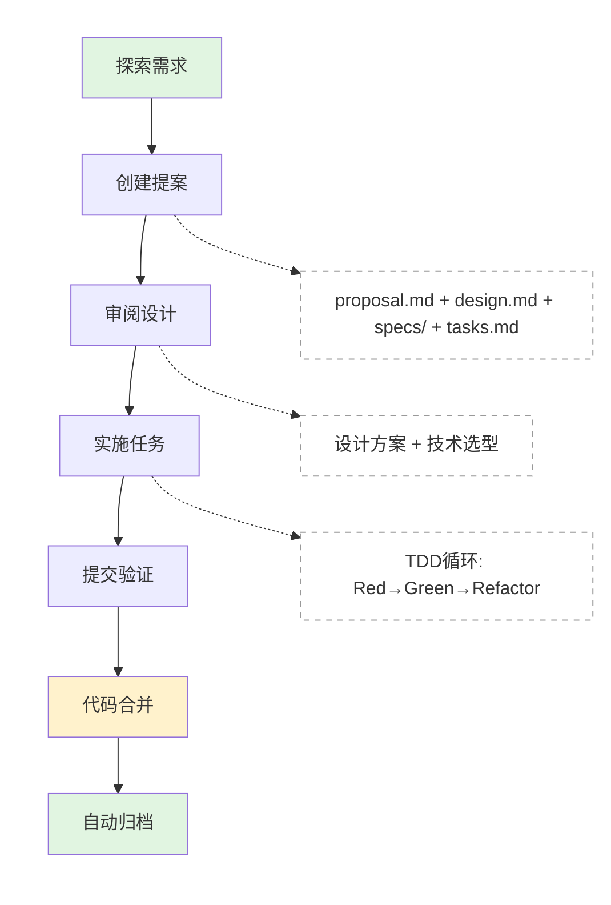

# 00 - 快速开始（5 分钟）

> 从零开始完成你的第一个 OpenSpec Harness 变更

## 前置条件

确保你已经安装：

- **Node.js** >= 22.0.0
- **pnpm** >= 8.0.0
- **Git**

验证安装：

```bash
node --version   # v22.x.x
pnpm --version   # 8.x.x
git --version    # git version 2.x
```

## 快速开始（5 分钟）

### Step 1: 克隆项目并安装依赖

```bash
# 克隆项目
git clone https://github.com/your-org/your-project.git
cd your-project

# 安装依赖
pnpm install

# 验证安装
pnpm test:unit
```

### Step 2: 了解项目结构

```bash
ls -la

├── openspec/                 # OpenSpec 配置目录
│   ├── config.yaml          # 项目配置
│   ├── schemas/             # 工作流定义
│   │   ├── spec-driven.yaml # 新功能开发
│   │   └── bugfix.yaml      # Bug 修复
│   └── changes/             # 变更目录（你的工作）
│
├── .opencode/               # AI 助手配置
│   ├── command/             # 斜杠命令
│   └── skills/              # 技能定义
│
├── AGENTS.md               # AI 行为指南
├── docs/                   # 文档
│   ├── openspec/           # Harness 使用文档
│
└── src/                    # 源代码
```

### Step 3: 创建你的第一个变更

#### 场景：你想添加一个"欢迎消息"功能

```bash
# 在 AI 助手中输入：
/opsx-propose add-welcome-message

# AI 会帮你创建：
openspec/changes/add-welcome-message/
├── .openspec.yaml          # 变更元数据
├── proposal.md             # 为什么做这个功能
├── design.md               # 技术方案
├── specs/                  # 详细规格
│   └── welcome/
│       └── spec.md          # 欢迎消息规格
└── tasks.md                # 实施任务列表
```

### Step 4: 审阅生成的文档

```bash
# 查看提案
cat openspec/changes/add-welcome-message/proposal.md

# 查看设计
cat openspec/changes/add-welcome-message/design.md

# 查看规格
cat openspec/changes/add-welcome-message/specs/welcome/spec.md

# 查看任务列表
cat openspec/changes/add-welcome-message/tasks.md
```

**示例 proposal.md**：

```markdown
# Proposal: 添加欢迎消息功能

## 问题

用户首次访问应用时，没有任何引导提示，导致不知道如何开始使用。

## 目标

为首次访问的用户显示欢迎消息，帮助用户快速了解应用功能。

## 成功标准

- [ ] 新用户首次访问时显示欢迎弹窗
- [ ] 用户可以关闭弹窗，下次不再显示
- [ ] 弹窗包含核心功能介绍
- [ ] 移动端适配
```

### Step 5: 开始实施

```bash
# 启动实施
/opsx-apply

# AI 会引导你完成 TDD 循环：
# 1. Red: 编写测试
# 2. Green: 写最小实现
# 3. Refactor: 重构代码
```

### Step 6: 提交验证

```bash
# 运行检查
pnpm test:unit    # 单元测试
pnpm lint          # 代码风格
pnpm type-check    # 类型检查

# 提交
git add .
git commit -m "feat: add welcome message feature"

# 推送
git push origin feature/add-welcome-message
```

## 🎉 完成！

你已经完成了一个完整的 Harness 工作流：



## 下一步

### 场景选择

根据你的需求选择：

| 如果你...     | 使用命令                | 阅读文档                                |
| ------------- | ----------------------- | --------------------------------------- |
| 加新功能      | `/opsx-propose <name>`  | [03-工作流](03-workflows.md)            |
| 修 Bug        | `/opsx-bugfix <bug-id>` | [03-工作流](03-workflows.md)            |
| 技术调研/选型 | `/opsx-spike <name>`    | [Spike vs Explore](spike-vs-explore.md) |
| 不确定怎么做  | `/opsx-explore`         | [03-工作流](03-workflows.md)            |

### 深入学习

- **理解配置**：三层配置如何配合？→ [02-配置体系](02-config-system.md)
- **命令参考**：所有命令怎么用？→ [04-命令参考](04-commands.md)
- **目录结构**：文件怎么组织？→ [05-目录结构](05-directory-structure.md)
- **最佳实践**：避免什么？做什么？→ [06-最佳实践](06-best-practices.md)

### 完整示例

想看一个从零到完成的详细演示？→ [07-示例演示](07-examples.md)

## 常见问题

### Q: `/opsx-propose` 提示找不到命令？

**A**: 确保你的项目有 OpenSpec 配置：

```bash
# 检查配置文件是否存在
ls openspec/config.yaml
ls .opencode/command/opsx-propose.md

# 如果不存在，需要初始化 OpenSpec
# （参见项目初始化文档）
```

### Q: 怎么知道变更是激活的还是归档的？

**A**: 查看 `openspec/changes/` 目录：

```bash
openspec/changes/
├── add-welcome-message/    # 激活（正在进行）
└── archive/                # 归档（已完成）
    ├── old-feature-1/
    └── old-feature-2/
```

### Q: 提交代码时检查失败怎么办？

**A**: 看具体错误：

```bash
# 检查测试失败
pnpm test:unit

# 检查代码风格
pnpm lint

# 检查类型错误
pnpm type-check
```

### Q: 怎么跳过某个检查？

**A**: 一般不建议跳过，但紧急情况：

```bash
# 跳过 pre-commit 钩子（谨慎使用！）
git commit --no-verify -m "emergency fix"
```

## 检查清单

完成快速开始后，你应该能回答：

- [ ] OpenSpec Harness 的三层配置是什么？
- [ ] `/opsx-propose` 命令做什么？
- [ ] 变更目录在哪里？
- [ ] TDD 循环是什么？
- [ ] 怎么运行测试和检查？

如果全部能回答，恭喜你！如果不确定，回到对应章节继续学习。
