# 01 - 系统概览

> 理解 OpenSpec Harness 的整体架构和核心概念

## 什么是 Harness Engineering？

**Harness** 原意是"马具"，在这里比喻为**将 AI 能力 harness（驾驭）到软件开发流程中**。

传统开发：

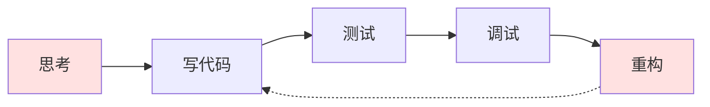

Harness Engineering：

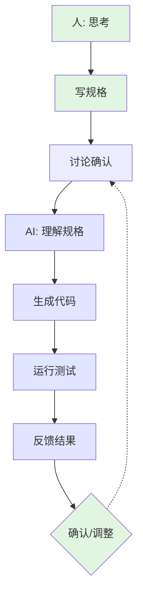

**核心转变**：人专注于"做什么"和"为什么"，AI 协助"怎么做"。

## 系统架构

### 整体架构图

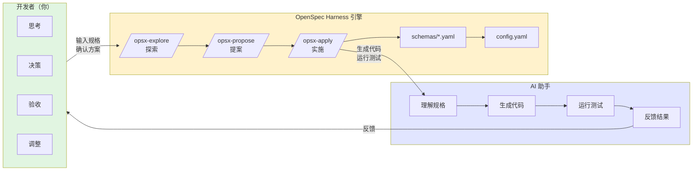

### 数据流

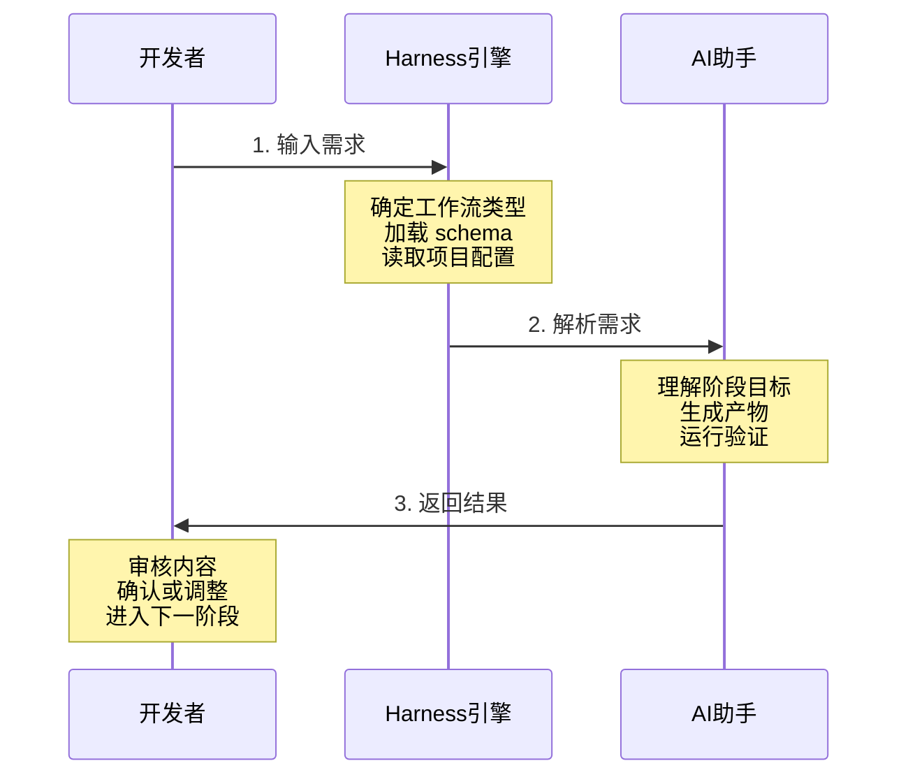

## 核心概念

### 1. 变更（Change）

**变更**是 Harness 的基本工作单元，代表一个完整的开发任务。

三种类型的变更：

**类型 1：新功能变更 (spec-driven)**

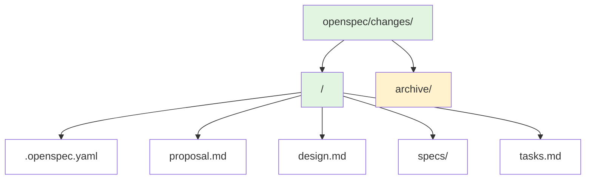

**类型 2：Bug 修复 (bugfix)**

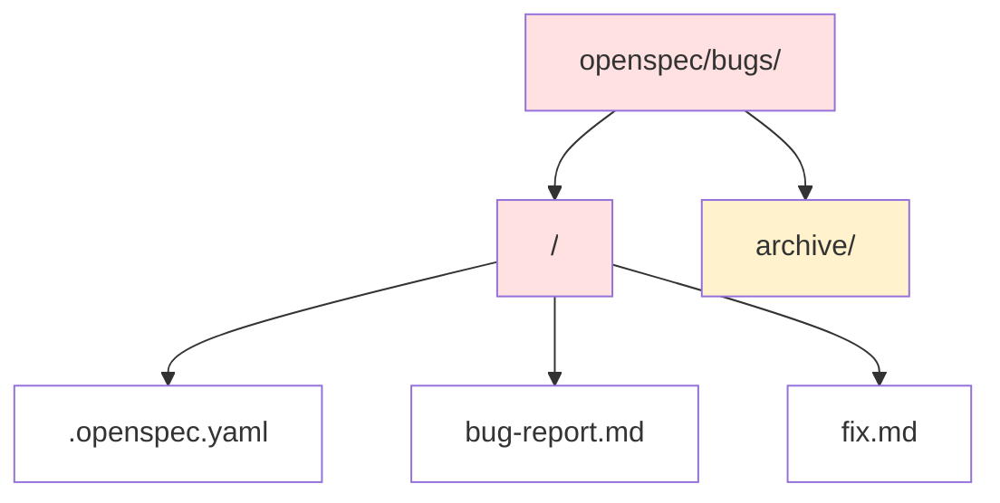

**类型 3：技术调研 (spike)**

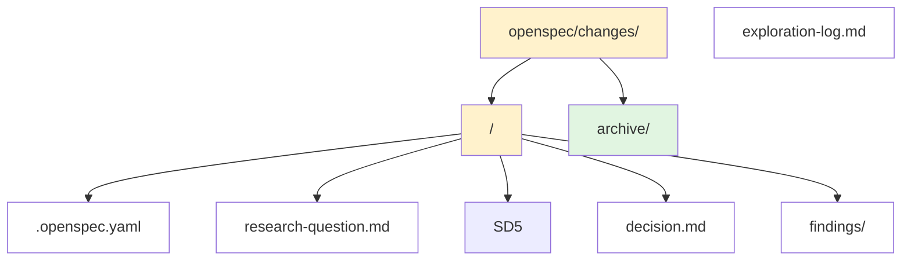

### 2. 阶段（Phase）

每个工作流由多个**阶段**组成，阶段之间有明确的顺序和检查点。

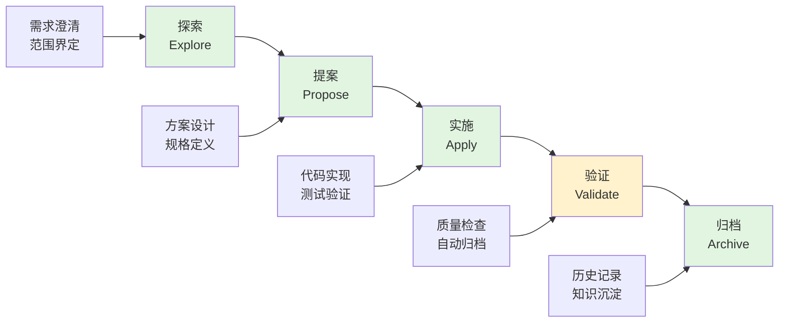

### 3. 产物（Artifact）

每个阶段产生特定的**产物**，产物是阶段完成的标志。

**提案阶段产物**

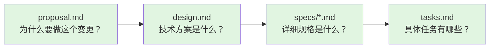

**实施阶段产物**


### 4. 检查点（Gate）

**检查点**是阶段之间的质量控制机制，确保只有满足条件才能进入下一阶段。

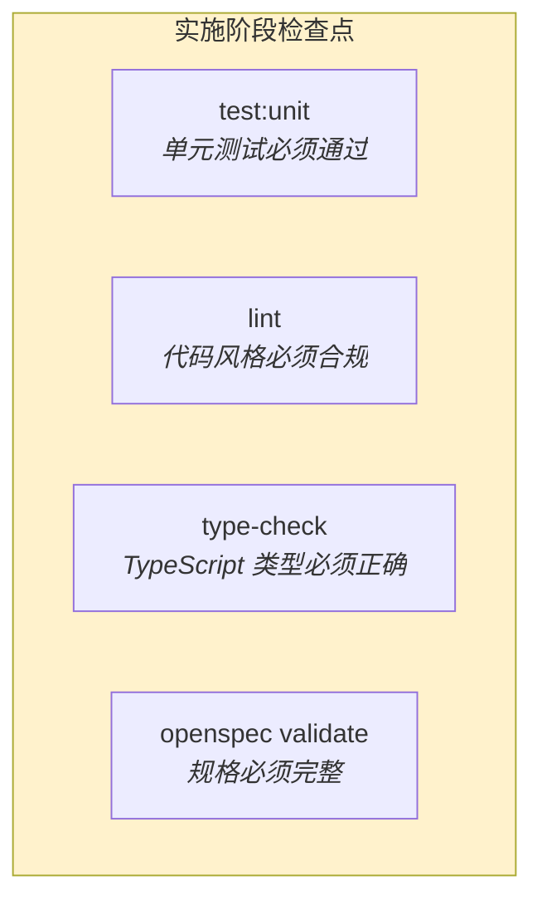

## 工作流类型

### Spec-Driven（新功能开发）

**适用场景**：新功能、架构改动、大型重构

**核心理念**：先写规格，后写代码（Specification First）

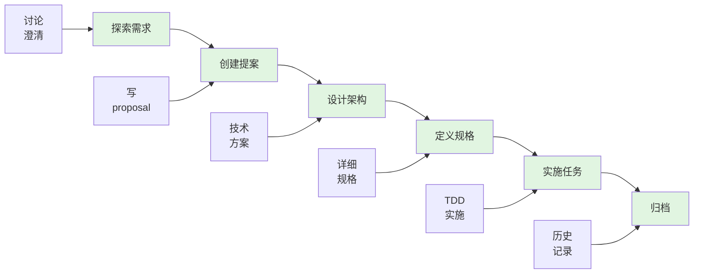

**产物**：

- proposal.md（为什么）
- design.md（怎么做 - 架构层面）
- specs/\*.md（做什么 - 详细规格）
- tasks.md（何时做 - 任务列表）

### Bugfix（Bug 修复）

**适用场景**：生产环境问题、功能异常

**核心理念**：快速定位、最小修复、回归测试

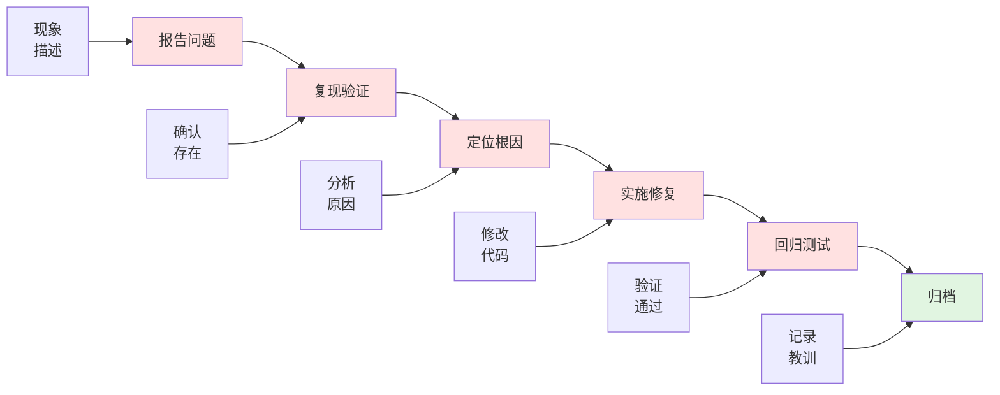

**产物**：

- bug-report.md（问题描述）
- fix.md（修复方案）
- regression test（回归测试）

### Spike（技术调研）

**适用场景**：技术选型、可行性验证、性能调查、新技术预研

**核心理念**：时间盒限制的探索性研究，必须产出明确决策

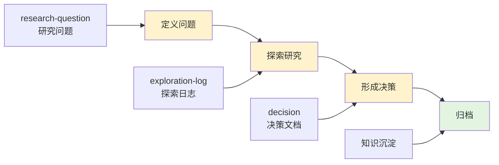

**产物**：

- research-question.md（研究问题定义）
- exploration-log.md（探索日志）
- decision.md（决策文档）
- findings/（研究发现）

**关键特性**：

- **时间盒限制**：默认 4 小时，最长 2 天
- **必须下结论**：即使是不完整的结论也要记录
- **可丢弃代码**：Spike 代码不需要测试，标记为实验性质
- **转为实施**：调研完成后通常转为 Spec-Driven 实施

### Explore（自由探索）

**适用场景**：需求不明确、技术方案不确定、风险评估

**核心理念**：先想清楚，再动手做

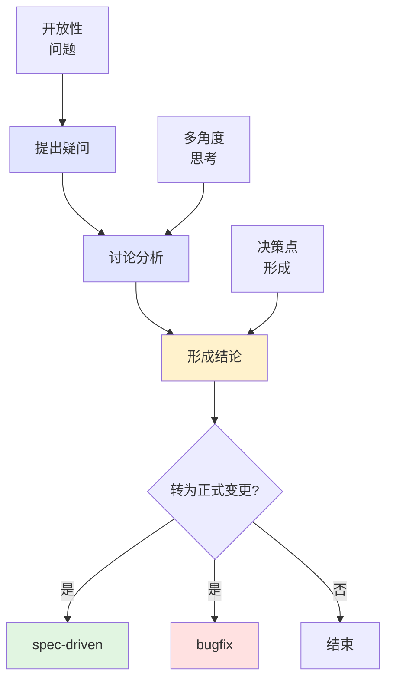

**产物**：无固定产物，可能有讨论记录或决策文档

## 配置体系

Harness 使用**三层配置**来定义如何工作：

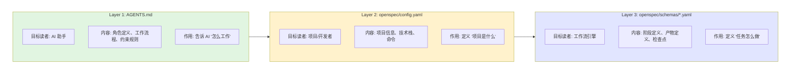

详细说明参见 [02-配置体系](02-config-system.md)。

## 使用示例

### 示例 1：添加用户认证功能

```bash
# 阶段 1：探索（可选）
/opsx-explore
> "我想添加用户认证功能，用什么方案比较好？"
< AI 讨论 JWT vs Session vs OAuth 的优缺点

# 阶段 2：提案
/opsx-propose add-user-auth
> AI 生成：
>   proposal.md: 为什么需要认证功能
>   design.md: 使用 JWT + Refresh Token 方案
>   specs/: 登录、注册、token 刷新等接口规格
>   tasks.md: 5 个实施任务

# 阶段 3：实施
/opsx-apply
> AI 协助完成 tasks.md 中的任务
>   - [Red] 写测试
>   - [Green] 写实现
>   - [Refactor] 重构代码

# 阶段 4：归档
# 合并到 main 后自动归档
```

### 示例 2：修复登录按钮失效

```bash
# 阶段 1：报告
/opsx-bugfix login-button-broken
> AI 引导填写 bug-report.md:
>   Symptom: 登录按钮点击无反应
>   Steps: 1. 打开首页 2. 点击登录
>   Expected: 弹出登录框
>   Actual: 无反应

# 阶段 2：修复
> AI 协助：
>   1. 定位根因：事件监听绑定问题
>   2. 实施修复：修改绑定方式
>   3. 添加回归测试

# 阶段 3：验证
> 运行测试确认修复

# 阶段 4：归档
```

## 优势总结

### 对开发者

1. **降低认知负担**：AI 协助处理细节，人专注于决策
2. **强制规格先行**：必须先想清楚做什么，才能开始做
3. **完整历史记录**：每个变更都有可追溯的完整上下文
4. **减少重复劳动**：AI 生成样板代码和文档

### 对项目

1. **知识沉淀**：所有决策和方案都记录在案
2. **新人友好**：新成员可以通过阅读 specs 快速理解系统
3. **质量保证**：检查点确保质量，不会跳过重要步骤
4. **可追溯性**：问题可以追溯到具体变更和决策

## 下一步

- **[配置体系详解](02-config-system.md)** - 理解 AGENTS.md、config.yaml、schemas 的关系
- **[工作流详解](03-workflows.md)** - 深入学习 spec-driven 和 bugfix 工作流
- **[命令参考](04-commands.md)** - 查看所有可用命令的详细用法
