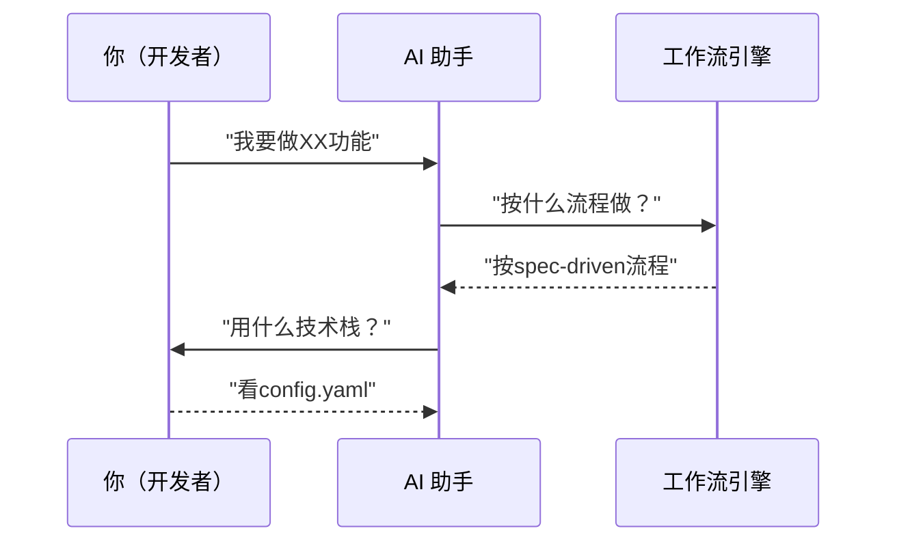

# 02 - 配置体系详解

> 理解 AGENTS.md、config.yaml、schemas 三层配置的关系和区别

## 为什么需要三层配置？

想象一个团队：



不同角色需要不同的信息：

- **你**：需要知道项目的技术栈、命令怎么用
- **AI**：需要知道它应该扮演什么角色、遵循什么规则
- **引擎**：需要知道每个阶段的具体步骤和检查点

这就是三层配置存在的意义。

## 四层配置对比

| 层级        | 文件                                   | 面向对象   | 核心内容           | 类比           |
| ----------- | -------------------------------------- | ---------- | ------------------ | -------------- |
| **Layer 1** | `AGENTS.md`                            | AI 助手    | 角色、流程、约束   | **员工手册**   |
| **Layer 2** | `openspec/config.yaml`                 | 项目/人    | 技术栈、模块、命令 | **项目说明书** |
| **Layer 3** | `openspec/schemas/`                    | 工作流引擎 | 阶段、产物、检查点 | **操作流程图** |
| **Layer 4** | `{{AI_CONFIG_DIR}}/commands/, skills/` | AI 执行层  | 命令定义、执行逻辑 | **操作手册**   |

## Layer 1: AGENTS.md（AI 行为指南）

### 作用

告诉 AI 助手：

1. 在这个项目中你是什么角色？
2. 你应该遵循什么流程？
3. 有哪些约束和规则？

### 内容示例

````markdown
---
target: AI Assistant
purpose: Operational guidelines for Niuma project
version: 1.0
---

# AI Agent Guidelines - Niuma Project

## Context

Niuma (牛马) - Multi-agent AI assistant system. TypeScript + Node.js + Next.js.

See [openspec/config.yaml](./openspec/config.yaml) for detailed project configuration.

## Roles

### SpecWriter

Create OpenSpec artifacts for new features.

Artifacts to create:

- `openspec/changes/<name>/proposal.md` — why we're doing this, what's changing
- `openspec/changes/<name>/design.md` — technical approach
- `openspec/changes/<name>/specs/*.md` — requirements and scenarios
- `openspec/changes/<name>/tasks.md` — implementation checklist

Requirements:

- Use SHALL/MUST keywords in specs
- Include WHEN/THEN scenarios
- Define acceptance criteria

### Tester

Implement tests before code exists.

Workflow:

1. Read specs from `openspec/changes/<name>/specs/*.md`
2. Create tests in `src/niuma-engine/tests/` or `src/tests/`
3. Run `pnpm test:unit` to confirm tests fail (Red)
4. Commit tests

Test coverage:

- Normal cases
- Edge cases
- Error handling

### Developer

Implement code to pass tests.

Workflow:

1. Read spec.md and existing tests
2. Implement in `src/niuma-engine/` or `src/`
3. Run tests until pass (Green)
4. Refactor (Refactor)

Standards:

- Pass `pnpm lint`
- Pass `pnpm type-check`
- Maintain coverage

### Reviewer

Validate code quality.

Checklist:

- [ ] TypeScript strict mode
- [ ] All tests pass
- [ ] No ESLint warnings
- [ ] Formatted code
- [ ] Updated docs

## Workflow Commands

| Phase    | Command                | Purpose                  | Trigger                  |
| -------- | ---------------------- | ------------------------ | ------------------------ |
| Explore  | `/opsx-explore`        | Clarify requirements     | Manual                   |
| Propose  | `/opsx-propose <name>` | Create specification     | Manual                   |
| Spike    | `/opsx-spike <name>`   | Technical research       | Manual                   |
| Bugfix   | `/opsx-bugfix <id>`    | Fix bugs                 | Manual                   |
| Apply    | `/opsx-apply`          | TDD implementation       | Manual                   |
| Validate | pre-commit hook        | Machine acceptance       | Auto (git hook)          |
| Archive  | GitHub Actions         | Archive completed change | Auto (on release/deploy) |

Full workflow config: [openspec/config.yaml](./openspec/config.yaml)

## TDD Cycle

```
Write Test → Red (Fail) → Implement → Green (Pass) → Refactor → Repeat
```

Phases:

- **Red**: Write tests that fail
- **Green**: Write minimal code to pass
- **Refactor**: Improve without changing behavior

## OpenSpec + TDD Integration

### Workflow

```
OpenSpec Phase          TDD Cycle
────────────────        ─────────
specs/*.md              → Red: from scenarios write tests
  └─ WHEN/THEN          → Green: implement code
tasks.md                → Refactor: refactor code
  └─ [Red] Write tests       ← each scenario maps to one test
  └─ [Green] Implement       ← make tests pass
  └─ [Refactor] Refactor    ← refactor
```

### Schema-Specific Workflows

| Schema      | Input Artifacts                              | Output Artifacts                    | No Code Production |
| ----------- | -------------------------------------------- | ----------------------------------- | ------------------ |
| spec-driven | proposal, design, specs, tasks               | Implementation + tests              | No                 |
| bugfix      | bug-report, fix                              | Fix + regression tests              | No                 |
| spike       | research-question, exploration-log, decision | Research findings + decision record | Yes (throwaway)    |

## Constraints

SHALL:

- Use TDD (Red→Green→Refactor)
- Write tests before implementation
- Follow directory conventions
- Use English identifiers
- Run all gates before commit
- Use `spec-driven` schema for new features and enhancements
- Use `bugfix` schema for bug fixes and hotfixes
- Use `spike` schema for technical research and feasibility studies

SHALL NOT:

- Skip tests
- Commit failing checks
- Push to main directly
- Ignore type errors
- Leave TODOs unresolved
- Mix feature work with bugfix in the same change
- Mix research/spike work with implementation in the same change

## Communication

With users:

- Clarify requirements first
- Report progress regularly
- Propose options for problems
- Document decisions

In commits:

- One logical change per commit
- Clear commit messages
- Reference issues when applicable

## Resources

- [OpenSpec Config](./openspec/config.yaml)
- [README](./README.md)
````

### 关键点

- **目标读者是 AI**：用人称"你"来指代 AI
- **描述行为规范**：告诉 AI 应该做什么、不应该做什么
- **不涉及技术细节**：技术栈在 config.yaml 中定义

## Layer 2: config.yaml（项目配置）

### 作用

定义项目的基本信息：

1. 这是什么项目？
2. 使用什么技术栈？
3. 项目如何组织？
4. 常用命令有哪些？
5. 使用哪些工作流 schema？

### 内容示例

```yaml
# OpenSpec Configuration for Niuma Project

# Default schema for new changes
schema: spec-driven

# Available schemas in this project
schemas:
  spec-driven:
    path: openspec/schemas/spec-driven
    description: Standard spec-driven development with TDD
  bugfix:
    path: openspec/schemas/bugfix
    description: Streamlined bug fix workflow
  spike:
    path: openspec/schemas/spike
    description: Technical research and investigation

context:
  project:
    name: Niuma
    description: Multi-agent AI assistant system
    language: TypeScript
    runtime: Node.js >=22.0.0
    package_manager: pnpm

  tech_stack:
    language: TypeScript 5.9+
    test_framework: vitest
    web_framework: Next.js 15
    ui: React 19 + Tailwind CSS
    runtime: Node.js >=22.0.0

  modules:
    niuma-engine:
      purpose: Agent core implementation
      scope: Agent base classes, tools, memory
      tests: src/niuma-engine/tests/
    src:
      purpose: Next.js web service
      scope: Web UI, API routes, components
      tests: src/tests/

  conventions:
    - ES Module syntax
    - Strict TypeScript
    - Async/await
    - Identifiers in English

  commands:
    install: pnpm install
    dev: pnpm dev
    build: pnpm build
    test: pnpm test
    test_unit: pnpm test:unit
    lint: pnpm lint
    type_check: pnpm type-check
```

### schemas 配置说明

`schemas` 部分声明了项目中可用的工作流：

- **key**: schema 名称（如 `spec-driven`, `bugfix`, `spike`）
- **path**: schema 目录路径，包含 `schema.yaml` 和 `templates/`
- **description**: schema 的用途描述

这与 OpenSpec 官方 CLI 兼容，可以使用 `openspec schemas` 命令查看可用 schema。

### 关键点

- **目标读者是开发者**：描述项目的基本信息
- **供 AI 参考**：AI 会读取此文件了解项目技术栈
- **不定义流程**：流程在 schemas 中定义

## Layer 3: schemas/（工作流定义）

### 作用

定义具体的工作流：

1. 有哪些阶段？
2. 每个阶段产生什么产物？
3. 阶段之间有什么检查点？

### 目录结构

每个 schema 是一个目录，包含配置文件和模板：

```
openspec/schemas/
├── spec-driven/              # 新功能开发工作流
│   ├── schema.yaml           # 工作流配置
│   └── templates/            # 产物模板
│       ├── proposal.md.tpl
│       ├── design.md.tpl
│       ├── spec.md.tpl
│       └── tasks.md.tpl
├── bugfix/                   # Bug 修复工作流
│   ├── schema.yaml
│   └── templates/
│       ├── bug-report.md.tpl
│       └── fix.md.tpl
└── spike/                    # 技术调研工作流
    ├── schema.yaml
    └── templates/
        ├── research-question.md.tpl
        ├── exploration-log.md.tpl
        └── decision.md.tpl
```

### 内容示例

#### spec-driven/schema.yaml

```yaml
# openspec/schemas/spec-driven/schema.yaml

schema:
  name: spec-driven
  version: "1.0"
  description: Specification-driven development workflow with TDD integration

artifacts:
  - id: proposal
    generates: proposal.md
    template: templates/proposal.md.tpl
    required_sections: [Non-goals, Acceptance Criteria]
    max_words: 500

  - id: design
    generates: design.md
    template: templates/design.md.tpl
    requires: [proposal]
    content: [design decisions, trade-offs]
    diagrams: ASCII

  - id: specs
    generates: specs/
    template: templates/spec.md.tpl
    requires: [design]
    required_sections: [Purpose, Requirements]
    keywords: [SHALL, MUST]
    scenarios: required

  - id: tasks
    generates: tasks.md
    template: templates/tasks.md.tpl
    requires: [specs]
    chunk_size: 30min
    verifiable: true
    organization: [Red, Green, Refactor]

phases:
  - id: explore
    name: Explore
    trigger: manual
    command: /opsx-explore

  - id: propose
    name: Propose
    trigger: manual
    command: /opsx-propose
    produces: [proposal, design, specs, tasks]
    internal_commands:
      - openspec new change <name>
      - openspec status --change <name>
      - openspec instructions <artifact> --change <name>

  - id: apply
    name: Apply
    trigger: manual
    command: /opsx-apply
    gates: [test:unit, lint, type-check]

  - id: validate
    name: Validate
    trigger: pre-commit
    blocking: true
    gates: [openspec validate, test:all, type-check, lint, format-check]
    internal_commands:
      - openspec validate --change <name>
      - openspec validate --all

  - id: archive
    name: Archive
    trigger: post-merge
    branch: main
    action: auto-archive-with-sync
    internal_commands:
      - openspec archive <name>
      - openspec list --specs

tdd:
  mapping:
    spec_to_test: "<module>/tests/<feature>.test.ts"
    test_to_impl: "<module>/<feature>.ts"

  spec_format:
    required_sections: [Purpose, Requirements, Scenarios]
    keywords: [SHALL, MUST]
    scenario_structure: [WHEN, THEN]

  tasks_structure:
    red_phase:
      prefix: "1."
      action: "Write test for"
      verifiable_by: "test fails"
    green_phase:
      prefix: "2."
      action: "Implement to pass"
      verifiable_by: "test passes"
    refactor_phase:
      prefix: "3."
      action: "Optimize"
      verifiable_by: "tests still pass, code improved"
```

#### bugfix/schema.yaml

```yaml
# openspec/schemas/bugfix/schema.yaml

schema:
  name: bugfix
  version: "1.0"
  description: Streamlined workflow for bug fixes with minimal overhead

artifacts:
  - id: bug_report
    generates: bug-report.md
    template: templates/bug-report.md.tpl
    required_sections:
      - Symptom
      - Steps_to_Reproduce
      - Expected_Behavior
      - Actual_Behavior
      - Environment
    optional_sections:
      - Root_Cause_Analysis
      - Workaround
    max_words: 300

  - id: fix
    generates: fix.md
    template: templates/fix.md.tpl
    requires: [bug_report]
    required_sections:
      - Root_Cause
      - Fix_Description
      - Files_Changed
      - Testing_Strategy
    optional_sections:
      - Spec_Impact
      - Risks
      - Follow_Up

  - id: regression_test
    generates: regression-test.md
    template: templates/regression-test.md.tpl
    requires: [fix]
    required_sections:
      - Test_Case
      - Coverage

phases:
  - id: triage
    name: Triage
    trigger: manual
    command: /opsx-bugfix
    description: Assess bug severity and assign owner
    gates: [severity-assigned, owner-assigned]

  - id: reproduce
    name: Reproduce
    trigger: manual
    description: Create minimal reproduction case
    produces: [bug_report]
    gates: [reproducible]
    internal_commands:
      - openspec new bugfix <id>
      - openspec status --bugfix <id>

  - id: fix
    name: Fix
    trigger: manual
    description: Implement fix with regression test
    produces: [fix, regression_test]
    gates: [fix-implemented, test-passes]
    internal_commands:
      - openspec instructions fix --bugfix <id>

  - id: validate
    name: Validate
    trigger: pre-commit
    blocking: true
    gates: [test:all, lint, type-check, regression-test]
    internal_commands:
      - openspec validate --bugfix <id>

  - id: close
    name: Close
    trigger: post-merge
    branch: main
    action: auto-close-with-report
    internal_commands:
      - openspec close <id>

severity:
  p0_critical:
    description: System down, data loss, security breach
    response_time: "immediate"
    workflow: hotfix

  p1_high:
    description: Core feature broken, blocking workflow
    response_time: "same day"
    gates: [skip-design-review]

  p2_medium:
    description: Feature impaired, workaround exists
    response_time: "this sprint"

  p3_low:
    description: Cosmetic, edge case, nice-to-have
    response_time: "backlog"

rules:
  minimal_change:
    principle: "Minimal change"
    description: Only fix the bug, don't refactor surrounding code
    exception: If surrounding code is clearly problematic, submit refactor separately

  regression_test_required:
    principle: "Regression test required"
    description: |
      Every bugfix must include a test case that:
      1. Fails before the fix
      2. Passes after the fix
      3. Catches similar regressions

  no_bypass_without_reason:
    principle: "No bypass without reason"
    description: |
      Even for urgent fixes, document in bug_report:
      - Why immediate fix was needed
      - Why normal process wasn't followed
      - Whether follow-up is needed

  root_cause_tracking:
    principle: "Track root cause"
    description: |
      Record the root cause of bugs for:
      - Identifying systemic issues
      - Improving development process
      - Training and education

integration:
  git:
    branch_naming: "fix/<bug-id>-<short-description>"
    commit_prefix: "fix:"

  issues:
    link_required: true
    auto_close: true

  tests:
    pattern: "src/tests/regression/<bug-id>.test.ts"
    naming: "should not regress: <symptom>"

hotfix_override:
  allowed: true
  conditions:
    - severity: p0_critical
    - approval: tech-lead
  simplified_flow:
    - reproduce (verbal/mental only)
    - fix (direct commit to main)
    - post-mortem (within 24h)
```

#### spike/schema.yaml

```yaml
# openspec/schemas/spike/schema.yaml

schema:
  name: spike
  version: "1.0"
  description: Technical research and exploratory investigation workflow

artifacts:
  - id: research_question
    generates: research-question.md
    template: templates/research-question.md.tpl
    required_sections:
      - Problem_Statement
      - Research_Goals
      - Scope
    optional_sections:
      - Constraints
      - Success_Criteria
      - Timebox
    max_words: 400

  - id: exploration_log
    generates: exploration-log.md
    template: templates/exploration-log.md.tpl
    requires: [research_question]
    required_sections:
      - Approach
      - Findings
    optional_sections:
      - Experiments_Conducted
      - Tools_Evaluated
      - Documentation_Reviewed
      - Code_Spikes
      - Pros_and_Cons
    format: chronological
    max_words: 2000

  - id: decision
    generates: decision.md
    template: templates/decision.md.tpl
    requires: [exploration_log]
    required_sections:
      - Summary
      - Recommendation
      - Rationale
    optional_sections:
      - Alternatives_Considered
      - Risks
      - Next_Steps
      - Implementation_Plan
    max_words: 800

phases:
  - id: define
    name: Define
    trigger: manual
    command: /opsx-spike
    description: Define the research question and scope
    produces: [research_question]
    internal_commands:
      - openspec new spike <name>
      - openspec status --spike <name>

  - id: explore
    name: Explore
    trigger: manual
    description: Conduct research, experiments, and gather findings
    produces: [exploration_log]
    gates: [timebox-respected, findings-documented]
    internal_commands:
      - openspec instructions explore --spike <name>

  - id: conclude
    name: Conclude
    trigger: manual
    description: Synthesize findings and make recommendations
    produces: [decision]
    gates: [decision-recorded, next-steps-defined]
    internal_commands:
      - openspec instructions conclude --spike <name>

  - id: archive
    name: Archive
    trigger: post-merge
    branch: main
    action: auto-archive-spike
    internal_commands:
      - openspec archive <name>

timebox:
  default: 4h
  max: 2d
  warning_threshold: 80%
  enforce: soft

rules:
  timebox_respected:
    principle: "Respect the timebox"
    description: |
      Spike is time-boxed research by design:
      - Set a clear time limit upfront
      - Document partial findings if time runs out
      - It's OK to say "need more time" with justification
      - Avoid gold-plating the exploration

  document_as_you_go:
    principle: "Document as you go"
    description: |
      Don't wait until the end to write findings:
      - Capture findings in real-time
      - Include failed experiments (they teach too)
      - Link to relevant docs, code, commits
      - Note assumptions made during exploration

  code_spikes_ok:
    principle: "Throwaway code is OK"
    description: |
      Spikes often involve writing experimental code:
      - Clearly mark code as experimental
      - Don't require tests for throwaway code
      - Document learnings from code experiments
      - Decide: prototype vs production-ready

  decision_required:
    principle: "Must reach a conclusion"
    description: |
      Every spike must produce a clear decision:
      - Proceed with approach A
      - Proceed with approach B
      - Need more research (with specific questions)
      - Don't proceed (with rationale)

  no_production_code:
    principle: "No production code in spike"
    description: |
      Spike findings inform implementation, but:
      - Spike code stays in spike directory
      - Production implementation is a separate change
      - Use spec-driven workflow for actual implementation
      - Spike artifacts are documentation, not deliverables

integration:
  git:
    branch_naming: "spike/<research-name>"
    commit_prefix: "spike:"

  directory:
    pattern: "openspec/changes/<spike-name>/"
    structure:
      - research-question.md
      - exploration-log.md
      - decision.md
      - findings/
      - code-spikes/

  follow_up:
    require_decision: true
    create_implementation_ticket: optional
    link_to_spec: recommended

examples:
  - name: evaluate-state-management
    description: Compare Redux, Zustand, and Context API for our use case
    timebox: 4h

  - name: prototype-new-api
    description: Explore feasibility of new third-party API integration
    timebox: 1d

  - name: performance-bottleneck
    description: Investigate slow rendering in dashboard component
    timebox: 2h
```

### 关键点

- **目标读者是工作流引擎**：定义机器可解析的流程
- **可扩展**：可以添加新的 schema 目录（如 spike/）
- **独立于项目**：schema 定义可以复用到不同项目
- **模板驱动**：每个产物都有对应的模板文件

## Layer 4: {{AI_CONFIG_DIR}}/（AI 执行层）

### 作用

定义 AI 助手如何执行命令：

1. 有哪些用户命令可用？
2. 每个命令的具体执行步骤是什么？
3. 执行时的约束和 guardrails 是什么？

### 目录结构

```
{{AI_CONFIG_DIR}}/
├── commands/                   # 斜杠命令定义
│   ├── opsx-explore.md         # 探索模式
│   ├── opsx-spike.md           # 技术调研
│   ├── opsx-propose.md         # 创建提案
│   ├── opsx-bugfix.md          # Bug 修复
│   ├── opsx-apply.md           # 实施任务
│   └── opsx-archive.md         # 归档变更
└── skills/                     # 技能定义（执行逻辑）
    ├── openspec-explore/SKILL.md
    ├── openspec-spike/SKILL.md
    ├── openspec-propose/SKILL.md
    ├── openspec-bugfix/SKILL.md
    ├── openspec-apply-change/SKILL.md
    └── openspec-archive-change/SKILL.md
```

### commands/ vs skills/

| 对比项       | commands/                    | skills/                    |
| ------------ | ---------------------------- | -------------------------- |
| **用途**     | 用户可见的命令描述           | AI 执行的详细逻辑          |
| **详细程度** | 高层次的流程概述             | 逐步的具体指令             |
| **内容**     | 命令目的、输入输出、基本流程 | 具体步骤、命令、guardrails |
| **读者**     | 用户和 AI                    | 主要是 AI                  |

### 内容示例

#### commands/opsx-propose.md

```markdown
---
description: Propose a new change - create it and generate all artifacts in one step
---

Propose a new change - create the change and generate all artifacts in one step.

**Input**: The argument after `/opsx-propose` is the change name...

**Steps**

1. **If no input provided, ask what they want to build**
2. **Create the change directory**
3. **Get the artifact build order**
   ...

**Guardrails**

- Create ALL artifacts needed for implementation
- Always read dependency artifacts before creating a new one
```

#### skills/openspec-propose/SKILL.md

````markdown
---
name: openspec-propose
description: Propose a new change - create it and generate all artifacts in one step
license: MIT
compatibility: Requires openspec CLI
metadata:
  author: openspec
  version: "1.0"
---

Propose a new change - create the change and generate all artifacts in one step.

**Steps**

1. **If no input provided, ask what they want to build**

   Use the **AskUserQuestion tool** to ask...

2. **Create the change directory**
   ```bash
   openspec new change "<name>"
   ```
````

This creates a scaffolded change at `openspec/changes/<name>/`...

**Guardrails**

- Create ALL artifacts needed for implementation (as defined by schema's `apply.requires`)
- Always read dependency artifacts before creating a new one

````

### 关键点

- **命令与技能分离**：commands/ 面向用户，skills/ 面向 AI 实现
- **详细执行指令**：skills/ 包含具体的工具调用、文件操作等
- **可独立更新**：可以只改命令描述，或只改执行逻辑
- **支持多个 AI 助手**：不同 AI 可以使用相同的 commands，但不同的 skills

## 四层配置如何配合？

### 场景：执行 `/opsx-propose add-auth`

```mermaid
flowchart TD
    S1["Step 1: AI 读取 AGENTS.md"] --> S1A["了解: SpecWriter 角色"]
    S1 --> S1B["了解: 工作流程<br/>/opsx-propose → /opsx-apply"]
    S1 --> S1C["了解: 必须遵循 TDD<br/>不能跳过测试"]

    S2["Step 2: AI 读取 config.yaml"] --> S2A["了解: TypeScript + Next.js"]
    S2 --> S2B["了解: 测试框架 vitest"]
    S2 --> S2C["了解: 代码放在 src/"]
    S2 --> S2D["了解: 验证命令 pnpm test:unit"]

    S3["Step 3: 引擎读取 schema"] --> S3A["了解: propose 需 4 个产物"]
    S3 --> S3B["了解: apply 需通过 3 检查点"]
    S3 --> S3C["了解: validate pre-commit 触发"]

    S4["Step 4: AI 读取 {{AI_CONFIG_DIR}}/"] --> S4A["了解: propose 命令步骤"]
    S4 --> S4B["了解: artifact 创建顺序"]
    S4 --> S4C["了解: 具体工具调用方法"]

    S5["Step 5: AI 执行 propose"] --> S5A["按 AGENTS 角色创建文档"]
    S5 --> S5B["按 config 技术栈写 design.md"]
    S5 --> S5C["按 schema 产物列表生成文件"]
    S5 --> S5D["按 {{AI_CONFIG_DIR}}/ 步骤执行命令"]

    S6["Step 6: 检查点验证"] --> S6A["按 schema 检查点验证"]
    S6 --> S6B["使用 config 定义的命令"]
    S6 --> S6C["按 AGENTS 约束决定是否继续"]

    S1 --> S2
    S2 --> S3
    S3 --> S4
    S4 --> S5
    S5 --> S6

    style S1 fill:#e1f5e1
    style S2 fill:#fff2cc
    style S3 fill:#e1e5ff
    style S4 fill:#ffe1f0
    style S5 fill:#e1f5e1
    style S6 fill:#fff2cc
````

## 配置层级关系图

```mermaid
flowchart TB
    subgraph Wrapper[""]
        direction LR
        Dev["开发者（你）"]

        subgraph Configs["配置层"]
            A1["AGENTS.md<br/>AI 行为指南"]
            A2["config.yaml<br/>项目配置"]
            A3["schemas/<br/>工作流定义"]
            A4["{{AI_CONFIG_DIR}}/<br/>AI 执行层"]

            A1D["• 角色定义<br/>• 工作流程<br/>• 约束规则"]
            A2D["• 技术栈<br/>• 模块划分<br/>• 命令定义"]
            A3D["• 阶段<br/>• 产物<br/>• 检查点"]
            A4D["• 命令定义<br/>• 执行步骤<br/>• 工具调用"]

            A1 --> A1D
            A2 --> A2D
            A3 --> A3D
            A4 --> A4D
        end

        subgraph AI["AI 助手"]
            direction LR
            AI_Read["读取配置"]
            AI_Exec["执行任务"]
        end

        Dev --> Configs
        Configs --> AI
    end

    style A1 fill:#e1f5e1
    style A2 fill:#fff2cc
    style A3 fill:#e1e5ff
    style A4 fill:#ffe1f0
    style AI_Read fill:#e8f4fd,stroke:#5a9fd9
    style AI_Exec fill:#fff3e6,stroke:#e6a817
    style AI fill:#f8f9fa,stroke:#dee2e6,stroke-width:2px
    style Wrapper fill:none,stroke:#999,stroke-width:2px,color:#666
```

## 常见误解澄清

### 误解 1：AGENTS.md 和 config.yaml 重复？

**错误理解**：

```
两者都定义了命令，不是重复吗？
```

**正确理解**：

```
AGENTS.md: 告诉 AI "有这些命令可用"
config.yaml: 定义命令具体怎么执行

示例：
AGENTS.md: "测试命令是 test:unit"
config.yaml: "test:unit = pnpm test:unit"
```

### 误解 2：为什么不把配置合并成一个文件？

**分层的好处**：

1. **关注点分离**：
   - AGENTS.md：只关心 AI 行为
   - config.yaml：只关心项目信息
   - schemas：只关心工作流定义

2. **可复用性**：
   - schemas/ 目录可以在不同项目间复用
   - AGENTS.md 可以根据项目调整，无需改引擎

3. **可维护性**：
   - 改 AI 行为 → 只改 AGENTS.md
   - 改技术栈 → 只改 config.yaml
   - 改流程 → 只改 schemas

### 误解 3：AI 只读 AGENTS.md？

**错误理解**：

```
AI 的行为只由 AGENTS.md 定义
```

**正确理解**：

```
AI 会读取所有三层配置：
1. AGENTS.md → 了解自己的角色和行为规范
2. config.yaml → 了解项目上下文
3. schemas/ → 了解当前阶段的任务
```

## 实际案例分析

### 案例：修改测试框架从 vitest 到 jest

**需要修改的文件**：

```
1. openspec/config.yaml
   修改:
     test_framework: vitest → jest
     test_unit: pnpm test:unit → pnpm jest

2. 其他文件不需要修改：
   - AGENTS.md: 只说"运行测试"，不指定工具
   - schemas: 只说"检查 test:unit"，不指定工具
```

**为什么这样设计？**

- AGENTS.md 保持抽象（"运行测试"）
- config.yaml 保持具体（"用 jest 运行"）
- 修改只在一处，不影响其他配置

### 案例：添加新的工作流阶段

**需要修改的文件**：

```
1. openspec/schemas/spec-driven/schema.yaml
   添加新的 phase 定义

2. {{AI_CONFIG_DIR}}/commands/opsx-xxx.md
    添加新的命令定义

3. {{AI_CONFIG_DIR}}/skills/openspec-xxx/SKILL.md
    添加新的技能定义

4. 可选：AGENTS.md
   如果新阶段需要新的 AI 行为，才需要更新
```

**示例：添加 Spike 工作流**

```
1. openspec/schemas/spike/schema.yaml
   定义 spike 工作流的阶段和产物

2. {{AI_CONFIG_DIR}}/commands/opsx-spike.md
    定义 /opsx-spike 命令的用户界面

3. {{AI_CONFIG_DIR}}/skills/openspec-spike/SKILL.md
    定义 spike 技能的详细执行逻辑

4. docs/openspec/03-workflows.md
   添加 spike 工作流文档
```

**为什么这样设计？**

- 流程变化不影响项目配置
- 项目配置变化不影响 AI 行为规范
- 命令定义（commands/）与执行逻辑（skills/）分离，可独立更新
- 各层独立演进

## 配置优先级

当配置冲突时（虽然应该避免）：

```
优先级从高到低：

1. {{AI_CONFIG_DIR}}/（最具体）
   └── 定义命令执行的具体步骤

2. schemas/（具体）
   └── 定义当前工作流的特定规则

3. openspec/config.yaml（中等）
   └── 定义项目级别的通用配置

4. AGENTS.md（最通用）
   └── 定义跨项目的 AI 行为准则
```

**示例**：

```
AGENTS.md: "必须写测试"
config.yaml: "测试框架是 vitest"
schemas: "此阶段运行 pnpm test:unit"
{{AI_CONFIG_DIR}}/: "使用 pnpm test:unit 命令运行测试"

执行顺序：
1. AI 读取 {{AI_CONFIG_DIR}}/："使用 pnpm test:unit 命令"
2. 解析 config："test:unit = pnpm vitest run"
3. 引擎读取 schema："此阶段需要运行测试"
4. AI 确认 AGENTS："符合'必须写测试'原则"
```

## 下一步

- **[工作流详解](03-workflows.md)** - 深入了解 spec-driven 和 bugfix 的具体流程
- **[命令参考](04-commands.md)** - 查看所有 `/opsx-*` 命令的详细用法
- **[目录结构](05-directory-structure.md)** - 理解文件组织的最佳实践
