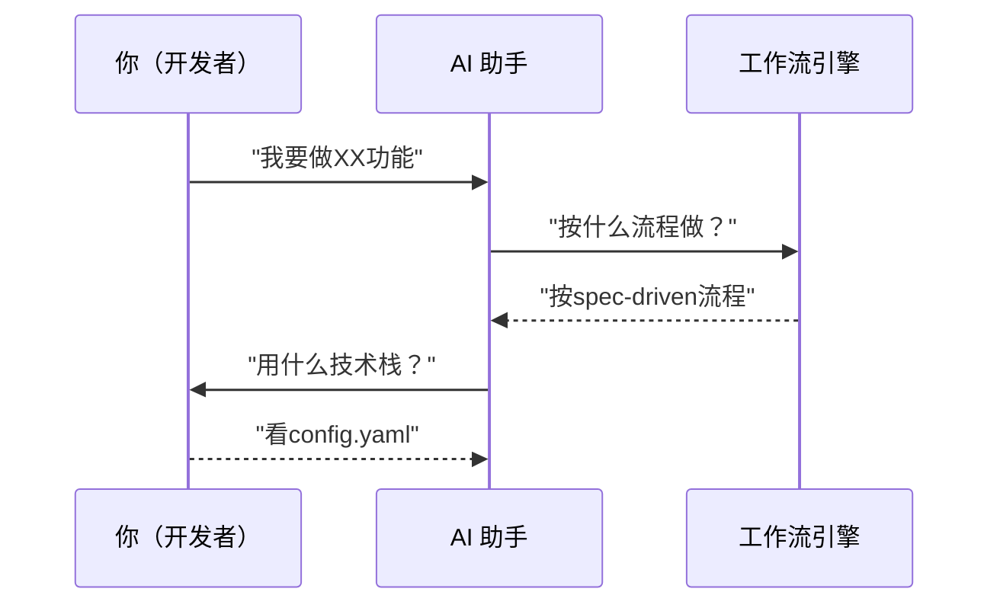
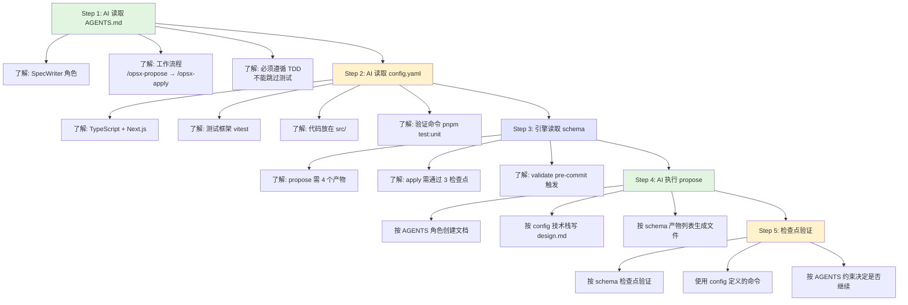
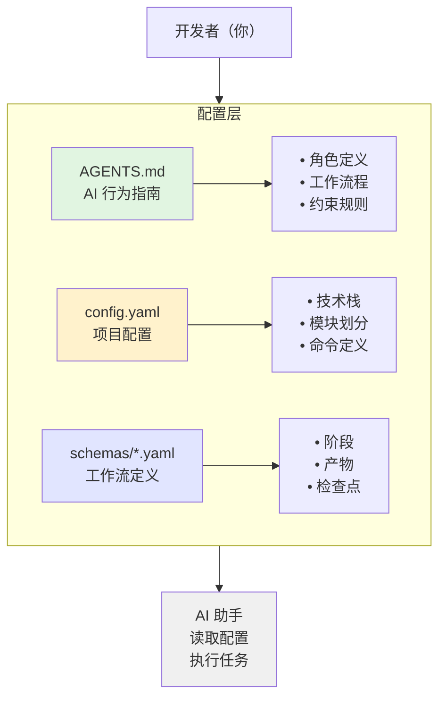

# 02 - 配置体系详解

> 理解 AGENTS.md、config.yaml、schemas 三层配置的关系和区别

## 为什么需要三层配置？

想象一个团队：



不同角色需要不同的信息：

- **你**：需要知道项目的技术栈、命令怎么用
- **AI**：需要知道它应该扮演什么角色、遵循什么规则
- **引擎**：需要知道每个阶段的具体步骤和检查点

这就是三层配置存在的意义。

## 三层配置对比

| 层级        | 文件                      | 面向对象   | 核心内容           | 类比           |
| ----------- | ------------------------- | ---------- | ------------------ | -------------- |
| **Layer 1** | `AGENTS.md`               | AI 助手    | 角色、流程、约束   | **员工手册**   |
| **Layer 2** | `openspec/config.yaml`    | 项目/人    | 技术栈、模块、命令 | **项目说明书** |
| **Layer 3** | `openspec/schemas/*.yaml` | 工作流引擎 | 阶段、产物、检查点 | **操作流程图** |

## Layer 1: AGENTS.md（AI 行为指南）

### 作用

告诉 AI 助手：

1. 在这个项目中你是什么角色？
2. 你应该遵循什么流程？
3. 有哪些约束和规则？

### 内容示例

```markdown
---
target: AI Assistant
purpose: Operational guidelines for Niuma project
---

# AI Agent Guidelines

## 角色定义

### SpecWriter

- 创建 proposal.md（为什么做）
- 创建 design.md（怎么做）
- 创建 specs/\*.md（做什么）

### Developer

- 读取 specs 实现代码
- 遵循 TDD（Red→Green→Refactor）
- 确保通过所有检查点

### Tester

- 先写测试再写实现
- 覆盖正常/边界/异常情况

## 工作流程

| 阶段    | 命令          | 目的     |
| ------- | ------------- | -------- |
| Explore | /opsx-explore | 澄清需求 |
| Propose | /opsx-propose | 创建规格 |
| Apply   | /opsx-apply   | TDD实现  |

## 约束

SHALL:

- 使用 TDD (Red→Green→Refactor)
- 先写测试再写实现
- 遵循目录约定

SHALL NOT:

- 跳过测试
- 忽略类型错误
- 直接推送到 main
```

### 关键点

- **目标读者是 AI**：用人称"你"来指代 AI
- **描述行为规范**：告诉 AI 应该做什么、不应该做什么
- **不涉及技术细节**：技术栈在 config.yaml 中定义

## Layer 2: config.yaml（项目配置）

### 作用

定义项目的基本信息：

1. 这是什么项目？
2. 使用什么技术栈？
3. 项目如何组织？
4. 常用命令有哪些？

### 内容示例

```yaml
schema: spec-driven # 默认工作流

context:
  project:
    name: Niuma
    description: Multi-agent AI assistant system
    language: TypeScript
    runtime: Node.js >=22.0.0
    package_manager: pnpm

  tech_stack:
    language: TypeScript 5.9+
    test_framework: vitest
    web_framework: Next.js 15
    ui: React 19 + Tailwind CSS
    runtime: Node.js >=22.0.0

  modules:
    niuma-engine:
      purpose: Agent core implementation
      scope: Agent base classes, tools, memory
      tests: src/niuma-engine/tests/
    src:
      purpose: Next.js web service
      scope: Web UI, API routes, components
      tests: src/tests/

  conventions:
    - ES Module syntax
    - Strict TypeScript
    - Async/await
    - Identifiers in English

  commands:
    install: pnpm install
    dev: pnpm dev
    build: pnpm build
    test: pnpm test
    test_unit: pnpm test:unit
    lint: pnpm lint
    type_check: pnpm type-check
```

### 关键点

- **目标读者是开发者**：描述项目的基本信息
- **供 AI 参考**：AI 会读取此文件了解项目技术栈
- **不定义流程**：流程在 schemas 中定义

## Layer 3: schemas/\*.yaml（工作流定义）

### 作用

定义具体的工作流：

1. 有哪些阶段？
2. 每个阶段产生什么产物？
3. 阶段之间有什么检查点？

### 内容示例

```yaml
# openspec/schemas/spec-driven.yaml

schema:
  name: spec-driven
  version: "1.0"
  description: Specification-driven development

workflow:
  name: spec-driven-development
  phases:
    - id: explore
      name: Explore
      trigger: manual
      command: /opsx-explore

    - id: propose
      name: Propose
      trigger: manual
      command: /opsx-propose
      produces: [proposal.md, design.md, specs/, tasks.md]

    - id: apply
      name: Apply
      trigger: manual
      command: /opsx-apply
      gates: [test:unit, lint, type-check]

    - id: validate
      name: Validate
      trigger: pre-commit
      blocking: true
      gates: [test:all, type-check, lint]

    - id: archive
      name: Archive
      trigger: post-merge
      action: auto-archive
```

#### spike.yaml

```yaml
# openspec/schemas/spike.yaml

schema:
  name: spike
  version: "1.0"
  description: Technical research and exploratory investigation workflow

workflow:
  name: spike-workflow
  phases:
    - id: define
      name: Define
      trigger: manual
      command: /opsx-spike
      produces: [research-question.md]

    - id: explore
      name: Explore
      trigger: manual
      produces: [exploration-log.md, findings/]
      gates: [timebox-respected, findings-documented]

    - id: conclude
      name: Conclude
      trigger: manual
      produces: [decision.md]
      gates: [decision-recorded, next-steps-defined]

    - id: archive
      name: Archive
      trigger: post-merge
      action: auto-archive-spike

timebox:
  default: 4h
  max: 2d
  warning_threshold: 80%
  enforce: soft
```

### 关键点

- **目标读者是工作流引擎**：定义机器可解析的流程
- **可扩展**：可以添加新的 schema（如 spike.yaml）
- **独立于项目**：schema 定义可以复用到不同项目

## 三层配置如何配合？

### 场景：执行 `/opsx-propose add-auth`



## 配置层级关系图



## 常见误解澄清

### 误解 1：AGENTS.md 和 config.yaml 重复？

**错误理解**：

```
两者都定义了命令，不是重复吗？
```

**正确理解**：

```
AGENTS.md: 告诉 AI "有这些命令可用"
config.yaml: 定义命令具体怎么执行

示例：
AGENTS.md: "测试命令是 test:unit"
config.yaml: "test:unit = pnpm test:unit"
```

### 误解 2：为什么不把配置合并成一个文件？

**分层的好处**：

1. **关注点分离**：
   - AGENTS.md：只关心 AI 行为
   - config.yaml：只关心项目信息
   - schemas：只关心工作流定义

2. **可复用性**：
   - schemas/\*.yaml 可以在不同项目间复用
   - AGENTS.md 可以根据项目调整，无需改引擎

3. **可维护性**：
   - 改 AI 行为 → 只改 AGENTS.md
   - 改技术栈 → 只改 config.yaml
   - 改流程 → 只改 schemas

### 误解 3：AI 只读 AGENTS.md？

**错误理解**：

```
AI 的行为只由 AGENTS.md 定义
```

**正确理解**：

```
AI 会读取所有三层配置：
1. AGENTS.md → 了解自己的角色和行为规范
2. config.yaml → 了解项目上下文
3. schemas/*.yaml → 了解当前阶段的任务
```

## 实际案例分析

### 案例：修改测试框架从 vitest 到 jest

**需要修改的文件**：

```
1. openspec/config.yaml
   修改:
     test_framework: vitest → jest
     test_unit: pnpm test:unit → pnpm jest

2. 其他文件不需要修改：
   - AGENTS.md: 只说"运行测试"，不指定工具
   - schemas: 只说"检查 test:unit"，不指定工具
```

**为什么这样设计？**

- AGENTS.md 保持抽象（"运行测试"）
- config.yaml 保持具体（"用 jest 运行"）
- 修改只在一处，不影响其他配置

### 案例：添加新的工作流阶段

**需要修改的文件**：

```
1. openspec/schemas/spec-driven.yaml
   添加新的 phase 定义

2. .opencode/command/opsx-xxx.md
   添加新的命令定义

3. .opencode/skills/openspec-xxx/SKILL.md
   添加新的技能定义

4. 可选：AGENTS.md
   如果新阶段需要新的 AI 行为，才需要更新
```

**示例：添加 Spike 工作流**

```
1. openspec/schemas/spike.yaml
   定义 spike 工作流的阶段和产物

2. .opencode/command/opsx-spike.md
   定义 /opsx-spike 命令

3. .opencode/skills/openspec-spike/SKILL.md
   定义 spike 技能逻辑

4. docs/openspec/03-workflows.md
   添加 spike 工作流文档
```

**为什么这样设计？**

- 流程变化不影响项目配置
- 项目配置变化不影响 AI 行为规范
- 各层独立演进

## 配置优先级

当配置冲突时（虽然应该避免）：

```
优先级从高到低：

1. schemas/*.yaml（最具体）
   └── 定义当前工作流的特定规则

2. openspec/config.yaml（中等）
   └── 定义项目级别的通用配置

3. AGENTS.md（最通用）
   └── 定义跨项目的 AI 行为准则
```

**示例**：

```
AGENTS.md: "必须写测试"
config.yaml: "测试框架是 vitest"
schemas: "此阶段运行 pnpm test:unit"

执行顺序：
1. 引擎读取 schema："运行 test:unit"
2. 解析 config："test:unit = pnpm vitest run"
3. AI 确认 AGENTS："符合'必须写测试'原则"
```

## 下一步

- **[工作流详解](03-workflows.md)** - 深入了解 spec-driven 和 bugfix 的具体流程
- **[命令参考](04-commands.md)** - 查看所有 `/opsx-*` 命令的详细用法
- **[目录结构](05-directory-structure.md)** - 理解文件组织的最佳实践
