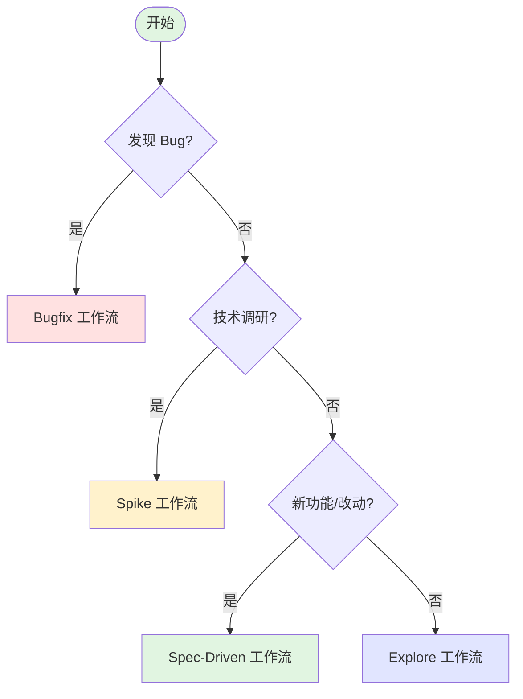
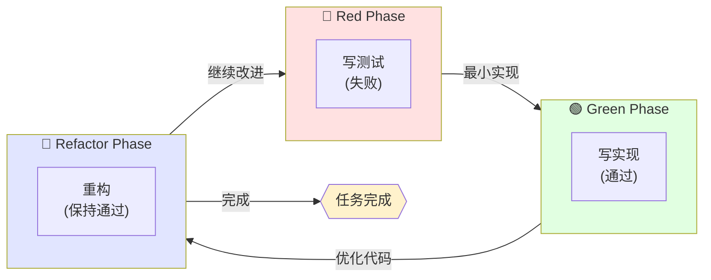
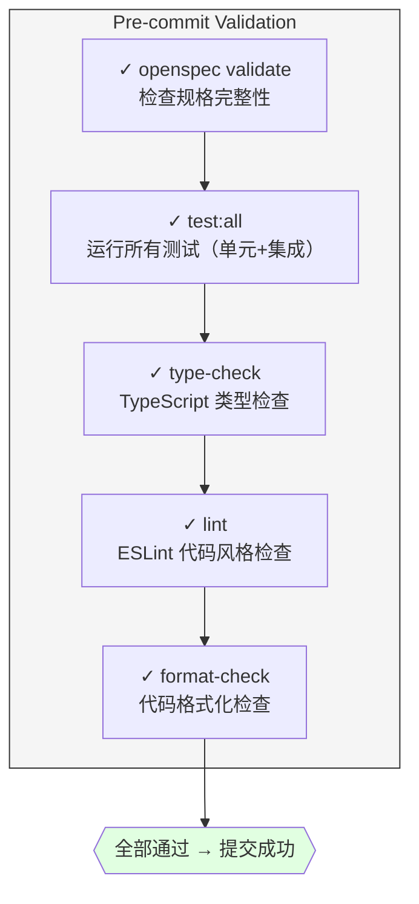
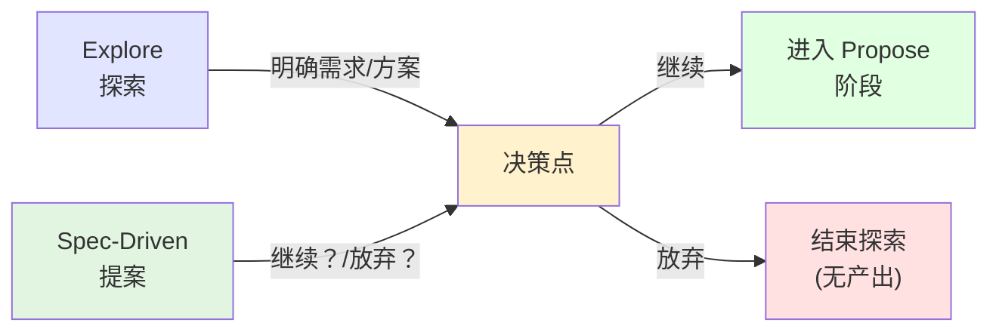
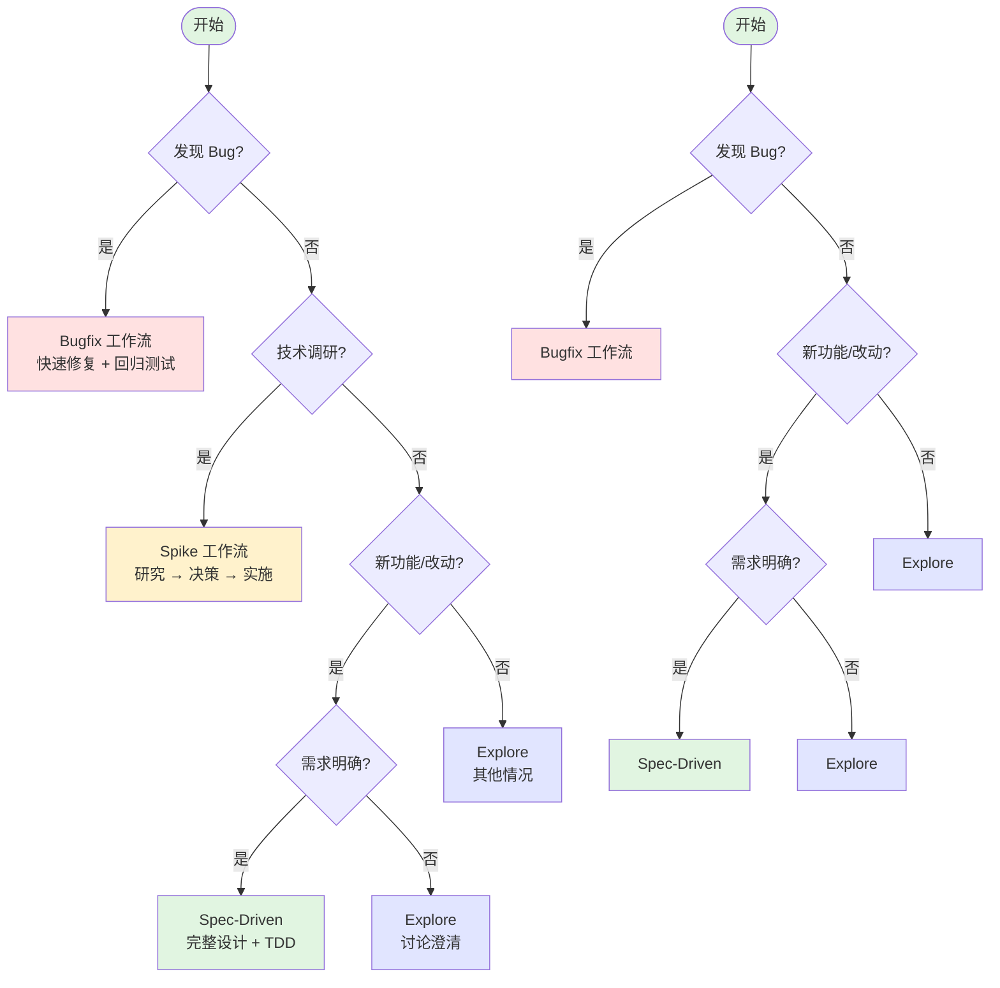

# 03 - 工作流详解

> 深入理解 spec-driven、bugfix、spike、explore 四种工作流

## 工作流选择决策树



## 工作流对比

| 维度         | Spec-Driven      | Bugfix        | Spike          | Explore        |
| ------------ | ---------------- | ------------- | -------------- | -------------- |
| **适用场景** | 新功能、架构改动 | Bug 修复      | 技术调研、选型 | 需求澄清、讨论 |
| **核心目标** | 设计先行         | 快速修复      | 探索并决策     | 明确方向       |
| **产物数量** | 多（4+文档）     | 少（2-3文档） | 中等（3文档）  | 无固定         |
| **时间投入** | 前期设计多       | 快速定位      | 时间盒限制     | 灵活           |
| **检查点**   | 完整             | 核心检查      | 无             | 无             |

## Spec-Driven 工作流

### 概述

**核心理念**：Specification First（规格先行）

在开始编码之前，先回答三个问题：

1. **Why** - 为什么要做这个？（proposal.md）
2. **How** - 技术上怎么做？（design.md）
3. **What** - 具体做什么？（specs/\*.md）

### 阶段详解

#### Phase 1: Explore（探索）- 可选

**触发条件**：需求不明确，需要讨论

**目标**：澄清需求，明确范围

**活动**：

```
开发者: "我想做实时协作功能"
    ↓
AI: "实时协作有多种实现方式："
    "1. WebSocket - 实时但复杂"
    "2. SSE - 简单但单向"
    "3. 轮询 - 简单但延迟高"
    "你的使用场景是什么？"
    ↓
开发者: "需要双向实时同步"
    ↓
AI: "建议使用 WebSocket"
    "需要考虑：连接管理、断线重连、并发控制"
    ↓
开发者: "明白了，先做 MVP"
```

**产物**：讨论记录（可选）

---

#### Phase 2: Propose（提案）

**触发条件**：需求明确，开始设计

**目标**：创建完整的设计文档

**产物**：

```
openspec/changes/<name>/
├── .openspec.yaml          # 变更元数据
├── proposal.md             # Why：为什么要做
├── design.md               # How：技术方案
├── specs/                  # What：详细规格
│   └── <capability>/
│       └── spec.md
└── tasks.md                # When：任务列表
```

**文档详解**：

**proposal.md** - 为什么做？

```markdown
# Proposal: 添加暗黑模式

## 问题

用户反馈界面太亮，夜间使用刺眼

## 目标

支持跟随系统/手动切换的暗黑模式

## 成功标准

- [ ] 支持亮色/暗黑/跟随系统三种模式
- [ ] 切换无闪烁
- [ ] 所有组件适配
```

**design.md** - 怎么做？

````markdown
# Design: 暗黑模式实现

## 技术选型

- **主题管理**: CSS 变量（`--color-*`）管理主题色
- **持久化**: localStorage 存储用户偏好
- **系统同步**: matchMedia API 监听系统主题

## 架构设计

```
src/
├── providers/
│   └── ThemeProvider.tsx    # 主题上下文提供者
├── hooks/
│   └── useTheme.ts           # 主题切换 Hook
├── components/
│   └── ThemeToggle.tsx       # 主题切换组件
└── styles/
    └── themes/
        ├── light.css         # 亮色主题变量
        └── dark.css          # 暗黑主题变量
```

## 组件设计

### ThemeProvider

```tsx
interface ThemeProviderProps {
  children: React.ReactNode;
  defaultTheme?: "light" | "dark" | "system";
}

// 职责：// 1. 从 localStorage 读取用户偏好
// 2. 监听系统主题变化（matchMedia）
// 3. 注入对应的 CSS 变量
// 4. 提供主题上下文（useTheme）
```

### ThemeToggle

```tsx
// 职责：
// 1. 显示当前主题状态
// 2. 提供主题切换按钮
// 3. 三种模式循环切换：light → dark → system
```

## 数据流

```
用户点击切换
    ↓
ThemeToggle.setTheme()
    ↓
更新 localStorage
    ↓
ThemeProvider 感知变化
    ↓
更新 CSS 变量
    ↓
UI 重新渲染
```

## 技术决策

| 决策点       | 选择          | 原因                   |
| ------------ | ------------- | ---------------------- |
| 主题存储     | localStorage  | 简单可靠，无需后端     |
| CSS 方案     | CSS 变量      | 动态切换，兼容性好     |
| 系统主题监听 | matchMedia    | 浏览器原生 API，性能好 |
| 状态管理     | React Context | 轻量级，不引入额外依赖 |

## 风险与缓解

| 风险                   | 影响 | 缓解措施                                  |
| ---------------------- | ---- | ----------------------------------------- |
| 第三方组件不兼容       | 高   | 提供 CSS 变量覆盖机制，优先支持主流 UI 库 |
| localStorage 不可用    | 低   | 降级为内存存储，session 内有效            |
| 系统主题频繁切换       | 低   | 防抖处理，避免频繁重绘                    |
| SSR/SSG hydration 问题 | 中   | 使用 useEffect 避免服务端渲染不匹配       |

## 测试策略

- **单元测试**: useTheme Hook 的状态切换逻辑
- **集成测试**: ThemeProvider + ThemeToggle 组合行为
- **E2E 测试**: 用户切换主题的完整流程

## 实现顺序

1. 实现 CSS 变量主题系统
2. 实现 ThemeProvider + useTheme
3. 实现 ThemeToggle 组件
4. 适配所有现有组件
5. 添加过渡动画
````

**specs/\*.md** - 做什么？

```markdown
# Spec: 主题切换

## 场景 1: 手动切换

WHEN 用户点击主题按钮
THEN 切换主题并保存偏好

## 场景 2: 跟随系统

WHEN 用户选择"跟随系统"
THEN 监听 matchMedia 并自动切换
```

**tasks.md** - 何时做？

```markdown
# Tasks

## Red Phase

- [ ] 编写 ThemeProvider 测试
- [ ] 编写主题切换组件测试

## Green Phase

- [ ] 实现 ThemeProvider
- [ ] 实现主题切换组件

## Refactor Phase

- [ ] 优化性能
- [ ] 添加过渡动画
```

## 组件设计

### ThemeProvider

```tsx
interface ThemeProviderProps {
  children: React.ReactNode;
  defaultTheme?: "light" | "dark" | "system";
}

// 职责：
// 1. 从 localStorage 读取用户偏好
// 2. 监听系统主题变化（matchMedia）
// 3. 注入对应的 CSS 变量
// 4. 提供主题上下文useTheme）
```

### ThemeToggle

```tsx
// 职责：
// 1. 显示当前主题状态
// 2. 提供主题切换按钮
// 3. 三种模式循环切换：light → dark → system
```

## 数据流

```
用户点击切换
    ↓
ThemeToggle.setTheme()
    ↓
更新 localStorage
    ↓
ThemeProvider 感知变化
    ↓
更新 CSS 变量
    ↓
UI 重新渲染
```

## 技术决策

| 决策点       | 选择          | 原因                   |
| ------------ | ------------- | ---------------------- |
| 主题存储     | localStorage  | 简单可靠，无需后端     |
| CSS 方案     | CSS 变量      | 动态切换，兼容性好     |
| 系统主题监听 | matchMedia    | 浏览器原生 API，性能好 |
| 状态管理     | React Context | 轻量级，不引入额外依赖 |

## 风险与缓解

| 风险                  | 影响 | 缓解措施                                  |
| --------------------- | ---- | ----------------------------------------- |
| 第三方组件不兼容      | 高   | 提供 CSS 变量覆盖机制，优先支持主流 UI 库 |
| localStorage 不可用   | 低   | 降级为内存存储，session 内有效            |
| 系统主题频繁切换      | 低   | 防抖处理，避免频繁重绘                    |
| SSR/SSGhydration 问题 | 中   | 使用 useEffect 避免服务端渲染不匹配       |

## 测试策略

- **单元测试**: useThemeHook 的状态切换逻辑
- **集成测试**: ThemeProvider + ThemeToggle 组合行为
- **E2E 测试**: 用户切换主题的完整流程

## 实现顺序

1. 实现 CSS 变量主题系统
2. 实现 ThemeProvider + useTheme
3. 实现 ThemeToggle 组件
4. 适配所有现有组件
5. 添加过渡动画

`````

**specs/\*.md** - 做什么？

````markdown
# Spec: 主题切换

## 场景 1: 手动切换

WHEN 用户点击主题按钮
THEN 切换主题并保存偏好

## 场景 2: 跟随系统

WHEN 用户选择"跟随系统"
THEN 监听 matchMedia 并自动切换

`````

**tasks.md** - 何时做？

```markdown
# Tasks

## Red Phase

- [ ] 编写 ThemeProvider 测试
- [ ] 编写主题切换组件测试

## Green Phase

- [ ] 实现 ThemeProvider
- [ ] 实现主题切换组件

## Refactor Phase

- [ ] 优化性能
- [ ] 添加过渡动画
```

`````

---

#### Phase 3: Apply（实施）

**触发条件**：设计完成，开始编码

**目标**：通过 TDD 实现功能

**TDD 循环**：



**实施步骤**：

```bash
# 1. 开始实施
/opsx-apply

# 2. 针对第一个任务
## Red
pnpm test:unit ThemeProvider
# 失败 - 测试报错

## Green
# 编写 ThemeProvider 实现
pnpm test:unit ThemeProvider
# 通过 - 测试通过

## Refactor
# 优化代码结构
pnpm test:unit ThemeProvider
# 仍然通过

# 3. 标记任务完成
# 更新 tasks.md: - [x] 编写 ThemeProvider 测试

# 4. 继续下一个任务
# 重复 Red→Green→Refactor
```

**检查点**：

- `test:unit` - 单元测试必须通过
- `lint` - 代码风格检查
- `type-check` - TypeScript 类型检查

---

#### Phase 4: Validate（验证）

**触发条件**：pre-commit 钩子

**目标**：确保质量，防止问题代码进入仓库

**检查点**：



**失败处理**：

- 任一检查失败 → commit 被阻止
- 开发者修复问题 → 重新提交

---

#### Phase 5: Archive（归档）

**触发条件**：Release 发布或部署成功后（通过 GitHub Actions 自动触发）

**目标**：保存历史，清理工作区

**操作**：

```bash
# 自动执行（GitHub Actions 触发）
openspec archive <change-name>

# 效果：
# 1. 将 openspec/changes/<name>/ 移动到 openspec/changes/archive/
# 2. 同步 delta specs 到主规格
# 3. 生成归档报告
# 4. 清理工作区
```

**归档后结构**：

```
openspec/changes/
├── archive/
│   └── <change-name>/        # 归档的变更
│       ├── .openspec.yaml
│       ├── proposal.md
│       ├── design.md
│       ├── specs/
│       └── tasks.md
└── (active changes...)       # 活跃的变更
```

---

### 完整示例

```bash
# 场景：添加用户认证功能

# Step 1: 探索（可选）
/opsx-explore
> "用户认证用 JWT 还是 Session？"
< AI 讨论优缺点

# Step 2: 创建提案
/opsx-propose add-user-auth
> AI 生成完整设计文档

# Step 3: 实施
/opsx-apply
> 针对每个任务进行 TDD
> Red → Green → Refactor

# Step 4: 提交（自动验证）
git commit -m "feat: add user authentication"
> pre-commit 运行所有检查
> 全部通过 → 提交成功

# Step 5: 合并后自动归档
# openspec/changes/add-user-auth/ → archive/
```

## Bugfix 工作流

### 概述

**核心理念**：快速定位、最小修复、回归测试

与 Spec-Driven 的区别：

- 不需要完整的设计文档
- 重点是根因分析和回归测试
- 变更范围小，时间紧

### 阶段详解

#### Phase 1: Report（报告）

**触发条件**：发现 Bug

**目标**：记录问题现象

**产物**：

```
openspec/bugs/<bug-id>/
├── .openspec.yaml          # Bug 元数据
└── bug-report.md           # 问题描述
```

**bug-report.md 结构**：

```markdown
# Bug Report: 登录按钮无响应

## Symptom

点击登录按钮没有任何反应

## Steps to Reproduce

1. 打开首页 https://example.com
2. 点击右上角"登录"按钮
3. 观察：无反应

## Expected Behavior

应该弹出登录对话框

## Actual Behavior

无任何反应，控制台报错：
```

TypeError: Cannot read property 'show' of undefined

```

## Environment
- OS: macOS 14.2
- Browser: Chrome 120.0
- App Version: v2.3.1

## Root Cause Analysis (Optional)
可能是事件绑定问题

## Workaround (Optional)
刷新页面后重新点击
```

---

#### Phase 2: Reproduce（复现）

**目标**：确认 Bug 可复现

**活动**：

```
AI: 尝试在本地环境复现...

1. 检查代码：找到登录按钮组件
2. 本地启动：pnpm dev
3. 复现步骤：按报告步骤操作
4. 确认现象：确实无反应，控制台报错

结论：Bug 确认存在
```

---

#### Phase 3: Fix（修复）

**目标**：定位根因，实施修复

**产物**：

```
openspec/bugs/<bug-id>/
├── .openspec.yaml
├── bug-report.md
└── fix.md                    # 新增：修复方案
```

**fix.md 结构**：

````markdown
# Fix: 登录按钮无响应

## Root Cause

LoginButton 组件中的 handleClick 方法使用了错误的 this 绑定：

```tsx
// 错误代码
<button onClick={this.handleClick}>
```
`````

在类组件中，this 不会自动绑定。

## Fix Description

改为箭头函数：

```tsx
// 修复后
<button onClick={() => this.handleClick()}>
```

## Files Changed

- src/components/LoginButton.tsx

## Testing Strategy

1. 单元测试：测试点击事件
2. 手动测试：本地验证修复

## Regression Test

```typescript
// src/tests/regression/login-button.test.ts
it('should open login modal when clicked', () => {
  render(<LoginButton />);
  fireEvent.click(screen.getByText('登录'));
  expect(screen.getByTestId('login-modal')).toBeVisible();
});
```

````

**修复原则**：
- ✅ 最小化改动（只修 Bug，不重构）
- ✅ 必须有回归测试
- ✅ 记录根因（防止再次发生）

#### Phase 4: Validate（验证）

与 Spec-Driven 相同，运行：
- 回归测试（必须通过）
- 所有现有测试（确保没破坏）
- Lint 和类型检查

---

#### Phase 4: Validate（验证）

与 Spec-Driven 相同，运行：
- 回归测试（必须通过）
- 所有现有测试（确保没破坏）
- Lint 和类型检查

---

#### Phase 5: Archive（归档）

与 Spec-Driven 相同，自动归档到 `openspec/bugs/archive/`。

---

### 完整示例

```bash
# 场景：修复登录按钮失效

# Step 1: 启动 Bugfix
/opsx-bugfix login-button-error

# Step 2: 填写报告
> AI 引导填写 bug-report.md

# Step 3: 复现
> AI 尝试复现问题
> 确认 Bug 存在

# Step 4: 修复
> AI 分析根因：this 绑定问题
> 实施修复
> 添加回归测试

# Step 5: 验证并提交
git commit -m "fix: login button click handler"
> 回归测试通过
> 提交成功

# Step 6: 自动归档
````

## Spike 工作流

### 概述

**核心理念**：时间盒限制的探索性研究

当你需要：

- 评估技术选型（Redux vs Zustand？）
- 验证技术可行性（能否集成某 API？）
- 探索未知领域（新框架、新协议）
- 调查性能问题（为什么慢？如何优化？）

就用 Spike 工作流。

### 与 Explore 的区别

| 维度       | Spike                   | Explore                     |
| ---------- | ----------------------- | --------------------------- |
| **目标**   | 得出明确决策            | 澄清需求或方案              |
| **产物**   | 必须产出决策文档        | 无固定产物                  |
| **时间**   | 有时间盒限制            | 灵活                        |
| **下一步** | 转为 Spec-Driven 或放弃 | 可能转为 Spec-Driven/Bugfix |

### 阶段详解

#### Phase 1: Define（定义）

**触发条件**：开始技术调研

**目标**：明确研究问题和范围

**产物**：

```
openspec/changes/<spike-name>/
├── .openspec.yaml              # 调研配置
└── research-question.md        # 研究问题定义
```

**research-question.md 结构**：

```markdown
# Research Question: 技术选型调研

## Problem_Statement

需要选择一个状态管理方案，要求：

- 支持 TypeScript
- 轻量级
- 易于测试

## Research_Goals

1. 评估 Redux Toolkit vs Zustand vs Context API
2. 测试在我们场景下的性能
3. 评估学习曲线

## Scope

**In Scope**:

- 三个方案的对比分析
- 简单原型验证
- 团队技能评估

**Out of Scope**:

- 完整实现
- 性能基准测试
- 长期维护成本分析

## Timebox

4 小时
```

---

#### Phase 2: Explore（探索）

**目标**：进行研究、实验、收集发现

**活动**：

```
1. 文档阅读
   - 阅读官方文档
   - 查看社区评价
   - 搜索最佳实践

2. 代码实验
   - 编写原型代码
   - 测试关键场景
   - 验证可行性

3. 记录发现
   - 实时记录发现
   - 包括失败的尝试
   - 记录假设和验证
```

**产物**：

```
openspec/changes/<spike-name>/
├── .openspec.yaml
├── research-question.md
└── exploration-log.md          # 新增：探索日志
```

**exploration-log.md 结构**：

```markdown
# Exploration Log: 状态管理调研

## Approach

按以下维度对比三个方案：

1. 包大小
2. API 复杂度
3. TypeScript 支持
4. 测试友好度

## Findings

### Redux Toolkit

- **大小**: ~11KB gzipped
- **优点**: 生态丰富，工具链完善
- **缺点**: 学习曲线陡峭，样板代码多

### Zustand

- **大小**: ~1KB gzipped
- **优点**: 极简 API，TypeScript 友好
- **缺点**: 社区较小，插件较少

### Context API

- **大小**: 0KB (built-in)
- **优点**: 无需额外依赖
- **缺点**: 频繁更新时性能问题

## Experiments_Conducted

### 实验 1: 性能测试

创建 1000 个组件，测试渲染性能：

- Redux: ~45ms
- Zustand: ~30ms
- Context: ~120ms (有闪烁)

### 实验 2: 代码复杂度

实现相同功能所需代码行数：

- Redux: ~80 行
- Zustand: ~25 行
  - Context: ~40 行
```

---

#### Phase 3: Conclude（结论）

**目标**：综合发现，形成决策

**产物**：

```
openspec/changes/<spike-name>/
├── .openspec.yaml
├── research-question.md
├── exploration-log.md
└── decision.md                 # 新增：决策文档
```

**decision.md 结构**：

```markdown
# Decision: 状态管理方案选择

## Summary

经过 4 小时调研，评估了 Redux Toolkit、Zustand 和 Context API 三个方案。

## Recommendation

**采用 Zustand 作为状态管理方案**

## Rationale

1. **包大小**: Zustand 仅 1KB，对首屏加载影响最小
2. **开发效率**: API 极简，减少样板代码
3. **TypeScript**: 原生支持，无需额外配置
4. **性能**: 在实验中表现最佳

## Alternatives_Considered

### Redux Toolkit

**为什么不选**:

- 对我们当前复杂度来说是过度设计
- 学习成本较高
- 样板代码增加维护负担

### Context API

**为什么不选**:

- 性能测试中出现渲染问题
- 随着功能增长，Provider 嵌套可能变得复杂

## Risks

1. **社区规模**: Zustand 社区比 Redux 小，第三方资源较少
2. **长期维护**: 项目相对年轻，长期支持不确定

**缓解措施**:

- 保持状态逻辑简单，便于未来迁移
- 封装状态层，隐藏实现细节

## Next_Steps

1. 创建实现变更: `/opsx-propose add-zustand-store`
2. 迁移现有全局状态
3. 编写团队使用指南
```

#### Phase 4: Archive（归档）

**触发条件**：post-merge 到 main 分支

**目标**：保存调研历史

Spike 完成后，决策文档成为重要的历史记录。即使决定不采用某方案,调研过程也有价值。

---

### 完整示例

```bash
# 场景：调研实时协作方案

# Step 1: 启动 Spike
/opsx-spike webrtc-vs-socketio

# Step 2: 定义问题
> AI 引导填写 research-question.md
> "需要选择实时同步技术"

# Step 3: 进行探索
> 阅读 WebSocket 文档
> 测试 Socket.io 示例
> 验证 WebRTC 可行性
> 记录发现

# Step 4: 形成决策
> AI 协助撰写 decision.md
> 明确推荐和理由

# Step 5: 后续行动
# 根据决策创建 Spec-Driven 变更实施
/opsx-propose implement-realtime-collab
```

### Spike 最佳实践

1. **严格遵守时间盒**: 到期后必须下结论，即使是不完整的结论
2. **记录失败**: 失败的实验同样有价值
3. **可丢弃代码**: Spike 代码不需要测试，标记为实验性质
4. **明确下一步**: 每个 Spike 必须有清晰的后续行动

## Explore 工作流

### 概述

**核心理念**：先想清楚，再动手做

当你：

- 不确定需求是否合理
- 不知道技术方案怎么选
- 想评估风险或可行性

就用 Explore 模式。

### 特点

- **无固定产物**：可能有讨论记录，但非必须
- **可中断**：随时结束，不一定要进入实施
- **灵活**：可以讨论任何问题

### 使用场景

#### 场景 1：技术选型

```bash
/opsx-explore
> "数据库用 PostgreSQL 还是 MongoDB？"

AI 讨论：
- PostgreSQL: 关系型，强一致性，复杂查询
- MongoDB: 文档型，灵活 Schema，水平扩展
- 建议：你的场景需要复杂查询，推荐 PostgreSQL

结论：选用 PostgreSQL
（可选择创建 spec-driven 变更实施）
```

#### 场景 2：需求澄清

```bash
/opsx-explore
> "用户说想要'智能推荐'，这是什么意思？"

AI 引导：
- 基于用户历史的协同过滤？
- 基于内容的标签匹配？
- 基于热度的排行榜？

通过讨论明确具体需求
```

#### 场景 3：风险评估

```bash
/opsx-explore
> "引入微服务架构有什么风险？"

AI 分析：
- 运维复杂度增加
- 分布式事务处理
- 服务间通信延迟
- 建议：当前规模不建议，先模块化单体

结论：暂缓微服务，先模块化
```

### 与 Spec-Driven 的关系



## 工作流选择指南

### 决策树



### 快速判断

| 如果你...             | 选择          |
| --------------------- | ------------- |
| 说"有个 bug"          | Bugfix        |
| 说"想加功能"          | Spec-Driven   |
| 说"调研一下/评估一下" | Spike         |
| 说"A 和 B 哪个好"     | Spike         |
| 说"能不能/是否可行"   | Spike/Explore |
| 说"不确定怎么做"      | Explore       |
| 说"帮忙看看"          | Explore       |

## 下一步

- **[命令参考](04-commands.md)** - 查看所有 `/opsx-*` 命令的详细用法
- **[目录结构](05-directory-structure.md)** - 理解文件组织的最佳实践
- **[最佳实践](06-best-practices.md)** - 学习模式与反模式

```

```
