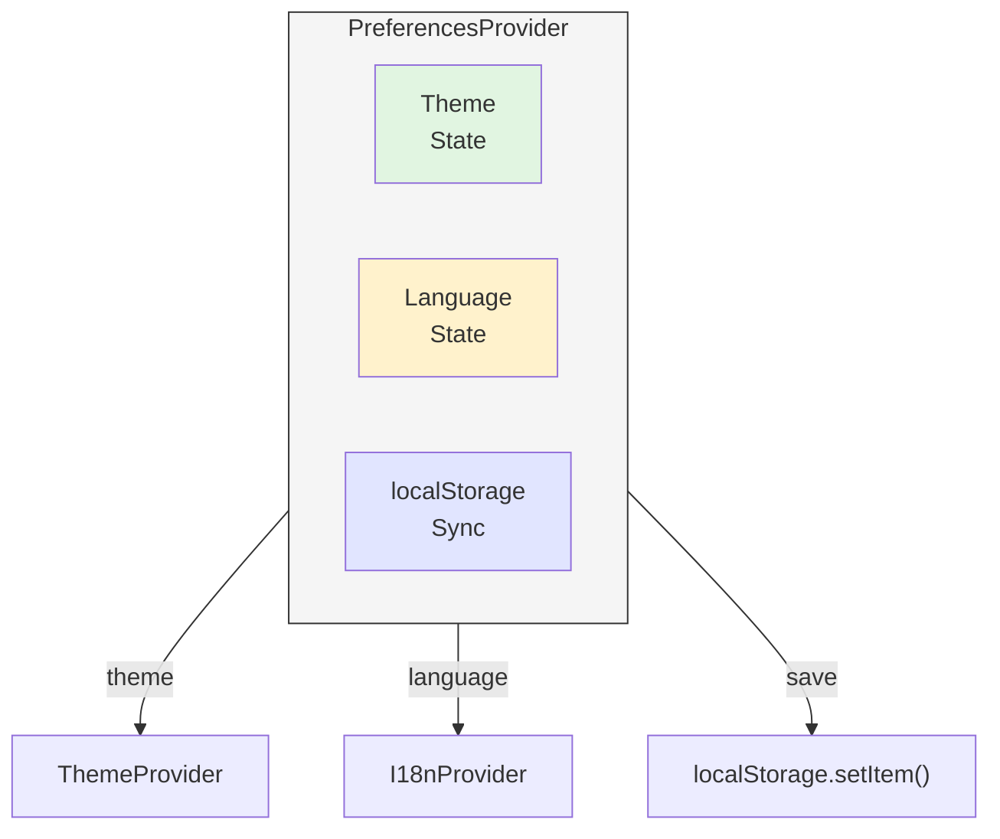

# 07 - 完整示例演示

> 一个端到端的示例：从想法到代码完成

## 示例场景

**需求**：为应用添加"用户偏好设置"功能，允许用户选择主题（亮色/暗色）和语言（中文/英文）。

我们将演示完整的 OpenSpec Harness 工作流程。

---

## Phase 1: 探索需求（可选）

如果你不确定需求细节，先探索：

```bash
/opsx-explore
```

**AI 对话示例**：

```
用户：我想添加用户偏好设置功能

AI：好的，先明确几个问题：

1. 偏好设置包括哪些？
   - 主题（亮色/暗色）
   - 语言（中文/英文）
   - 还有其他吗？

2. 偏好存储在哪里？
   - 本地存储（localStorage）
   - 同步到服务器（需要登录）

3. 什么时候加载偏好？
   - 应用启动时
   - 用户更改时实时生效

用户：
1. 只要主题和语言
2. 本地存储，不需要登录
3. 应用启动时加载，更改时实时生效

AI：明确了！这是一个本地偏好设置功能，我来创建提案。
```

**探索阶段产物**（可选）：

- 问题澄清记录
- 需求截图或笔记

---

## Phase 2: 创建提案

### 2.1 启动提案

```bash
/opsx-propose add-user-preferences
```

### 2.2 AI 生成的文档

AI 会自动创建以下文件：

```
openspec/changes/add-user-preferences/
├── .openspec.yaml          # 变更元数据
├── proposal.md             # 提案文档
├── design.md               # 设计文档
├── specs/                  # 规格目录
│   └── preferences/
│       ├── theme.md        # 主题规格
│       └── language.md     # 语言规格
└── tasks.md                # 任务列表
```

### 2.3 proposal.md 示例

```markdown
# Proposal: 添加用户偏好设置

## 问题

用户无法自定义应用的外观和行为：

- 无法切换亮色/暗色主题
- 无法选择界面语言
- 每次访问都需要重新设置

## 目标

实现本地偏好设置，允许用户：

1. 切换主题（亮色/暗色）
2. 切换语言（中文/英文）
3. 偏好持久化，下次访问自动加载

## 成功标准

- [ ] 用户可以切换主题，切换后立即生效
- [ ] 用户可以切换语言，切换后立即生效
- [ ] 偏好保存到 localStorage
- [ ] 应用启动时自动加载偏好
- [ ] 移动端和桌面端均可用

## 范围

**包含**：

- 主题切换（亮色/暗色）
- 语言切换（中文/英文）
- localStorage 存储

**不包含**：

- 服务器同步（需要登录功能）
- 自定义字体大小
- 其他高级偏好

## 影响范围

- `src/components/Settings/` - 新建设置页面
- `src/hooks/usePreferences.ts` - 新建偏好 Hook
- `src/context/ThemeContext.tsx` - 扩展主题支持
- `src/i18n/` - 国际化支持
```

### 2.4 design.md 示例

````markdown
# Design: 用户偏好设置

## 技术方案

### 1. 状态管理

使用 React Context + localStorage 实现偏好管理：


````

````

### 2. 数据结构

```typescript
// src/types/preferences.ts
interface UserPreferences {
  theme: 'light' | 'dark' | 'system';
  language: 'zh-CN' | 'en-US';
}

// localStorage key
const STORAGE_KEY = 'user_preferences';
````

### 3. 核心实现

#### 3.1 usePreferences Hook

```typescript
// src/hooks/usePreferences.ts
export function usePreferences() {
  const [preferences, setPreferences] = useState<UserPreferences>(() => {
    // 初始化时从 localStorage 加载
    const stored = localStorage.getItem(STORAGE_KEY);
    return stored ? JSON.parse(stored) : DEFAULT_PREFERENCES;
  });

  const updatePreferences = useCallback((updates: Partial<UserPreferences>) => {
    setPreferences((prev) => {
      const next = { ...prev, ...updates };
      localStorage.setItem(STORAGE_KEY, JSON.stringify(next));
      return next;
    });
  }, []);

  return { preferences, updatePreferences };
}
```

### 4. API 设计

#### 4.1 设置页面

```typescript
// 设置页面组件
<SettingsPage>
  <ThemeSelector value={preferences.theme} onChange={handleThemeChange} />
  <LanguageSelector value={preferences.language} onChange={handleLanguageChange} />
</SettingsPage>
```

#### 4.2 主题切换

```typescript
// 主题切换组件
<ThemeSelector
  options={[
    { value: 'light', label: '亮色模式' },
    { value: 'dark', label: '暗色模式' },
    { value: 'system', label: '跟随系统' },
  ]}
  value={preferences.theme}
  onChange={(theme) => updatePreferences({ theme })}
/>
```

### 5. 风险与缓解

| 风险                      | 缓解措施               |
| ------------------------- | ---------------------- |
| localStorage 容量限制     | 偏好数据 < 10KB，安全  |
| 浏览器不支持 localStorage | 检测并使用内存模式     |
| 主题切换闪烁              | 使用 CSS 变量 + 预加载 |

### 6. 测试策略

- **单元测试**: usePreferences Hook
- **集成测试**: 设置页面交互
- **E2E 测试**: Cypress 测试主题切换

````

### 2.5 specs/theme.md 示例

```markdown
# Spec: 主题设置

## 场景 1: 用户切换主题

### WHEN 用户选择"暗色模式"
**前提条件**：
- 用户已进入设置页面
- 当前主题为"亮色模式"

**操作步骤**：
1. 用户点击主题选择器
2. 用户选择"暗色模式"

### THEN 主题立即切换
**预期结果**：
- 页面背景变为暗色
- 文字颜色变为浅色
- 所有组件主题同步更新
- localStorage 保存 `{ theme: 'dark' }`

**验证**：
```typescript
expect(localStorage.getItem('user_preferences')).toContain('"theme":"dark"');
expect(document.documentElement.classList.contains('dark')).toBe(true);
````

---

## 场景 2: 应用启动时加载主题

### WHEN 用户打开应用

**前提条件**：

- localStorage 中已保存 `{ theme: 'dark' }`

### THEN 应用使用保存的主题

**预期结果**：

- 页面直接渲染为暗色
- 无闪烁或跳动
- 主题选择器显示"暗色模式"

---

## 场景 3: 用户选择"跟随系统"

### WHEN 用户选择"跟随系统"主题

**前提条件**：

- 系统主题为"暗色"

### THEN 应用跟随系统主题

**预期结果**：

- 应用使用暗色主题
- 系统切换到亮色时，应用自动切换
- localStorage 保存 `{ theme: 'system' }`

````

### 2.6 tasks.md 示例

```markdown
# Tasks: 用户偏好设置

## Red Phase（编写测试）

- [ ] 编写 usePreferences Hook 测试
  - 测试默认值
  - 测试更新偏好
  - 测试 localStorage 同步

- [ ] 编写 ThemeSelector 组件测试
  - 测试主题选项渲染
  - 测试主题切换

- [ ] 编写 LanguageSelector 组件测试
  - 测试语言选项渲染
  - 测试语言切换

- [ ] 编写设置页面集成测试
  - 测试完整交互流程

## Green Phase（实现功能）

- [ ] 实现 usePreferences Hook
  - 实现状态初始化
  - 实现 localStorage 同步
  - 实现偏好更新

- [ ] 实现 ThemeSelector 组件
  - 渲染主题选项
  - 处理主题切换
  - 连接 usePreferences

- [ ] 实现 LanguageSelector 组件
  - 渲染语言选项
  - 处理语言切换
  - 连接 i18n

- [ ] 实现设置页面
  - 集成 ThemeSelector
  - 集成 LanguageSelector
  - 添加导航入口

## Refactor Phase（优化）

- [ ] 提取颜色变量到主题配置
- [ ] 优化主题切换过渡动画
- [ ] 添加偏好导入/导出功能
````

---

## Phase 3: 实施任务

### 3.1 启动实施

```bash
/opsx-apply
```

AI 会读取 `tasks.md` 并引导你完成 TDD 循环。

### 3.2 TDD 循环示例

#### 任务 1: 编写 usePreferences Hook 测试（Red）

```typescript
// src/hooks/__tests__/usePreferences.test.ts
import { renderHook, act } from "@testing-library/react";
import { usePreferences } from "../usePreferences";

describe("usePreferences", () => {
  beforeEach(() => {
    localStorage.clear();
  });

  it("should return default preferences", () => {
    const { result } = renderHook(() => usePreferences());
    expect(result.current.preferences.theme).toBe("system");
    expect(result.current.preferences.language).toBe("zh-CN");
  });

  it("should update preferences", () => {
    const { result } = renderHook(() => usePreferences());

    act(() => {
      result.current.updatePreferences({ theme: "dark" });
    });

    expect(result.current.preferences.theme).toBe("dark");
    expect(localStorage.getItem("user_preferences")).toContain('"theme":"dark"');
  });
});
```

```bash
pnpm test:unit usePreferences

# ✗ 失败（预期：Hook 还未实现）
```

#### 任务 2: 实现 usePreferences Hook（Green）

```typescript
// src/hooks/usePreferences.ts
import { useState, useCallback } from "react";

const STORAGE_KEY = "user_preferences";
const DEFAULT_PREFERENCES = {
  theme: "system" as const,
  language: "zh-CN" as const,
};

export function usePreferences() {
  const [preferences, setPreferences] = useState(() => {
    const stored = localStorage.getItem(STORAGE_KEY);
    return stored ? JSON.parse(stored) : DEFAULT_PREFERENCES;
  });

  const updatePreferences = useCallback((updates: Partial<typeof preferences>) => {
    setPreferences((prev: typeof preferences) => {
      const next = { ...prev, ...updates };
      localStorage.setItem(STORAGE_KEY, JSON.stringify(next));
      return next;
    });
  }, []);

  return { preferences, updatePreferences };
}
```

```bash
pnpm test:unit usePreferences

# ✓ 通过
```

#### 任务 3: 重构优化（Refactor）

```typescript
// 优化：添加类型安全和错误处理
export function usePreferences() {
  const [preferences, setPreferences] = useState<UserPreferences>(() => {
    try {
      const stored = localStorage.getItem(STORAGE_KEY);
      return stored ? JSON.parse(stored) : DEFAULT_PREFERENCES;
    } catch {
      console.warn("Failed to load preferences from localStorage");
      return DEFAULT_PREFERENCES;
    }
  });

  // ... rest of the code
}
```

```bash
pnpm test:unit usePreferences

# ✓ 仍然通过
```

---

## Phase 4: 提交验证

### 4.1 运行所有检查

```bash
# 单元测试
pnpm test:unit

# 代码风格
pnpm lint

# 类型检查
pnpm type-check

# 构建
pnpm build
```

### 4.2 提交代码

```bash
# 查看变更
git status

# 添加文件
git add .

# 提交（pre-commit hook 会自动验证）
git commit -m "feat: add user preferences feature

- Add usePreferences hook with localStorage sync
- Add ThemeSelector and LanguageSelector components
- Add settings page with preference controls
- Cover with unit tests

Closes #XXX"
```

### 4.3 推送和创建 PR

```bash
# 推送分支
git push origin feature/add-user-preferences

# 创建 Pull Request（使用浏览器或 CLI）
gh pr create --title "feat: add user preferences feature" \
  --body "Implements user preference settings including theme and language selection.

**Features**:
- Theme selector (light/dark/system)
- Language selector (中文/English)
- Persistent storage via localStorage
- Auto-load on app startup

**Tests**:
- Unit tests for usePreferences hook
- Component tests for selectors
- Integration tests for settings page"
```

---

## Phase 5: 归档（自动）

合并到 main 分支后，变更会自动归档：

```
openspec/changes/
├── archive/                    # 归档目录
│   └── add-user-preferences/   # 已完成的变更
│       ├── .openspec.yaml
│       ├── proposal.md
│       ├── design.md
│       ├── specs/
│       └── tasks.md
└── (active changes only)       # 只保留活跃变更
```

---

## 完整时间线

```mermaid
gantt
    title OpenSpec 工作流程时间线
    dateFormat X
    axisFormat %H:%M

    section 探索
    探索需求 /opsx-explore :done, 09:00, 30m

    section 提案
    创建提案 /opsx-propose :done, 09:30, 30m
    审阅文档 :done, 10:00, 60m

    section 实施
    开始实施 /opsx-apply :done, 11:00, 3h
    完成 Red Phase :done, 14:00, 3h
    完成 Green Phase :done, 17:00, 16h

    section 优化
    完成 Refactor Phase :done, d2, 2h

    section 提交
    提交 PR 代码审查 :done, d2, 3h
    合并代码 自动归档 :done, d2, 5m
    完成 整个流程结束 :milestone, 14:05, 0m
```

**总耗时**：约 2 个工作日（包含首次学习的摸索时间）

---

## 关键检查点

### 提案阶段检查

- [ ] proposal.md 清楚说明 Why
- [ ] design.md 包含技术方案
- [ ] specs/ 覆盖所有场景
- [ ] tasks.md 任务列表完整

### 实施阶段检查

每个任务遵循 Red → Green → Refactor：

- [ ] **Red**: 测试编写完成且失败
- [ ] **Green**: 最小实现使测试通过
- [ ] **Refactor**: 代码优化且测试仍通过

### 提交前检查

- [ ] 所有单元测试通过
- [ ] Lint 检查通过
- [ ] 类型检查通过
- [ ] 无调试代码残留

### 合并后检查

- [ ] 自动归档成功
- [ ] archive 目录有变更记录
- [ ] 无活跃变更残留

---

## 示例 2：技术调研（Spike 工作流）

**场景**：需要为项目选择合适的状态管理方案

### Phase 1: 启动 Spike

```bash
/opsx-spike evaluate-state-management
```

AI 创建：

```
openspec/changes/evaluate-state-management/
├── .openspec.yaml              # Spike 配置（含时间盒）
├── research-question.md        # 研究问题
├── exploration-log.md          # 探索日志
├── decision.md                 # 决策文档
└── findings/                   # 研究发现
```

### Phase 2: 定义研究问题

**research-question.md**:

```markdown
# Research Question: 状态管理方案选择

## Problem_Statement

项目需要添加全局状态管理，要求：

- 包大小 < 5KB
- TypeScript 原生支持
- 学习曲线平缓

## Research_Goals

1. 评估 Redux Toolkit vs Zustand vs Context API
2. 测试实际性能表现
3. 评估团队学习成本

## Scope

**In Scope**: 基础功能、性能、易用性
**Out of Scope**: 高级功能、长期维护成本

## Timebox

4 小时
```

### Phase 3: 探索研究

记录到 **exploration-log.md**:

```markdown
# Exploration Log

## Approach

从三个维度对比：包大小、API 复杂度、性能

## Findings

### Redux Toolkit

- 大小: 11KB gzipped
- 优点: 生态丰富，工具完善
- 缺点: 样板代码多，学习曲线陡

### Zustand

- 大小: 1KB gzipped
- 优点: 极简 API，TypeScript 友好
- 缺点: 社区较小

### Context API

- 大小: 0KB (built-in)
- 优点: 无需额外依赖
- 缺点: 频繁更新时性能问题

## Experiments_Conducted

### 性能测试

1000 个组件渲染：

- Redux: ~45ms
- Zustand: ~30ms
- Context: ~120ms (闪烁)
```

### Phase 4: 形成决策

**decision.md**:

```markdown
# Decision: 采用 Zustand

## Recommendation

**采用 Zustand 作为状态管理方案**

## Rationale

1. 包大小最优（1KB vs 11KB）
2. TypeScript 原生支持
3. 性能测试表现最佳
4. API 极简，学习成本低

## Alternatives_Considered

- Redux: 过度设计，学习成本高
- Context: 性能问题，不适合复杂状态

## Next_Steps

1. 创建实施变更: `/opsx-propose add-zustand-store`
2. 预计工期: 2 天
3. 编写团队使用指南
```

### Phase 5: 转为实施

```bash
# Spike 完成后，基于决策创建 Spec-Driven 变更
/opsx-propose add-zustand-store

# 继续 Spec-Driven 流程...
```

---

## 示例 3：Bug 修复（Bugfix 工作流）

**场景**：用户报告登录按钮点击无响应

### Phase 1: 启动 Bugfix

```bash
/opsx-bugfix login-button-unresponsive
```

AI 创建：

```
openspec/bugs/login-button-unresponsive/
├── .openspec.yaml              # Bug 配置
├── bug-report.md               # 问题报告
└── fix.md                      # 修复方案
```

### Phase 2: 填写 Bug 报告

**bug-report.md**:

```markdown
# Bug Report: 登录按钮无响应

## Symptom

点击登录按钮没有任何反应

## Steps_to_Reproduce

1. 打开首页 https://example.com
2. 点击右上角"登录"按钮
3. 观察：无反应，控制台报错

## Expected_Behavior

应该弹出登录对话框

## Actual_Behavior

无任何反应，控制台报错：
```

TypeError: Cannot read property 'show' of undefined

```

## Environment

- Browser: Chrome 120
- OS: macOS 14.2
- App Version: v2.3.1

## Severity

P1 - High: 核心功能损坏
```

### Phase 3: 复现与定位

AI 分析：

```
1. 检查代码：LoginButton 组件
2. 本地启动：pnpm dev
3. 复现问题：确认 Bug 存在
4. 分析根因：this 绑定问题
```

### Phase 4: 实施修复

**fix.md**:

````markdown
# Fix: 登录按钮无响应

## Root Cause

LoginButton 组件使用了错误的 this 绑定：

```tsx
// 错误代码
<button onClick={this.handleClick}>
```

在类组件中，this 不会自动绑定。

## Fix Description

改为箭头函数：

```tsx
// 修复后
<button onClick={() => this.handleClick()}>
```

## Files Changed

- src/components/LoginButton.tsx

## Testing Strategy

1. 单元测试：测试点击事件
2. 手动测试：本地验证修复

## Regression Test

```typescript
// src/tests/regression/login-button.test.ts
it('should open login modal when clicked', () => {
  render(<LoginButton />);
  fireEvent.click(screen.getByText('登录'));
  expect(screen.getByTestId('login-modal')).toBeVisible();
});
```
````

### Phase 5: 验证与提交

```bash
# 运行回归测试
pnpm test:unit login-button

# 运行所有测试确保没有破坏
pnpm test:all

# 提交
git add .
git commit -m "fix: login button click handler binding

- Fix this binding in LoginButton component
- Add regression test to prevent recurrence

Fixes login-button-unresponsive"

# 合并后自动归档到 openspec/bugs/archive/
```

---

## 恭喜！🎉

你已经完成了一个完整的 OpenSpec Harness 工作流程。

### 学到了什么？

1. **探索阶段**：如何澄清需求
2. **提案阶段**：如何创建完整的设计文档
3. **实施阶段**：如何用 TDD 方式实现功能
4. **验证阶段**：如何确保代码质量
5. **归档阶段**：如何保留变更历史

### 下一步

- **学习更多工作流**：→ [03-工作流](03-workflows.md)
- **深入命令**：→ [04-命令参考](04-commands.md)
- **最佳实践**：→ [06-最佳实践](06-best-practices.md)

### 需要帮助？

遇到问题？查看 [06-最佳实践 - 常见问题](06-best-practices.md#常见问题解决)
