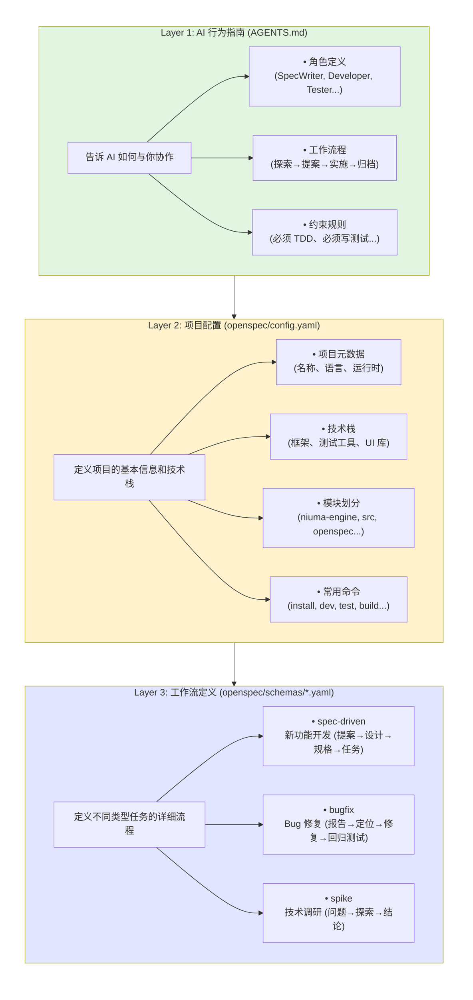
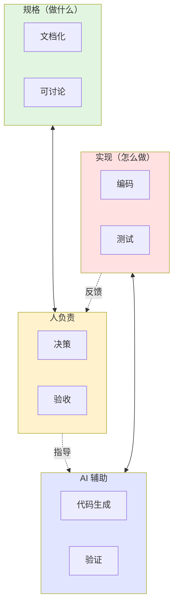

# OpenSpec Harness Engineering 环境

> 个人开发者的 AI 辅助规格驱动开发环境

## 这是什么？

**OpenSpec Harness** 是一个为个人开发者设计的 AI 辅助开发环境，让你能够：

- 📝 **规格先行**：先写清楚要做什么，再动手编码
- 🤖 **AI 协作**：AI 理解你的规格，协助实现和验证
- 🔄 **流程化**：从想法到代码到归档，完整的工作流
- 📚 **可追溯**：每个变更都有完整的历史记录

## 核心概念

### 三层配置体系



**关键区别**：

| 文件                | 面向对象   | 内容               | 作用               |
| ------------------- | ---------- | ------------------ | ------------------ |
| **AGENTS.md**       | AI 助手    | 角色、流程、约束   | 告诉 AI "怎么工作" |
| **config.yaml**     | 项目/人    | 技术栈、模块、命令 | 定义 "项目是什么"  |
| **schemas/\*.yaml** | 工作流引擎 | 阶段、产物、检查点 | 定义 "任务怎么做"  |

## 文档导航

### 入门必读

| 文档                               | 内容                                     | 建议顺序    |
| ---------------------------------- | ---------------------------------------- | ----------- |
| [00-快速开始](00-quick-start.md)   | **5 分钟入门教程**                       | **第 0 步** |
| [01-概览](01-overview.md)          | 系统整体介绍、核心概念                   | 第 1 步     |
| [02-配置体系](02-config-system.md) | AGENTS.md vs config.yaml vs schemas 详解 | 第 2 步     |
| [03-工作流](03-workflows.md)       | spec-driven、bugfix、spike 详解          | 第 3 步     |

### 使用参考

| 文档                                     | 内容                    | 使用时机         |
| ---------------------------------------- | ----------------------- | ---------------- |
| [04-命令参考](04-commands.md)            | 所有 `/opsx-*` 命令速查 | 日常使用         |
| [05-目录结构](05-directory-structure.md) | 完整目录说明            | 需要了解组织方式 |
| [06-最佳实践](06-best-practices.md)      | 模式与反模式            | 进阶使用         |
| [07-示例演示](07-examples.md)            | 端到端完整示例          | 需要完整流程参考 |

### 扩展阅读

| 文档                                    | 内容                 | 适用场景                    |
| --------------------------------------- | -------------------- | --------------------------- |
| [工作流详解](03-workflows.md)           | Schema 选择和决策树  | 不确定用哪个工作流          |
| [Spike vs Explore](spike-vs-explore.md) | 技术调研 vs 自由探索 | 不确定用 spike 还是 explore |

## 快速体验

### 场景 1：我想加个功能

```bash
# 1. 创建提案（AI 会帮你生成完整设计文档）
/opsx-propose add-dark-mode

# 2. 查看生成的文档
ls openspec/changes/add-dark-mode/
#   ├── proposal.md    ← 为什么要做
#   ├── design.md      ← 技术方案
#   ├── specs/         ← 详细规格
#   └── tasks.md       ← 实施任务

# 3. 开始实现
/opsx-apply
```

### 场景 2：修复一个 Bug

```bash
# 1. 启动 Bug 修复流程
/opsx-bugfix button-not-working

# 2. AI 引导你填写 bug-report.md
#    - 现象描述
#    - 复现步骤
#    - 环境信息

# 3. AI 协助定位根因并修复
```

### 场景 3：技术调研

```bash
# 1. 启动技术调研
/opsx-spike evaluate-state-management

# 2. 定义研究问题
#    - 要研究什么技术问题？
#    - 有什么约束条件？
#    - 时间限制？

# 3. 进行探索
#    - 评估备选方案
#    - 编写实验代码
#    - 记录发现

# 4. 得出结论
#    - 形成决策文档
#    - 推荐下一步行动
```

### 场景 4：不确定怎么做

```bash
# 使用探索模式自由讨论
/opsx-explore

# 可以问：
# - "这个功能合理吗？"
# - "用哪种技术方案更好？"
# - "可能有什么风险？"
```

---

## 不确定用哪个命令？

根据你想做什么，快速选择：

| 场景                               | 命令                   | 说明                 |
| ---------------------------------- | ---------------------- | -------------------- |
| **加新功能**                       | `/opsx-propose <name>` | 创建完整设计方案     |
| **修复 Bug**                       | `/opsx-bugfix <id>`    | 快速定位并修复问题   |
| **技术选型**（Redux vs Zustand？） | `/opsx-spike <name>`   | 调研并产出决策       |
| **需求讨论**（怎么做比较好？）     | `/opsx-explore`        | 自由探索，无产出压力 |

### Spike vs Explore 快速区分

- **Spike** = "我要选一个方案，时间有限，必须下结论"
- **Explore** = "我不确定怎么做，先聊聊看"

详细对比和选择指南 → [Spike vs Explore 完整指南](spike-vs-explore.md)

---

## 核心优势

### 1. 清晰分离关注点



### 2. 可追溯的变更历史

每个变更都有：

- **为什么**：proposal.md
- **怎么做**：design.md + specs/
- **做了什么**：代码提交记录
- **验证了什么**：测试用例

### 3. AI 理解上下文

AI 通过读取：

- `openspec/config.yaml` → 了解项目技术栈
- `openspec/changes/<name>/` → 了解当前任务规格
- `AGENTS.md` → 了解自己的角色和约束

## 下一步

1. **[了解系统](01-overview.md)** - 深入理解 Harness 的工作原理
2. **[理解配置](02-config-system.md)** - 明白三层配置如何配合
3. **[学习工作流](03-workflows.md)** - 掌握 spec-driven、bugfix 和 spike
4. **[开始使用](04-commands.md)** - 查看具体命令用法
