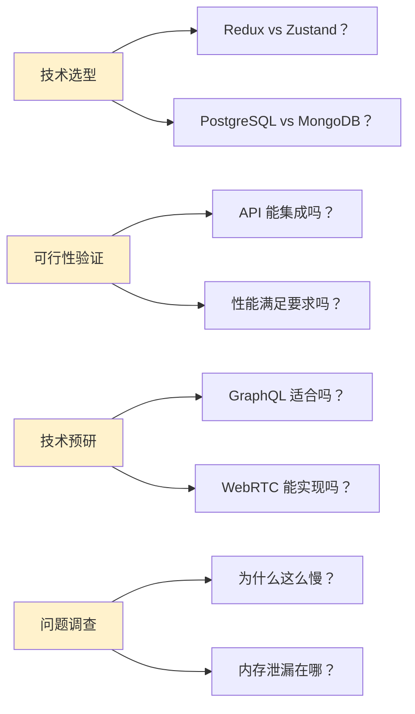
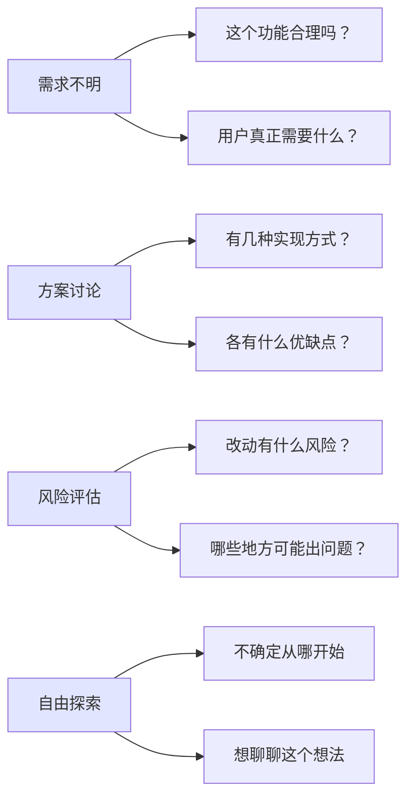
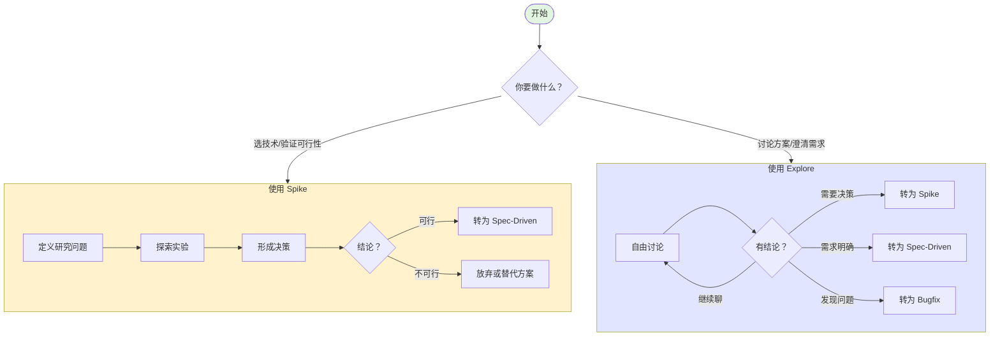
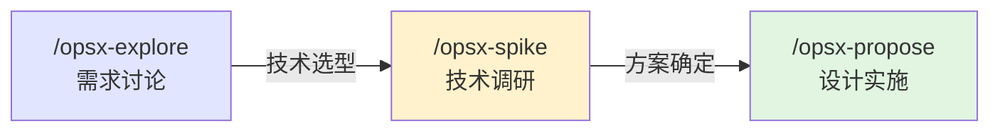

# Spike vs Explore：选择指南

> 技术调研 vs 自由探索：何时使用哪个工作流

## 一句话总结

- **Spike** = "我要选一个方案，时间有限，必须下结论"
- **Explore** = "我不确定怎么做，先聊聊看"

---

## 核心区别

| 维度         | **Spike**                      | **Explore**                       |
| ------------ | ------------------------------ | --------------------------------- |
| **核心目标** | 得出**明确决策**               | 澄清需求或方案                    |
| **必须产出** | `decision.md`（决策文档）      | 无固定产物                        |
| **时间限制** | **时间盒**（默认 4h，最长 2d） | 灵活                              |
| **下一步**   | 转为 Spec-Driven 实施 或 放弃  | 可能转为 Spec-Driven/Bugfix/Spike |
| **结束方式** | 必须有结论                     | 可随时结束                        |

---

## 使用场景对比

### 使用 `/opsx-spike` 的场景



**典型问法**：

- "评估一下这三个方案"
- "调研一下这个技术"
- "验证一下是否可行"
- "对比一下 A 和 B"

### 使用 `/opsx-explore` 的场景



**典型问法**：

- "这个功能怎么做比较好？"
- "有什么风险？"
- "帮我看看这个方案"
- "聊聊这个想法"

---

## 决策树



---

## 典型工作流程

### Spike 完整流程

```bash
# 1. 启动 Spike（时间盒：4小时）
/opsx-spike evaluate-state-management

# 2. 定义问题（AI 引导填写 research-question.md）
#    - 研究目标：Redux vs Zustand vs Context
#    - 评估维度：性能、易用性、生态
#    - 时间盒：4小时

# 3. 探索研究（实时记录 exploration-log.md）
#    - 阅读文档
#    - 编写原型代码
#    - 性能测试
#    - 记录发现（包括失败的实验）

# 4. 形成决策（撰写 decision.md）
#    - 推荐：Zustand
#    - 理由：轻量、TypeScript 友好
#    - 风险：社区较小
#    - 下一步：创建实施变更

# 5. 转为实施
/opsx-propose add-zustand-store
```

**产物**：

```
openspec/changes/evaluate-state-management/
├── .openspec.yaml
├── research-question.md      # 研究问题定义
├── exploration-log.md        # 探索日志
└── decision.md               # 决策文档（必须有！）
```

### Explore 完整流程

```bash
# 1. 进入探索模式（无固定结构）
/opsx-explore

# 2. 自由讨论
> "我想加个实时协作功能"
AI: "好的，有几个问题想了解一下..."

# 3. 可能的方向：
#    - 讨论技术方案（WebSocket vs WebRTC）
#    - 评估实现复杂度
#    - 识别潜在风险
#    - 澄清需求范围

# 4. 讨论结果可能是：
#    A. "这个想法可行，先做技术调研"
#       → 转为 Spike
/opsx-spike evaluate-realtime-options

#    B. "需求明确了，可以开始设计"
#       → 转为 Spec-Driven
/opsx-propose add-realtime-collab

#    C. "发现个现有 Bug"
#       → 转为 Bugfix
/opsx-bugfix realtime-connection-issue

#    D. "还需要再想想"
#       → 继续 Explore 或结束
```

**产物**：无固定产物，可能有讨论记录或思维导图

---

## 对比示例

### 场景：添加实时消息功能

#### 情况 A：使用 Spike

```
用户：我应该用 WebSocket 还是 Server-Sent Events？

→ 这是技术选型问题，需要对比并决策
→ 使用 /opsx-spike

结果：
- 产出 decision.md
- 明确选择 WebSocket
- 下一步：创建实施变更
```

#### 情况 B：使用 Explore

```
用户：我想加个实时消息功能，怎么做比较好？

→ 这是开放式问题，需求和技术都不确定
→ 使用 /opsx-explore

讨论：
- "实时"具体指什么？（聊天？通知？数据同步？）
- 需要持久化消息吗？
- 要不要支持离线？
- 用户量多少？

结果可能是：
- 需要先做技术调研 → 转为 Spike
- 需求明确了 → 转为 Spec-Driven
- 需要再讨论 → 继续 Explore
```

---

## 常见错误

### ❌ 错误：用 Explore 做技术选型

```
用户：Redis 和 Memcached 哪个好？

错误：/opsx-explore
→ Explore 不会强制产出决策文档
→ 讨论完了可能还是没结论

正确：/opsx-spike compare-caching-solutions
→ 必须产出 decision.md
→ 有明确结论后才能结束
```

### ❌ 错误：用 Spike 做需求澄清

```
用户：这个功能合理吗？

错误：/opsx-spike validate-feature-idea
→ Spike 假设技术方案存在，只是选哪个
→ 如果需求本身不明，Spike 会偏题

正确：/opsx-explore
→ 先澄清需求
→ 如果需要技术选型，再转 Spike
```

---

## 快速决策表

| 如果你说...        | 使用    | 原因           |
| ------------------ | ------- | -------------- |
| "评估一下..."      | Spike   | 需要对比和决策 |
| "调研一下..."      | Spike   | 需要产出结论   |
| "验证一下..."      | Spike   | 需要明确可行性 |
| "对比一下 A 和 B"  | Spike   | 技术选型       |
| "这个功能怎么做？" | Explore | 开放式讨论     |
| "有什么风险？"     | Explore | 需要多角度分析 |
| "帮我看看..."      | Explore | 需求澄清       |
| "聊聊这个想法"     | Explore | 自由探索       |

---

## 组合使用

### 典型组合：Explore → Spike → Spec-Driven



**示例**：

```bash
# Step 1: 探索需求
/opsx-explore
> "想加个实时通知功能"
讨论后明确：需要 WebSocket + 消息持久化

# Step 2: 技术选型
/opsx-spike evaluate-websocket-libraries
对比 Socket.io vs ws vs native WebSocket
决策：使用 Socket.io

# Step 3: 实施
/opsx-propose add-realtime-notifications
编写设计文档、规格、任务
开始编码
```

---

## 总结

```
┌─────────────────────────────────────────────────────────────┐
│                                                           │
│   有明确技术问题要决策？ ──► Spike                         │
│                                                           │
│   不确定怎么做/需求不明？ ──► Explore                      │
│                                                           │
│   Explore 发现需要技术选型？ ──► 转 Spike                  │
│                                                           │
│   Spike 完成后？ ──► 转 Spec-Driven 实施                   │
│                                                           │
└─────────────────────────────────────────────────────────────┘
```

**记住**：

- Spike = **必须下结论**（有时间压力）
- Explore = **自由探索**（无产出压力）
