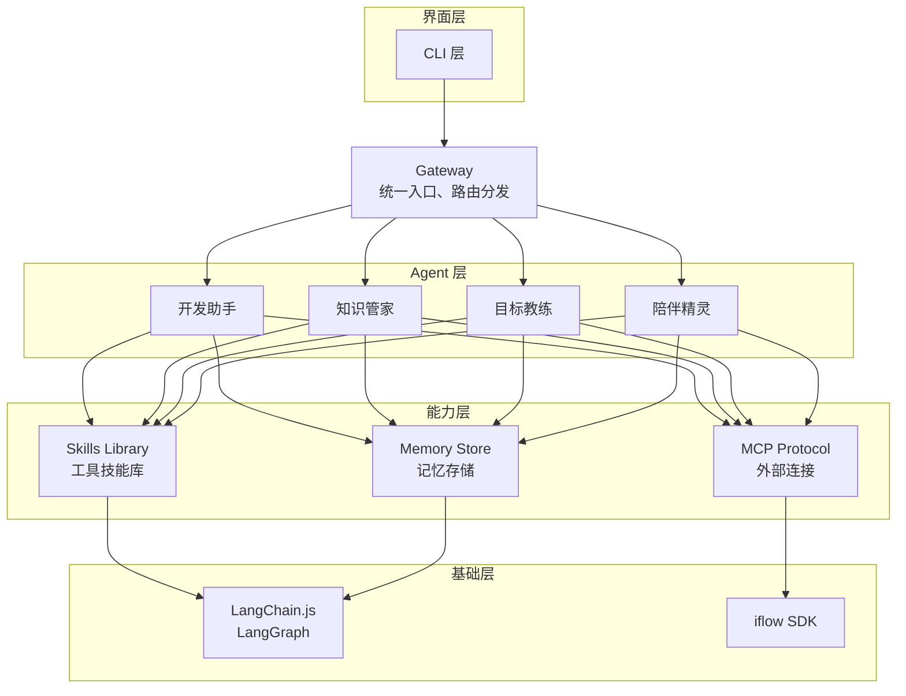

# OpenViking 研究报告

> 研究日期：2026-03-01
> 研究目标：评估 OpenViking 作为 Niuma 记忆系统技术方案的可行性

---

## 执行摘要

### 项目概览

**OpenViking** 是字节跳动火山引擎 Viking 团队开源的**面向 AI Agent 的上下文数据库**，于 2026 年 1 月正式开源。

| 维度 | 信息 |
|------|------|
| **开源方** | 字节跳动火山引擎 Viking 团队 |
| **定位** | AI Agent 上下文数据库 |
| **语言** | Python |
| **协议** | 开源 |
| **GitHub** | https://github.com/volcengine/OpenViking |
| **官网** | https://www.openviking.ai |

### 对 Niuma 项目的价值评估

| 评估维度 | 结论 | 说明 |
|----------|------|------|
| 功能契合度 | ⭐⭐⭐⭐⭐ | 分层记忆、自迭代机制与 Niuma 需求高度契合 |
| 技术可行性 | ⭐⭐⭐☆☆ | Python 实现，需考虑与 TypeScript 架构的集成方式 |
| 成本效益 | ⭐⭐⭐⭐☆ | 开源免费，可节省大量开发时间 |
| 成熟度 | ⭐⭐⭐☆☆ | 项目处于早期阶段，API 可能变动 |

---

## 第一部分：项目介绍

### 1.1 核心定位

> 为 Agent 定义一套极简的上下文交互范式，让开发者彻底告别上下文管理的烦恼。

OpenViking 摒弃了传统 RAG 的碎片化向量存储模式，创新性地采用"文件系统范式"，将 Agent 所需的记忆、资源和技能进行统一的结构化组织。

**核心理念**：
> *Memory, Resource, Skill. Everything is a File.*
> 记忆、资源、技能，皆为文件。

### 1.2 解决的问题

| 问题 | 描述 | 影响 |
|------|------|------|
| **上下文无序且割裂** | 记忆在代码中，资源在向量库，技能分散各处 | 关联和维护成本极高 |
| **长程任务压力大** | 多工具、多 Agent 协同带来上下文窗口压力 | 信息损失或高昂成本 |
| **朴素 RAG 效果局限** | 平铺式存储缺乏全局视野 | 检索效果不佳 |
| **缺乏可观测性** | 隐式检索链路如同黑箱 | 难以归因调试 |
| **记忆资产未沉淀** | 缺乏系统化的记忆管理 | 无法实现"越用越聪明" |

---

## 第二部分：核心特性

### 2.1 文件系统管理范式

将记忆、资源、技能统一抽象为**虚拟文件系统**（`viking://` 协议）：

```
viking://
├── memory/
│   ├── user/           # 用户偏好记忆
│   └── agent/          # Agent 经验记忆
├── resource/
│   └── documents/      # 外部资源
└── skill/
    └── capabilities/   # 能力模块
```

**优势**：
- Agent 可通过 `list`、`find`、`read` 等标准指令操作上下文
- 上下文管理从模糊的语义匹配变为直观的"文件操作"
- 每个上下文条目拥有唯一 URI，便于追踪和管理

### 2.2 分层上下文按需加载（L0/L1/L2）

| 层级 | 内容 | 用途 | Token 消耗 |
|------|------|------|------------|
| **L0** | 一句话摘要 | 快速判断相关性 | ~10 tokens |
| **L1** | 核心信息概述 | 规划阶段决策 | ~100 tokens |
| **L2** | 完整原始数据 | 深入读取详情 | 原始大小 |

**价值**：
- 大幅降低 Token 消耗（实测可节省 2-3 倍）
- 避免"丢卒保帅"式信息截断
- 保留完整信息的同时实现成本优化

### 2.3 目录递归检索

**检索策略**：
1. 意图分析生成多个检索条件
2. 向量检索快速定位高分目录
3. 在目录下进行二次检索
4. 若存在子目录，逐层递归
5. 返回最相关的上下文

**优势**：
- "先锁定目录、再精细探索"的策略
- 理解信息所在的完整语境
- 融合语义搜索与文件系统检索

### 2.4 可观测与自迭代

**可观测性**：
- 检索轨迹可视化
- 层次化结构易于理解
- 便于调试和优化

**自迭代机制**：
```python
# 会话结束时触发记忆迭代
session.commit()
```

系统会自动：
- 分析任务执行结果与用户反馈
- 更新 User 的 `/memory` 目录（用户偏好）
- 更新 Agent 的 `/memory` 目录（经验技巧）
- 实现"越用越聪明"的复利效果

---

## 第三部分：技术实现

### 3.1 安装与配置

```bash
# 安装
pip install openviking

# 配置环境变量
export OPENVIKING_CONFIG_FILE=ov.conf
```

### 3.2 配置文件示例

```json
{
  "vlm": {
    "api_key": "<your-api-key>",
    "model": "doubao-seed-1-8-251228",
    "api_base": "https://ark.cn-beijing.volces.com/api/v3",
    "backend": "volcengine"
  },
  "embedding": {
    "dense": {
      "backend": "volcengine",
      "api_key": "<your-api-key>",
      "model": "doubao-embedding-vision-250615",
      "api_base": "https://ark.cn-beijing.volces.com/api/v3",
      "dimension": 1024
    }
  }
}
```

### 3.3 基础用法

```python
import openviking as ov

# 初始化客户端
client = ov.SyncOpenViking(path="./data")
client.initialize()

# 添加资源
add_result = client.add_resource(
    path="https://example.com/document.pdf"
)
root_uri = add_result['root_uri']

# 浏览目录结构
ls_result = client.ls(root_uri)

# 语义搜索
results = client.find("查询内容", target_uri=root_uri)

# 读取内容
content = client.read(results.resources[0].uri)

# 获取摘要和概述
abstract = client.abstract(root_uri)
overview = client.overview(root_uri)

client.close()
```

### 3.4 支持的模型服务

| 服务商 | VLM 模型 | Embedding 模型 |
|--------|----------|----------------|
| 火山引擎 | doubao-seed系列 | doubao-embedding系列 |
| OpenAI | GPT-4V | text-embedding-3-large |
| 自定义 | 兼容 OpenAI API 格式 | 兼容 OpenAI API 格式 |

---

## 第四部分：与 Niuma 架构的集成分析

### 4.1 架构适配性

**Niuma 现有架构**：



**OpenViking 可替代/增强的模块**：
- `Memory Store` → OpenViking 的上下文数据库
- 记忆系统 → 分层记忆管理（L0/L1/L2）
- 自迭代机制 → 会话记忆自动更新

### 4.2 集成方案对比

| 方案 | 描述 | 优势 | 劣势 |
|------|------|------|------|
| **方案A：独立服务** | OpenViking 作为独立 Python 服务，通过 HTTP API 通信 | 解耦清晰，可独立部署维护 | 需要额外服务，增加运维复杂度 |
| **方案B：Python 子进程** | Node.js 通过子进程调用 Python 脚本 | 集成简单，无需额外服务 | 进程通信开销，错误处理复杂 |
| **方案C：TypeScript 重实现** | 参考 OpenViking 设计，用 TypeScript 重新实现 | 完全融入现有技术栈 | 开发成本高，需持续跟进上游更新 |
| **方案D：等待官方 TS 支持** | 等待 OpenViking 提供 TypeScript/JavaScript SDK | 最优解，官方支持 | 时间不确定 |

### 4.3 推荐方案

**短期（MVP 阶段）**：方案 B - Python 子进程
- 快速验证概念
- 验证 OpenViking 是否满足 Niuma 需求

**中长期**：
- 若 OpenViking 提供 JS SDK → 方案 D
- 若无官方支持但需求稳定 → 方案 A（独立服务）

### 4.4 集成代码示例

```typescript
// niuma-memory-service.ts
import { spawn } from 'child_process';

class OpenVikingBridge {
  private pythonPath = 'python3';
  private scriptPath = './scripts/viking_bridge.py';

  async addResource(path: string): Promise<string> {
    const result = await this.execute('add_resource', { path });
    return result.root_uri;
  }

  async find(query: string, targetUri: string): Promise<SearchResult[]> {
    return this.execute('find', { query, target_uri: targetUri });
  }

  async read(uri: string): Promise<string> {
    return this.execute('read', { uri });
  }

  private async execute(action: string, params: object): Promise<any> {
    return new Promise((resolve, reject) => {
      const process = spawn(this.pythonPath, [
        this.scriptPath,
        action,
        JSON.stringify(params)
      ]);
      
      let output = '';
      process.stdout.on('data', (data) => output += data);
      process.stderr.on('data', (data) => console.error(data.toString()));
      process.on('close', (code) => {
        if (code === 0) {
          resolve(JSON.parse(output));
        } else {
          reject(new Error(`Process exited with code ${code}`));
        }
      });
    });
  }
}
```

```python
# scripts/viking_bridge.py
import sys
import json
import openviking as ov

client = ov.SyncOpenViking(path="./data")
client.initialize()

action = sys.argv[1]
params = json.loads(sys.argv[2])

if action == 'add_resource':
    result = client.add_resource(path=params['path'])
    print(json.dumps(result))
elif action == 'find':
    results = client.find(params['query'], target_uri=params['target_uri'])
    print(json.dumps([{'uri': r.uri, 'score': r.score} for r in results.resources]))
elif action == 'read':
    content = client.read(params['uri'])
    print(json.dumps({'content': content}))

client.close()
```

### 4.5 功能映射

| Niuma 需求 | OpenViking 能力 | 实现方式 |
|------------|-----------------|----------|
| 用户偏好记忆 | `/memory/user/` 目录 | `session.commit()` 自动更新 |
| Agent 经验记忆 | `/memory/agent/` 目录 | 任务执行后自动沉淀 |
| Obsidian 笔记索引 | `/resource/` 目录 | `add_resource()` 导入 |
| 分层记忆检索 | L0/L1/L2 分层 | `abstract()`, `overview()`, `read()` |
| 语义搜索 | 向量 + 目录递归检索 | `find()` |

---

## 第五部分：风险与建议

### 5.1 潜在风险

| 风险 | 影响 | 缓解措施 |
|------|------|----------|
| 项目早期，API 可能变动 | 集成代码需跟随调整 | 封装抽象层，隔离变化 |
| 仅支持 Python | 与 TypeScript 架构集成有成本 | 采用桥接方案或等待 JS SDK |
| 依赖外部模型服务 | 需要配置 VLM 和 Embedding API | 支持多服务商，避免锁定 |
| 数据存储格式未标准化 | 迁移成本 | 关注官方演进，预留迁移方案 |

### 5.2 建议

| 优先级 | 建议 | 理由 |
|--------|------|------|
| 🔴 高 | MVP 阶段采用 Python 子进程方案快速验证 | 低成本试错 |
| 🔴 高 | 封装 Memory Service 抽象接口 | 隔离底层实现，便于替换 |
| 🟡 中 | 持续关注 OpenViking 官方动态 | 等待 TypeScript SDK |
| 🟡 中 | 评估火山引擎模型服务成本 | 对比其他服务商 |
| 🟢 低 | 贡献代码/反馈问题 | 参与社区共建 |

---

## 附录

### 相关链接

- GitHub: https://github.com/volcengine/OpenViking
- 官网: https://www.openviking.ai
- 文档: https://www.openviking.ai/docs
- 知乎介绍: https://zhuanlan.zhihu.com/p/2000634266720161814

### 参考资料

- OpenViking GitHub README
- OpenViking 知乎官方介绍文章
- 字节跳动 Viking 团队产品历程

---

*研究报告由 Niuma 项目生成*
