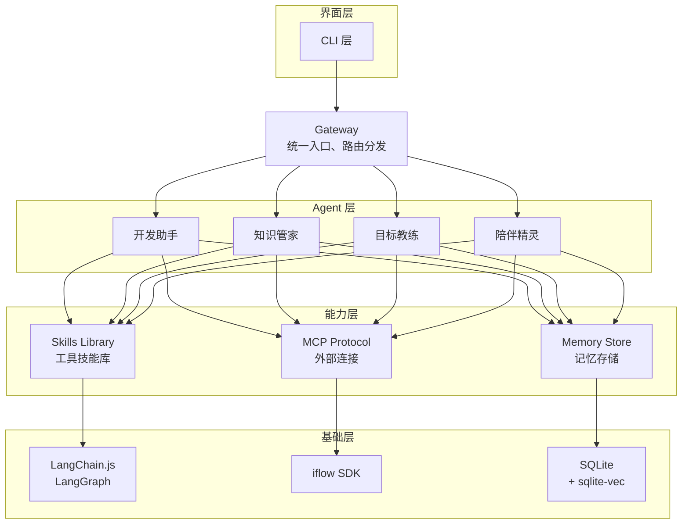
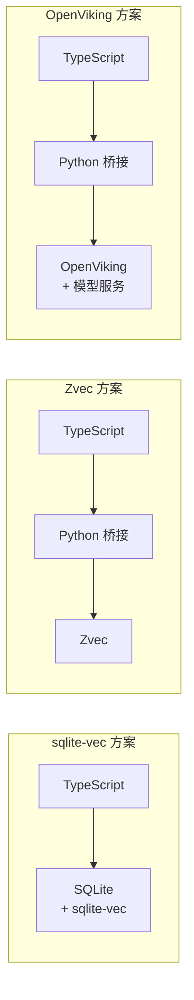

# sqlite-vec 研究报告

> 研究日期：2026-03-01
> 研究目标：评估 sqlite-vec 作为 Niuma 向量存储方案的可行性

---

## 执行摘要

### 项目概览

**sqlite-vec** 是一个极小、足够快的 SQLite 向量搜索扩展，可在任何支持 SQLite 的地方运行。是 sqlite-vss 的继任者，由 Mozilla Builders 等赞助支持。

| 维度 | 信息 |
|------|------|
| **开发者** | asg017 (Alex Garcia) |
| **定位** | SQLite 向量搜索扩展 |
| **语言** | 纯 C，无依赖 |
| **状态** | pre-v1（API 可能变动） |
| **赞助方** | Mozilla Builders、Fly.io、Turso、SQLite Cloud、Shinkai |
| **GitHub** | https://github.com/asg017/sqlite-vec |

### 对 Niuma 项目的价值评估

| 评估维度 | 结论 | 说明 |
|----------|------|------|
| 功能契合度 | ⭐⭐⭐⭐☆ | 向量存储与检索能力完善 |
| 技术可行性 | ⭐⭐⭐⭐⭐ | 原生支持 Node.js，与 TypeScript 无缝集成 |
| 成本效益 | ⭐⭐⭐⭐⭐ | 开源免费，零配置，极简部署 |
| 成熟度 | ⭐⭐⭐☆☆ | pre-v1 状态，API 可能变动 |

### 决策结论

**✅ 推荐 sqlite-vec 作为 Niuma 向量存储方案**

核心理由：
1. **技术栈统一**：原生支持 Node.js，无需 Python 桥接
2. **架构精简**：基于 SQLite，减少依赖组件
3. **部署简单**：无需独立服务，嵌入式运行
4. **生态成熟**：SQLite 生态完善，稳定可靠

---

## 第一部分：项目介绍

### 1.1 核心定位

> 一个极小、足够快的向量搜索 SQLite 扩展，可在任何地方运行。

**核心理念**：
> 向量数据库不应是独立服务，而应是 SQLite 的一部分。

### 1.2 核心特性

| 特性 | 描述 |
|------|------|
| **多向量类型** | 支持 float、int8、二进制向量 |
| **虚拟表** | 通过 `vec0` 虚拟表存储向量 |
| **纯 C 实现** | 无外部依赖，极小体积 |
| **跨平台** | Linux/macOS/Windows/WASM/树莓派 |
| **KNN 查询** | 支持向量相似度搜索 |
| **元数据存储** | 支持非向量数据的辅助列 |

### 1.3 与传统方案对比

| 维度 | 独立向量数据库 | sqlite-vec |
|------|----------------|------------|
| **部署方式** | 独立服务 | SQLite 扩展 |
| **依赖** | 多个依赖 | 零依赖 |
| **配置复杂度** | 需要配置 | 零配置 |
| **语言绑定** | 部分语言 | 全语言支持 |
| **适用场景** | 大规模生产 | 嵌入式、边缘设备、原型 |

---

## 第二部分：技术实现

### 2.1 安装方式

| 语言 | 安装命令 |
|------|----------|
| **Python** | `pip install sqlite-vec` |
| **Node.js** | `npm install sqlite-vec` |
| **Ruby** | `gem install sqlite-vec` |
| **Go** | `go get -u github.com/asg017/sqlite-vec/bindings/go` |
| **Rust** | `cargo add sqlite-vec` |

### 2.2 基础用法

```sql
-- 加载扩展
.load ./vec0

-- 创建向量表（虚拟表）
CREATE VIRTUAL TABLE vec_examples USING vec0(
  sample_embedding float[8]  -- 定义 8 维浮点向量列
);

-- 插入向量（支持 JSON 格式）
INSERT INTO vec_examples(rowid, sample_embedding)
  VALUES
    (1, '[-0.200, 0.250, 0.341, -0.211, 0.645, 0.935, -0.316, -0.924]'),
    (2, '[0.443, -0.501, 0.355, -0.771, 0.707, -0.708, -0.185, 0.362]'),
    (3, '[0.716, -0.927, 0.134, 0.052, -0.669, 0.793, -0.634, -0.162]'),
    (4, '[-0.710, 0.330, 0.656, 0.041, -0.990, 0.726, 0.385, -0.958]');

-- KNN 向量搜索
SELECT 
  rowid,
  distance
FROM vec_examples
WHERE sample_embedding MATCH '[0.890, 0.544, 0.825, 0.961, 0.358, 0.0196, 0.521, 0.175]'
ORDER BY distance
LIMIT 2;

-- 结果
-- ┌───────┬──────────────────┐
-- │ rowid │     distance     │
-- ├───────┼──────────────────┤
-- │ 2     │ 2.38687372207642 │
-- │ 1     │ 2.38978505134583 │
-- └───────┴──────────────────┘
```

### 2.3 Node.js 集成示例

```typescript
import Database from 'better-sqlite3';
import * as sqliteVec from 'sqlite-vec';

// 创建数据库连接
const db = new Database(':memory:');

// 加载 sqlite-vec 扩展
sqliteVec.load(db);

// 创建向量表
db.exec(`
  CREATE VIRTUAL TABLE memories USING vec0(
    embedding float[768],
    content TEXT,
    metadata TEXT
  )
`);

// 插入向量
const insert = db.prepare(`
  INSERT INTO memories(rowid, embedding, content, metadata)
  VALUES (?, ?, ?, ?)
`);

const embedding1 = new Float32Array([0.1, 0.2, 0.3, /* ... 768 维 */]);
const embedding2 = new Float32Array([0.4, 0.5, 0.6, /* ... 768 维 */]);

insert.run(1, embedding1.buffer, '用户喜欢 TypeScript', JSON.stringify({category: 'preference'}));
insert.run(2, embedding2.buffer, '项目使用 LangChain', JSON.stringify({category: 'project'}));

// 向量搜索
const search = db.prepare(`
  SELECT rowid, distance, content, metadata
  FROM memories
  WHERE embedding MATCH ?
  ORDER BY distance
  LIMIT 5
`);

const queryEmbedding = new Float32Array([0.15, 0.25, 0.35, /* ... */]);
const results = search.all(queryEmbedding.buffer);

console.log(results);
```

### 2.4 向量格式支持

| 格式 | 描述 | 使用场景 |
|------|------|----------|
| **float[]** | 浮点向量 | 标准 Embedding（如 OpenAI） |
| **int8[]** | 8位整型向量 | 量化后的向量 |
| **bit[]** | 二进制向量 | 二进制量化向量 |

```sql
-- 不同向量类型的表定义
CREATE VIRTUAL TABLE multi_vec USING vec0(
  float_embedding float[768],    -- 浮点向量
  int8_embedding int8[768],      -- int8 向量
  binary_embedding bit[768]      -- 二进制向量
);
```

---

## 第三部分：性能特点

### 3.1 性能特征

| 特征 | 说明 |
|------|------|
| **搜索算法** | 暴力搜索（Brute Force） |
| **ANN 索引** | 暂不支持（计划中） |
| **适用规模** | 10 万向量以下性能良好 |
| **二进制量化** | 可显著提升性能 |

### 3.2 性能优化建议

| 策略 | 说明 |
|------|------|
| **二进制量化** | 将向量转换为位向量，大幅提升速度 |
| **分区键** | 使用分区键减少搜索范围 |
| **批量插入** | 使用事务批量插入向量 |
| **合理维度** | 根据需求选择合适的向量维度 |

### 3.3 适用场景

| 场景 | 适用性 |
|------|--------|
| **边缘设备** | ✅ 完美适配 |
| **移动应用** | ✅ 完美适配 |
| **嵌入式 RAG** | ✅ 完美适配 |
| **原型开发** | ✅ 完美适配 |
| **小规模生产** | ✅ 适合（<10万向量） |
| **大规模生产** | ⚠️ 需评估（无 ANN 索引） |

---

## 第四部分：与 Niuma 架构的集成分析

### 4.1 架构适配性

**Niuma 现有架构**：



### 4.2 方案对比

| 方案 | 技术栈 | 部署复杂度 | TypeScript 集成 | 性能 |
|------|--------|------------|-----------------|------|
| **sqlite-vec** | SQLite + C 扩展 | ⭐ 极简 | ✅ 原生 | 中等 |
| **Zvec** | Python + C++ | ⭐⭐ 简单 | ⚠️ 需桥接 | 高 |
| **OpenViking** | Python | ⭐⭐⭐ 中等 | ⚠️ 需桥接 | 高 |

### 4.3 选型决策

**选择 sqlite-vec 的理由**：

| 维度 | 说明 |
|------|------|
| **架构精简** | 无需引入 Python 运行时，减少依赖 |
| **技术栈统一** | 与 Niuma 的 TypeScript 技术栈完美融合 |
| **部署简单** | SQLite 文件即可，无需独立服务 |
| **开发效率** | 直接在 SQL 中操作向量，学习成本低 |
| **生态成熟** | SQLite 生态完善，稳定可靠 |

**权衡考量**：

| 维度 | sqlite-vec | Zvec/OpenViking |
|------|------------|-----------------|
| 向量规模 | <10 万 | 大规模 |
| ANN 索引 | ❌ 暂无 | ✅ 有 |
| 部署复杂度 | 极简 | 需桥接 |
| TypeScript 支持 | ✅ 原生 | ⚠️ 需桥接 |

### 4.4 集成实现

#### 数据模型设计

```typescript
// src/storage/memory-store.ts
import Database from 'better-sqlite3';
import * as sqliteVec from 'sqlite-vec';

interface Memory {
  id: string;
  content: string;
  embedding: Float32Array;
  metadata: MemoryMetadata;
  createdAt: Date;
}

interface MemoryMetadata {
  type: 'preference' | 'experience' | 'knowledge';
  agent?: string;
  tags?: string[];
}

class MemoryStore {
  private db: Database.Database;

  constructor(dbPath: string) {
    this.db = new Database(dbPath);
    sqliteVec.load(this.db);
    this.initialize();
  }

  private initialize() {
    this.db.exec(`
      CREATE TABLE IF NOT EXISTS memories (
        id TEXT PRIMARY KEY,
        content TEXT NOT NULL,
        metadata TEXT,
        created_at DATETIME DEFAULT CURRENT_TIMESTAMP
      );

      CREATE VIRTUAL TABLE IF NOT EXISTS memory_embeddings USING vec0(
        embedding float[768],
        memory_id TEXT
      );

      CREATE INDEX IF NOT EXISTS idx_memory_id ON memory_embeddings(memory_id);
    `);
  }

  async add(memory: Memory): Promise<void> {
    const insertMemory = this.db.prepare(`
      INSERT INTO memories (id, content, metadata, created_at)
      VALUES (?, ?, ?, ?)
    `);

    const insertEmbedding = this.db.prepare(`
      INSERT INTO memory_embeddings (embedding, memory_id)
      VALUES (?, ?)
    `);

    const transaction = this.db.transaction(() => {
      insertMemory.run(
        memory.id,
        memory.content,
        JSON.stringify(memory.metadata),
        memory.createdAt.toISOString()
      );
      insertEmbedding.run(memory.embedding.buffer, memory.id);
    });

    transaction();
  }

  async search(queryEmbedding: Float32Array, topK: number = 5): Promise<Array<Memory & { score: number }>> {
    const search = this.db.prepare(`
      SELECT 
        m.id,
        m.content,
        m.metadata,
        m.created_at,
        e.distance as score
      FROM memory_embeddings e
      JOIN memories m ON e.memory_id = m.id
      WHERE e.embedding MATCH ?
      ORDER BY e.distance
      LIMIT ?
    `);

    const results = search.all(queryEmbedding.buffer, topK);

    return results.map(r => ({
      id: r.id,
      content: r.content,
      metadata: JSON.parse(r.metadata),
      createdAt: new Date(r.created_at),
      score: r.score
    }));
  }

  async delete(id: string): Promise<void> {
    const deleteMemory = this.db.prepare('DELETE FROM memories WHERE id = ?');
    const deleteEmbedding = this.db.prepare('DELETE FROM memory_embeddings WHERE memory_id = ?');

    const transaction = this.db.transaction(() => {
      deleteMemory.run(id);
      deleteEmbedding.run(id);
    });

    transaction();
  }

  close() {
    this.db.close();
  }
}

export { MemoryStore, Memory, MemoryMetadata };
```

### 4.5 功能映射

| Niuma 需求 | sqlite-vec 实现 | 说明 |
|------------|-----------------|------|
| 用户偏好记忆 | `memories` + `memory_embeddings` | 结构化存储 + 向量检索 |
| Agent 经验记忆 | metadata.type = 'experience' | 按类型分类 |
| 语义搜索 | `MATCH` + `ORDER BY distance` | KNN 向量搜索 |
| 记忆删除 | DELETE 级联 | 事务保证一致性 |
| 元数据过滤 | SQL WHERE 条件 | 灵活的过滤能力 |

---

## 第五部分：与其他方案对比

### 5.1 功能对比

| 功能 | sqlite-vec | Zvec | OpenViking |
|------|------------|------|------------|
| 向量存储 | ✅ | ✅ | ✅ |
| 语义检索 | ✅ | ✅ | ✅ |
| ANN 索引 | ❌ | ✅ | ✅ |
| 分层上下文 | ❌ | ❌ | ✅ L0/L1/L2 |
| 记忆自迭代 | ❌ | ❌ | ✅ |
| TypeScript 原生 | ✅ | ❌ | ❌ |
| 部署复杂度 | 极简 | 简单 | 中等 |
| 依赖外部服务 | ❌ | ❌ | ✅ 需模型服务 |

### 5.2 架构对比



### 5.3 选型建议

| 场景 | 推荐方案 |
|------|----------|
| **架构精简优先** | sqlite-vec ✅ |
| **小规模向量（<10万）** | sqlite-vec ✅ |
| **大规模向量（>100万）** | Zvec |
| **需要 ANN 索引** | Zvec |
| **完整上下文管理** | OpenViking |
| **TypeScript 原生集成** | sqlite-vec ✅ |

---

## 第六部分：风险与建议

### 6.1 潜在风险

| 风险 | 影响 | 缓解措施 |
|------|------|----------|
| pre-v1 状态 | API 可能变动 | 封装抽象层，隔离变化 |
| 无 ANN 索引 | 大规模性能受限 | 控制向量规模，使用二进制量化 |
| 暴力搜索 | 性能上限 | 适合中小规模场景 |

### 6.2 建议

| 优先级 | 建议 | 理由 |
|--------|------|------|
| 🔴 高 | 采用 sqlite-vec 作为 MVP 向量存储 | 架构精简，快速验证 |
| 🔴 高 | 封装 MemoryStore 抽象接口 | 便于未来替换 |
| 🟡 中 | 控制向量规模在 10 万以内 | 保证性能 |
| 🟡 中 | 持续关注 sqlite-vec ANN 索引进展 | 性能提升潜力 |
| 🟢 低 | 若未来规模增长，再考虑迁移到 Zvec | 预留扩展性 |

---

## 附录

### 相关链接

- GitHub: https://github.com/asg017/sqlite-vec
- 文档: https://github.com/asg017/sqlite-vec#documentation
- 示例: https://github.com/asg017/sqlite-vec/tree/main/examples

### 参考资料

- sqlite-vec GitHub README
- SQLite 虚拟表文档
- Mozilla Builders 项目

---

## 更新日志

| 日期 | 决策 |
|------|------|
| 2026-03-01 | 确定采用 sqlite-vec 作为 Niuma 向量存储方案，替代 Zvec/OpenViking |

---

*研究报告由 Niuma 项目生成*
