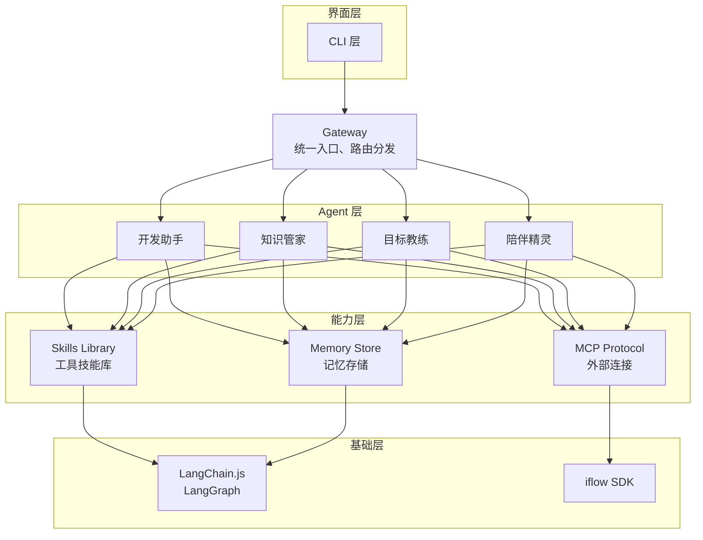
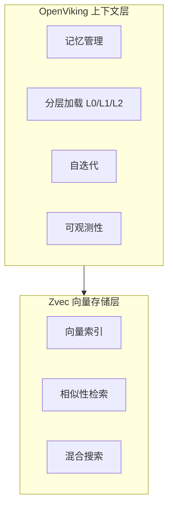

# Zvec 研究报告

> 研究日期：2026-03-01
> 研究目标：评估 Zvec 作为 Niuma 向量存储方案的技术可行性

---

## 执行摘要

### 项目概览

**Zvec** 是阿里巴巴开源的一款**轻量级、闪电般快速的嵌入式向量数据库**，基于阿里内部生产验证的 **Proxima** 引擎构建，于 2026 年 2 月开源。

| 维度 | 信息 |
|------|------|
| **开源方** | 阿里巴巴 |
| **定位** | 进程内嵌入式向量数据库 |
| **底层引擎** | Proxima（阿里生产验证） |
| **语言** | Python（C++ 核心） |
| **GitHub** | https://github.com/alibaba/zvec |
| **官网** | https://zvec.org |

### 对 Niuma 项目的价值评估

| 评估维度 | 结论 | 说明 |
|----------|------|------|
| 功能契合度 | ⭐⭐⭐⭐☆ | 向量检索能力完善，但缺乏上层上下文管理 |
| 技术可行性 | ⭐⭐⭐☆☆ | Python 实现，需考虑与 TypeScript 架构的集成方式 |
| 成本效益 | ⭐⭐⭐⭐⭐ | 开源免费，零配置，资源占用低 |
| 成熟度 | ⭐⭐⭐⭐☆ | 基于阿里生产验证的 Proxima 引擎，稳定可靠 |

---

## 第一部分：项目介绍

### 1.1 核心定位

> 类 SQLite 的轻量级嵌入式向量数据库，开箱即用、极致性能。

Zvec 采用**进程内（in-process）架构**，作为库直接嵌入应用程序运行，而非独立服务部署。

**核心理念**：
> 向量数据库界的 SQLite —— 无需服务器，零配置，嵌入即用。

### 1.2 核心特性

| 特性 | 描述 |
|------|------|
| **⚡ 极致性能** | 十亿级向量毫秒级搜索 |
| **🔧 开箱即用** | `pip install zvec`，无需服务器、无需配置 |
| **🔢 稠密+稀疏向量** | 原生支持稠密和稀疏嵌入向量 |
| **🔍 混合检索** | 语义相似性 + 结构化过滤 |
| **🌍 全平台运行** | 服务器、边缘设备、CLI 工具均可运行 |

### 1.3 与传统方案对比

| 维度 | 传统向量数据库 | Zvec |
|------|----------------|------|
| **部署方式** | 独立服务器 | 嵌入进程 |
| **配置复杂度** | 需要配置集群 | 零配置 |
| **资源占用** | 较高 | 轻量级 |
| **适用场景** | 大规模生产环境 | 边缘设备、RAG 应用、嵌入式场景 |
| **类比** | PostgreSQL | SQLite |

---

## 第二部分：技术实现

### 2.1 安装与要求

```bash
# 安装
pip install zvec
```

**系统要求**：
- Python 3.10 - 3.12
- Linux (x86_64) / macOS (ARM64)

### 2.2 基础用法

```python
import zvec

# 定义集合结构
schema = zvec.CollectionSchema(
    name="example",
    vectors=zvec.VectorSchema("embedding", zvec.DataType.VECTOR_FP32, 4),
)

# 创建集合
collection = zvec.create_and_open(path="./zvec_example", schema=schema)

# 插入文档
collection.insert([
    zvec.Doc(id="doc_1", vectors={"embedding": [0.1, 0.2, 0.3, 0.4]}),
    zvec.Doc(id="doc_2", vectors={"embedding": [0.2, 0.3, 0.4, 0.1]}),
])

# 向量相似性搜索
results = collection.query(
    zvec.VectorQuery("embedding", vector=[0.4, 0.3, 0.3, 0.1]),
    topk=10
)
```

### 2.3 核心数据结构

```python
# 文档结构
zvec.Doc(
    id="unique_id",           # 文档唯一标识
    vectors={                 # 向量字段
        "embedding": [0.1, 0.2, ...]
    },
    metadata={                # 元数据（可选）
        "title": "文档标题",
        "category": "类别"
    }
)

# 查询结构
zvec.VectorQuery(
    "embedding",              # 向量字段名
    vector=[0.4, 0.3, ...],   # 查询向量
    topk=10                   # 返回数量
)
```

### 2.4 混合检索

```python
# 语义搜索 + 结构化过滤
results = collection.query(
    zvec.VectorQuery("embedding", vector=query_vector, topk=10),
    filter="category == 'tech' AND year >= 2024"  # 结构化过滤
)
```

---

## 第三部分：性能基准

### 3.1 测试环境

- **平台**：VectorDBBench（开源基准框架）
- **硬件**：16 vCPU, 64 GiB RAM
- **数据集**：Cohere 1M / 10M（768 维向量）

### 3.2 性能表现

| 数据集 | 指标 | 表现 |
|--------|------|------|
| **Cohere 10M** | QPS | 行业领先 |
| **Cohere 1M** | QPS | 行业领先 |
| **索引构建** | Load Duration | 快速构建 |
| **召回率** | Recall | 高精度检索 |

### 3.3 技术优势

Zvec 基于 **Proxima** 引擎，该引擎已在阿里巴巴集团内部经过大规模生产验证，具备：
- 高效的索引算法（HNSW + 量化）
- 低延迟查询优化
- 内存友好的数据布局

---

## 第四部分：与 Niuma 架构的集成分析

### 4.1 架构适配性

**Niuma 现有架构**：



**Zvec 可适用的模块**：
- `Memory Store` → 向量检索底层存储
- Obsidian 笔记语义搜索 → 向量化 + 相似性检索
- 知识问答 → RAG 检索增强

### 4.2 集成方案

| 方案 | 描述 | 优势 | 劣势 |
|------|------|------|------|
| **方案A：独立服务** | Zvec 作为独立 Python 服务 | 解耦清晰 | 额外服务，违背嵌入式设计初衷 |
| **方案B：Python 子进程** | Node.js 通过子进程调用 Python | 集成简单 | 进程通信开销 |
| **方案C：TypeScript 重实现** | 参考 Zvec 架构用 TypeScript 实现 | 完全融入技术栈 | 开发成本高 |
| **方案D：等待官方 TS 支持** | 等待 Zvec 提供 JS SDK | 最优解 | 时间不确定 |

### 4.3 推荐方案

**短期（MVP 阶段）**：方案 B - Python 子进程
- Zvec 本身就是嵌入式设计，子进程调用符合其理念
- 快速验证向量检索功能

**中长期**：
- 关注 Zvec 官方动态，等待 JavaScript SDK
- 若无官方支持但需求稳定，考虑方案 C

### 4.4 集成代码示例

```typescript
// niuma-vector-store.ts
import { spawn } from 'child_process';

class ZvecBridge {
  private pythonPath = 'python3';
  private scriptPath = './scripts/zvec_bridge.py';
  private dbPath: string;

  constructor(dbPath: string) {
    this.dbPath = dbPath;
  }

  async insert(docs: Array<{id: string; vector: number[]; metadata?: object}>): Promise<void> {
    await this.execute('insert', { 
      path: this.dbPath,
      docs 
    });
  }

  async search(vector: number[], topk: number = 10): Promise<SearchResult[]> {
    return this.execute('search', { 
      path: this.dbPath,
      vector, 
      topk 
    });
  }

  async delete(id: string): Promise<void> {
    await this.execute('delete', { path: this.dbPath, id });
  }

  private async execute(action: string, params: object): Promise<any> {
    return new Promise((resolve, reject) => {
      const process = spawn(this.pythonPath, [
        this.scriptPath,
        action,
        JSON.stringify(params)
      ]);
      
      let output = '';
      process.stdout.on('data', (data) => output += data);
      process.stderr.on('data', (data) => console.error(data.toString()));
      process.on('close', (code) => {
        if (code === 0) {
          resolve(output ? JSON.parse(output) : null);
        } else {
          reject(new Error(`Process exited with code ${code}`));
        }
      });
    });
  }
}

interface SearchResult {
  id: string;
  score: number;
  metadata?: object;
}
```

```python
# scripts/zvec_bridge.py
import sys
import json
import zvec

action = sys.argv[1]
params = json.loads(sys.argv[2])

if action == 'insert':
    schema = zvec.CollectionSchema(
        name="niuma",
        vectors=zvec.VectorSchema("embedding", zvec.DataType.VECTOR_FP32, len(params['docs'][0]['vector'])),
    )
    collection = zvec.create_and_open(path=params['path'], schema=schema)
    collection.insert([
        zvec.Doc(id=d['id'], vectors={"embedding": d['vector']}, metadata=d.get('metadata'))
        for d in params['docs']
    ])
    collection.close()
    
elif action == 'search':
    collection = zvec.open(path=params['path'])
    results = collection.query(
        zvec.VectorQuery("embedding", vector=params['vector'], topk=params['topk'])
    )
    print(json.dumps([
        {'id': r.id, 'score': r.score, 'metadata': r.metadata}
        for r in results
    ]))
    collection.close()
    
elif action == 'delete':
    collection = zvec.open(path=params['path'])
    collection.delete(params['id'])
    collection.close()
```

### 4.5 功能映射

| Niuma 需求 | Zvec 能力 | 实现方式 |
|------------|-----------|----------|
| 用户偏好记忆向量检索 | 向量存储 + 相似性搜索 | `insert()` + `query()` |
| Obsidian 笔记语义搜索 | 文档向量索引 | 笔记向量化后存储 |
| 知识问答 RAG | 混合检索 | 向量检索 + 元数据过滤 |
| 记忆相似性匹配 | Top-K 检索 | `query(topk=N)` |

---

## 第五部分：与 OpenViking 对比分析

### 5.1 定位差异

| 维度 | Zvec | OpenViking |
|------|------|------------|
| **定位** | 嵌入式向量数据库 | Agent 上下文数据库 |
| **抽象层级** | 底层存储 | 上层上下文管理 |
| **核心能力** | 向量检索 | 记忆、资源、技能统一管理 |
| **分层机制** | 无 | L0/L1/L2 三层 |
| **自迭代** | 无 | `session.commit()` 自动迭代 |

### 5.2 功能对比

| 功能 | Zvec | OpenViking |
|------|------|------------|
| 向量存储 | ✅ | ✅ |
| 语义检索 | ✅ | ✅ |
| 分层上下文 | ❌ | ✅ L0/L1/L2 |
| 记忆自迭代 | ❌ | ✅ |
| 文件系统范式 | ❌ | ✅ viking:// |
| 可观测性 | ❌ | ✅ 检索轨迹 |
| 混合检索 | ✅ | ✅ |
| 部署复杂度 | 极简 | 需配置模型服务 |

### 5.3 选型建议

| 场景 | 推荐方案 |
|------|----------|
| **纯向量检索需求** | Zvec |
| **完整上下文管理** | OpenViking |
| **轻量级 + 快速启动** | Zvec |
| **Agent 记忆系统** | OpenViking |
| **两者结合** | Zvec 作为 OpenViking 的底层存储 |

### 5.4 混合方案



---

## 第六部分：风险与建议

### 6.1 潜在风险

| 风险 | 影响 | 缓解措施 |
|------|------|----------|
| 仅支持 Python | 与 TypeScript 架构集成有成本 | 采用桥接方案或等待 JS SDK |
| 平台支持有限 | macOS 仅支持 ARM64 | 关注官方更新 |
| 项目较新 | API 可能变动 | 封装抽象层，隔离变化 |

### 6.2 建议

| 优先级 | 建议 | 理由 |
|--------|------|------|
| 🟡 中 | 若仅需向量检索，优先考虑 Zvec | 轻量、零配置、高性能 |
| 🔴 高 | 若需要完整记忆管理，选择 OpenViking | 功能更契合 Agent 需求 |
| 🟡 中 | 可考虑 Zvec 作为 OpenViking 底层存储 | 结合两者优势 |
| 🟢 低 | 关注两个项目的官方动态 | 等待 JavaScript SDK |

---

## 附录

### 相关链接

- GitHub: https://github.com/alibaba/zvec
- 官网: https://zvec.org
- 文档: https://zvec.org/en/docs/
- 基准测试: https://zvec.org/en/docs/benchmarks/

### 参考资料

- Zvec GitHub README
- VectorDBBench 基准测试框架
- 阿里巴巴 Proxima 引擎

---

*研究报告由 Niuma 项目生成*
