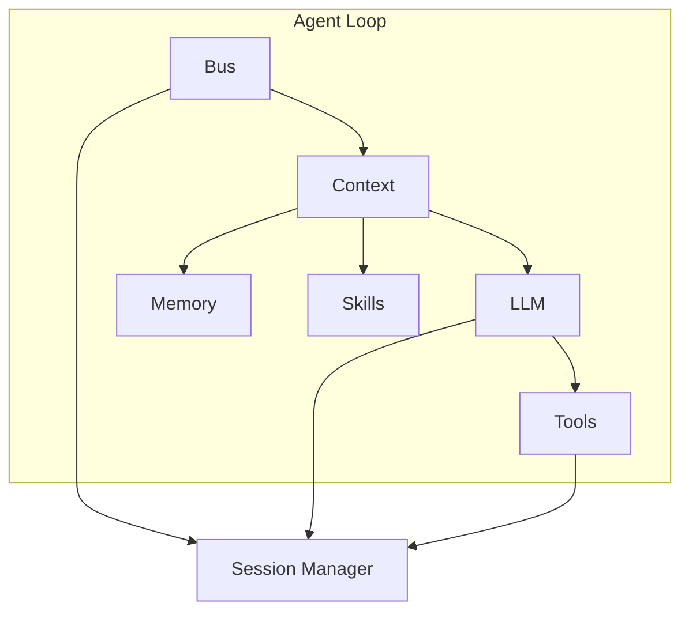

## Context

Niuma 项目已完成 Phase 1 核心基础设施，包括：

- 类型系统（`types/`）
- 配置管理（`config/`）
- 工具框架（`agent/tools/base.ts`, `agent/tools/registry.ts`）
- 事件总线（`bus/events.ts`, `bus/queue.ts`）

Phase 2 需要在此基础上实现 Agent 核心，对标 nanobot 的核心模块：

- `nanobot/agent/loop.py` → `agent/loop.ts`
- `nanobot/agent/context.py` → `agent/context.ts`
- `nanobot/agent/memory.py` → `agent/memory.ts`
- `nanobot/agent/skills.py` → `agent/skills.ts`
- `nanobot/agent/subagent.py` → `agent/subagent.ts`

## Goals / Non-Goals

**Goals:**

- 实现 Agent 循环，支持 LLM ↔ 工具执行的多轮对话
- 实现双层记忆系统，支持 LLM 驱动的记忆整合
- 实现技能系统，支持 SKILL.md 解析和按需加载
- 实现子智能体管理，支持后台任务执行
- 实现会话管理，支持历史记录持久化
- 实现最小化 LLM Provider 抽象（OpenAI 优先）
- 支持流式响应
- 支持 LLM 调用失败重试机制
- 支持 reasoning_content（思维模型）

**Non-Goals:**

- 不实现完整 Provider 系统（Phase 4）
- 不实现多渠道接入（Phase 6）
- 不实现向量检索记忆（后续扩展）
- 不实现 MCP 工具动态加载（预留接口）

## Decisions

### 1. 模块依赖顺序

**决策：** 按 `context → memory → skills → session → providers → loop → subagent` 顺序实现

**理由：**

- `context` 无外部依赖，可独立实现
- `memory` 和 `skills` 被 `context` 使用
- `session` 被 `loop` 依赖
- `providers` 最小化实现后才能测试 `loop`
- `subagent` 依赖 `loop` 的核心逻辑

**替代方案：** 并行开发所有模块 — 风险高，最后整合可能发现设计问题

### 2. LLM Provider 抽象设计

**决策：** 定义 `LLMProvider` 接口，使用 LangChain 的 `ChatOpenAI` 作为底层实现

**接口设计：**

```typescript
interface LLMProvider {
  chat(options: ChatOptions): Promise<LLMResponse>
  chatStream?(options: ChatOptions): AsyncIterable<LLMStreamChunk>
  getDefaultModel(): string
}
```

**理由：**

- LangChain 已封装 OpenAI API，避免重复造轮子
- 接口抽象便于后续扩展其他 Provider
- 流式支持是现代 AI 应用的标配

**替代方案：** 直接使用 OpenAI SDK — 缺乏抽象，后续扩展困难

### 3. 记忆整合触发机制

**决策：** 当会话消息数超过 `memoryWindow` 时，异步触发记忆整合

**触发条件：**

- 消息数 > `memoryWindow`（默认 50）
- 用户执行 `/new` 命令（全量归档）

**理由：**

- 避免每次对话都调用 LLM 整合，节省成本
- 异步执行不阻塞主流程
- 整合后消息仍保留在会话中（直到用户主动清空）

**替代方案：** 每轮对话后整合 — 成本高、延迟大

### 4. LLM 调用失败处理

**决策：** 指数退避重试，最多 4 次连续失败后返回错误

**重试策略：**

```
失败 1: 延迟 1s 重试
失败 2: 延迟 2s 重试
失败 3: 延迟 4s 重试
失败 4: 返回错误给用户
```

**理由：**

- 网络波动和 API 限流是常见问题
- 指数退避避免雪崩效应
- 4 次重试在用户体验和可靠性间取得平衡

**替代方案：** 立即失败 — 用户体验差

### 5. 工具执行失败处理

**决策：** 工具执行失败后继续循环，让 LLM 尝试其他方式

**理由：**

- 工具失败可能是参数错误，LLM 可以自我修正
- 单个工具失败不应中断整个对话
- LLM 可以选择替代方案

**替代方案：** 工具失败立即返回错误 — 限制 Agent 能力

### 6. 进度通知策略

**决策：** 混合策略，CLI 优先使用分组批量通知

**CLI 显示效果：**

```
🔧 本轮工具调用 (3)
• web_search("query") ✅ 1.2s
• read_file("config.json") ✅ 0.3s
• write_file("output.md") ✅ 0.5s
```

**理由：**

- CLI 不支持消息编辑，分组批量最自然
- 减少屏幕滚动，信息密度高
- 后续可扩展为渠道特定展示

**替代方案：** 每个工具执行前后都通知 — CLI 上信息过载

### 7. reasoning_content 支持

**决策：** 支持 reasoning_content 字段，通过配置控制是否展示

**配置项：**

```typescript
interface AgentConfig {
  showReasoning: boolean  // 默认 false
}
```

**理由：**

- DeepSeek 等思维模型会返回推理过程
- 有些用户想看到思考过程，有些觉得干扰
- 配置化满足不同需求

### 8. 子智能体隔离

**决策：** 子智能体不包含 `message` 和 `spawn` 工具

**理由：**

- 防止子智能体发送消息到其他渠道
- 防止子智能体创建更多子智能体（资源失控）
- 保持子智能体专注于任务执行

## Architecture



## Risks / Trade-offs

### Risk 1: 记忆整合 LLM 调用失败

**风险：** 整合失败会导致记忆丢失或重复整合

**缓解：**
- 整合失败后标记 `lastConsolidated` 不变，下次重试
- 原始消息仍保留在会话中，不会丢失

### Risk 2: 子智能体资源泄漏

**风险：** 子智能体任务卡死可能导致内存泄漏

**缓解：**
- 设置最大迭代次数（15 次）
- 实现超时机制
- 会话关闭时取消所有关联的子智能体

### Risk 3: 流式响应中断

**风险：** 网络中断导致流式响应不完整

**缓解：**
- 流式中断时回退到非流式调用
- 保存部分响应用于恢复

### Risk 4: Provider 抽象不完整

**风险：** 最小化实现可能遗漏其他 Provider 需要的功能

**缓解：**
- 接口设计参考 LangChain 抽象
- Phase 4 完善时再扩展接口

### Trade-off 1: 成本 vs 记忆质量

**权衡：** 记忆整合需要额外 LLM 调用

**决策：** 只在超过阈值时整合，而非每轮对话

### Trade-off 2: 实时性 vs 信息量

**权衡：** 分组批量通知实时性较差

**决策：** CLI 场景下信息密度更重要，后续渠道可调整

## Open Questions

1. **会话持久化存储位置？**
   - 当前方案：JSON 文件存储在 `~/.niuma/sessions/`
   - 备选：SQLite 数据库（需提前实现数据库模块）

2. **是否需要支持会话导入导出？**
   - 可作为后续功能，当前 Phase 不实现

3. **MCP 工具注册时机？**
   - 预留接口，实际注册在 Phase 后续实现
