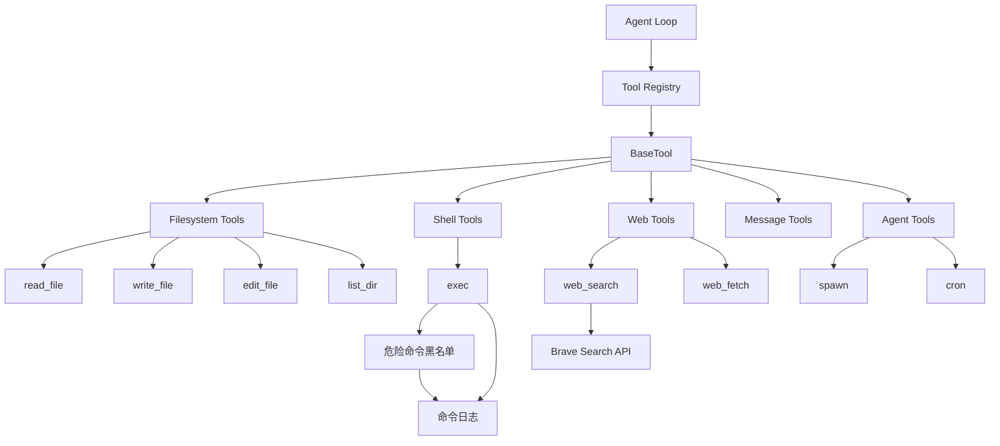

# 技术设计：内置工具实现

## Context

当前项目已完成工具框架（BaseTool、ToolRegistry）和 Agent 核心功能，但缺少具体的工具实现。Agent 需要一套内置工具来执行文件操作、命令执行、网络请求等常见任务。Phase 1 和 Phase 2 已完成基础设施，现在是实现内置工具的最佳时机。

## Goals / Non-Goals

**Goals:**
- 实现一套完整的内置工具集，涵盖文件系统、Shell、Web、消息和 Agent 操作
- 确保所有工具继承自 BaseTool 并正确注册到 ToolRegistry
- 提供严格的安全控制，特别是 Shell 命令执行
- 保持工具的一致性和可维护性

**Non-Goals:**
- 不实现图形界面工具
- 不实现数据库专用工具（已在 Session Manager 中处理）
- 不实现 MCP 协议集成（Phase 7）
- 不实现渠道特定的工具（Phase 5）

## Decisions

### 1. 工具组织结构

**决策：** 按功能分类组织工具文件

```
niuma/agent/tools/
├── base.ts              # 工具基类（已存在）
├── registry.ts          # 工具注册表（已存在）
├── filesystem.ts        # 文件系统工具
├── shell.ts             # Shell 工具
├── web.ts               # Web 工具
├── message.ts           # 消息工具
└── agent.ts             # Agent 工具
```

**理由：** 相关的工具放在同一个文件中，便于维护和理解。每个文件导出多个工具类，通过 ToolRegistry 统一注册。

### 2. 文件路径处理

**决策：** 统一使用绝对路径，支持相对路径自动解析

```typescript
// 工具内部统一使用绝对路径
function resolvePath(path: string, cwd?: string): string {
  if (isAbsolute(path)) return path;
  return join(cwd || process.cwd(), path);
}
```

**理由：** 避免路径混淆，确保操作的可预测性。相对路径基于 Agent 工作目录或当前工作目录。

### 3. Shell 安全控制

**决策：** 实现危险命令黑名单 + 用户确认机制

```typescript
const DENY_PATTERNS = [
  /\brm\s+-[rf]{1,2}\b/,           // rm -r, rm -rf
  /\bdel\s+[fq]\b/,                // del /f, del /q
  /\brmdir\s+\/s\b/,               // rmdir /s
  /\b(shutdown|reboot|poweroff)\b/, // 系统电源
  /:\(\)\s*\{.*\};\s*:/,           // fork bomb
];

// 对于危险命令，要求用户确认
if (isDangerous(cmd)) {
  const confirmed = await askUserConfirmation(cmd);
  if (!confirmed) throw new Error("Command cancelled by user");
}
```

**理由：** 黑名单防止意外删除系统文件，用户确认机制提供额外的安全层。

### 4. Web 请求库选择

**决策：** 使用原生 `fetch` API（Node.js 18+）

```typescript
// 直接使用全局 fetch
const response = await fetch(url, options);
```

**理由：** Node.js 18+ 内置 fetch，无需额外依赖。如果需要兼容旧版本，可以降级到 node-fetch。

### 5. Web Search API

**决策：** 支持 Brave Search API，预留其他搜索引擎接口

```typescript
interface SearchProvider {
  name: string;
  search(query: string, options?: SearchOptions): Promise<SearchResult[]>;
}
```

**理由：** Brave 提供免费 API，适合开发阶段。接口设计支持未来扩展到其他搜索引擎。

### 6. 工具参数验证

**决策：** 使用 Zod Schema 定义工具参数

```typescript
const ReadFileSchema = z.object({
  path: z.string().describe("文件路径（绝对或相对）"),
  offset: z.number().int().nonnegative().optional().describe("起始行号"),
  limit: z.number().int().positive().optional().describe("读取行数限制"),
});
```

**理由：** Zod 提供运行时类型验证，自动生成工具描述，与现有工具框架一致。

### 7. 错误处理

**决策：** 统一使用 NiumaError 子类

```typescript
class ToolExecutionError extends NiumaError {
  constructor(toolName: string, message: string, originalError?: Error) {
    super('TOOL_EXECUTION_ERROR', message, { toolName, originalError });
  }
}
```

**理由：** 保持错误处理的一致性，便于追踪和调试。

### 8. 工具注册方式

**决策：** 自动注册 + 显式导出

```typescript
// filesystem.ts
export const ReadFileTool = new ReadFileToolImpl();

// registry.ts
import { ReadFileTool } from './filesystem';
registerTool(ReadFileTool);
```

**理由：** 自动注册减少遗漏，显式导出便于测试和文档。

## Risks / Trade-offs

### 风险 1：Shell 命令执行安全性

**风险：** 黑名单可能无法覆盖所有危险命令，存在绕过可能。

**缓解措施：**
- 定期更新黑名单
- 提供用户配置选项（允许/禁止特定命令）
- 记录所有执行的命令到日志

### 风险 2：文件路径遍历攻击

**风险：** 用户可能通过相对路径访问系统文件。

**缓解措施：**
- 限制工作目录范围
- 提供白名单机制
- 警告用户操作敏感目录

### 风险 3：Web 请求超时和重试

**风险：** 网络请求可能超时或失败，影响 Agent 体验。

**缓解措施：**
- 设置合理的超时时间（默认 30 秒）
- 实现指数退避重试机制
- 提供清晰的错误信息

### 权衡 1：代码重复 vs 可维护性

**选择：** 每个工具独立实现，共享工具函数。

**权衡：** 增加少量代码重复，但保持工具的独立性和可维护性。

### 权衡 2：功能完整性 vs 安全性

**选择：** 优先安全性，限制某些功能（如删除系统目录）。

**权衡：** 功能受限，但避免灾难性后果。

## Migration Plan

无需迁移计划，这是纯新增功能。

## Open Questions

1. **Web Search API 密钥管理**
   - 是否需要在配置文件中添加 Brave API 密钥？
   - 是否支持多个搜索引擎切换？

2. **Shell 工具的工作目录**
   - 基于 Agent 工作目录还是当前进程工作目录？
   - 是否允许指定工作目录？

3. **文件编辑工具的实现方式**
   - 使用正则表达式替换（简单但有限）
   - 使用 AST 解析（复杂但精确）
   - 建议使用正则表达式 + 行号定位

4. **消息工具的渠道支持**
   - 当前只有 CLI，消息工具是否需要？
   - 建议预留接口，Phase 5 实现渠道集成后再完善

## 架构图



## 依赖更新

```json
{
  "dependencies": {
    // 新增依赖
    "date-fns": "^4.0.0",    // 文件时间处理
    "cheerio": "^1.0.0"       // HTML 解析（web_fetch 可选）
  }
}
```

**注意：** 不需要新增 `node-fetch` 或 `axios`，使用 Node.js 18+ 内置 fetch。