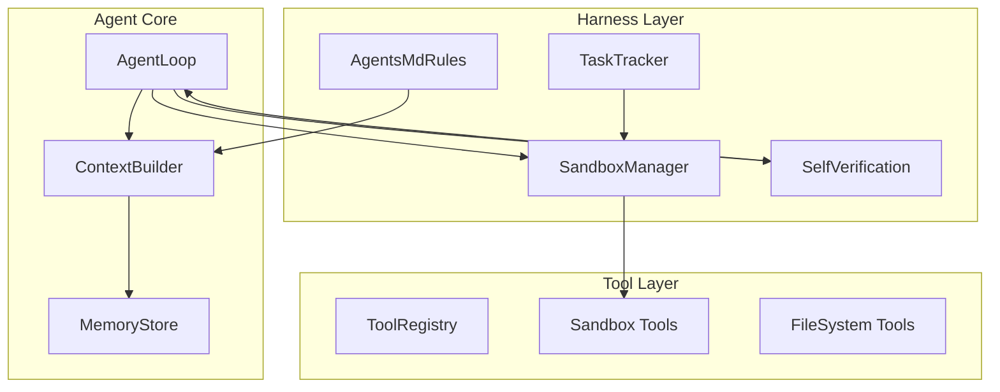
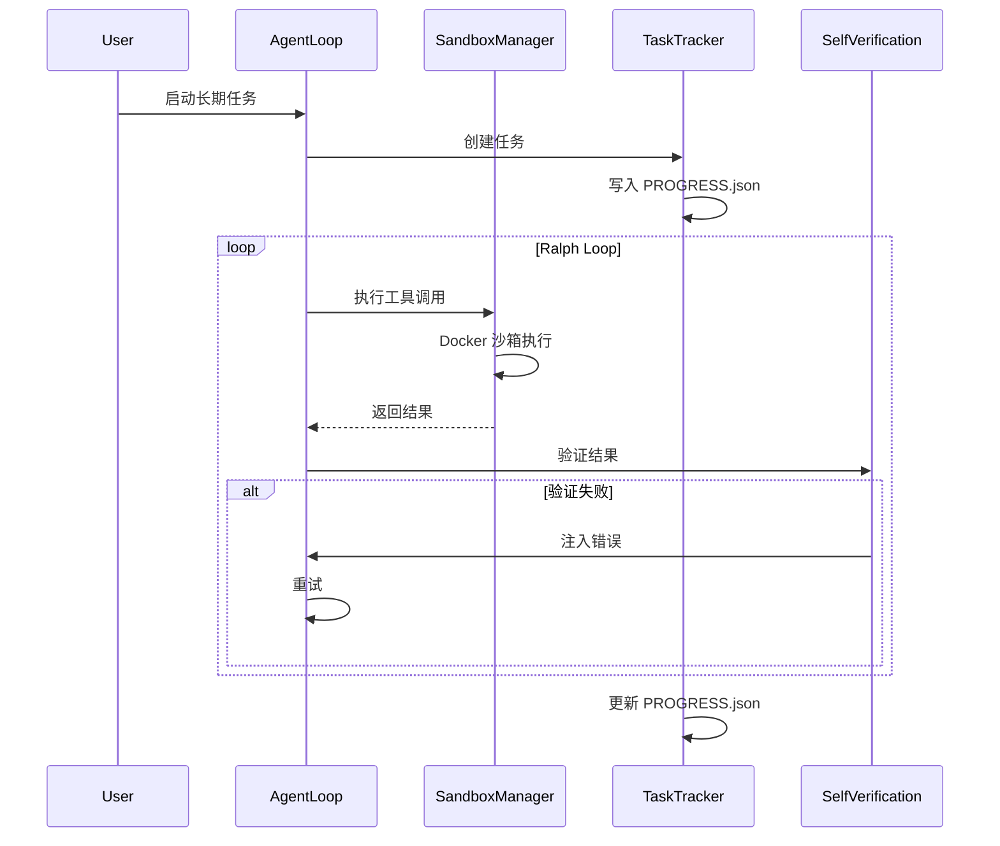

## Context

Niuma 当前架构是单代理对话系统，基于 `AgentLoop` ↔ `ToolRegistry` ↔ `LLMProvider` 的核心循环。存在以下局限：

**当前架构:**
```
AgentLoop
├── ToolRegistry (exec, filesystem, git, ...)
├── MemoryStore (MEMORY.md, HISTORY.md)
├── ContextBuilder
└── LLMProvider
```

**问题:**
1. Shell 工具直接在主机执行，缺乏隔离
2. 无长周期任务支持（会话即边界）
3. 无验证机制（任务对错无法自动判断）
4. 上下文随历史增长衰减

## Goals / Non-Goals

**Goals:**
- 为 Niuma 添加完整的 Harness 操作系统能力
- 支持安全、可靠的长周期复杂任务执行
- 保持向后兼容（现有对话模式不受影响）
- 建立可渐进增强的架构基础

**Non-Goals:**
- 不实现完整的多代理协调系统
- 不改变现有 Provider/Channel 抽象
- 不追求 100% Production-ready（MVP 优先）

## Decisions

### D1: 沙箱执行采用 Docker 隔离

**选择:** Docker Engine API (`dockerode`) 而非 E2B/Modal

**理由:**
- 零额外成本（复用现有 Docker）
- 灵活定制镜像
- 网络隔离可控

**备选考虑:**
- E2B: 开箱即用但成本高、定制受限
- Modal: 无状态函数，不适合交互式 Agent

**架构:**
```
┌─────────────────────────────────────┐
│ AgentLoop                           │
│ ┌───────────────────────────────┐  │
│ │ SandboxManager                 │  │
│ │  ├── Container Lifecycle       │  │
│ │  ├── Tool Interceptor         │  │
│ │  └── Resource Limits          │  │
│ └───────────────────────────────┘  │
└─────────────────────────────────────┘
              │
              ▼
┌─────────────────────────────────────┐
│ Docker Container (Sandbox)          │
│  - Python 3.11 / Node.js 20        │
│  - Git / CLI tools                 │
│  - 隔离网络 / 资源限制              │
└─────────────────────────────────────┘
```

### D2: 渐进式实现策略

**Phase 1 (MVP):** 沙箱 + 任务追踪 + 自验证
**Phase 2:** 上下文压缩 + HiTL + Ralph Loops
**Phase 3:** Initializer-Executor 架构

**理由:**
- 风险分散，每阶段可验证
- 符合"Build to Delete"原则（简单优先）

### D3: Shell 工具双模式

**保留原有 exec 工具**用于轻量命令，新增 `sandbox_exec` 工具用于复杂任务。

```typescript
// 双模式设计
interface ShellToolConfig {
  mode: "direct" | "sandbox";
  sandboxConfig?: SandboxConfig;
}
```

### D4: AGENTS.md 作为规则积累机制

**位置:** `workspace/AGENTS.md`

**格式:**
```markdown
## Rules (accumulated from failures)
1. Always run tests after writing code
2. Use `npm test` not `jest` directly
...
```

**更新时机:** 任务失败后自动追加规则

### D5: PROGRESS.json 任务状态

**格式:**
```json
{
  "project": "project-name",
  "tasks": [
    { "id": 1, "name": "Task", "status": "pending|in_progress|completed" }
  ],
  "current": 0,
  "completed": []
}
```

**持久化:** 写入 `workspace/PROGRESS.json`

## Architecture

### 整体架构 (Phase 1)



### 核心模块关系



## Risks / Trade-offs

| Risk | Impact | Mitigation |
|------|--------|------------|
| Docker 依赖 | 部署环境要求 | 提供 fallback 到 direct mode |
| 沙箱性能开销 | 首次启动慢 | 容器池化复用 |
| 上下文压缩丢失关键信息 | 任务失败 | 保留决策节点，只压缩推理 |
| AGENTS.md 无限增长 | 难以维护 | 定期合并/清理 |
| HiTL 阻断主流程 | 用户体验 | 超时机制 + 异步审批选项 |

## Migration Plan

### Phase 1: 基础设施 (1-2 周)

1. 添加 `dockerode` 依赖
2. 实现 `SandboxManager` 类
3. 新增 `sandbox_exec` 工具
4. 配置项 `sandbox.enabled`

### Phase 2: 任务系统 (1 周)

1. 实现 `TaskTracker`
2. 新增 `start_task` / `complete_task` 工具
3. 写入 `PROGRESS.json`

### Phase 3: 验证机制 (1 周)

1. 实现 `SelfVerification`
2. 新增验证配置项
3. 集成到 AgentLoop

### Rollback

- 每个 Phase 独立可回滚
- 配置项控制开关
- 保持原有代码路径

## Open Questions

1. **沙箱镜像维护**: 如何同步更新预装工具版本？
2. **容器池大小**: 默认池大小？如何配置？
3. **跨任务状态**: 不同任务的沙箱是否需要隔离？
4. **AGENTS.md 合并策略**: 何时触发合并？合并频率？
